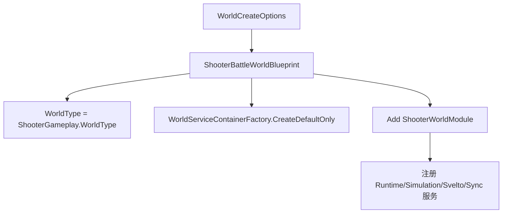
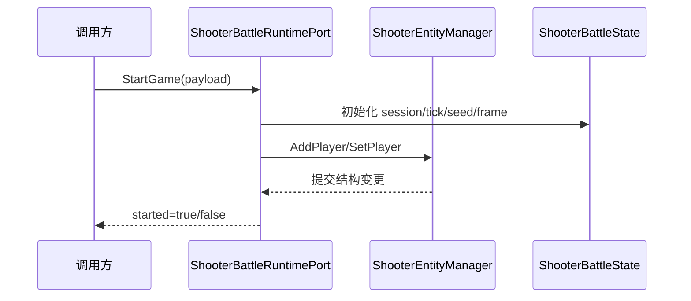
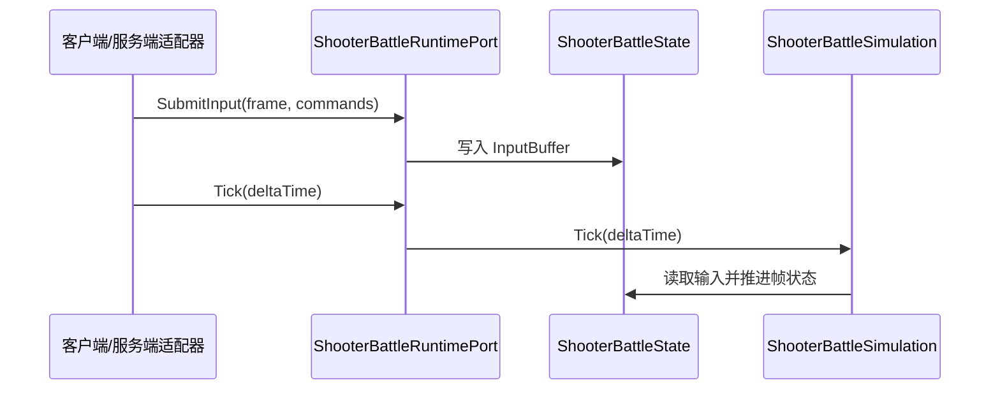

# Shooter Runtime、Svelto 与战斗模拟

> 本文说明 Shooter 示例中服务端/客户端共用的战斗运行时如何组织：WorldBlueprint 如何创建 Shooter world，RuntimePort 如何作为能力门面，Svelto EntityManager 如何管理实体，Simulation 如何推进战斗状态。

## 1. 设计目标

Shooter runtime 层的目标是把战斗核心收敛为一个可被客户端、服务端、测试和烟测复用的门面。

它要求：

- 输入提交统一；
- Tick 推进统一；
- 快照导出统一；
- 状态 hash 统一；
- Svelto 结构变更可控；
- 不让外部调用方直接依赖战斗内部集合。

## 2. WorldBlueprint

`ShooterBattleWorldBlueprint` 负责声明 Shooter 战斗世界：

- 设置 world type；
- 准备默认服务容器；
- 添加 `ShooterWorldModule`。

它比 MOBA Blueprint 更薄，因为 Shooter 主要通过 `ShooterBattleRuntimePort` 暴露能力。



## 3. RuntimePort 门面

`ShooterBattleRuntimePort` 同时注册为多个接口，是 Shooter 示例的核心门面。

| 接口 | 职责 |
|------|------|
| `IShooterBattleRuntimePort` | 聚合入口 |
| `IShooterGameStartPort` | 启动游戏 |
| `IShooterInputPort` | 提交输入 |
| `IShooterSimulationClock` | Tick 与帧推进 |
| `IShooterSnapshotReadPort` | 读取状态快照 |
| `IShooterStateHashProvider` | 计算状态 hash |
| `IShooterPackedSnapshotPort` | packed snapshot 导入/导出 |
| `IShooterPureStateSnapshotPort` | pure-state snapshot 导出 |

这种注册方式让 Orleans runtime adapter、客户端 session、测试代码都可以只依赖自己需要的接口。

## 4. RuntimePort 内部组成

```mermaid
flowchart TB
    Port[ShooterBattleRuntimePort]
    Port --> State[ShooterBattleState]
    Port --> Sim[ShooterBattleSimulation]
    Port --> Entity[ShooterEntityManager]
    Port --> Rules[ShooterBattleRules]
    Port --> Snapshot[ShooterStateSnapshotExporter]
    Port --> PackedExporter[ShooterPackedSnapshotExporter]
    Port --> PackedImporter[ShooterPackedSnapshotImporter]
    Port --> PureExporter[ShooterPureStateSnapshotExporter]
    Port --> Hash[ShooterStateHasher]
    Port --> Bot[ShooterBotAiSystem]
    Port --> Step[ShooterBattleSveltoStepEngine]
```



## 5. StartGame 流程

`StartGame` 会基于 `ShooterStartGamePayload` 初始化战斗：

1. 设置战斗 session 信息；
2. 初始化 tick rate、seed、玩家列表；
3. 创建玩家实体；
4. 重置输入缓冲与事件缓冲；
5. 标记 runtime started。



## 6. 输入提交与 Tick

输入通过 `SubmitInput(frame, commands)` 进入 runtime，随后在 `Tick(deltaTime)` 中被 simulation 消费。



## 7. Svelto EntityManager

`ShooterEntityManager` 负责玩家与子弹实体的结构化管理。

它维护：

- `_playerIds`；
- `_projectileIds`；
- `_structuralChangeDepth`；
- `_hasPendingStructuralChanges`；
- `ISveltoWorldContext`。

结构变更通过 begin/end 深度控制，避免在遍历实体集合时直接修改结构。

## 8. Simulation Tick

`ShooterBattleSimulation` 分两段：

| 阶段 | 职责 |
|------|------|
| `TickPlayers` | 消费输入、移动、瞄准、开火、创建子弹 |
| `TickBullets` | 子弹移动、寿命递减、命中检测、事件输出、移除子弹 |

```mermaid
flowchart TD
    A[Tick(deltaTime)] --> B[TickPlayers]
    B --> C[读取最新输入]
    C --> D[移动/瞄准]
    D --> E{Fire?}
    E -->|Yes| F[SpawnBullet]
    E -->|No| G[跳过开火]
    F --> H[TickBullets]
    G --> H
    H --> I[移动子弹]
    I --> J[命中检测]
    J --> K[血量/分数/事件]
    K --> L[移除失效子弹]
```

## 9. 源码索引

| 模块 | 源码 |
|------|------|
| Shooter Blueprint | `Unity/Packages/com.abilitykit.demo.shooter.runtime/Runtime/Worlds/ShooterBattleWorldBlueprint.cs` |
| World Module | `Unity/Packages/com.abilitykit.demo.shooter.runtime/Runtime/Worlds/ShooterWorldModule.cs` |
| Runtime Port | `Unity/Packages/com.abilitykit.demo.shooter.runtime/Runtime/Application/Runtime/ShooterBattleRuntimePort.cs` |
| 战斗状态 | `Unity/Packages/com.abilitykit.demo.shooter.runtime/Runtime/Domain/Battle/ShooterBattleState.cs` |
| 战斗模拟 | `Unity/Packages/com.abilitykit.demo.shooter.runtime/Runtime/Domain/Battle/ShooterBattleSimulation.cs` |
| 实体管理 | `Unity/Packages/com.abilitykit.demo.shooter.runtime/Runtime/Application/Services/EntityManager/ShooterEntityManager.cs` |
