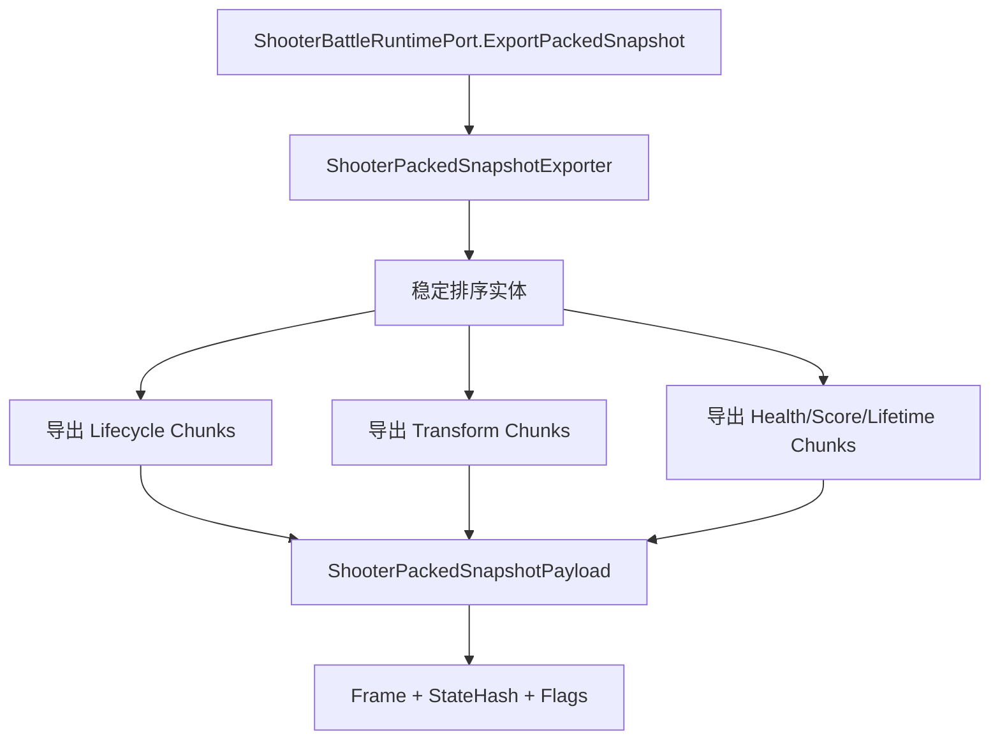
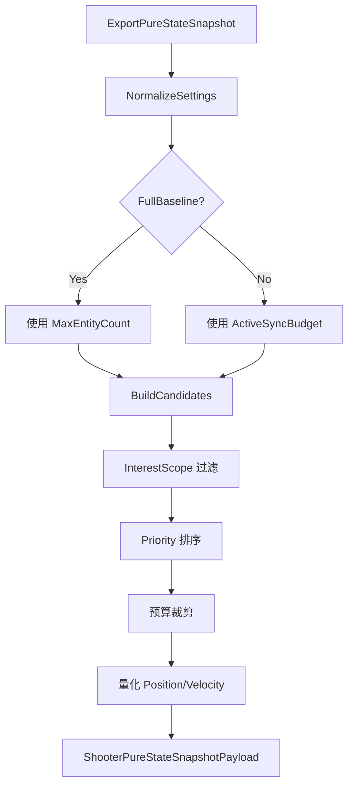
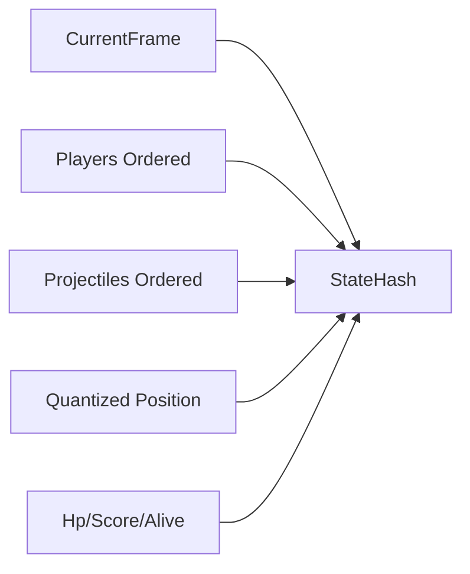
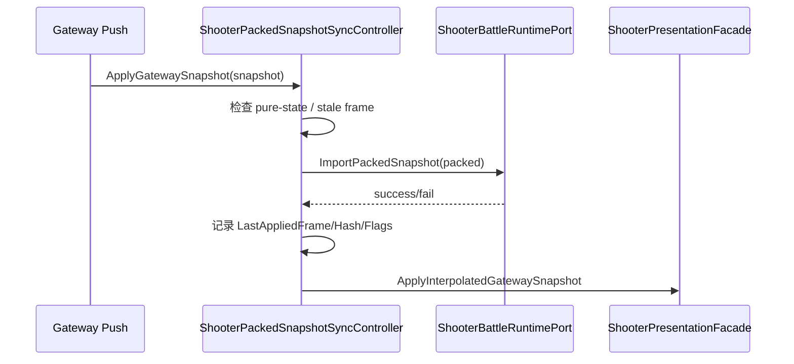
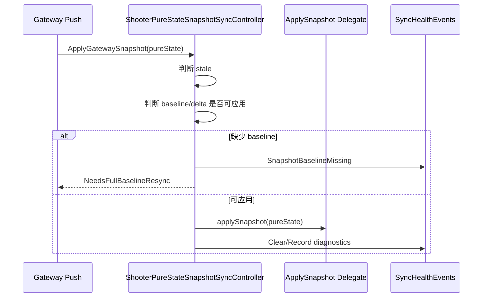

# Shooter Snapshot、Hash 与同步模型

> 本文拆解 Shooter 示例的同步设计：packed snapshot 如何表达组件块，pure-state snapshot 如何支持 baseline/delta 与兴趣范围，state hash 如何验证一致性，客户端如何选择预测回滚、权威插值或混合同步控制器。

## 1. 同步层目标

Shooter 的同步层要支持多种场景：

- 小规模权威快照同步；
- 大规模实体预算裁剪；
- 重连与 late join；
- 客户端预测回滚；
- 权威插值；
- snapshot stale ignore；
- hash 验证。

因此它没有只使用单一 `WorldStateSnapshot`，而是同时提供 packed snapshot 和 pure-state snapshot。

## 2. packed snapshot

`ShooterPackedSnapshotExporter` 导出组件块式快照。

典型组件块包括：

| 组件块 | 内容 |
|--------|------|
| PlayerLifecycle | 玩家存在性、生命周期 |
| ProjectileLifecycle | 子弹存在性、生命周期 |
| EnemyLifecycle | 敌人存在性、生命周期 |
| PlayerTransform | 玩家位置/速度/瞄准 |
| ProjectileTransform | 子弹位置/速度 |
| EnemyTransform | 敌人位置/速度 |
| PlayerHealth | 玩家血量 |
| EnemyHealth | 敌人血量 |
| PlayerScore | 玩家分数 |
| ProjectileLifetime | 子弹寿命 |

## 3. packed snapshot 的适用场景

packed snapshot 适合：

- full snapshot；
- key frame；
- authority override；
- 重连恢复；
- smoke 验证；
- 需要完整导入 runtime 的场景。

客户端应用 packed snapshot 时，会调用 runtime importer，让本地 runtime 状态对齐服务端权威状态。

## 4. pure-state snapshot

`ShooterPureStateSnapshotExporter` 更偏向“大规模状态分发”。它可以根据设置导出：

- full baseline；
- delta；
- low-frequency frame；
- 按兴趣范围裁剪后的实体集合；
- 按预算限制后的实体集合。

## 5. baseline 与 delta

pure-state delta 不是孤立可用的，它依赖 baseline。

客户端应用 delta 前必须确认：

- 已有 baseline；
- baseline frame 匹配；
- baseline hash 匹配；
- 当前 delta 未过期。

如果缺少 baseline，`ShooterPureStateSnapshotSyncController` 会标记需要 full baseline resync。

## 6. 状态 Hash

`ShooterStateHasher` 以确定性顺序 hash：

- 当前帧；
- 玩家 ID；
- 玩家位置、瞄准、血量、分数、生存状态；
- 子弹状态；
- 其他参与同步的实体状态。

位置等浮点状态会先量化再参与 hash，减少浮点误差影响。

## 7. 客户端同步控制器选择

`ShooterClientSyncControllerFactory` 根据 `NetworkSyncModel` 创建控制器。

| 模式 | 控制器方向 | 适用场景 |
|------|------------|----------|
| PredictRollback | 本地预测 + 权威校正 | 操作响应优先 |
| AuthoritativeInterpolation | 权威快照插值 | 状态一致性优先 |
| BatchStateSync | 批量状态同步 | 多实体低频更新 |
| MassBattleLodSync | 大规模 LOD 同步 | 大量实体、兴趣裁剪 |
| HybridHeroPrediction | 主控英雄预测 + 其他实体插值 | MOBA/Shooter 混合体验 |

## 8. packed snapshot 应用流程

## 9. pure-state 应用流程

## 10. 源码索引

| 模块 | 源码 |
|------|------|
| packed 导出 | `Unity/Packages/com.abilitykit.demo.shooter.runtime/Runtime/Application/Synchronization/ShooterPackedSnapshotExporter.cs` |
| packed 导入 | `Unity/Packages/com.abilitykit.demo.shooter.runtime/Runtime/Application/Synchronization/ShooterPackedSnapshotImporter.cs` |
| packed codec | `Unity/Packages/com.abilitykit.demo.shooter.runtime/Runtime/Application/Synchronization/ShooterPackedSnapshotBytesCodec.cs` |
| pure-state 导出 | `Unity/Packages/com.abilitykit.demo.shooter.runtime/Runtime/Application/Synchronization/ShooterPureStateSnapshotExporter.cs` |
| 状态 hash | `Unity/Packages/com.abilitykit.demo.shooter.runtime/Runtime/Application/Synchronization/ShooterStateHasher.cs` |
| 客户端 session | `Unity/Packages/com.abilitykit.demo.shooter.view.runtime/Runtime/Client/ShooterClientSession.cs` |
| 输入协调 | `Unity/Packages/com.abilitykit.demo.shooter.view.runtime/Runtime/Client/Session/ShooterClientInputCoordinator.cs` |
| 同步控制器工厂 | `Unity/Packages/com.abilitykit.demo.shooter.view.runtime/Runtime/Client/Synchronization/ShooterClientSyncControllerFactory.cs` |
| packed 控制器 | `Unity/Packages/com.abilitykit.demo.shooter.view.runtime/Runtime/Client/Synchronization/ShooterPackedSnapshotSyncController.cs` |
| pure-state 控制器 | `Unity/Packages/com.abilitykit.demo.shooter.view.runtime/Runtime/Client/Synchronization/ShooterPureStateSnapshotSyncController.cs` |
