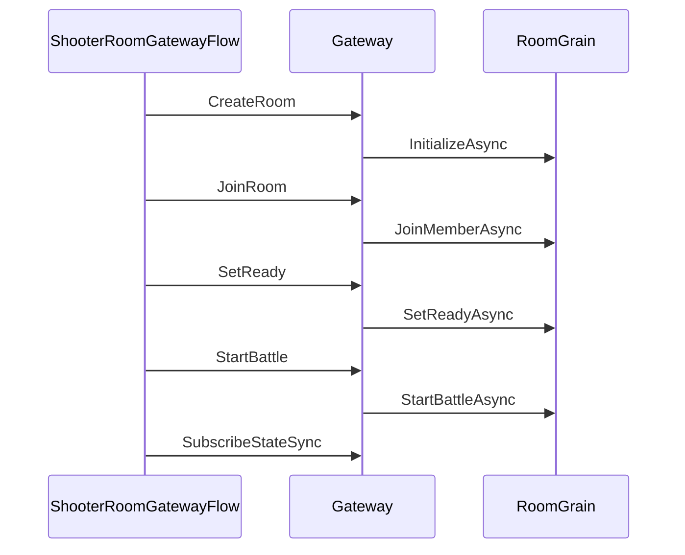
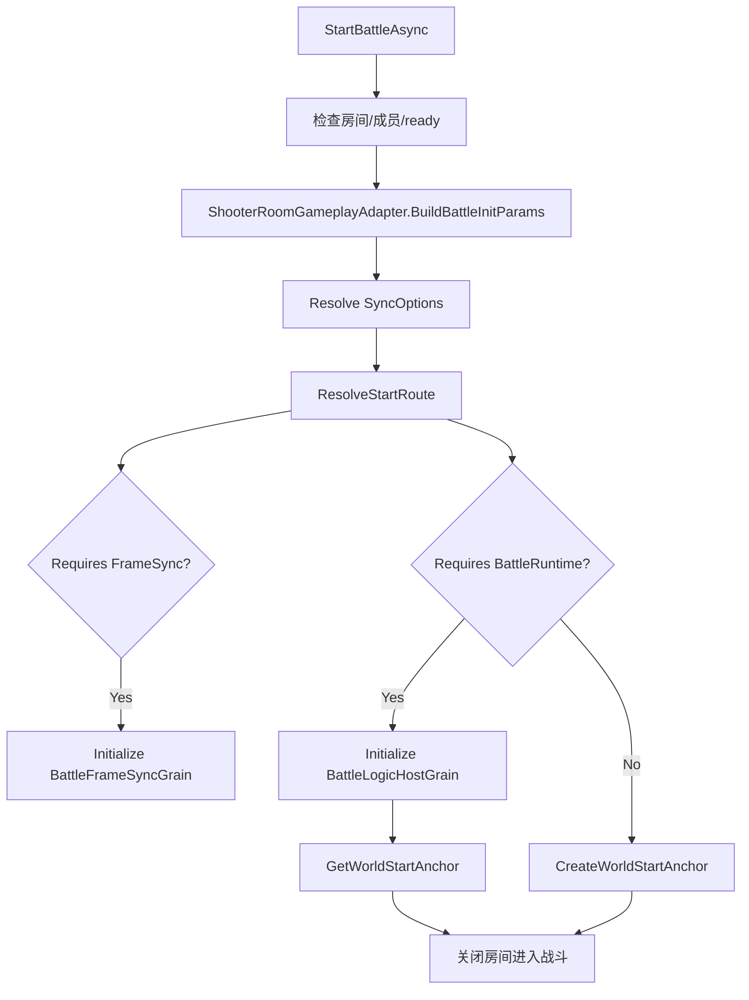
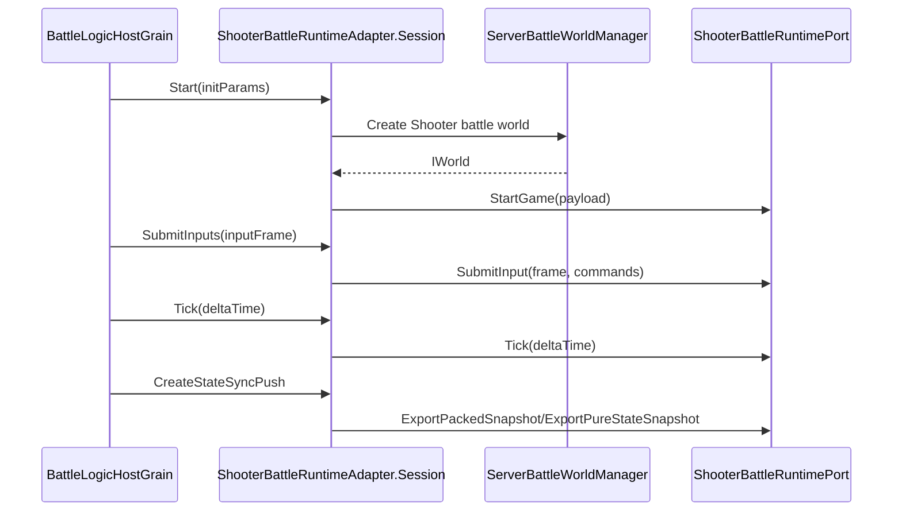
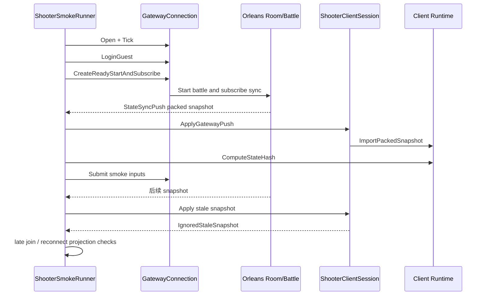

# Shooter Gateway、Orleans 与 Smoke 验收

> 本文说明 Shooter 示例如何通过 Gateway 和 Orleans 把客户端房间流程、战斗运行时、状态同步推送和烟测验收串成服务端权威闭环。

## 1. 设计目标

Shooter 服务端链路要解决：

- 客户端如何创建/加入/准备/开始房间；
- 房间如何转成战斗初始化参数；
- 战斗 runtime 如何被 Orleans 托管；
- 输入如何进入服务端权威模拟；
- 状态同步如何推送回客户端；
- late join、reconnect、stale snapshot 如何验证。

## 2. 客户端房间流程

`ShooterRoomGatewayFlow` 封装常见流程：

1. create room；
2. join room；
3. set ready；
4. start battle；
5. resolve battleId；
6. subscribe state sync；
7. select world start anchor。

## 3. Gateway 请求路由

`GatewayRequestRouter` 通过 opcode 找 handler，然后统一处理：

- 未注册 opcode；
- 请求超时；
- handler 异常；
- 外部取消。

这使 Shooter 房间流程不需要直接知道 Orleans Grain 的实现，只需要通过 Gateway 协议发送请求。

## 4. RoomGrain 状态机

`RoomGrain` 保存房间生命周期状态：

| 状态字段 | 作用 |
|----------|------|
| `_summary` | 房间摘要 |
| `_gameplay` | gameplay adapter |
| `_gameplayState` | Shooter 房间私有状态 |
| `_members` | 成员跟踪 |
| `_battleId` | 战斗 ID |
| `_worldId` | 世界 ID |
| `_worldStartAnchor` | 世界启动锚点 |
| `_closed` | 房间是否关闭 |

启动战斗时，RoomGrain 会：

## 5. ShooterRoomGameplayAdapter

`ShooterRoomGameplayAdapter` 把通用房间语义转成 Shooter 战斗语义。

它负责：

- 声明 room type；
- 创建 Shooter room state；
- 判断所有玩家是否 ready；
- 构造房间玩家快照；
- 构造 late join 玩家；
- 构造 `BattleInitParams`；
- 通过 room id 生成确定性 world id。

## 6. ShooterBattleRuntimeAdapter

`ShooterBattleRuntimeAdapter` 是 Orleans battle host 与 Shooter runtime 的桥。

其 session 负责：

| 方法 | 职责 |
|------|------|
| `Start` | 创建 Shooter battle world，解析 runtime port，调用 StartGame |
| `JoinPlayer` | late join 或补充玩家 |
| `MountBotAi` | 挂载 bot AI |
| `SubmitInputs` | 解码 Shooter input opcode 并提交 runtime |
| `Tick` | 调用 runtime.Tick |
| `GetSnapshot` | 读取 actor snapshot |
| `CreateStateSyncPush` | 导出 packed 或 pure-state payload |

## 7. BattleFrameSyncGrain

`BattleFrameSyncGrain` 是独立帧同步 Grain。

它负责：

- 按 tick rate 推进 frame；
- 按 frame 缓存输入；
- timer 触发帧推送；
- catch up 时限制单次推进帧数；
- 通知 observer `FramePushedEvent`。

这层适合用于 lockstep 或需要独立帧输入同步的房间。

## 8. StateSyncPush

Shooter battle session 会根据同步配置构造 `StateSyncPush`。

packed 模式下通常包含：

- worldId；
- frame；
- timestamp；
- actor snapshots；
- full snapshot 标记；
- payload opcode；
- serialized packed payload。

pure-state 模式则会根据配置导出 full baseline 或 delta，并交由 Gateway 推送给订阅者。

## 9. SmokeRunner 验收链路

`ShooterSmokeRunner` 是端到端验收入口。它不仅验证能跑通，还验证协议语义。

主要验收项：

| 验收项 | 意义 |
|--------|------|
| Gateway 连接与 guest 登录 | 网络入口可用 |
| 创建 presentation/runtime | 客户端本地会话可运行 |
| 等待 packed snapshot push | 服务端状态同步可达 |
| ApplyGatewayPush 返回 AppliedPackedSnapshot | 客户端能应用权威快照 |
| packed frame 等于 runtime/presentation frame | 帧对齐 |
| packed hash 等于 runtime.ComputeStateHash | 状态一致 |
| 提交输入 | 输入链路可达服务端 |
| stale snapshot 返回 IgnoredStaleSnapshot | 过期帧保护有效 |
| presentation player count | 表现投影正确 |
| late join projection | 晚加入恢复有效 |
| reconnect projection | 重连恢复有效 |

## 10. Smoke 覆盖的协议风险

Shooter smoke 不只是集成测试，它覆盖同步协议中最容易出问题的点：

- 服务端和客户端帧号不一致；
- hash 不一致；
- stale snapshot 被错误应用；
- 重连后 baseline 缺失；
- late join 看到的世界状态不完整；
- presentation 与 runtime 状态脱节。

## 11. 源码索引

| 模块 | 源码 |
|------|------|
| 房间流程 | `Unity/Packages/com.abilitykit.demo.shooter.view.runtime/Runtime/Client/Gateway/ShooterRoomGatewayFlow.cs` |
| Gateway 路由 | `Server/Orleans/src/AbilityKit.Orleans.Gateway/Gateway/Core/GatewayRequestRouter.cs` |
| RoomGrain | `Server/Orleans/src/AbilityKit.Orleans.Grains/Rooms/RoomGrain.cs` |
| Shooter 房间适配 | `Server/Orleans/src/AbilityKit.Orleans.Grains/Gameplays/Shooter/Rooms/ShooterRoomGameplayAdapter.cs` |
| Shooter 战斗适配 | `Server/Orleans/src/AbilityKit.Orleans.Grains/Gameplays/Shooter/Battle/ShooterBattleRuntimeAdapter.cs` |
| FrameSync Grain | `Server/Orleans/src/AbilityKit.Orleans.Grains/FrameSync/BattleFrameSyncGrain.cs` |
| Smoke Runner | `Server/Orleans/src/AbilityKit.Orleans.ShooterSmoke/Runner/ShooterSmokeRunner.cs` |
