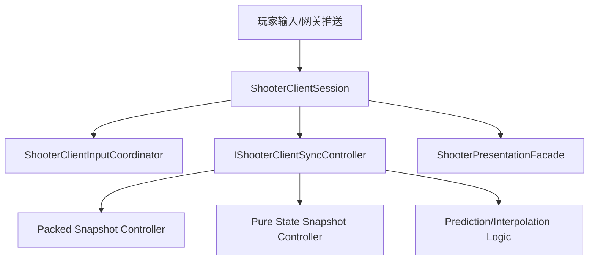
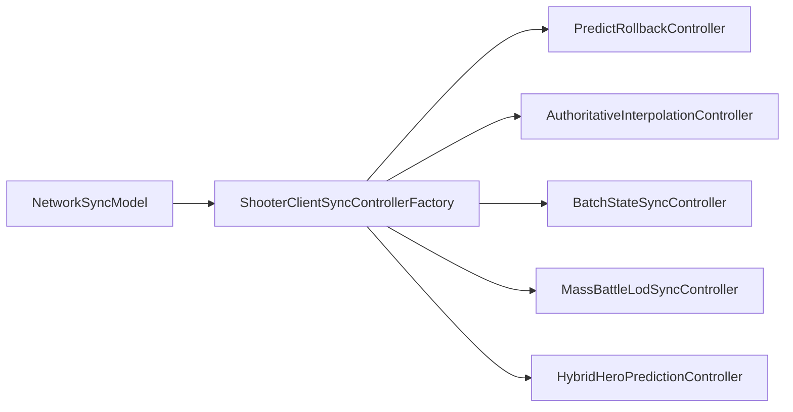
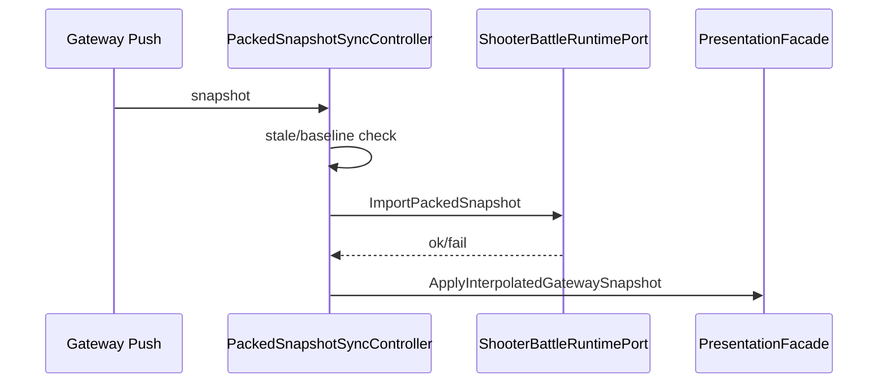

# Shooter 客户端同步策略

> 本文单独拆解 Shooter 示例的客户端同步层，说明 `ShooterClientSession`、输入协调、同步控制器工厂、packed/pure-state 应用器分别承担什么职责，以及它们如何支持预测回滚、权威插值和混合同步。

## 1. 为什么要单独拆出来

Shooter 示例的同步层不是一个“单控制器”方案，而是一个可切换策略集合。把它单独拆出来有助于说明：

- 同一套 runtime 可以被不同同步模型复用；
- 输入链路和快照链路是两个独立通道；
- 客户端会话只是一个编排门面，不是战斗核心。

## 2. 会话门面

`ShooterClientSession` 聚合了：

- `ShooterPresentationSessionContext`；
- `ShooterPresentationFacade`；
- `IShooterClientSyncController`。

它提供的能力包括：

- `StartGame()`；
- `SubmitLocalInput()`；
- `SubmitLocalInputToGatewayAsync()`；
- `Tick()`；
- `CatchUpToFrame()`；
- `TryEnterCatchUp()`；
- `ApplyGatewayPush()`。

## 3. 输入协调

`ShooterClientInputCoordinator` 的职责很明确：

1. 构建客户端输入包；
2. 提交到 frame sync；
3. 可选地通过 gateway 转发到服务端；
4. 捕获远程输入健康事件；
5. 在需要时触发 resync 请求。

它不会直接参与状态应用，这样输入和同步的职责就分离了。

## 4. 同步控制器工厂

`ShooterClientSyncControllerFactory` 根据 `NetworkSyncModel` 选择具体同步控制器。

| 模式 | 控制器倾向 |
|------|------------|
| `PredictRollback` | 输入优先、局部预测、权威修正 |
| `AuthoritativeInterpolation` | 权威快照驱动、平滑插值 |
| `BatchStateSync` | 低频批量状态刷新 |
| `MassBattleLodSync` | 预算裁剪与兴趣分层 |
| `HybridHeroPrediction` | 主控角色预测，其余实体插值 |

## 5. packed snapshot 控制器

`ShooterPackedSnapshotSyncController` 处理服务端推送的 packed snapshot。

关键行为：

- 先检查是否存在 pure-state baseline；
- 忽略过期帧；
- 处理没有 packed payload 的插值快照；
- 导入 packed snapshot；
- 更新 frame/hash/flags；
- 再驱动 presentation 插值。

## 6. pure-state 控制器

`ShooterPureStateSnapshotSyncController` 更关注 baseline/delta 语义。

它会判断：

- 是否收到了 pure-state 载荷；
- 帧是否过期；
- delta 是否可在当前 baseline 上应用；
- 是否需要 full baseline resync；
- 是否记录同步健康事件。

这对于大规模状态同步尤其重要，因为 delta 不是独立自足的。

## 7. 同步健康事件

Shooter 客户端同步层不只是“应用成功/失败”，还会记录健康诊断：

- stale snapshot；
- baseline missing；
- resync requested；
- snapshot ignored；
- fallback to full baseline。

这些诊断非常适合调试网络同步问题。

## 8. 设计总结

Shooter 的客户端同步层体现了一个核心原则：

> 会话、输入、同步控制器、presentation 应分层组织，不要把“接收快照”和“渲染快照”混成同一个对象。

## 9. 源码索引

| 模块 | 源码 |
|------|------|
| Client Session | `Unity/Packages/com.abilitykit.demo.shooter.view.runtime/Runtime/Client/ShooterClientSession.cs` |
| 输入协调 | `Unity/Packages/com.abilitykit.demo.shooter.view.runtime/Runtime/Client/Session/ShooterClientInputCoordinator.cs` |
| 同步控制器工厂 | `Unity/Packages/com.abilitykit.demo.shooter.view.runtime/Runtime/Client/Synchronization/ShooterClientSyncControllerFactory.cs` |
| packed 控制器 | `Unity/Packages/com.abilitykit.demo.shooter.view.runtime/Runtime/Client/Synchronization/ShooterPackedSnapshotSyncController.cs` |
| pure-state 控制器 | `Unity/Packages/com.abilitykit.demo.shooter.view.runtime/Runtime/Client/Synchronization/ShooterPureStateSnapshotSyncController.cs` |
| presentation facade | `Unity/Packages/com.abilitykit.demo.shooter.view.runtime/Runtime/Presentation/ShooterPresentationFacade.cs` |
