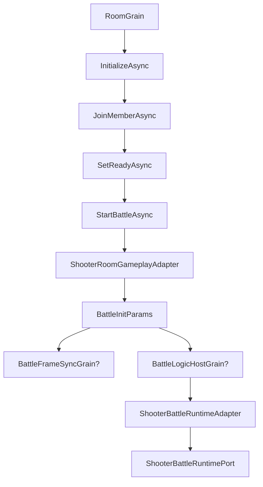
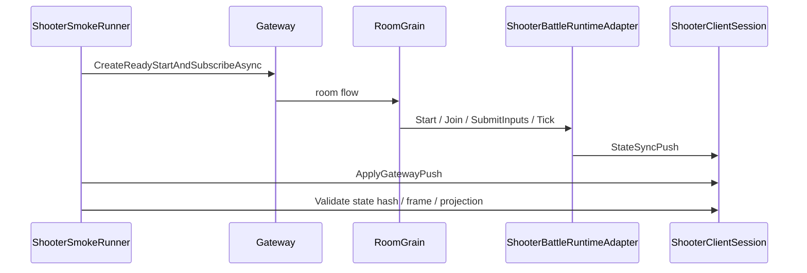

# Shooter 服务端流程与 Smoke 深潜

> 本文把 Shooter 示例的 Gateway、RoomGrain、BattleAdapter、FrameSyncGrain 与 SmokeRunner 串成一条服务端权威闭环，强调服务端如何把房间生命周期和同步验证联系起来。

## 1. 为什么要单独拆出来

Shooter 服务端部分包含多个层次：

- Gateway 请求路由；
- 房间生命周期；
- 战斗 runtime 宿主；
- 帧同步 grain；
- 烟测验收。

这些内容很适合独立成文，因为它们决定了示例如何从“能运行”变成“可验证”。

## 2. Gateway 只做路由

`GatewayRequestRouter` 负责：

- opcode 到 handler 的映射；
- 请求超时；
- handler 异常隔离；
- 取消传播。

它不关心 Shooter 具体战斗逻辑，因此可以作为统一入口服务于多个玩法。

## 3. RoomGrain 负责生命周期

`RoomGrain` 维护房间状态，并在开始战斗时完成关键转换：

1. 校验房间与成员；
2. 读取 gameplay adapter；
3. 构建 `BattleInitParams`；
4. 初始化 frame sync 或 battle runtime；
5. 建立 world start anchor；
6. 关闭房间进入战斗态。

## 4. Room gameplay adapter

`ShooterRoomGameplayAdapter` 把 lobby 层的 room summary 转成 Shooter 的 battle init 参数。

它会处理：

- room type；
- room state 创建；
- ready 判断；
- late join 玩家构造；
- battle 初始化参数；
- 确定性 world id。

## 5. Battle runtime adapter

`ShooterBattleRuntimeAdapter` 将 Orleans battle host 和 Shooter runtime 串联起来。

其 session 关键职责：

| 方法 | 说明 |
|------|------|
| `Start` | 创建 world 并调用 runtime StartGame |
| `JoinPlayer` | late join / 补位 |
| `MountBotAi` | 挂载 bot 行为 |
| `SubmitInputs` | 输入解码与提交 |
| `Tick` | 推进 simulation |
| `GetSnapshot` | 读取 actor snapshot |
| `CreateStateSyncPush` | 导出 packed / pure-state payload |

## 6. FrameSyncGrain 的意义

`BattleFrameSyncGrain` 适合需要独立帧推进的服务端模式。它：

- 用 timer 推动 frame；
- 按 frame 缓存输入；
- catch up 时限制单次推进量；
- 向 observer 发送 frame pushed 事件。

这让 Shooter 可以同时支持：

- 战斗主循环；
- 输入同步；
- 独立帧控制；
- 服务端权威推送。

## 7. SmokeRunner 的价值

`ShooterSmokeRunner` 不是简单的连通性测试，而是对整个闭环的协议验收。

它验证：

- 登录与房间流程；
- 首帧 packed snapshot 推送；
- runtime/presentation frame 对齐；
- state hash 一致；
- 输入可提交；
- stale snapshot 被忽略；
- late join / reconnect projection 可用。

## 8. Smoke 关注的失败模式

这个烟测专门覆盖容易出问题的地方：

- 快照版本不一致；
- 哈希不一致；
- 过期快照被误应用；
- 重连后 baseline 缺失；
- late join 投影错误；
- 服务端推送与客户端渲染帧脱节。

## 9. 设计总结

Shooter 示例的服务端链路说明了一个非常重要的原则：

> 服务端不是只负责“跑模拟”，还必须负责“把模拟结果以可验证、可恢复的方式送到客户端”。

## 10. 源码索引

| 模块 | 源码 |
|------|------|
| Gateway 路由 | `Server/Orleans/src/AbilityKit.Orleans.Gateway/Gateway/Core/GatewayRequestRouter.cs` |
| RoomGrain | `Server/Orleans/src/AbilityKit.Orleans.Grains/Rooms/RoomGrain.cs` |
| Room gameplay adapter | `Server/Orleans/src/AbilityKit.Orleans.Grains/Gameplays/Shooter/Rooms/ShooterRoomGameplayAdapter.cs` |
| Battle runtime adapter | `Server/Orleans/src/AbilityKit.Orleans.Grains/Gameplays/Shooter/Battle/ShooterBattleRuntimeAdapter.cs` |
| FrameSyncGrain | `Server/Orleans/src/AbilityKit.Orleans.Grains/FrameSync/BattleFrameSyncGrain.cs` |
| SmokeRunner | `Server/Orleans/src/AbilityKit.Orleans.ShooterSmoke/Runner/ShooterSmokeRunner.cs` |
