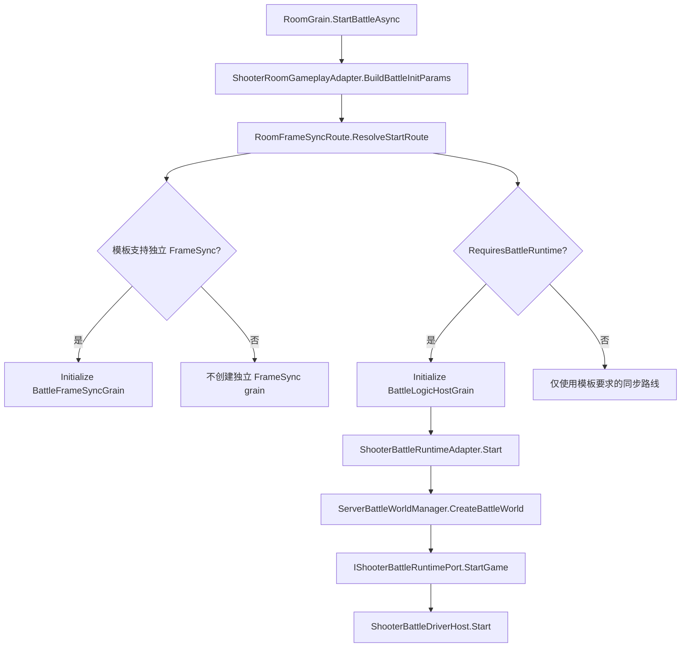
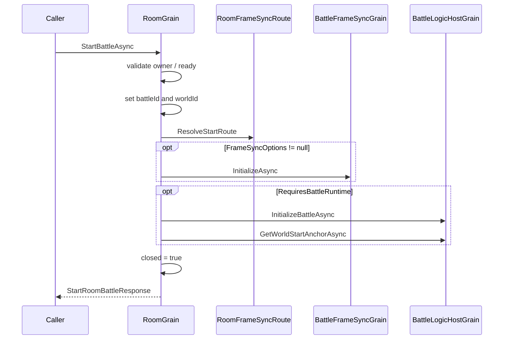

# Shooter 服务端适配与 Smoke 证据深潜

> 本文聚焦 Shooter 在 Orleans 服务端中的玩法特化边界：Room 如何生成稳定的战斗身份，Battle runtime adapter 如何托管权威世界与同步 payload，以及 Smoke 如何把协议、恢复、投影、玩法终局和 replay 变成可检查证据。通用 Gateway/Room/Battle 主链路见 [Gateway、Room 与 Battle 服务端链路](../../12-ServerArchitecture/02-GatewayRoomBattleFlow.md)，端到端接入概览见 [Shooter Gateway、Orleans 与 Smoke](03-GatewayOrleansSmoke.md)。

## 1. 边界与结论

Shooter 服务端不是一条由 `GatewayRequestRouter -> RoomGrain -> BattleFrameSyncGrain -> Shooter runtime` 固定串联的流水线。实际结构由三组边界组成：

| 边界 | 主要实现 | Shooter 特化职责 | 不负责 |
|------|----------|------------------|--------|
| 请求入口 | `GatewayRequestRouter` | 无；按 opcode 分派并归一化超时/异常 | 房间状态、玩法规则、客户端恢复 |
| 房间适配 | `RoomGrain`、`ShooterRoomGameplayAdapter` | 玩家槽位、ready、worldId、`BattleInitParams`、late join 参数 | 权威模拟、payload 编码 |
| 战斗适配 | `ShooterBattleRuntimeAdapter` | 创建 Shooter world、输入解码、推进、诊断与状态推送 | Room 成员关系、Gateway session |
| 可选独立帧路由 | `RoomFrameSyncRoute`、`BattleFrameSyncGrain` | 按同步模板决定是否创建独立 frame-sync grain | 默认 Shooter 权威 runtime 的必选依赖 |
| 运行证据 | `ShooterSmokeRunner`、`ShooterSmokeClientProcessRunner` | 单进程闭环、多进程恢复、网络条件与 replay | 替代单元测试或生产监控 |

核心结论：

1. Shooter 默认权威同步要求 Battle runtime，但不代表必然同时创建 `BattleFrameSyncGrain`。
2. Room 在启动前生成稳定 worldId 和稳定玩家槽位；默认 random seed 仍来自进程时间，不具备同等级确定性。
3. `StartBattleAsync()` 存在部分提交窗口，late join 则实现了明确的 Room 侧补偿。
4. packed 与 pure-state 是两套 payload 契约；pure-state 还区分全局 baseline 与 observer baseline。
5. Smoke 的通过条件不是“收到一帧”，而是协议、输入、恢复、投影、玩法终局、replay 和清理共同成立。

## 2. Gateway 只定义请求失败外观

`GatewayRequestRouter.RouteAsync()` 从 registry 解析 handler。未注册 opcode 返回 `UnhandledOpCode`；注册 handler 使用 linked cancellation token，并在配置大于零时调用 `CancelAfter`。

异常映射有一个容易忽略的边界：

| 情况 | 结果 |
|------|------|
| 未找到 handler | `GatewayStatusCode.UnhandledOpCode` |
| Router 自己触发的超时 | `GatewayStatusCode.Timeout` |
| handler 普通异常 | `GatewayStatusCode.Exception` |
| 调用方 cancellation token 已取消 | 不命中超时 catch filter，取消继续传播 |

因此“Gateway 隔离异常”不等于吞掉所有取消。外部取消仍保留调用方控制语义，玩法 handler 也不能依赖 Router 回滚 Room 或 Battle 状态。

## 3. Room 到战斗的 Shooter 特化

### 3.1 玩家槽位是稳定身份，不是列表下标

`ShooterRoomGameplayAdapter` 为首次加入的账户分配递增 playerId。成员离开后，其 ID 进入 `SortedSet<int>`；新成员优先复用最小已释放 ID。构造玩家快照和 `BattleInitParams.Players` 时再按 playerId 排序。

这保证三个性质：

- 前序成员离开不会让剩余成员整体换号；
- late join 可复用明确释放的槽位；
- 战斗初始化顺序不依赖字典枚举顺序。

默认玩家参数仍是示例策略：`ActorId`、`HeroId`、`SpawnPointId` 与 playerId 对齐，所有玩家 `TeamId = 1`，出生 X 坐标为 `(playerId - 1) * 2f`。这些值适合 Smoke，不应直接当作正式匹配和队伍分配规则。

### 3.2 worldId 稳定，默认 seed 不稳定

`BuildBattleInitParams()` 从 Room tags 读取 tick rate、map、seed 和 duration。worldId 由 roomId 经过 FNV-1a 风格的 64 位哈希生成，并把零值修正为 1；同一 roomId 可跨调用得到同一 worldId。

`RandomSeed` 的默认值则是 `Environment.TickCount`。若调用方没有显式写入 `ShooterRoomTagKeys.RandomSeed`，不同进程或不同启动时刻不能保证复现同一世界。需要确定性 replay 的测试或部署必须显式传 seed。

### 3.3 同步模板决定启动路线

`RoomFrameSyncRoute.ResolveStartRoute()` 先从玩法同步 profile 解析模板，再独立给出两个结果：

- `RequiresBattleRuntime`：是否初始化 `IBattleLogicHostGrain`；
- `FrameSyncOptions`：是否初始化 `IBattleFrameSyncGrain`。

模板无法解析时，route 会标记 `IsUnsupportedTemplate = true`，并回退为要求 Battle runtime、没有独立 frame-sync 的路线。当前 `RoomGrain` 不读取该标记做显式拒绝，因此它更接近兼容性回退信号，而不是启动失败信号。

## 4. Room 生命周期与事务边界

### 4.1 启动顺序存在部分提交窗口

`RoomGrain.StartBattleAsync()` 在等待任何远端初始化前，先写入 `_battleId` 和 `_worldId`，之后才按 route 初始化 frame-sync 和 Battle runtime，最后写 world start anchor 并设置 `_closed = true`。

当前方法没有围绕异步启动的 `try/catch`、状态快照或显式回滚。若 frame-sync 或 Battle 初始化中途失败，Room 可能保留 `_battleId`/`_worldId`，而 `_closed` 仍为 false；后续再次 Start 因 `_battleId` 已存在会直接返回已有战斗响应。这是现有实现的非事务边界，运维与测试应把“Room 已记录 battleId”与“Battle world 已健康启动”分开判断。

### 4.2 late join 有局部补偿

运行中战斗收到新账户时，Room 先加入 member tracker 和 gameplay state，再构造 `PlayerInitInfo` 调用 Battle join。若 Battle 返回拒绝，Room 会执行：

1. 从 member tracker 删除账户和成员状态；
2. 调用 gameplay adapter 的 `Leave()` 释放 Shooter player slot；
3. 抛出异常，让 Gateway 返回失败。

这保证 Room 的成员与 gameplay state 不会因为 Battle 拒绝而永久残留。补偿只覆盖 Room 内写入；若 Battle adapter 在返回拒绝前产生外部副作用，仍需由 Battle 边界自行处理。

已有成员在运行中重入返回 `Reconnect`。`RestoreAsync()` 只恢复已知 member 的在线状态，并依据 `_battleId` 选择 TeamLobby 或 Reconnect，不会把未知账户隐式加入房间。

## 5. Shooter Battle runtime session

### 5.1 启动、推进与销毁

`ShooterBattleRuntimeAdapter.CreateSession()` 为每个 battleId 创建 session。`Start()` 的顺序是：

1. 通过 `ServerBattleWorldManager.CreateBattleWorld()` 创建世界；
2. 从 world services 解析 `IShooterBattleRuntimePort`；
3. 将 `BattleInitParams` 转成 `ShooterStartGamePayload`；
4. 调用 `StartGame()`；
5. 创建并启动 `ShooterBattleDriverHost`；
6. 建立 accountId 到 playerId 的索引。

`Tick()` 调用 runtime 的 `AdvanceFrame(deltaTime)`，并以 `CurrentFrame >= frame` 判断是否追上 Battle host 要求的帧。`Dispose()` 停止 driver、销毁 battle world，并清空 runtime、observer baseline 与账户索引。

启动失败还有一处资源边界：world 创建后，如果 runtime port 缺失或 `StartGame()` 拒绝，`Start()` 直接返回失败，方法本身没有立即销毁已创建 world。正常 session Dispose 可最终清理，但启动调用方必须确保失败 session 进入销毁路径。

### 5.2 输入不是只接受 Shooter opcode

`SubmitInputs()` 对 `ShooterOpCodes.Input.PlayerCommand` 使用 `ShooterInputCodec` 解码，可从一个 Battle input 展开多个命令。其他 opcode 不会直接拒绝，而会通过 `CreateFallbackCommand()` 转成 Shooter command。

这让通用 Battle host 输入仍能进入示例 runtime，但也意味着“未知 opcode 已被服务端拒绝”不是当前契约。正式协议若要求严格白名单，应在 Gateway handler 或 adapter 中增加显式拒绝与指标。

## 6. packed 与 pure-state 推送

默认 adapter 从 `ABILITYKIT_SHOOTER_STATE_SYNC_PAYLOAD_MODE` 读取模式。空值、`packed` 或未知环境值最终使用 packed；`pure-state`、`purestate`、`pure_state` 使用 pure-state。Smoke 命令行只接受规范化后的 packed/pure-state，并在非 client 模式启动前设置环境变量。

| 维度 | packed | pure-state |
|------|--------|------------|
| 主 opcode | `ShooterOpCodes.Snapshot.PackedState` | full 为 `PureState`，delta 为 `PureStateDelta` |
| baseline | payload 自包含完整 packed 数据 | delta 携带 baseline frame/hash |
| 预算 | 固定 packed 编码 | 根据网络条件解析 active、delta、低频和插值参数 |
| observer 状态 | 不维护 pure-state baseline | 全局 baseline 与 observer baseline 分离 |
| AOI | packed 全量组件块 | observer 可建立 player interest scope 与可见性提示 |

pure-state 的非 observer push 使用 session 级 `_lastPureStateBaselineFrame/_lastPureStateBaselineHash`。observer push 使用 `ShooterObserverPureStateSyncState`，按 observer key 隔离 baseline 和 `AoiInterestSet`。若 accountId 无法映射到活着的 Shooter player，adapter 无法构造 observer interest scope，会退化为非 observer-specific pure-state push。

`ShooterStateSyncPushOptions.ResolvePureStateSettings()` 会按网络条件收缩预算。例如 limited-bandwidth profile 将 active budget 降为 128，并采用 4 帧 delta、30 帧低频间隔和 6 帧插值延迟。对应单元测试同时锁定 full/delta opcode、baseline frame/hash、环境模式解析和预算参数。

## 7. `BattleFrameSyncGrain` 是可选基础设施

独立 frame-sync grain 激活时先按默认 30Hz 注册 timer；`InitializeAsync()` 可重设 tick interval。输入按 frame 缓存，timer 一次最多追赶 5 帧，然后向 observer 发送 `OnFramePushed(evt)`。

当前实现的运维边界包括：

- observer 回调没有逐个 await 或异常隔离；
- deactivate 清理 timer 和 input buffer，但源码中没有清空 observer set；
- 它是否存在由同步模板决定，不能以它的 frame 作为所有 Shooter 战斗的唯一健康指标。

因此排障时应先查看 `RoomBattleStartRoute`，再决定检查 `BattleFrameSyncGrain` 还是 `BattleLogicHostGrain` 的运行状态。

## 8. 单进程 Smoke：完整闭环证据

`ShooterSmokeRunner.RunAsync()` 在同一 Host 中连接 TCP Gateway，但仍通过真实网络连接执行登录、房间和推送流程。其验收阶段为：

1. 固定账户登录并取得 session token；
2. create、ready、start、subscribe；
3. 捕获 packed snapshot，解析 wire 与 packed 字段；
4. 应用到本地 runtime 和 presentation，关闭插值以消除观察延迟；
5. 提交至少 3 组 Gateway 输入；
6. 构造旧一帧 full snapshot，确认返回 `IgnoredStaleSnapshot`；
7. 验证主客户端、late join 和 reconnect 的投影；
8. 直接驱动 Battle host 完成移动、射击、击杀和比赛终局；
9. 保存、最小化并验证 input-logic/server-frame replay；
10. 统一校验结果，取消 observer 订阅并销毁 Battle。

关键门禁不是全部采用严格相等：

| 证据 | 通过条件 |
|------|----------|
| wire/packed frame | 必须相等 |
| snapshot hash/entity | hash 非零，entity count 大于零 |
| runtime/presentation frame | 不得落后于 packed frame，可高于它 |
| 主客户端投影 | 必须至少应用一次 full sync，玩家数严格等于预期 |
| late join/reconnect 投影 | 不强制 full sync，玩家数使用下限语义 |
| reconnect | 必须重新登录、轮换 session token，并返回 `Reconnect` |
| gameplay loop | frame 前进、发生移动和射击、至少击败一个敌人、进入 Victory/Defeat/Ended |
| replay | 记录被消费，最小化结果可验证，状态回放匹配 |

清理顺序是先取消主账户和 late-join 账户对应 `IStateSyncObserverGrain` 的订阅，再调用 `IBattleLogicHostGrain.DestroyAsync()`。清理本身没有聚合容错：前一个 unsubscribe 抛错会阻止后续 destroy，因此失败报告应保留原始 battleId 供补偿清理。

## 9. 多进程 Smoke：恢复与网络条件证据

`ShooterSmokeClientProcessRunner` 支持 create/join 两种独立客户端进程。它不仅输出 pass/fail，还输出可供脚本解析的结构化字段：

- payload kind、source/baseline frame/hash；
- pure-state full、delta 和 baseline resync 次数；
- prediction reconciliation 前后 frame/hash、replay ticks 和 pending inputs；
- input accepted/current frame、server ticks、`ShouldResync`；
- reconnect 前后 push 数与 entry kind；
- latency、jitter、packet loss 和实际 delayed/dropped 计数；
- remote time anchor、catch-up frame；
- lag compensation 结果；
- input-state replay 路径、最小化结果和分布统计。

join 或 reconnect entry 会主动调用 `RequestFullSnapshotBaselineAsync()`，等待 accepted 后才等待可应用 snapshot。pure-state 客户端若遇到 baseline 不匹配，会累计 `PureStateBaselineResyncNeeded`；该指标与服务端 observer baseline 一起构成恢复链路证据。

多进程 reconnect 当前只对 join 模式执行：关闭 connection，等待配置延迟，再使用原 session token 重新走 `JoinReadyStartAndSubscribeAsync()`，要求 entry kind 为 Reconnect 且恢复后收到可应用 push。它验证的是连接恢复和 baseline 续接；单进程 Smoke 的“重新账户登录并轮换 token”是另一条更强的身份恢复门禁，两者不能混为同一个测试。

## 10. 失败矩阵与治理建议

| 故障点 | 当前行为 | 可见证据 | 仍需治理 |
|--------|----------|----------|----------|
| Gateway 未注册 opcode | 返回 `UnhandledOpCode` | Gateway response | registry 覆盖测试 |
| Gateway 内部超时 | 返回 `Timeout` | status code | 区分 handler 阶段指标 |
| Room 启动中途失败 | battleId/worldId 可能已写入 | Room runtime state、Battle 查询 | 引入启动状态与补偿/幂等恢复 |
| unsupported sync template | 回退 Battle runtime 路线 | `IsUnsupportedTemplate` 仅在 route 中 | 决定拒绝还是显式告警 |
| late join 被 Battle 拒绝 | 回滚 Room member 和 player slot | join 失败、Room snapshot | 验证 Battle 外部副作用 |
| Shooter Start 在 world 创建后失败 | session 返回失败，world 未立即销毁 | world manager/session 日志 | 失败路径立即 destroy |
| 未知 Battle input opcode | 转 fallback command | accepted/input 状态 | 正式环境增加协议白名单 |
| pure-state baseline 丢失 | 客户端请求 full baseline/resync | resync count、baseline 字段 | 告警阈值与速率限制 |
| observer push 异常 | frame-sync 无逐 observer 隔离 | 推送缺失/异常日志 | 隔离失败 observer |
| Smoke cleanup 中断 | 后续 destroy 可能未执行 | 遗留 battleId/world | `finally` + 聚合异常/补偿任务 |

优先级最高的工程补强是 Room 启动事务、Battle Start 失败资源释放和 Smoke cleanup 的 `finally` 化。这三项直接影响重复启动、残留 world 和测试环境污染，比继续扩展 Smoke 输出字段更重要。

## 11. 验证入口

| 验证目标 | 入口 |
|----------|------|
| Room 参数映射、稳定槽位与复用 | `ShooterRoomGameplayAdapterTests` |
| Battle world、输入、packed/pure-state、预算 | `ShooterBattleRuntimeAdapterTests` |
| battle session 销毁 world | `ShooterRoomToBattleFlowTests` |
| 单进程 TCP Gateway 闭环 | `AbilityKit.Orleans.ShooterSmoke` 默认模式 |
| 独立服务端 | `--server --tcp-port 41001` |
| 多进程创建/加入 | `--client --client-mode create|join` |
| pure-state | `--state-sync-payload-mode pure-state` |
| 网络条件 | `--condition-latency-ms`、`--condition-jitter-ms`、`--condition-packet-loss-rate` |
| 恢复与终局 | `--reconnect-once`、`--wait-for-match-end` |
| replay | `--client-state-replay-output`、`--server-frame-replay-output` |

## 12. 源码索引

| 模块 | 源码 |
|------|------|
| Gateway 路由 | `Server/Orleans/src/AbilityKit.Orleans.Gateway/Gateway/Core/GatewayRequestRouter.cs` |
| Room 生命周期 | `Server/Orleans/src/AbilityKit.Orleans.Grains/Rooms/RoomGrain.cs` |
| 同步启动路线 | `Server/Orleans/src/AbilityKit.Orleans.Grains/Rooms/RoomFrameSyncRoute.cs` |
| Shooter Room adapter | `Server/Orleans/src/AbilityKit.Orleans.Grains/Gameplays/Shooter/Rooms/ShooterRoomGameplayAdapter.cs` |
| Shooter Battle adapter | `Server/Orleans/src/AbilityKit.Orleans.Grains/Gameplays/Shooter/Battle/ShooterBattleRuntimeAdapter.cs` |
| 同步 payload 配置 | `Server/Orleans/src/AbilityKit.Orleans.Grains/Gameplays/Shooter/Battle/ShooterStateSyncPushOptions.cs` |
| 可选 FrameSync grain | `Server/Orleans/src/AbilityKit.Orleans.Grains/FrameSync/BattleFrameSyncGrain.cs` |
| 单进程 Smoke | `Server/Orleans/src/AbilityKit.Orleans.ShooterSmoke/Runner/ShooterSmokeRunner.cs` |
| Smoke 校验与清理 | `Server/Orleans/src/AbilityKit.Orleans.ShooterSmoke/Runner/ShooterSmokeScenarioBase.cs` |
| 多进程 Smoke | `Server/Orleans/src/AbilityKit.Orleans.ShooterSmoke/Runner/ShooterSmokeClientProcessRunner.cs` |
| 命令行入口 | `Server/Orleans/src/AbilityKit.Orleans.ShooterSmoke/Program.cs` |
| Room adapter 测试 | `Server/Orleans/src/AbilityKit.Orleans.Grains.Tests/Rooms/ShooterRoomGameplayAdapterTests.cs` |
| Battle adapter 测试 | `Server/Orleans/src/AbilityKit.Orleans.Grains.Tests/Battle/ShooterBattleRuntimeAdapterTests.cs` |
