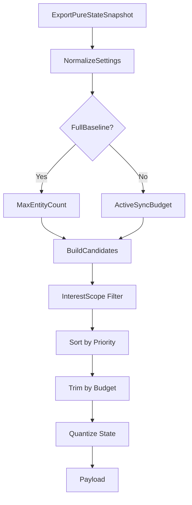

# Shooter 纯状态预算与兴趣范围深潜

> 本文单独拆解 Shooter 示例的 pure-state 同步设计，重点说明实体预算、兴趣范围、低频帧、基线/增量和候选排序如何共同作用。

## 1. 为什么要单独拆出来

Shooter 示例的 pure-state 不是简单的“换一种序列化格式”，而是另一条完整同步策略：

- 面向大量实体；
- 支持按预算截断；
- 支持按兴趣范围过滤；
- 支持低频帧补充；
- 支持 baseline/delta 校验。

这些内容比普通快照同步更需要单独说明。

## 2. 预算与兴趣范围

`ShooterPureStateSnapshotExporter` 的导出逻辑会根据以下信息动态决策：

| 维度 | 作用 |
|------|------|
| `isFullBaseline` | 是否导出完整基线 |
| `LowFrequencyIntervalFrames` | 是否走低频帧 |
| `MaxEntityCount` | 全量预算 |
| `ActiveSyncBudget` | 增量预算 |
| `interestScope` | 观察者兴趣范围 |

## 3. 候选实体的排序思想

pure-state 导出并不是“发现哪些实体就发哪些实体”，而是要先排序再裁剪。这样可以保证：

- 观察者自身优先；
- 关键实体优先；
- 远处或不重要实体在预算不足时被淘汰；
- 同类场景下结果更稳定。

## 4. 低频帧的意义

低频帧不是“少发一点就行”，而是为了在预算不足时补足长期状态一致性：

- 高频帧负责响应；
- 低频帧负责校正；
- baseline 负责恢复；
- delta 负责持续更新。

## 5. baseline/delta 关系

客户端应用 pure-state 增量前必须知道：

- 参考基线是哪一帧；
- 基线 hash 是什么；
- 当前 delta 是否可叠加；
- 若不可叠加，是否需要 full baseline。

这也是 pure-state controller 会返回 resync needed 的原因。

## 6. 为什么这比普通 snapshot 更适合大规模场景

因为它允许：

- 不同客户端看到不同的实体集合；
- 同一客户端按兴趣范围看到不同细节；
- 网络压力高时自动退化；
- 不破坏同步语义的前提下做预算裁剪。

## 7. 源码索引

| 模块 | 源码 |
|------|------|
| pure-state 导出 | `Unity/Packages/com.abilitykit.demo.shooter.runtime/Runtime/Application/Synchronization/ShooterPureStateSnapshotExporter.cs` |
| pure-state 同步控制器 | `Unity/Packages/com.abilitykit.demo.shooter.view.runtime/Runtime/Client/Synchronization/ShooterPureStateSnapshotSyncController.cs` |
| pure-state 设置 | `Unity/Packages/com.abilitykit.demo.shooter.runtime/Runtime/Application/Synchronization/ShooterPureStateSyncSettings.cs` |
| 兴趣范围 | `Unity/Packages/com.abilitykit.demo.shooter.runtime/Runtime/Application/Synchronization/ShooterPureStateInterestScope.cs` |
