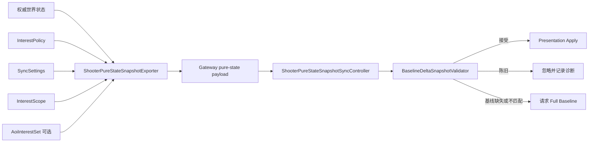
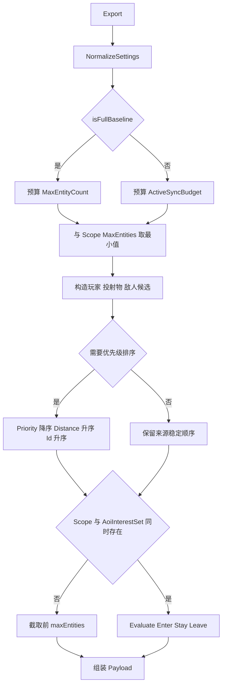
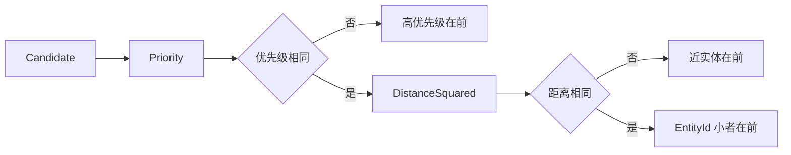
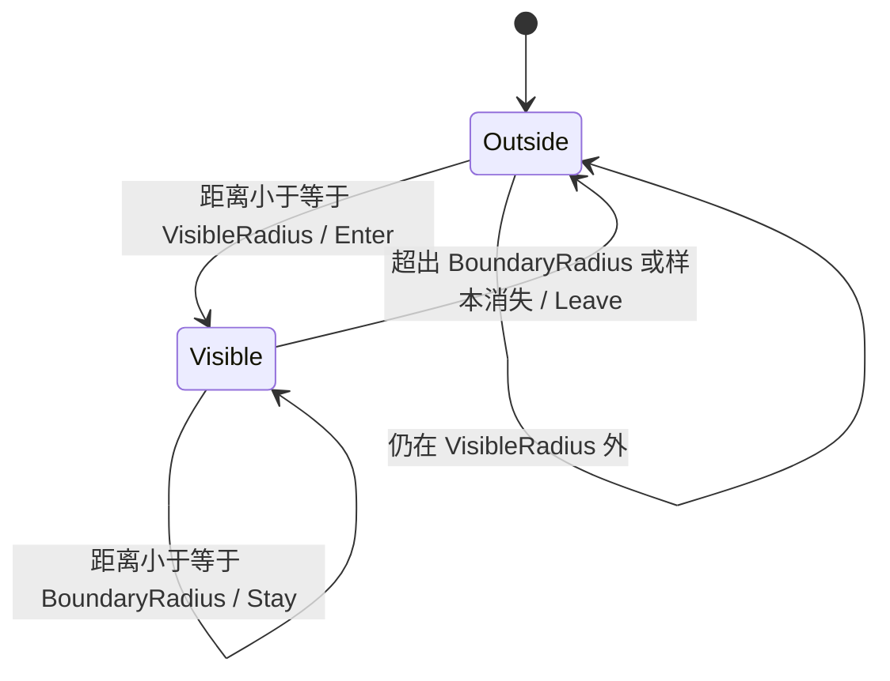
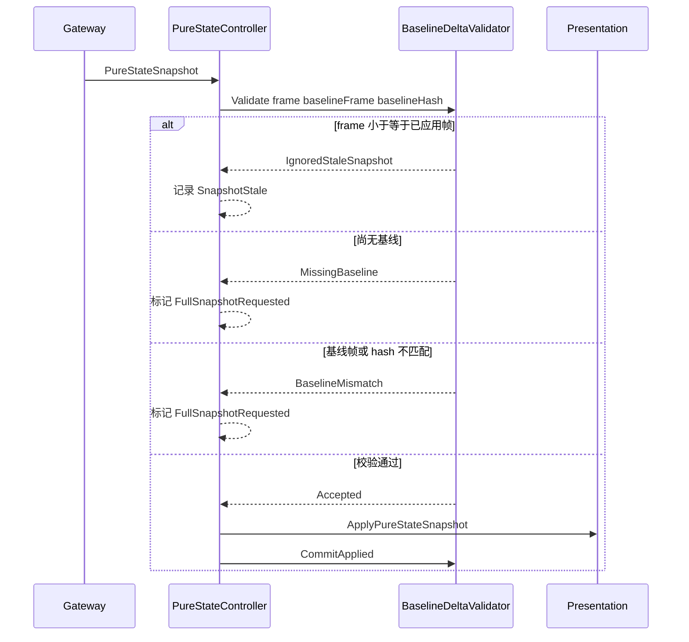

# Shooter 纯状态预算与兴趣范围深潜

> 本文以当前运行时代码为准，说明 pure-state 导出如何组合实体预算、候选优先级、AOI 状态、低频标记和 baseline/delta 校验。它不是普通快照的另一种编码格式，而是一条具有独立选择与恢复语义的同步链路。

## 1. 设计目标与边界

纯状态同步解决的是“实体总量可能远大于单帧可发送量”时的可控降级问题。服务端先从权威世界构造候选，再按客户端上下文选择有限实体；客户端则必须先验证帧序和基线，再把载荷交给表现层。

当前实现提供：

- 全量基线与增量使用不同实体预算；
- 按观察者、实体类型、存活状态、范围和距离稳定排序；
- 可选的跨帧 AOI 可见集合，生成 `Enter`、`Stay`、`Leave`；
- 位置和速度定点量化；
- 过期帧拒绝、缺失基线和基线不一致恢复；
- 同步健康事件与诊断快照。

需要明确的边界：

- `ShooterPureStateSnapshotExporter` 负责一次导出，不负责决定何时发送 baseline 或 delta；`BaselineIntervalFrames`、`DeltaIntervalFrames` 和发送节奏由上层调度策略消费。
- 仅传入 `interestScope` 不会维护跨帧可见集合，也不是严格的半径硬过滤；只有同时传入 `AoiInterestSet` 才执行 AOI 进入、保持和离开迁移。
- `StateHash` 是完整权威状态的校验值，不是“本次裁剪后实体数组”的摘要。
- 预算裁剪保证流量上界，不保证预算外实体最终一定轮转发送；若业务需要公平轮转，应在策略层增加年龄或欠账权重。

## 2. 组件职责

| 组件 | 责任 | 不负责 |
|------|------|--------|
| `ShooterPureStateSnapshotExporter` | 归一化设置、构造候选、排序、预算裁剪、AOI 转换、量化和组装载荷 | 网络发送频率、客户端重同步请求 |
| `ShooterPureStateInterestPolicy` | 计算玩家、投射物、敌人的优先级与观察点距离 | 保存历史可见状态 |
| `ShooterPureStateInterestScope` | 描述观察者、中心、可见/边界半径和客户端实体上限 | 自身不产生 `Enter/Leave` |
| `AoiInterestSet` | 保存跨帧可见键，按双半径产生 `Enter/Stay/Leave` | 不决定 Shooter 实体字段 |
| `BaselineDeltaSnapshotValidator` | 校验帧序、是否已有基线及 baseline frame/hash | 不应用表现状态 |
| `ShooterPureStateSnapshotSyncController` | 解码网关推送、调用校验器、发布健康事件、通过后提交表现层 | 不修补不兼容的 delta |



## 3. 设置归属与默认值

`ShooterPureStateSyncSettings` 定义在 Shooter 协议包中，因为设置会随 `ShooterPureStateSnapshotPayload` 一起序列化。当前默认值为：

| 字段 | 默认值 | 当前语义 |
|------|-------:|----------|
| `MaxEntityCount` | 10000 | 全量基线实体上限，也是任何导出的总上限 |
| `ActiveSyncBudget` | 512 | 非全量导出的可见实体预算 |
| `BaselineIntervalFrames` | 60 | 供上层发送策略使用；导出器本身不据此切换 baseline |
| `DeltaIntervalFrames` | 2 | 供上层发送策略使用；导出器本身不据此跳帧 |
| `LowFrequencyIntervalFrames` | 15 | 非全量且帧号整除时，将载荷标记为低频类别 |
| `InterpolationDelayFrames` | 3 | 随协议下发给消费端，导出器不执行插值 |

导出前会归一化设置：非正数回退到协议默认值。因此调用方不能用 `0` 表示“关闭预算”；如需零实体，应通过 `interestScope.MaxEntities` 之外的明确策略实现，因为该字段仅在大于零时参与上限计算。

## 4. 单次导出流程

一次 `Export` 的主要步骤如下：

1. 归一化设置并读取当前帧。
2. 判断是否为低频帧：仅非 baseline 且 `frame % LowFrequencyIntervalFrames == 0` 时成立。
3. baseline 选择 `MaxEntityCount`，其他快照选择 `ActiveSyncBudget`。
4. 若 `interestScope.MaxEntities > 0`，再与当前预算取最小值。
5. 从 Svelto 世界或普通快照读取端构造候选。
6. 需要裁剪、存在兴趣范围或启用 AOI 时执行稳定排序。
7. 直接截取候选，或交给 `AoiInterestSet` 转换可见状态。
8. 计算权威状态 hash，写入 baseline/delta 元数据并返回载荷。



## 5. 预算计算不是独立过滤器

最终可见实体预算为：

```text
baseBudget = isFullBaseline ? MaxEntityCount : ActiveSyncBudget
maxEntities = min(MaxEntityCount, max(0, baseBudget))
maxEntities = interestScope.MaxEntities > 0
    ? min(maxEntities, interestScope.MaxEntities)
    : maxEntities
```

没有 `AoiInterestSet` 时，选择器只复制排序后的前 `maxEntities` 个候选。范围外实体仍会留在候选中，只是通常优先级更低、距离更远，在预算紧张时更容易被淘汰。因此“传入兴趣范围”等价于硬过滤是错误理解。

预算只限制 `Enter/Stay` 对应的可见实体数量。启用 AOI 后，`Leave` 生成的 `Despawn` 会先加入结果，不占 `visibleCount`；这避免在可见预算已满时丢失必要的移除事件，所以最终 `Entities.Length` 可能短暂大于可见实体预算。

## 6. 候选优先级与确定性

排序比较器依次使用：

1. `Priority` 降序；
2. 到兴趣中心的距离平方升序；
3. 实体 ID `TieBreaker` 升序。

这保证相同权威状态和相同兴趣参数下，预算边界上的选择结果稳定。玩家、投射物和敌人的策略并不完全相同：

- 观察者自身玩家获得最高优先级；
- 存活玩家高于死亡玩家，范围内玩家继续加权；
- 观察者自己发射的投射物优先于普通投射物；
- 范围外投射物仍可成为候选，但优先级降到很低；
- Svelto 路径还包含敌人，按存活状态和是否在范围内计算优先级；普通快照回退路径当前只提供玩家和投射物。

这个回退差异是能力边界：不能假设两条读取路径在所有实体种类上完全等价。



## 7. AOI 状态迁移与迟滞半径

`AoiInterestSet` 是有状态对象，调用方必须为每个观察者维护独立实例，不能在多个客户端之间共享。其可见判断使用双半径：

- 尚不可见的实体使用 `VisibleRadius`，进入后产生 `Enter`；
- 已可见实体使用不小于可见半径的 `BoundaryRadius`，继续可见产生 `Stay`；
- 超出边界半径或本帧候选中消失，产生 `Leave`。

双半径形成迟滞区，可降低实体在边界附近移动时反复 spawn/despawn。全量基线调用 `Evaluate(..., forceFullBaseline: true)`，会先清空历史可见集合，因此当前范围内实体重新以 `Enter` 输出为 `Spawn`。



迁移到 Shooter delta 的规则是：

| AOI 迁移 | `DeltaKind` | 说明 |
|----------|-------------|------|
| `Enter` | `Spawn` | 建立客户端实体 |
| `Stay` | baseline 时 `Spawn`，其他情况 `Update` | 更新仍可见实体 |
| `Leave` | `Despawn` | 使用最后一次可见样本保留 kind、layer、owner 和 flags |

## 8. 低频帧的真实语义

当前实现中的“低频帧”首先是协议分类与实体 flag，而不是第二套补发队列：

- 非 baseline 且命中间隔时，`SnapshotKind` 为 `LowFrequency`；
- 投射物统一增加 `LowFrequency` flag；
- 死亡玩家和死亡敌人增加该 flag；
- 候选仍受 `ActiveSyncBudget` 和相同排序/裁剪约束；
- 导出器没有基于“多久未发送”轮换候选，也不会自动扩大预算。

因此低频帧可供客户端或上层策略区分更新类别，但不能宣称它已经保证所有低优先级实体最终收敛。若要实现长期公平补偿，需要显式增加候选年龄、分层预算或轮转游标，并为断线恢复建立测试。

## 9. 量化与载荷元数据

位置和速度都按 `1000` 缩放并四舍五入到整数，减少浮点跨端差异。每个实体还携带 kind、layer、owner、HP、分数、剩余帧和 flags；`VisibilityHints` 与选中的可见实体配套输出优先级信息，`Leave` 只产生 despawn entity，不产生 hint。

baseline 与 delta 的元数据规则不同：

| 字段 | Full baseline | Delta / Low frequency |
|------|---------------|-----------------------|
| `BaselineFrame` | 当前导出帧 | 调用方传入的基线帧 |
| `BaselineHash` | 当前 `StateHash` | 调用方传入的基线 hash |
| `StateHash` | 当前权威状态 hash | 当前权威状态 hash |
| 实体默认 `DeltaKind` | `Spawn` | `Update` |

调用方必须把最近一次已认可 baseline 的 frame/hash 原样带到后续 delta。导出器不会替调用方查找或修正错误基线。

## 10. 客户端校验与恢复

客户端控制器先把载荷转换为通用 `BaselineDeltaSnapshotInfo`，再执行以下顺序：



关键约束：

- 已应用过快照后，`Frame <= LastAppliedFrame` 一律作为陈旧帧忽略；
- delta 到达时若从未应用快照，或没有有效 baseline frame，返回 `MissingBaseline`；
- delta 的 baseline frame/hash 任一不等于本地记录，返回 `BaselineMismatch`；
- 失败的 delta 不会进入表现层，也不会推进 `LastAppliedFrame`；
- 新 full baseline 可直接被接受，提交后清除 resync 状态；
- 控制器保留最后忽略帧、重同步帧、状态 hash 和健康事件，供监控与 smoke 断言使用。

## 11. 风险与扩展准则

| 风险 | 表现 | 建议 |
|------|------|------|
| AOI 对象跨客户端共享 | 一个观察者的 `Leave` 污染另一个观察者 | 每会话或每观察者独占 `AoiInterestSet` |
| baseline 与 delta 使用不同兴趣上下文 | 大量意外 spawn/despawn 或表现残留 | baseline 重建时同步重置对应 AOI 状态 |
| 长期固定排序 | 低优先级实体持续饥饿 | 引入年龄权重或分层保底预算 |
| 只看 entity budget | 忽略 despawn 额外数量造成包体峰值 | 同时监控实体数、字节数和 leave 数 |
| 关闭 `computeStateHash` | hash 为零，削弱诊断价值 | 仅在明确的性能测试或非校验链路关闭 |
| 回退读取路径缺少敌人 | 不同宿主导出实体集合不一致 | 将端口契约扩展后增加双路径一致性测试 |

扩展优先级策略时必须保留稳定 tie-breaker；扩展协议字段时必须同步 MemoryPack 顺序、codec 版本、网关解码与客户端投影，不能只修改导出器。

## 12. 验证清单

至少覆盖以下自动化场景：

1. baseline 使用 `MaxEntityCount`，delta 使用 `ActiveSyncBudget`，scope 上限取三者最小值。
2. 相同优先级和距离时按实体 ID 稳定选择。
3. 无 AOI 状态集时，范围外实体在预算充足时仍可能输出。
4. 有 AOI 状态集时验证 `Enter -> Stay -> Leave`，并验证边界半径迟滞。
5. leave 数量不受可见预算截断，且生成 `Despawn`。
6. full baseline 重置 AOI 集合并重新输出 spawn。
7. 低频帧类别、flags 和预算符合当前实现，不误测为自动轮转。
8. 陈旧帧被忽略；缺失基线和 baseline frame/hash 不匹配触发 full baseline resync。
9. 校验失败时表现层回调未执行，成功提交后诊断字段正确更新。
10. 量化边界、负坐标和大值不会产生非确定性结果。

## 13. 源码索引

| 模块 | 源码 |
|------|------|
| pure-state 导出与候选选择 | `Unity/Packages/com.abilitykit.demo.shooter.runtime/Runtime/Application/Synchronization/ShooterPureStateSnapshotExporter.cs` |
| Shooter 兴趣优先级策略 | `Unity/Packages/com.abilitykit.demo.shooter.runtime/Runtime/Application/Synchronization/ShooterPureStateInterestPolicy.cs` |
| 导出端口与兴趣范围 | `Unity/Packages/com.abilitykit.demo.shooter.runtime/Runtime/Application/Ports/ShooterRuntimePorts.cs` |
| 协议设置、实体 delta 与 payload | `Unity/Packages/com.abilitykit.protocol.shooter/Runtime/PureStateSync/ShooterPureStateSyncCodec.cs` |
| 通用 AOI 可见集合 | `Unity/Packages/com.abilitykit.world.statesync/Runtime/StateSync/Aoi/AoiInterestSet.cs` |
| baseline/delta 校验器 | `Unity/Packages/com.abilitykit.network.runtime/Runtime/Network/Runtime/Sync/BaselineDeltaSnapshotValidator.cs` |
| pure-state 客户端控制器 | `Unity/Packages/com.abilitykit.demo.shooter.view.runtime/Runtime/Client/Synchronization/ShooterPureStateSnapshotSyncController.cs` |
