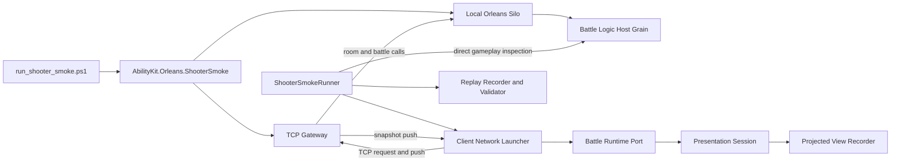
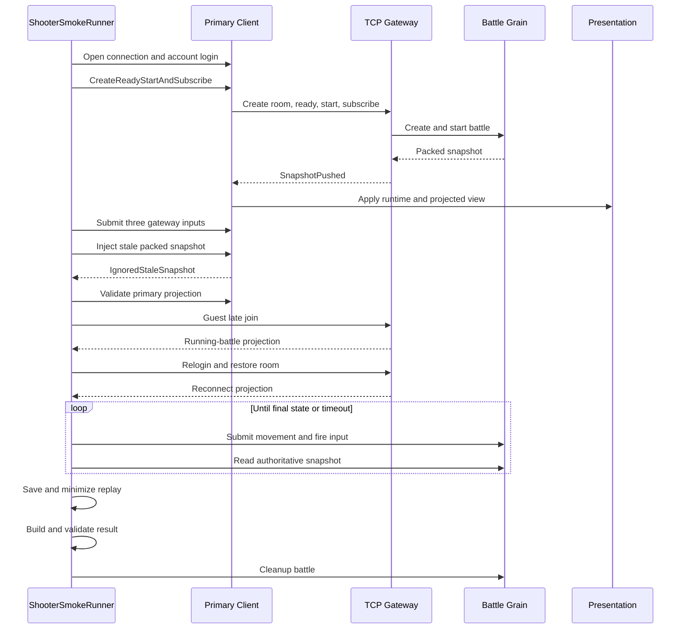
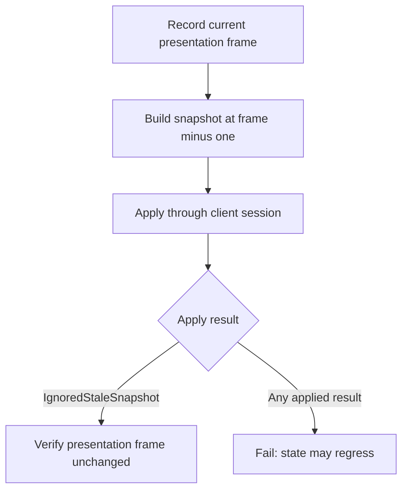

# Shooter Smoke 验证用例深潜

> 本文以当前实现为准，说明 Shooter smoke 覆盖的系统边界、执行阶段、硬断言、诊断方法与尚未覆盖的风险。它不是单纯的端口探活，而是一条贯穿 Orleans、TCP Gateway、房间流程、战斗运行时、状态同步、表现投影、恢复流程与回放产物的进程内验收链路。

## 1. 验证范围与非目标

默认 smoke 在同一进程中启动本地 Orleans Silo 和 TCP Gateway，再使用真实客户端网络适配器执行完整场景。通过条件不是“服务能启动”或“收到一个包”，而是以下证据同时成立：

1. 账号登录、建房、准备、开局和订阅成功，且产生有效的 room、battle、world 标识。
2. Gateway 推送的 packed snapshot 能被客户端解码、应用并推进 runtime 与 presentation。
3. wire envelope 与 packed payload 的 world、frame、server tick、payload opcode 等协议锚点有效。
4. 客户端状态产生非零 hash，旧帧快照被拒绝且不会回退表现帧。
5. 主客户端、晚加入客户端和重连客户端均能形成有效表现投影。
6. 输入经 Gateway 被接受，完整玩法循环实际发生移动、开火、击败敌人并进入终局。
7. 配置回放输出路径时，生成原始与最小化 input-logic replay，并计算回放验证摘要。

当前 smoke 不等价于以下测试：

- 不证明生产集群部署、外部存储、负载均衡或跨机器网络正确。
- 默认单进程场景固定使用 packed state，不覆盖 pure-state baseline/delta 的全部恢复规则。
- 不做长时间稳定性、并发房间容量、吞吐量或内存泄漏验证。
- 不检查渲染画面像素，只验证 presentation projection 的实体结果。
- replay 摘要单元测试不启动 Gateway，也不能替代端到端 smoke。

## 2. 运行拓扑



`Program.cs` 有三种入口形态：

| 形态 | 参数 | 行为 |
|---|---|---|
| 默认验收 | 无 `--server` / `--client` | 启动本地 Silo、Gateway，调用 `ShooterSmokeRunner.RunAsync`，输出 PASS 摘要 |
| 独立服务 | `--server` | 仅启动状态同步服务并等待退出，供外部客户端进程连接 |
| 客户端进程 | `--client` | 调用 `ShooterSmokeClientProcessRunner`，支持 create/join、网络劣化、重连和 packed/pure-state 模式 |

默认进程无论场景成功还是抛异常，`Program.cs` 的 `finally` 都会停止 TCP transport 和 host。这是进程资源清理，不等同于战斗 Grain 的业务清理。

## 3. 推荐执行方式

在仓库根目录使用 PowerShell：

```powershell
pwsh -File Server/Orleans/tools/run_shooter_smoke.ps1
```

常用参数：

```powershell
pwsh -File Server/Orleans/tools/run_shooter_smoke.ps1 `
  -Configuration Release `
  -TcpPort 41002
```

脚本默认执行以下动作：

1. 清理 TCP 端口、Orleans Silo/Gateway 端口以及匹配的旧 smoke 进程；`-NoCleanup` 可跳过。
2. 构建 smoke 项目；`-NoBuild` 可跳过，但要求对应配置已存在可运行产物。
3. 删除上次的原始和最小化 replay，运行默认验收场景。
4. 检查两个 replay 文件均已创建且长度大于零。

默认产物位于：

```text
artifacts/shooter_smoke/records/input-logic.record.bin
artifacts/shooter_smoke/records/input-logic.min.record.bin
```

`-ReplayExtension` 可以修改扩展名，但不会改变回放内容格式。脚本只验证文件存在且非空；回放内容的语义验证由运行器生成摘要，当前总结果硬断言并未要求该摘要必须通过。

## 4. 默认场景时序



默认开局数据是固定种子 `20260610`、默认 tick rate 和两个玩家。固定种子降低了验收波动，但同时意味着该场景不是随机地图或多种配置的覆盖测试。

## 5. 分阶段硬断言

### 5.1 登录与房间启动

主客户端使用带随机后缀的 account ID 登录，并启用 `kickExisting`。`CreateReadyStartAndSubscribeAsync` 负责串联建房、准备、开局和订阅；启动结果必须满足 launcher 自身校验，最终结果还要求：

- `RoomId`、`BattleId` 非空；
- `WorldId` 非零；
- 客户端目标帧与后续输入响应可用。

这些断言能定位“连接成功但房间/战斗未建立”的半成功状态。

### 5.2 Packed snapshot 协议

主客户端只把 `AppliedPackedSnapshot` 视为首个目标推送。捕获逻辑要求：

| 锚点 | 断言 |
|---|---|
| Gateway opcode | 必须是 `SnapshotPushed` |
| payload opcode | 必须是 `ShooterOpCodes.Snapshot.PackedState` |
| payload | 非空且可被 packed codec 反序列化 |
| world | wire world 与 packed world 相同 |
| frame | wire frame 与 packed frame 相同 |
| server tick | wire 与 packed 两侧都大于零 |
| state hash | packed state hash 非零 |
| entities | packed entity count 大于零 |
| client progress | runtime 与 presentation frame 均不落后于 packed frame |

注意：当前硬断言要求 wire frame 与 packed frame 相等，但不要求 wire server ticks 与 packed server tick 数值相等，只要求两者有效。文档和新增测试不应把它误写成 tick 严格相等。

客户端应用后还会计算 runtime state hash，并要求结果非零。此处证明状态已形成稳定摘要，不等价于服务端和客户端 hash 已做逐值相等比较；`ShooterSmokeResult` 分别记录 runtime hash 与 snapshot hash。

### 5.3 输入接收

场景先通过 Gateway 提交三组不同的移动、瞄准和开火输入。每次提交都要求：

- remote response 成功；
- accepted frame 不小于 requested frame；
- current frame 非负；
- status 非空；
- server ticks 大于零。

最终总断言再次要求输入数至少为 3，并检查最后一次响应。这样既覆盖网络请求路径，也避免仅靠直接 Grain 调用完成整个 smoke。

### 5.4 旧快照拒绝

运行器构造 `lastAppliedFrame - 1` 的 full + authority-override packed snapshot，通过客户端 session 注入。期望返回 `IgnoredStaleSnapshot`，并且 presentation frame 保持不变。



这里验证的是客户端帧单调性防线，不模拟真实 TCP 乱序，也不覆盖 baseline hash 不匹配等 pure-state resync 分支。

### 5.5 表现投影

投影记录器统计 apply batch、full-sync batch、实体增删、组件更新以及最终实体分类。三类客户端的要求不同：

| 客户端 | 入口约束 | full sync 要求 | 玩家数要求 |
|---|---|---|---|
| Primary | 正常 create/start/subscribe | 必须至少应用一次 full-sync projection batch | 必须精确等于主表现层当前玩家数 |
| Late join | 不得落入 `TeamLobby` | 不强制 `FullSyncApplyCount > 0` | 最终玩家数不得低于主客户端玩家数 |
| Reconnect | 必须为 `Reconnect` | 不强制 `FullSyncApplyCount > 0` | 最终玩家数不得低于主客户端玩家数 |

三者都必须至少应用一个 projection batch，且最终实体数大于零。晚加入和重连允许玩家数高于主客户端基准，是因为加入过程本身可能改变房间中的玩家集合。

这一区分非常重要：当前实现不能支持“三个客户端都必须观察到 full sync”的结论。只有 primary 明确要求 full-sync batch；late join 和 reconnect 验证的是恢复后投影有效和玩家数达到最低值。

## 6. 完整玩法循环

快照与投影通过后，运行器直接访问 `IBattleLogicHostGrain` 推进确定性的玩法循环：

1. 读取初始权威快照并找到 actor 1。
2. 循环读取当前帧，提交带移动和持续开火的玩家命令。
3. 每次输入被接受后记录 replay，等待约 35 ms，再读取权威快照。
4. 比较玩家位置判断是否实际移动，累计是否开火。
5. 在终局出现或 15 秒超时后构建玩法结果。

总结果要求：

- final frame 大于 start frame；
- 观察到移动；
- 至少提交过开火；
- `DefeatedEnemies > 0`；
- `MatchFinal` 为真；
- 终局状态属于 `Victory`、`Defeat` 或 `Ended`；
- time limit 和 match completed frame 都大于零。

`GameplayMatchVictory` 和胜利目标等字段会进入结果与输出，但当前硬断言并不要求必须胜利。因此 smoke 验证“完整进入合法终局”，而不是固定要求 Victory。

## 7. Replay 证据链

配置 `--input-logic-replay-output` 后，`ShooterSmokeReplayRecordScope` 记录初始快照、服务端接受的输入以及后续权威快照。场景结束时：

- 保存原始 replay；
- 生成最小化 replay 路径；
- 调用 `ShooterSmokeReplayValidation.ValidateReplay` 生成验证结果；
- 将路径和验证摘要写入 `ShooterSmokeResult` 与 PASS 输出。

覆盖边界需要明确：

- `run_shooter_smoke.ps1` 对两个文件执行存在性和非空检查。
- `ShooterSmokeReplaySummaryTests` 使用内存数据验证 summary 的 metadata、frame 范围、opcode 分布及 packed/pure-state 诊断计数。
- 当前 `ShooterSmokeScenarioBase.ValidateSmokeResult` 没有针对 replay 路径或 `ReplayValidation` 的硬断言。

因此，回放文件缺失会被推荐脚本拦截；直接运行项目且未提供输出路径时，不会因缺失 replay 失败。若回放可重放性成为发布门禁，应在总结果校验中增加明确断言，而不是只依赖格式化输出。

## 8. 多进程与网络劣化模式

`ShooterSmokeClientProcessRunner` 提供比默认场景更灵活的客户端进程入口。命令行可配置：

- `--client-mode create|join`；
- host、TCP port、room ID、player ID 和 client ID；
- input count、seed 和 timeout；
- 等待比赛结束和执行一次 reconnect；
- latency、jitter、packet-loss rate 及其随机种子；
- `packed` 或 `pure-state` payload mode；
- input-state replay 输出路径。

该运行器会统计 packed/pure-state push、full baseline、delta、resync request、reconciliation、网络条件、lag compensation 和 reconnect 等诊断项。它适合搭建“独立服务进程 + 多客户端进程”的专项验证，但这些参数不是默认 `run_shooter_smoke.ps1` 场景自动覆盖的矩阵。

## 9. 失败定位顺序

出现失败时按数据流从外到内排查，避免只查看最终异常：

| 失败信号 | 优先检查 |
|---|---|
| TCP listen timeout | 端口占用、Gateway 注册、host 启动日志 |
| login / launch 失败 | account/session token、room flow、Grain 调用异常 |
| 等待 snapshot 超时 | observer 订阅、snapshot emitter、Gateway push 分发 |
| payload opcode 或 frame 不匹配 | wire 序列化、packed codec、Gateway envelope 构造 |
| runtime/presentation frame 未推进 | client session apply、runtime import、presentation session |
| stale snapshot 被应用 | 客户端 last-applied-frame 和拒绝分支 |
| projection 无实体 | projected sink、full/delta batch、实体分类映射 |
| late join 落入 lobby | running battle 恢复路由与 room entry kind |
| reconnect kind 错误 | account relogin、session 替换、room restore |
| 未移动/未击败敌人/未终局 | 输入接受、战斗 tick、命中与胜负规则、15 秒期限 |
| replay 缺失或为空 | 输出目录、record scope、save/minimize 路径 |

PASS 输出由 `ShooterSmokeResultFormatter` 汇总标识、输入帧、hash、snapshot、projection、late join、reconnect、gameplay 和 replay 字段。保留完整输出比只保留退出码更有利于定位跨层失败。

## 10. 清理语义与已知风险

存在两层清理：

1. `Program.cs` 的 `finally` 总会取消 transport、停止 TCP server 并停止 host。
2. `ShooterSmokeRunner.RunAsync` 在 `ValidateSmokeResult(result)` 成功后调用 `CleanupBattleAsync`，取消 observer 并清理战斗相关资源。

第二层当前不在 `try/finally` 中。若场景中途失败，或最终结果校验抛异常，业务清理调用不会执行；默认同进程 host 随后会停止，但在复用外部服务或多进程调试时可能残留房间/战斗状态。工程上若需要把 smoke 长期运行在共享环境，应把业务清理放入持有 room/battle 标识后的 `finally`，并让清理异常不覆盖原始失败。

脚本的启动前进程清理只能缓解端口和旧进程残留，不能证明 Grain 业务状态已经按正常路径释放。

## 11. 扩展用例准则

新增验证应遵循以下约束：

- 同时记录“输入条件、服务端锚点、客户端应用结果”，不要只检查一个布尔值。
- 区分硬断言与诊断字段；进入结果模型不代表已经成为通过条件。
- 对 primary、late join、reconnect 分别定义恢复契约，不复制不符合实现的 full-sync 假设。
- 协议断言明确是“非零”“单调”“相等”还是“最低数量”，避免扩大语义。
- 网络劣化、pure-state 和多客户端矩阵优先复用 client-process runner，避免在默认 smoke 中堆叠不稳定时序。
- 端到端场景负责跨层契约，summary 单元测试负责纯数据统计，两者不能相互替代。

## 12. 验收检查表

- [ ] 默认脚本完成构建并以退出码 0 结束。
- [ ] PASS 输出包含非空 room/battle ID 和非零 world ID。
- [ ] packed snapshot 的 wire/packed frame 一致，server ticks、hash 和 entity count 有效。
- [ ] runtime 与 presentation frame 不落后于 snapshot frame。
- [ ] 三个 Gateway 输入成功，accepted frame 不回退。
- [ ] 注入旧快照返回 `IgnoredStaleSnapshot`，表现帧不变化。
- [ ] primary 存在 full-sync projection；late join/reconnect 形成有效投影但不强制 full-sync 计数。
- [ ] reconnect entry kind 为 `Reconnect`，late join 未进入 `TeamLobby`。
- [ ] 完整玩法循环发生移动、开火、击败敌人并进入合法终局。
- [ ] 原始与最小化 replay 文件存在且非空。
- [ ] 失败场景检查业务清理残留，尤其是共享服务模式。

## 13. 源码索引

| 模块 | 源码 |
|---|---|
| 默认 host 与命令行参数 | `Server/Orleans/src/AbilityKit.Orleans.ShooterSmoke/Program.cs` |
| 默认端到端场景 | `Server/Orleans/src/AbilityKit.Orleans.ShooterSmoke/Runner/ShooterSmokeRunner.cs` |
| 公共登录、断言与清理 | `Server/Orleans/src/AbilityKit.Orleans.ShooterSmoke/Runner/ShooterSmokeScenarioBase.cs` |
| 客户端进程场景 | `Server/Orleans/src/AbilityKit.Orleans.ShooterSmoke/Runner/ShooterSmokeClientProcessRunner.cs` |
| 结果模型 | `Server/Orleans/src/AbilityKit.Orleans.ShooterSmoke/Models/ShooterSmokeResults.cs` |
| PASS 输出格式 | `Server/Orleans/src/AbilityKit.Orleans.ShooterSmoke/Models/ShooterSmokeResultFormatter.cs` |
| Replay summary 单元测试 | `Server/Orleans/src/AbilityKit.Orleans.ShooterSmoke.Tests/ShooterSmokeReplaySummaryTests.cs` |
| 推荐运行脚本 | `Server/Orleans/tools/run_shooter_smoke.ps1` |
