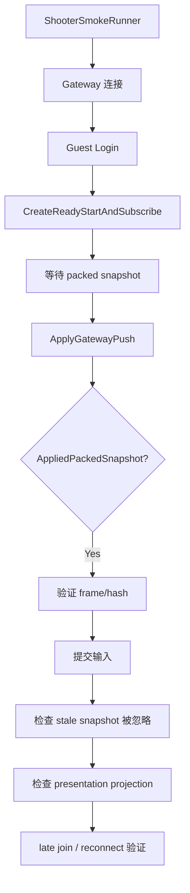

# Shooter Smoke 验证用例深潜

> 本文把 `ShooterSmokeRunner` 的验收点整理成可读的设计文档，突出为什么 smoke 不只是连通性测试，而是同步协议、状态一致性和恢复能力的综合验证。

## 1. Smoke 的目标

Shooter smoke 的目标不是“启动成功”，而是验证：

- room flow 正常；
- battle runtime 正常；
- packed snapshot 可以被导入；
- hash 对得上；
- stale snapshot 能被拒绝；
- late join / reconnect 可以恢复到正确投影。

## 2. 核心验证点

## 3. 为什么要验证 frame 和 hash

frame 和 hash 是同步协议最核心的两个稳定锚点：

- frame 说明双方看的是哪一帧；
- hash 说明双方状态是否一致。

只验证“有画面”远远不够，必须验证这两个锚点。

## 4. stale snapshot 的意义

烟测里显式验证过期 snapshot 被忽略，是为了防止：

- 重放旧数据；
- 网络乱序导致状态回退；
- 客户端误把旧快照当新快照应用。

这类错误在真实网络环境里非常常见，因此必须在示例中暴露出来。

## 5. late join / reconnect

Shooter smoke 还验证：

- 晚加入时是否能拿到合适的投影；
- 重连后是否能重新同步；
- 表现层是否能正确恢复。

这说明 smoke 不只关注“第一帧”，而是关注整条生命周期。

## 6. 结果校验的思路

烟测最后会构建 `ShooterSmokeResult` 并执行验证。设计上它应关注：

- 所有关键事件是否出现；
- 每个关键步骤是否得到期望结果；
- 有无意外异常、超时、状态不一致。

## 7. 源码索引

| 模块 | 源码 |
|------|------|
| Smoke Runner | `Server/Orleans/src/AbilityKit.Orleans.ShooterSmoke/Runner/ShooterSmokeRunner.cs` |
| Smoke Scenario Base | `Server/Orleans/src/AbilityKit.Orleans.ShooterSmoke/Runner/ShooterSmokeScenarioBase.cs` |
| Smoke Result | `Server/Orleans/src/AbilityKit.Orleans.ShooterSmoke/Runner/ShooterSmokeResult.cs` |
