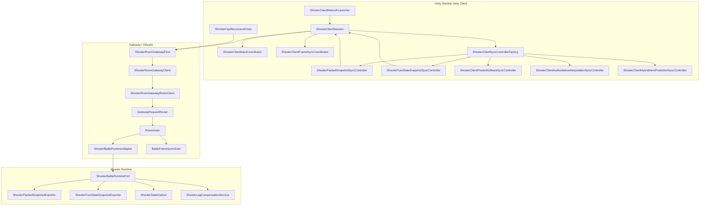
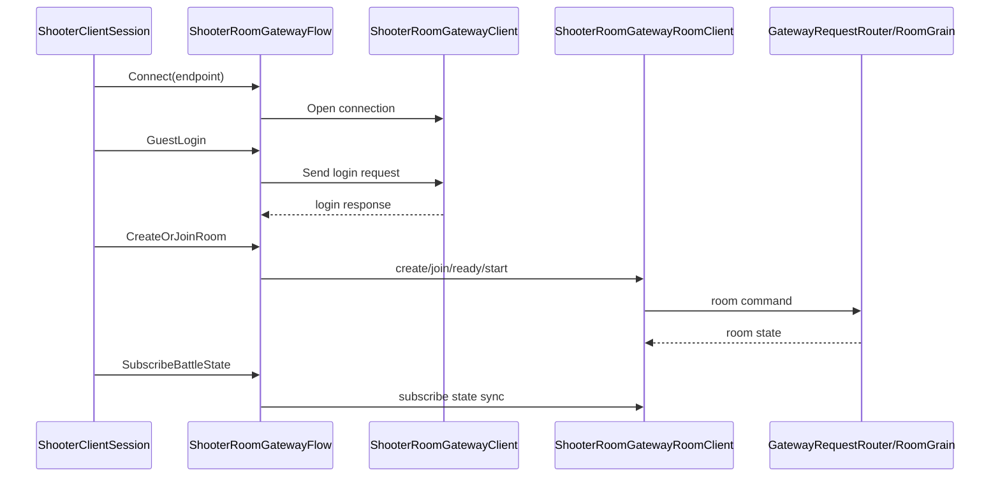
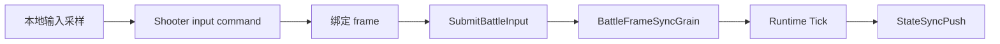
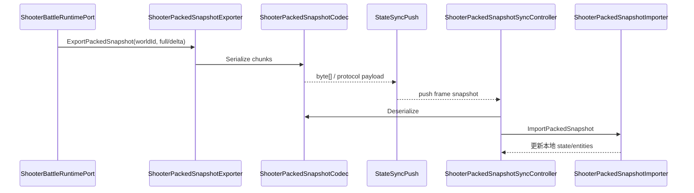
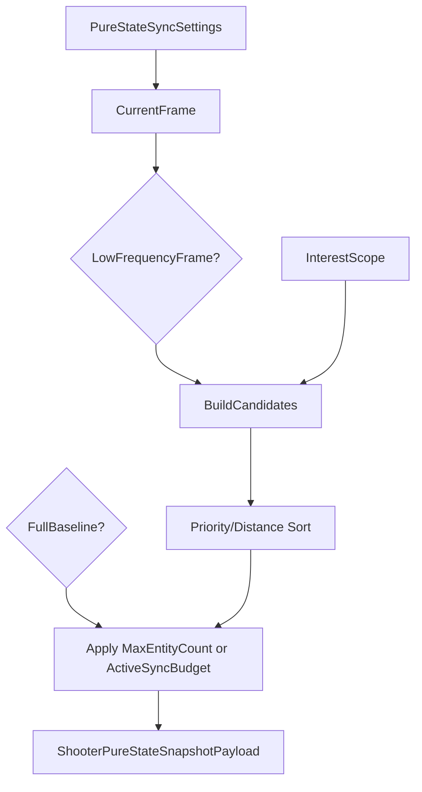
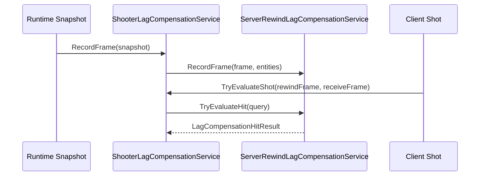

# Shooter 网络模块深潜

> 本文聚焦 Shooter 示例的网络模块组合：客户端 Session、Gateway Room Flow、同步控制器、快照编码、纯状态预算、延迟补偿与重连验收。它补充 `04-ClientSyncStrategies.md` 与 `05-ServerFlowAndSmokeDeepDive.md` 中没有展开的网络模块职责边界。

## 1. 网络模块全景

Shooter 网络链路不是单个类，而是一组可替换模块：

## 2. 客户端网络入口

| 模块 | 职责 |
|------|------|
| `ShooterClientNetworkEndpoint` | 描述服务器地址、端口、协议等连接端点 |
| `ShooterClientConnectionFactory` | 创建底层连接对象 |
| `ShooterClientNetworkLauncher` | 把 endpoint、connection、session 组合成启动流程 |
| `ShooterClientGatewayLauncher` | 面向 Gateway 模式的启动入口 |
| `ShooterClientSession` | 聚合登录、房间、输入、同步、表现回调 |
| `ShooterClientBattleHandle` | 封装进入战斗后的句柄与状态 |

设计上客户端不直接调用 `RoomGrain` 或 `BattleFrameSyncGrain`。所有远程调用先进入 Gateway 客户端层，再由服务端路由到 Orleans Grain。

## 3. Room Gateway Flow

`ShooterRoomGatewayFlow` 把房间生命周期包装成客户端可调用的顺序流程：

这层的价值是把“网络请求编排”与“战斗同步策略”隔离：房间创建失败、登录失败、ready/start 失败不会污染 packed/pure-state 同步控制器。

## 4. 输入网络模块

Shooter 输入链路按“本地输入采样 → frame sync 协调 → Gateway 提交 → 服务端 Tick”组织：

| 模块 | 职责 |
|------|------|
| `ShooterClientInputCoordinator` | 采样移动、瞄准、开火等输入，生成协议输入 |
| `ShooterClientFrameSyncCoordinator` | 将输入绑定到帧号，处理帧同步节奏 |
| `ShooterClientFrameSyncController` | 客户端 frame sync 控制器，连接输入与远端帧确认 |
| `BattleFrameSyncGrain` | 服务端聚合输入帧，形成权威帧推进依据 |
| `FramePacketNetAdapter` | Host Extension 中的 frame packet 网络适配层 |

## 5. 同步控制器矩阵

`ShooterClientSyncControllerFactory` 的核心价值是按策略选择控制器，而不是把所有同步策略塞进一个大类。

| 控制器 | 适用模式 | 关键行为 |
|--------|----------|----------|
| `ShooterPackedSnapshotSyncController` | packed snapshot 状态同步 | 反序列化 packed payload，按帧应用，忽略 stale snapshot |
| `ShooterPureStateSnapshotSyncController` | 大规模 pure-state 同步 | 应用 baseline/delta、预算、兴趣范围、插值延迟 |
| `ShooterClientPredictRollbackSyncController` | 客户端预测回滚 | 本地预测、权威快照对账、漂移恢复 |
| `ShooterClientAuthoritativeInterpolationSyncController` | 完全权威插值 | 延迟播放服务端快照，减少抖动 |
| `ShooterClientHybridHeroPredictionSyncController` | 主角预测 + 其他实体插值 | 主控角色低延迟，非主控实体权威插值 |

## 6. Packed Snapshot 网络路径

packed 模式面向小中规模实体与高频权威同步。

packed snapshot 的特点：

- 用 chunk 表示 entity id、flags、位置、速度、血量、分数、生命周期等字段；
- `ShooterPackedSnapshotChunkCodec` 对 float 做量化与 pair packing；
- `ShooterPackedSnapshotImporter` 区分 full 与 delta；
- `ShooterPackedSnapshotBytesCodec` 为回滚和网络传输提供 byte[] 包装。

## 7. Pure-State 网络路径

pure-state 模式面向大规模实体与带预算的状态同步。`ShooterPureStateSnapshotExporter` 会在导出时执行：

1. 归一化 `ShooterPureStateSyncSettings`；
2. 判断当前帧是否是 low-frequency frame；
3. 根据 full baseline 或 delta 选择 `MaxEntityCount` / `ActiveSyncBudget`；
4. 根据 Svelto context 或普通 snapshot 构造候选实体；
5. 按 priority、距离、entity id 排序；
6. 截断到预算内；
7. 输出 entity delta 与 visibility hint；
8. 携带 baseline frame/hash 与 current state hash。

## 8. 延迟补偿模块

`ShooterLagCompensationService` 把 runtime snapshot 转换为 `LagCompensatedEntitySnapshot` 并交给 `ServerRewindLagCompensationService`。

| 能力 | 说明 |
|------|------|
| `RecordFrame(runtime)` | 从 `GetSnapshot()` 捕获玩家位置、命中半径、存活状态 |
| `TryEvaluateShot(shot, out result)` | 按客户端请求的 rewind frame 回放命中检测 |
| Telemetry | 暴露 captured frame、oldest frame、latest frame |
| LastEvaluation | 记录最近一次命中补偿评估，便于诊断 |

## 9. 网络质量与重连

| 模块 | 说明 |
|------|------|
| `ShooterNetworkConditionProvider` | 为演示或验收提供延迟、抖动、丢包等网络条件 |
| `ShooterCarrierNetworkLink` | Demo harness 中模拟 carrier 链路 |
| `ShooterDemoHarnessCarrier` | packed/predict 等模式的测试载体 |
| `ShooterHybridDemoHarnessCarrier` | 混合同步模式测试载体 |
| `ShooterInterpolationDemoHarnessCarrier` | 插值模式测试载体 |
| `ShooterFastReconnectDriver` | 快速重连流程驱动 |
| `ShooterTimeAnchorCoordinator` | 对齐客户端播放时间与服务端权威时间 |

这些模块共同支撑 smoke 中的 stale snapshot、late join、reconnect、state hash 校验。

## 10. 模块边界总结

| 层级 | 不应该做 | 应该做 |
|------|----------|--------|
| Gateway Flow | 不解释 snapshot 内容 | 负责登录、房间、订阅、请求顺序 |
| ClientSession | 不实现具体同步算法 | 聚合同步控制器、输入、表现回调 |
| SyncController | 不创建房间 | 应用快照、预测/插值/回滚、处理 stale |
| RuntimePort | 不关心网络连接 | 导出 snapshot/hash、执行 tick、导入权威状态 |
| SnapshotExporter | 不做客户端表现 | 量化、排序、预算、baseline/delta |
| LagCompensation | 不推进战斗帧 | 捕获历史帧并评估 rewind 命中 |

## 11. 源码入口

| 主题 | 源码 |
|------|------|
| 客户端 Session | `Unity/Packages/com.abilitykit.demo.shooter.view.runtime/Runtime/Client/ShooterClientSession.cs` |
| 网络启动 | `Unity/Packages/com.abilitykit.demo.shooter.view.runtime/Runtime/Client/ShooterClientNetworkLauncher.cs` |
| Gateway Flow | `Unity/Packages/com.abilitykit.demo.shooter.view.runtime/Runtime/Client/Gateway/ShooterRoomGatewayFlow.cs` |
| Gateway Client | `Unity/Packages/com.abilitykit.demo.shooter.view.runtime/Runtime/Client/Gateway/ShooterRoomGatewayClient.cs` |
| 输入协调 | `Unity/Packages/com.abilitykit.demo.shooter.view.runtime/Runtime/Client/Session/ShooterClientInputCoordinator.cs` |
| 帧同步协调 | `Unity/Packages/com.abilitykit.demo.shooter.view.runtime/Runtime/Client/Session/ShooterClientFrameSyncCoordinator.cs` |
| 同步控制器工厂 | `Unity/Packages/com.abilitykit.demo.shooter.view.runtime/Runtime/Client/Synchronization/ShooterClientSyncControllerFactory.cs` |
| packed 控制器 | `Unity/Packages/com.abilitykit.demo.shooter.view.runtime/Runtime/Client/Synchronization/ShooterPackedSnapshotSyncController.cs` |
| pure-state 控制器 | `Unity/Packages/com.abilitykit.demo.shooter.view.runtime/Runtime/Client/Synchronization/ShooterPureStateSnapshotSyncController.cs` |
| pure-state exporter | `Unity/Packages/com.abilitykit.demo.shooter.runtime/Runtime/Application/Synchronization/ShooterPureStateSnapshotExporter.cs` |
| packed exporter | `Unity/Packages/com.abilitykit.demo.shooter.runtime/Runtime/Application/Synchronization/ShooterPackedSnapshotExporter.cs` |
| lag compensation | `Unity/Packages/com.abilitykit.demo.shooter.runtime/Runtime/Application/Synchronization/ShooterLagCompensationService.cs` |
| RoomGrain | `Server/Orleans/src/AbilityKit.Orleans.Grains/Rooms/RoomGrain.cs` |
| BattleFrameSyncGrain | `Server/Orleans/src/AbilityKit.Orleans.Grains/FrameSync/BattleFrameSyncGrain.cs` |
