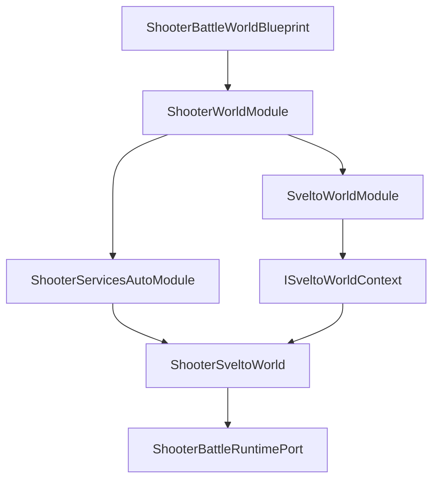
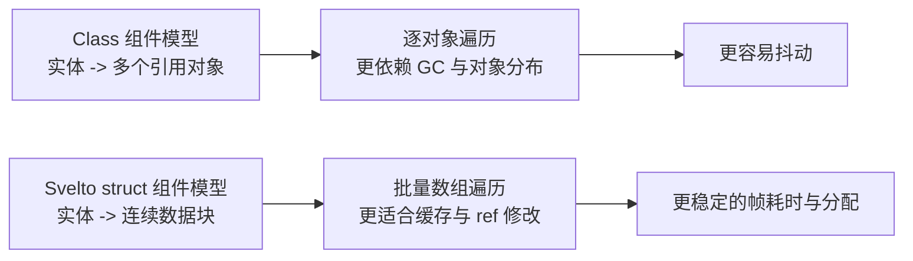
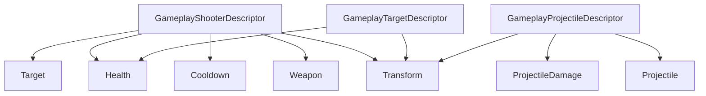
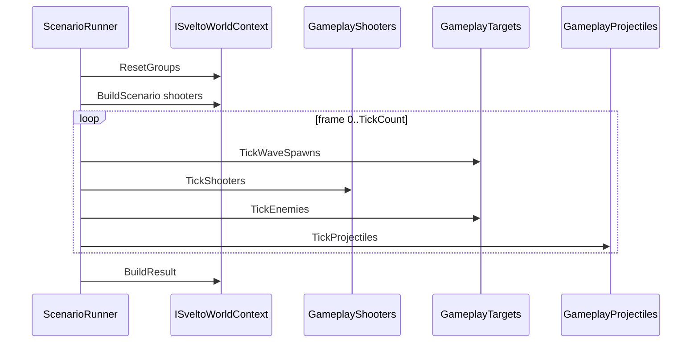
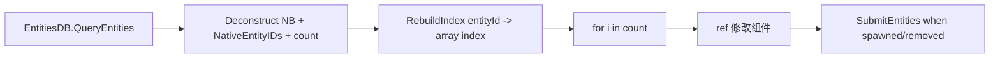
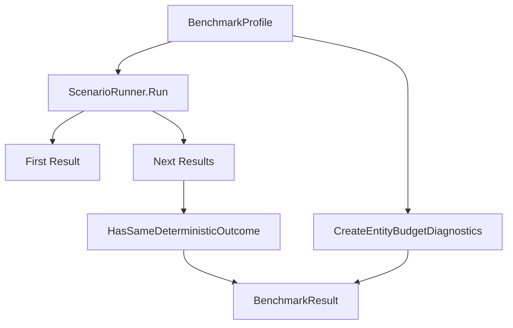
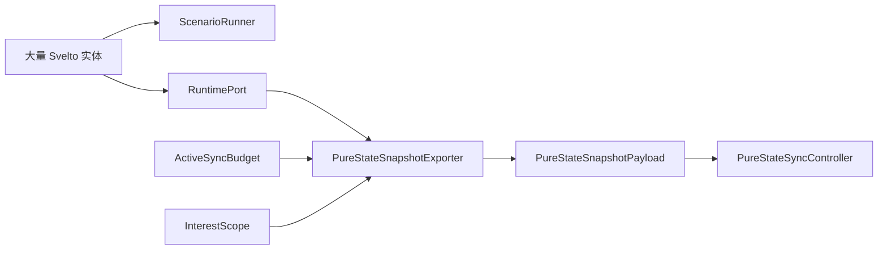

# Shooter Svelto 性能模式深潜

> 本文补充 Shooter 示例的 Svelto 性能模式。该模式不是普通战斗逻辑的替代品，而是展示 AbilityKit 如何用 Svelto struct component、分组、批量查询、预算诊断和确定性 benchmark 构建大规模 Shooter 场景。

## 1. 设计定位

Shooter 中有两类 Svelto 用法：

| 用法 | 目标 | 代表源码 |
|------|------|----------|
| 战斗运行时实体存储 | 支撑玩家、子弹、敌人快照与状态哈希 | `ShooterEntityManager`、`ShooterSveltoPlayerComponent`、`ShooterSveltoProjectileComponent` |
| 性能模式 gameplay scenario | 大量 shooter/target/projectile 的批处理压测 | `ShooterSveltoGameplayScenarioRunner`、`ShooterSveltoGameplayBenchmark` |

性能模式强调：

- struct component 降低对象分配；
- ExclusiveGroup 隔离不同实体族；
- `EntitiesDB.QueryEntities` 批量取数组；
- `NB<T>` 与 `NativeEntityIDs` 避免逐实体对象遍历；
- benchmark 输出确定性、实体预算、帧均耗时、帧均分配。

## 2. Svelto World 装配

`ShooterWorldModule` 在 world 构建时加入 `SveltoWorldModule` 与 Shooter 自动服务模块：

`ShooterSveltoWorld` 只是一个很薄的 world service，保存 `ISveltoWorldContext`。这样其他服务无需知道 Svelto module 如何初始化，只通过 DI 拿到上下文。

## 3. Entity Group 与 Layout

Shooter 将不同实体用途放到不同 group：

| Group | 用途 |
|-------|------|
| `shooter.players` | 正常战斗运行时玩家 |
| `shooter.projectiles` | 正常战斗运行时子弹 |
| `shooter.gameplay.shooters` | 性能模式中的射手阵列 |
| `shooter.gameplay.targets` | 性能模式中的敌人/靶子阵列 |
| `shooter.gameplay.projectiles` | 性能模式中的大规模投射物阵列 |

`ShooterSveltoEntityLayout` 把实体创建集中到三个方法：

| 方法 | Descriptor | Group |
|------|------------|-------|
| `BuildPlayer` | `ShooterSveltoPlayerDescriptor` | `Players` |
| `BuildProjectile` | `ShooterSveltoProjectileDescriptor` | `Projectiles` |
| `BuildGameplayTarget` | `ShooterSveltoGameplayTargetDescriptor` | `GameplayTargets` |

这种 layout 层让业务系统不直接散落 `BuildEntity<TDescriptor>` 调用，便于替换 group 或 descriptor。

## 4. 性能模式组件设计

性能模式的组件拆成小 struct：

| Component | 字段语义 | 典型系统 |
|-----------|----------|----------|
| `ShooterSveltoTransformComponent` | 位置、方向 | shooter 旋转、projectile 移动、target 索引 |
| `ShooterSveltoHealthComponent` | 当前血量、最大血量、存活标记 | 命中、死亡、波次统计 |
| `ShooterSveltoWeaponComponent` | 子弹速度、伤害、冷却、散射 | `TickShooters`、`TickEnemies` |
| `ShooterSveltoCooldownComponent` | 剩余冷却帧 | 批量射击节奏 |
| `ShooterSveltoTargetComponent` | 当前锁定目标 entity id | 减少每帧重新选目标成本 |
| `ShooterSveltoProjectileComponent` | 子弹拥有者、目标 group、剩余寿命 | 投射物推进 |
| `ShooterSveltoProjectileDamageComponent` | 子弹伤害 | 命中结算 |

### 4.1 结构体组件相对类组件的性能优势

Shooter 的 Svelto 性能模式刻意使用 `struct` 组件，而不是传统面向对象里常见的 `class` 组件。其核心目的不是“语法更短”，而是让大规模实体在批处理循环里更稳定、更便宜。

| 维度 | `struct` 组件 | `class` 组件 |
|------|---------------|--------------|
| 内存布局 | 连续、紧凑，便于按数组批量遍历 | 对象分散在堆上，访问更离散 |
| GC 压力 | 低，组件本身通常不产生托管分配 | 高，实体数量大时对象实例多 |
| CPU 缓存 | 更友好，遍历时更容易命中缓存行 | 较差，指针跳转多，局部性弱 |
| 批量更新 | 适合 `EntitiesDB.QueryEntities` 后 `ref` 修改 | 需要逐对象访问，批处理收益低 |
| 复制成本 | 值语义，适合小而密的状态块 | 引用语义，单体对象更重 |
| 并行/分组 | 更容易围绕 group 和数组做阶段性处理 | 依赖对象图，切分成本更高 |

Shooter 这里不是简单“把类换成结构体”，而是配合 Svelto 的查询和 group 机制形成一个完整的高性能路径：

1. 先按 group 把同类实体隔离；
2. 再用 `EntitiesDB.QueryEntities<...>()` 一次性取出组件数组；
3. 在 `for` 循环中按 index 批量 `ref` 修改；
4. 最后统一 `SubmitEntities()` 处理生成与移除。

这条路径比“每个实体一个 class 组件、每帧遍历对象列表”的方式更适合大规模 shooter 场景，因为它减少了：

- 托管堆对象数量；
- 逐对象虚调用和属性访问；
- cache miss 和 pointer chasing；
- 频繁结构变更带来的调度成本。

### 4.2 与常规组件式编程的对比

传统组件式编程如果使用 `class` 组件，通常更接近“对象集合”模型：一个实体持有多个引用型组件，系统按对象逐个读取和修改。这样的模型在中小规模玩法里足够清晰，但在 Shooter 的 projectile storm、wave survival 和 large-scale budget 场景里会出现两个问题：

- **数据访问不连续**：系统每次读取都要跨越多个堆对象，性能对对象数量和分布更敏感；
- **扩展到大规模时容易抖动**：实体数上涨后，分配、回收和 cache miss 会把帧耗时拉宽。

Svelto 的 `struct` 组件更像“数据块 + 批处理系统”的组合：

因此，Shooter 的 Svelto 设计并不是为了替代所有组件式编程，而是为了在“海量实体 + 高频 Tick + 预算约束”这类场景下，把性能风险前置到数据结构层解决。

Descriptor 则按实体族组合组件：

## 5. Scenario Runner 主循环

`ShooterSveltoGameplayScenarioRunner.Run` 的执行顺序固定：

每帧阶段顺序决定仿真语义：

1. 先刷波次，保证本帧新增敌人可以被射手看到；
2. 再让 shooter 查询 target 并发射子弹；
3. 再让 enemy 反击 shooter；
4. 最后推进 projectile、命中和移除。

## 6. 批处理查询模式

典型查询代码会一次性取出多个组件数组和 entity ids：

关键设计点：

| 点 | 说明 |
|----|------|
| `NB<T>` | 批量组件 buffer，循环中可按 index 读取或 `ref` 修改 |
| `NativeEntityIDs` | 查询结果对应的实体 id buffer |
| `RebuildIndex` | 构建 entity id 到数组 index 的映射，避免嵌套扫描 |
| `_projectileRemovalBuffer` | 先记录待删除子弹，循环结束后统一 remove |
| `_enemySpawnBuffer` | 先收集待生成敌人，再统一 build + submit |

## 7. Projectile Storm 场景

`ProjectileStorm` 是典型压力场景：

| 参数 | 值 | 含义 |
|------|----|------|
| shooterCount | 64 | 多射手同时开火 |
| targetCount | 96 | 大量目标参与选择和命中 |
| tickCount | 120 | 模拟 120 帧 |
| projectilesPerShot | 3 | 每次射击多子弹 |
| cooldownFrames | 3 | 高频开火 |
| wave count | 3 波 | 持续补充目标 |

它用于验证数组批处理、投射物生命周期、命中统计和状态 hash 的确定性。

## 8. Wave Survival 场景

`WaveSurvival` 更接近玩法样板：

| 参数 | 值 | 含义 |
|------|----|------|
| shooterCount | 4 | 少量玩家/炮台 |
| targetCount | 96 | 总敌人规模 |
| tickCount | 180 | 更长持续时间 |
| maxActiveEnemies | 36 | 控制场上活跃敌人 |
| waves | 3 波 | 按 startFrame 与 spawn interval 刷新 |

它展示了配置化 battle flow 如何驱动 Svelto 实体生成、目标索引和战斗结算。

## 9. Benchmark Profile 与预算诊断

`ShooterSveltoGameplayBenchmark` 会多次运行 scenario，并比较首轮与后续结果是否完全一致。

预算诊断字段：

| 字段 | 说明 |
|------|------|
| `MaxEntityCount` | 全局最大实体数 |
| `ActiveSyncBudget` | 每帧活跃同步预算 |
| `RequestedInitialEntityCount` | 场景请求的初始实体数 |
| `ClampedInitialEntityCount` | 按限制裁剪后的实体数 |
| `InitialEntityBudgetHeadroom` | 剩余实体预算 |
| `InitialEntitiesWithinBudget` | 初始实体是否超限 |
| `TotalActiveSyncBudgetFrames` | 总帧数 × 活跃同步预算 |
| `AverageFrameTicks` | 平均每帧 tick 耗时 |
| `AverageFrameAllocatedBytes` | 平均每帧分配字节 |

## 10. LargeScaleEntityBudget Profile

`LargeScaleEntityBudget` 是预算压力入口：

| 参数 | 值 |
|------|----|
| shooterCount | 256 |
| targetCount | 4096 |
| tickCount | 60 |
| arenaRadius | 64 |
| maxActiveEnemies | 512 |
| activeSyncBudget | 2048 |

这个 profile 的重点不是“所有实体每帧都同步”，而是展示：

1. 模拟实体规模可以很大；
2. 网络同步必须有 `ActiveSyncBudget`；
3. pure-state exporter 通过候选排序与预算裁剪输出网络可承受的子集；
4. benchmark 同时记录 CPU 和分配指标。

## 11. 与网络同步的关系

Svelto 性能模式和 pure-state 网络模块之间的关系如下：

Svelto 提供高效本地实体遍历，pure-state 提供网络侧预算与可见性裁剪。两者结合才构成“大规模场景可运行且可同步”的设计。

## 12. 性能模式边界

| 边界 | 说明 |
|------|------|
| ScenarioRunner 不连接真实 Gateway | 它是本地性能/确定性压测入口 |
| Benchmark 不替代 Profiling 工具 | 它输出粗粒度 ticks/alloc/determinism，真实项目仍需 Unity Profiler |
| ActiveSyncBudget 不等于实体上限 | 它是每帧可同步实体数，不是场上实体数 |
| Svelto group 不等于玩法阵营 | group 是存储和查询分区，阵营/目标规则由组件和系统表达 |
| SubmitEntities 不应散落每个实体 | 批量生成/删除后统一 submit，减少结构变更成本 |

## 13. 源码入口

| 主题 | 源码 |
|------|------|
| World module | `Unity/Packages/com.abilitykit.demo.shooter.runtime/Runtime/Worlds/ShooterWorldModule.cs` |
| Svelto world wrapper | `Unity/Packages/com.abilitykit.demo.shooter.runtime/Runtime/Infrastructure/Ecs/Svelto/ShooterSveltoWorld.cs` |
| Groups | `Unity/Packages/com.abilitykit.demo.shooter.runtime/Runtime/Infrastructure/Ecs/Svelto/ShooterSveltoEntities.cs` |
| Entity layout | `Unity/Packages/com.abilitykit.demo.shooter.runtime/Runtime/Infrastructure/Ecs/Svelto/ShooterSveltoEntityLayout.cs` |
| Gameplay components | `Unity/Packages/com.abilitykit.demo.shooter.runtime/Runtime/Infrastructure/Ecs/Svelto/ShooterSveltoGameplayComponents.cs` |
| Gameplay descriptors | `Unity/Packages/com.abilitykit.demo.shooter.runtime/Runtime/Infrastructure/Ecs/Svelto/ShooterSveltoGameplayDescriptors.cs` |
| Scenario config | `Unity/Packages/com.abilitykit.demo.shooter.runtime/Runtime/Domain/Gameplay/ShooterSveltoGameplayScenarioConfig.cs` |
| Scenario runner | `Unity/Packages/com.abilitykit.demo.shooter.runtime/Runtime/Domain/Gameplay/ShooterSveltoGameplayScenarioRunner.cs` |
| Benchmark | `Unity/Packages/com.abilitykit.demo.shooter.runtime/Runtime/Domain/Gameplay/ShooterSveltoGameplayBenchmark.cs` |
| Battle step engine | `Unity/Packages/com.abilitykit.demo.shooter.runtime/Runtime/Domain/Battle/Systems/ShooterBattleSystem.cs` |
| Enemy wave system | `Unity/Packages/com.abilitykit.demo.shooter.runtime/Runtime/Domain/Battle/Systems/ShooterEnemyWaveBattleSystem.cs` |
| Bot AI target index | `Unity/Packages/com.abilitykit.demo.shooter.runtime/Runtime/Domain/Battle/AI/ShooterBotAiSystem.cs` |
| Pure-state exporter | `Unity/Packages/com.abilitykit.demo.shooter.runtime/Runtime/Application/Synchronization/ShooterPureStateSnapshotExporter.cs` |
