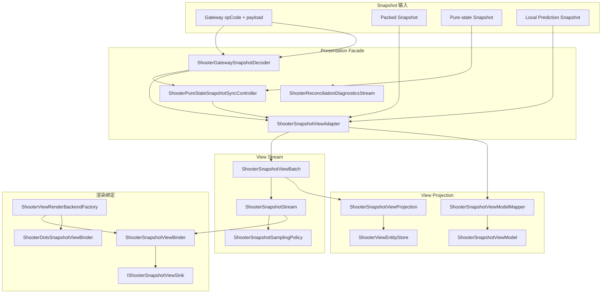
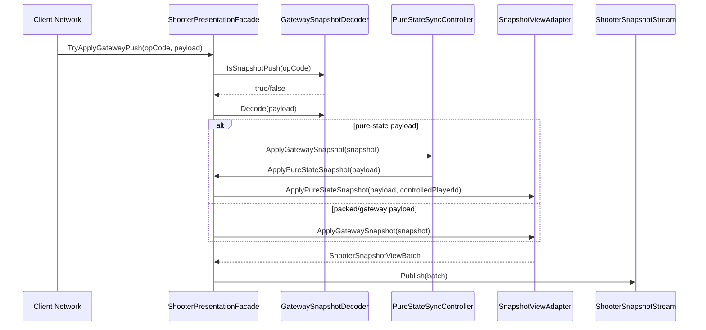
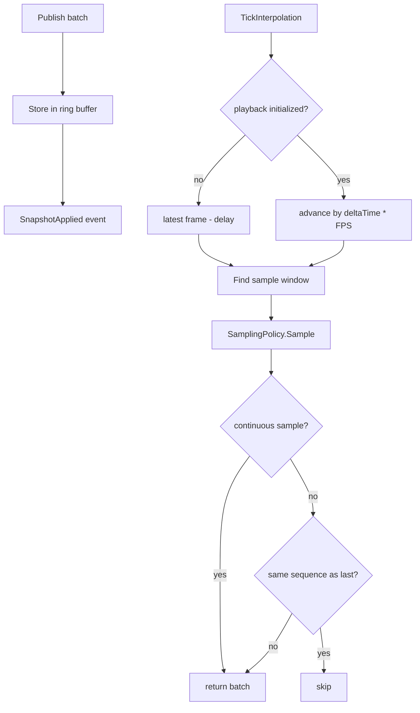
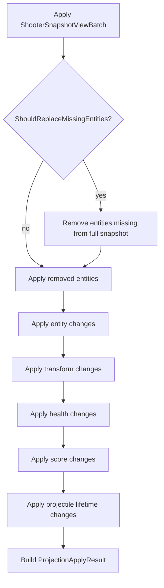
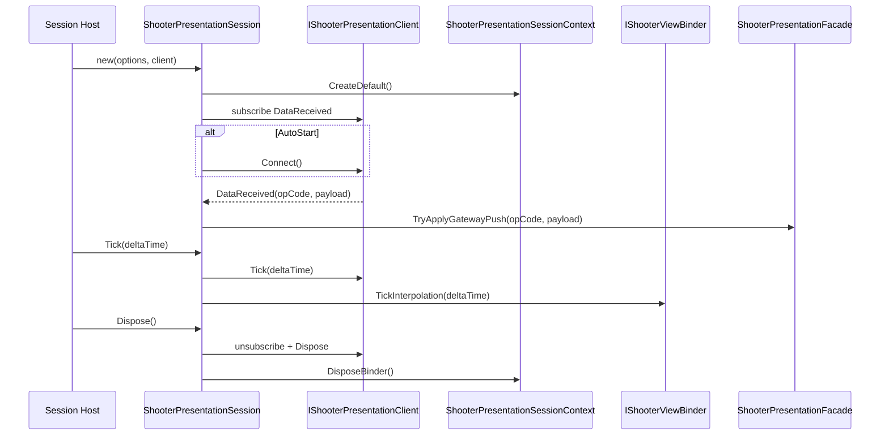
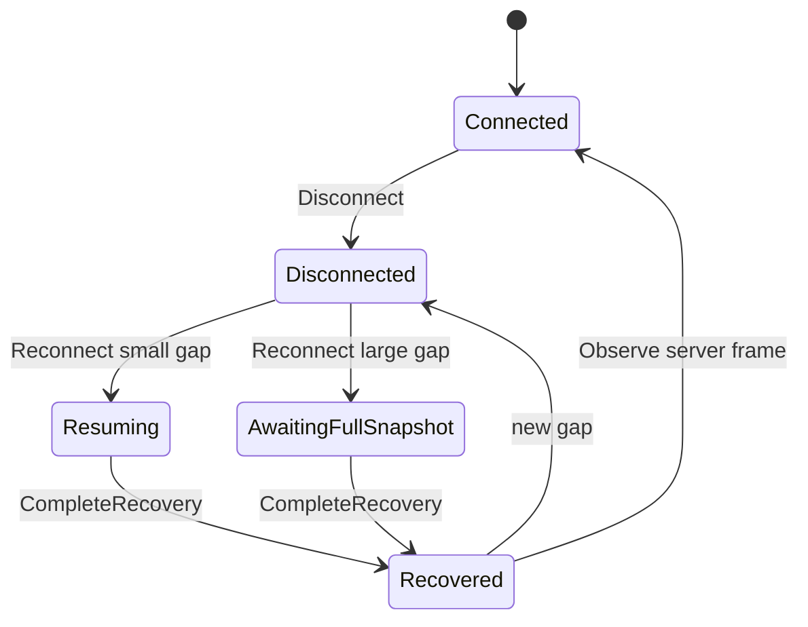
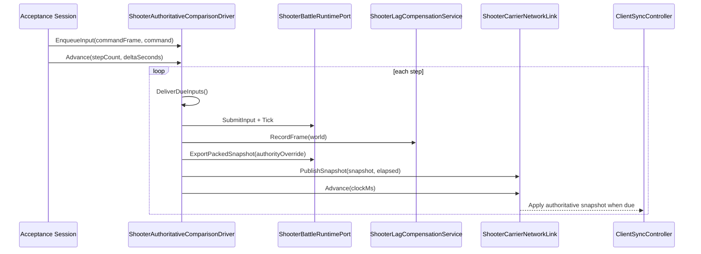

# Shooter Presentation Session 与 View Pipeline 深潜

> 本文补充 Shooter 示例中尚未单独展开的表现会话、快照流、投影、绑定器、插值播放与权威对比诊断。它解释服务端或本地模拟产出的 snapshot 如何变成表现层可消费的 ViewModel，以及 reconnect、lag compensation、网络模拟等诊断如何进入验收链路。

## 1. 设计目标

Shooter View Runtime 的表现层不是直接读取战斗世界，而是通过稳定的 snapshot/view pipeline 解耦。

| 目标 | 说明 | 代表源码 |
|------|------|----------|
| 网络输入解码 | Gateway push、packed snapshot、pure-state snapshot 统一进入 facade | `ShooterPresentationFacade`、`ShooterGatewaySnapshotDecoder` |
| 状态转 ViewModel | runtime snapshot 被适配成 view batch 与 view model | `ShooterSnapshotViewAdapter`、`ShooterSnapshotViewModelMapper` |
| 流式播放 | 快照进入环形缓冲，可按 playback frame 采样和插值 | `ShooterSnapshotStream`、`ShooterSnapshotSamplingPolicy` |
| 投影存储 | batch 增量应用到 view entity store，支持 full snapshot 替换缺失实体 | `ShooterSnapshotViewProjection`、`ShooterViewEntityStore` |
| 渲染绑定 | 根据渲染后端绑定到 GameObject 或 DOTS sink | `ShooterSnapshotViewBinder`、`ShooterDotsSnapshotViewBinder` |
| 会话生命周期 | presentation facade、binder、client connection 由 session/context 管理 | `ShooterPresentationSession`、`ShooterPresentationSessionContext` |
| 验收诊断 | 权威对比、网络条件、lag compensation、fast reconnect 形成独立诊断层 | `ShooterAuthoritativeComparisonDriver`、`ShooterFastReconnectDriver` |

## 2. 表现管线全景

## 3. `ShooterPresentationFacade`：表现层统一门面

`ShooterPresentationFacade` 聚合四类对象：

| 成员 | 职责 |
|------|------|
| `ShooterGatewaySnapshotDecoder` | 判断 opCode 是否为 snapshot push，并解码 payload |
| `ShooterSnapshotViewAdapter` | 将 gateway/pure/local payload 转成 view batch 与 view model |
| `ShooterSnapshotStream` | 发布 batch 并维护插值采样缓冲 |
| `ShooterReconciliationDiagnosticsStream` | 发布客户端校验、回滚、对账诊断 |
| `ShooterPureStateSnapshotSyncController` | pure-state baseline/delta 应用、resync 状态与诊断 |

关键入口：

- `TryApplyGatewayPush(opCode, payload)`：用于网络收到数据后的统一入口；
- `ApplyGatewaySnapshot`：直接应用 gateway snapshot；
- `ApplyInterpolatedGatewaySnapshot`：带 controlled player id 的插值应用；
- `ApplyPureStateGatewaySnapshot` / `ApplyPureStateSnapshot`：纯状态路径；
- `ApplyLocalPredictionSnapshot`：本地预测或权威对比路径；
- `PublishReconciliation`：同步诊断输出；
- `Clear`：清空 adapter 状态并发布清理 batch。

## 4. `ShooterSnapshotStream`：环形缓冲与插值播放

`ShooterSnapshotStream` 同时承担事件流和播放缓冲：

| 能力 | 说明 |
|------|------|
| `Publish` | 存入环形缓冲并触发 `SnapshotApplied` |
| `TrySampleLatest` | 取最新 batch，用于 rebind all |
| `TrySample(playbackFrame)` | 在缓冲窗口里按 playback frame 采样 |
| `TryAdvancePlayback(deltaTime)` | 推进播放帧，并返回需要渲染的 batch |
| `Reset` | 清空缓冲、采样序列和播放状态 |

播放策略：

1. 初次播放时，`playbackFrame = latest.Frame - InterpolationDelayFrames`；
2. 后续每帧按 `deltaTime * PlaybackFramesPerSecond` 前进；
3. `TryFindSampleWindow` 找到 from/to 两个 batch；
4. `ShooterSnapshotSamplingPolicy.Sample` 决定返回插值 batch 还是离散 batch；
5. 非连续采样会用 sequence 去重，避免重复 apply 同一帧。

## 5. 投影：从 ViewBatch 到 ViewEntityStore

`ShooterSnapshotViewProjection.Apply` 把 `ShooterSnapshotViewBatch` 应用到表现侧实体存储。顺序很重要：

1. 如果 batch 要求 full replace，则删除 full snapshot 中缺失的实体；
2. 应用显式 removed entities；
3. 应用 entity changes，区分新增、更新、死亡移除；
4. 应用 transform、health、score、projectile lifetime 组件变化；
5. 生成 `ShooterViewProjectionApplyResult`，记录 frame、sequence、source、实体数和组件更新数。

这种投影模式让表现层可以独立维护自己的 entity store，不需要持有 runtime ECS/Svelto entity，也避免渲染对象直接依赖服务端权威结构。

## 6. 绑定器与渲染后端

`ShooterSnapshotViewBinder` 的职责很薄：监听 stream、决定即时 apply 还是插值 apply，然后把 batch 交给 sink。

| 方法 | 行为 |
|------|------|
| `Sync` | 直接 `sink.ApplySnapshot(batch)` |
| `TickInterpolation` | 插值开启时从 stream 推进播放并 Sync |
| `RebindAll` | 取最新 batch 重新绑定所有表现对象 |
| `Clear` | reset stream 并清空 sink |
| `OnSnapshotApplied` | 插值关闭时收到 batch 立即 Sync |

`ShooterPresentationSessionContext` 根据 `ViewRenderBackend` 创建 binder：

- GameObject 后端：常规 `ShooterSnapshotViewBinder`；
- DOTS 后端：`ShooterDotsSnapshotViewBinder`；
- 自定义后端：通过 `IShooterSnapshotViewSink` 注入。

这使同一套 network/sync/presentation facade 可以服务不同渲染实现。

## 7. Presentation Session 生命周期

`ShooterPresentationSession` 把表现上下文和客户端连接组合成一个可释放会话。

`ShooterPresentationSessionContext` 还提供 retain/release 语义，便于 session host 或 resolver 共享同一个 presentation context，只有引用计数归零时才释放 binder。

## 8. Fast Reconnect 驱动

`ShooterFastReconnectDriver` 是框架无关 `FastReconnectSession` 在 Shooter 示例中的消费方。它把 Shooter 的恢复状态投影到框架阶段机：

- `Connected`；
- `Disconnected`；
- `Resuming`；
- `AwaitingFullSnapshot`；
- `Recovered`。

关键设计：

1. `Heartbeat(authoritativeFrame)` 只在 connected/recovered 阶段观察权威帧；
2. `Reconcile(target, authoritativeFrame, gapHint)` 每次最多推进 8 步，避免非法迁移死循环；
3. gap 小于恢复窗口时走短追帧，大于窗口时强制进入 full snapshot；
4. 每个步骤收集 `SyncHealthEvent`，上层可以把恢复过程纳入统一健康遥测；
5. 非法状态迁移被 catch 并返回 false，保持恢复层增量、安全。

## 9. 权威对比与网络条件诊断

`ShooterAuthoritativeComparisonDriver` 是验收场景中“客户端控制器 vs 权威世界”的桥接层。

| 成员 | 职责 |
|------|------|
| `IShooterClientSyncController` | 客户端同步控制器，被 carrier network link 投喂权威快照 |
| `ShooterBattleRuntimePort` | 权威世界，每次 Advance 推进 Tick |
| `ShooterCarrierNetworkLink` | 按 `NetworkConditionProfile` 模拟延迟、丢包、投递 |
| `ShooterLagCompensationService` | 记录权威帧历史并评估射击回溯 |
| pending inputs queue | 输入按网络时间排队，达到投递时间才提交到权威世界 |

Advance 流程：

这条链路把网络条件、权威世界推进、快照发布、客户端同步控制器和 lag compensation 放在同一个可验收循环里。

## 10. 与已有 Shooter 文档的边界

| 已有文档 | 本文补充点 |
|----------|------------|
| `04-ClientSyncStrategies.md` | 该文说明 sync controller 策略；本文说明 sync controller 产物如何进入表现流 |
| `08-NetworkModulesDeepDive.md` | 该文说明网络模块边界；本文细化 presentation facade、stream、binder 与 reconnect 状态机 |
| `09-SveltoPerformanceModeDeepDive.md` | 该文说明 runtime 性能模拟；本文说明 runtime snapshot 如何脱离 ECS/Svelto 投影到 view store |
| `07-SmokeValidationCases.md` | 该文说明验收用例；本文解释 authoritative comparison driver 如何构造验收闭环 |

## 11. 仍值得继续拆分的点

| 候选专题 | 拆分理由 |
|----------|----------|
| Authoritative Interpolation Controller | 插值同步控制器内部 buffer、time anchor、stale ignore 与 controlled player 过滤可独立成文 |
| Hybrid Hero Prediction | 英雄预测、远端权威插值、回滚校验三者混合策略值得单独画时序图 |
| Reconciliation Diagnostics | `ShooterReconciliationDiagnosticsStream`、hash mismatch、snapshot apply result 可形成诊断专题 |
| DOTS View Binder | DOTS 后端和 GameObject 后端的表现绑定差异可以单独说明 |

## 12. 源码锚点

| 主题 | 源码 |
|------|------|
| presentation facade | `Unity/Packages/com.abilitykit.demo.shooter.view.runtime/Runtime/Presentation/ShooterPresentationFacade.cs` |
| presentation session | `Unity/Packages/com.abilitykit.demo.shooter.view.runtime/Runtime/Presentation/Session/ShooterPresentationSession.cs` |
| session context | `Unity/Packages/com.abilitykit.demo.shooter.view.runtime/Runtime/Presentation/ShooterPresentationSessionContext.cs` |
| snapshot stream | `Unity/Packages/com.abilitykit.demo.shooter.view.runtime/Runtime/Presentation/Snapshot/ShooterSnapshotStream.cs` |
| view projection | `Unity/Packages/com.abilitykit.demo.shooter.view.runtime/Runtime/Presentation/View/ShooterSnapshotViewProjection.cs` |
| view binder | `Unity/Packages/com.abilitykit.demo.shooter.view.runtime/Runtime/Presentation/View/ShooterSnapshotViewBinder.cs` |
| fast reconnect driver | `Unity/Packages/com.abilitykit.demo.shooter.view.runtime/Runtime/Client/Synchronization/ShooterFastReconnectDriver.cs` |
| authoritative comparison | `Unity/Packages/com.abilitykit.demo.shooter.view.runtime/Runtime/Client/Synchronization/ShooterAuthoritativeComparisonDriver.cs` |
