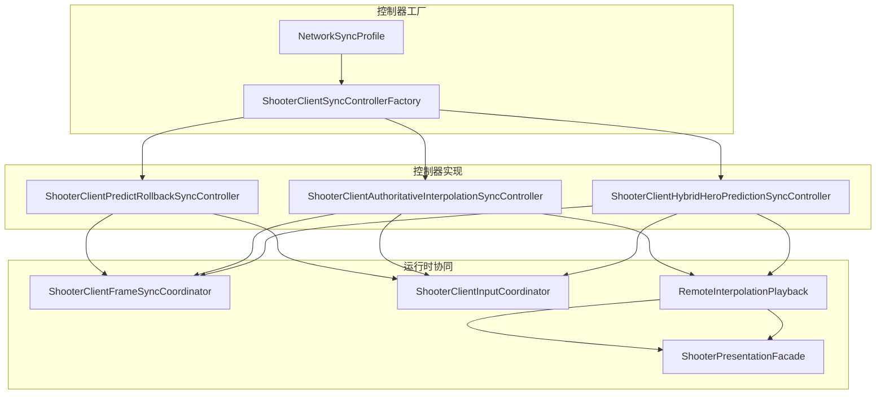
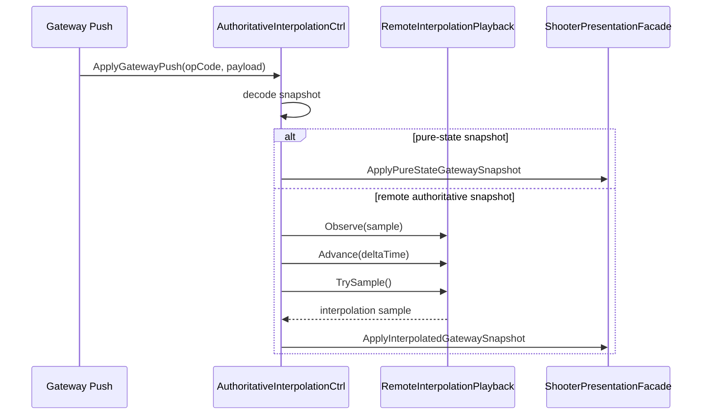
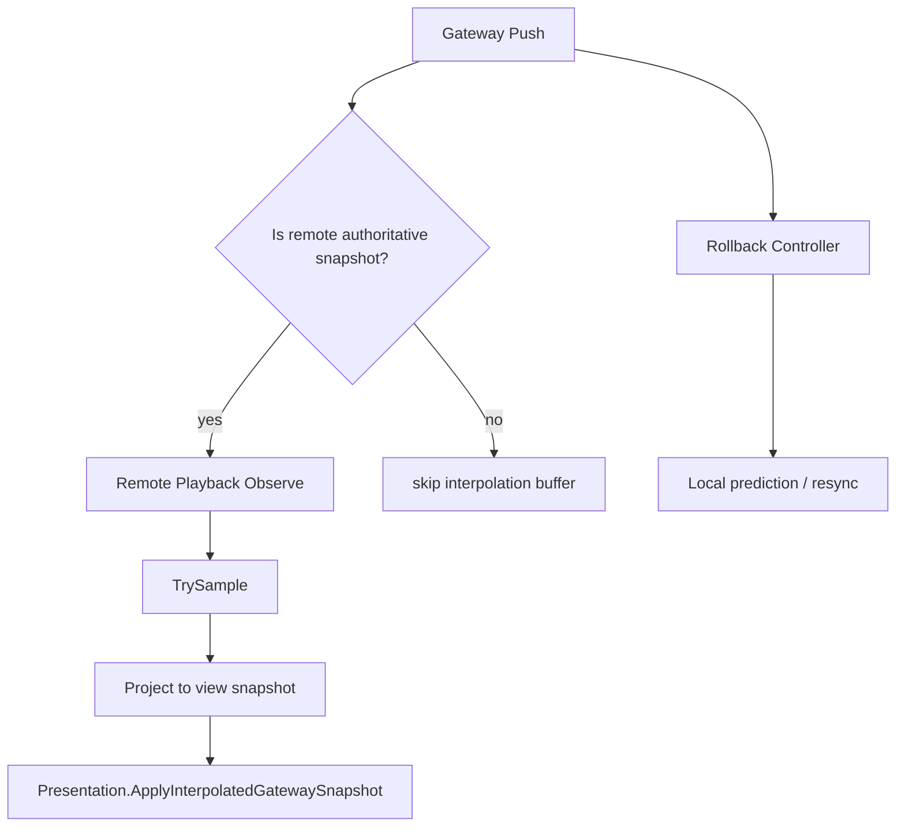

# Shooter Authoritative Interpolation、Hybrid Prediction 与 Diagnostics 深潜

> 本文补充 Shooter 示例中还未单独展开的同步控制器细节：Authoritative Interpolation、Hybrid Hero Prediction、插值诊断、DOTS View Binder 与时间锚点协同。它解释不同 `NetworkSyncModel` 如何复用同一套 runtime / presentation / gateway 链路，同时在本地预测、远端插值与诊断输出之间保持清晰分工。

## 1. 设计目标

| 目标 | 说明 | 代表源码 |
|------|------|----------|
| 同步模型可插拔 | 预测回滚、权威插值、混合英雄预测可以由工厂按 profile 选择 | `ShooterClientSyncControllerFactory` |
| 远端插值独立 | 远端样本只进缓冲与播放时间线，不污染本地预测/回滚 | `ShooterClientAuthoritativeInterpolationSyncController` |
| 混合策略清晰 | 本地英雄仍预测回滚，远端对象使用权威插值 | `ShooterClientHybridHeroPredictionSyncController` |
| 诊断可观测 | 插值缓存、饥饿、时间线、apply 结果需要可视化/可测试 | `ShooterReconciliationDiagnosticsStream`、`IInterpolationDiagnosticsProvider` |
| 渲染后端可替换 | GameObject 与 DOTS 绑定器走同一表现协议 | `ShooterSnapshotViewBinder`、`ShooterDotsSnapshotViewBinder` |

## 2. 同步模型谱系

Shooter 的同步控制器并不是只有“预测回滚”一种实现，而是围绕 `NetworkSyncModel` 分出多条执行路径：

- `PredictRollback`：本地模拟 + 回滚校正；
- `AuthoritativeInterpolation`：只对远端快照做延迟插值；
- `HybridHeroPrediction`：本地英雄预测回滚，远端对象延迟插值；
- 其他 profile 可能复用以上控制器策略。

## 3. `ShooterClientAuthoritativeInterpolationSyncController`

这个控制器的核心思想是：**本地玩家保持原有预测链路，远端权威样本只进入插值缓冲**。

### 关键成员

| 成员 | 职责 |
|------|------|
| `_frameSync` | 负责本地 frame 同步、catch-up、resync |
| `_input` | 负责输入提交与 gateway 交互 |
| `_playback` | 维护远端样本的插值播放缓冲 |
| `_projector` | 将远端插值结果投影成 gateway snapshot / view 产物 |
| `_presentation` | 把权威插值结果送入表现层 |
| `_predictionState` | 记录本地预测姿态，便于比较与诊断 |

### 核心行为

| 方法 | 行为 |
|------|------|
| `StartGame` | 初始化 frame sync |
| `SubmitLocalInput` | 提交本地输入并刷新 predicted pose |
| `Tick` | 推进 frame sync、推进 playback、发布插值帧 |
| `ApplyGatewayPush` | 解码网关推送，区分 pure-state 与 remote snapshot |
| `BufferRemoteSnapshot` | 只缓冲远端权威样本，不导入本地模拟 |

### 关键约束

1. 不把远端权威样本回写到本地模拟 ECS；
2. 不触发回滚校正；
3. 插值缓冲有自己的 `PlaybackTicks` 与 `EstimatedServerTicks`；
4. 若缓冲饥饿，则保持最新样本，不做危险外推。

## 4. `ShooterClientHybridHeroPredictionSyncController`

混合同步控制器把两条策略组合起来：

- 本地英雄：依然走预测回滚；
- 远端 actor：走权威插值播放。

### 为什么需要混合模式

在多人射击里，本地玩家体验和远端观感往往不是同一个目标：

- 本地玩家需要即时输入反馈；
- 远端玩家更适合平滑权威插值；
- 两者混在一起时，不能让远端插值破坏本地预测链路。

`ShooterClientHybridHeroPredictionSyncController` 直接封装了一个 `ShooterClientPredictRollbackSyncController`，再叠加一条远端插值缓冲。

### 关键行为

| 方法 | 行为 |
|------|------|
| `Tick` | 先推进 rollback，再推进远端 playback，并发布插值帧 |
| `ApplyGatewayPush` | 先交给 rollback，再独立缓冲远端样本 |
| `BufferRemoteSnapshot` | 只写入插值缓冲 |
| `GetInterpolationDiagnostics` | 暴露远端缓冲诊断 |

## 5. 插值诊断流

`ShooterReconciliationDiagnosticsStream` 很薄，但它是诊断可视化的关键接入口。

### 行为

- 发布 `ShooterClientReconciliationResult`；
- 如果 `ApplyResult == Ignored` 则直接丢弃；
- 否则通过 `ReconciliationApplied` 事件广播给订阅方。

它说明 Shooter 的诊断不是“日志字符串堆积”，而是结构化结果流。

### 相关状态

`ShooterClientAuthoritativeInterpolationSyncController` 和 `ShooterClientHybridHeroPredictionSyncController` 都暴露：

- `BufferedRemoteSnapshotCount`
- `RemotePlaybackTicks`
- `EstimatedServerTicks`
- `HasPublishedRemoteFrame`
- `IsRemotePlaybackStarved`

这些指标足以支撑验收矩阵里的稳定性判断。

## 6. DOTS View Binder

`ShooterDotsSnapshotViewBinder` 说明了 Shooter 表现层不是只能绑定 GameObject。

### 与 GameObject binder 的共同点

- 都订阅 `ShooterPresentationFacade.Snapshots.SnapshotApplied`；
- 都支持 `InterpolationEnabled`；
- 都可以 `Sync` / `TickInterpolation` / `RebindAll` / `Clear`；
- 都维护 `AppliedBatchCount`、实体变化计数和组件变化计数。

### 差异

| 绑定器 | 特点 |
|--------|------|
| `ShooterSnapshotViewBinder` | 常规表现绑定器，适合 GameObject sink |
| `ShooterDotsSnapshotViewBinder` | 在投影层上直接维护 `ShooterViewEntityStore`，更适合 DOTS sink |

这种双绑定器结构把“表现协议”和“渲染后端”解耦。

## 7. 时间锚点与验收矩阵

Shooter 的同步和验收依赖统一的时间锚点语义：

- `ShooterTimeAnchorCoordinator` 维护本地时间锚点；
- `ProjectRemote(...)` 把服务端 start anchor 映射到远端播放锚点；
- `ShooterRemoteTimeAnchorProjection` 记录 target frame、catch-up frames 和 elapsed seconds；
- `ShooterAcceptanceLab`、`ShooterPlaySessionRunner`、`ShooterRemoteStateSyncPlayModeHost` 都会采集这些锚点。

这使网络条件、时间线偏移、插值播放是否稳定都可以进入统一验收链路。

## 8. 与已有 Shooter 文档的边界

| 已有文档 | 本文补充点 |
|----------|------------|
| `04-ClientSyncStrategies.md` | 说明控制器策略选择；本文说明 authoritative interpolation 和 hybrid prediction 的内部执行 |
| `08-NetworkModulesDeepDive.md` | 说明网络模块边界；本文细化插值缓冲、诊断流和表现绑定 |
| `10-PresentationSessionAndViewDeepDive.md` | 说明 presentation session 与 view pipeline；本文说明不同 sync model 如何把结果送入 presentation |
| `07-SmokeValidationCases.md` | 说明验收用例；本文补充时间锚点与插值诊断如何进入验收矩阵 |

## 9. 仍值得继续拆分的点

| 候选专题 | 拆分理由 |
|----------|----------|
| Authoritative Interpolation Controller | buffer、starvation、time anchor、sample window 可以继续专文展开 |
| Hybrid Hero Prediction | 本地预测和远端插值的混合规则可以画成独立时序图 |
| Reconciliation Diagnostics | `ShooterReconciliationDiagnosticsStream` 与恢复报告可独立成诊断专题 |
| DOTS View Binder | DOTS sink 与 GameObject sink 的差异足以形成单独文档 |

## 10. 源码锚点

| 主题 | 源码 |
|------|------|
| 同步控制器工厂 | `Unity/Packages/com.abilitykit.demo.shooter.view.runtime/Runtime/Client/Synchronization/ShooterClientSyncControllerFactory.cs` |
| 权威插值控制器 | `Unity/Packages/com.abilitykit.demo.shooter.view.runtime/Runtime/Client/Synchronization/ShooterClientAuthoritativeInterpolationSyncController.cs` |
| 混合英雄预测控制器 | `Unity/Packages/com.abilitykit.demo.shooter.view.runtime/Runtime/Client/Synchronization/ShooterClientHybridHeroPredictionSyncController.cs` |
| 插值诊断流 | `Unity/Packages/com.abilitykit.demo.shooter.view.runtime/Runtime/Presentation/Snapshot/ShooterReconciliationDiagnosticsStream.cs` |
| DOTS 绑定器 | `Unity/Packages/com.abilitykit.demo.shooter.view.runtime/Runtime/Presentation/View/ShooterDotsSnapshotViewBinder.cs` |
| GameObject 绑定器 | `Unity/Packages/com.abilitykit.demo.shooter.view.runtime/Runtime/Presentation/View/ShooterSnapshotViewBinder.cs` |
| 时间锚点协调器 | `Unity/Packages/com.abilitykit.demo.shooter.view.runtime/Runtime/Client/Synchronization/ShooterTimeAnchorCoordinator.cs` |
| 远端权威样本 | `Unity/Packages/com.abilitykit.demo.shooter.view.runtime/Runtime/Client/Synchronization/ShooterRemoteSnapshotSample.cs` |
| 远端样本投影 | `Unity/Packages/com.abilitykit.demo.shooter.view.runtime/Runtime/Client/Synchronization/ShooterRemoteSnapshotProjector.cs` |
| 验收载体 | `Unity/Packages/com.abilitykit.demo.shooter.view.runtime/Runtime/Client/Synchronization/ShooterAcceptanceLab.cs` |
| PlayMode 主机 | `Unity/Packages/com.abilitykit.demo.shooter.view.runtime/Runtime/Unity/PlayMode/ShooterRemoteStateSyncPlayModeHost.cs` |
