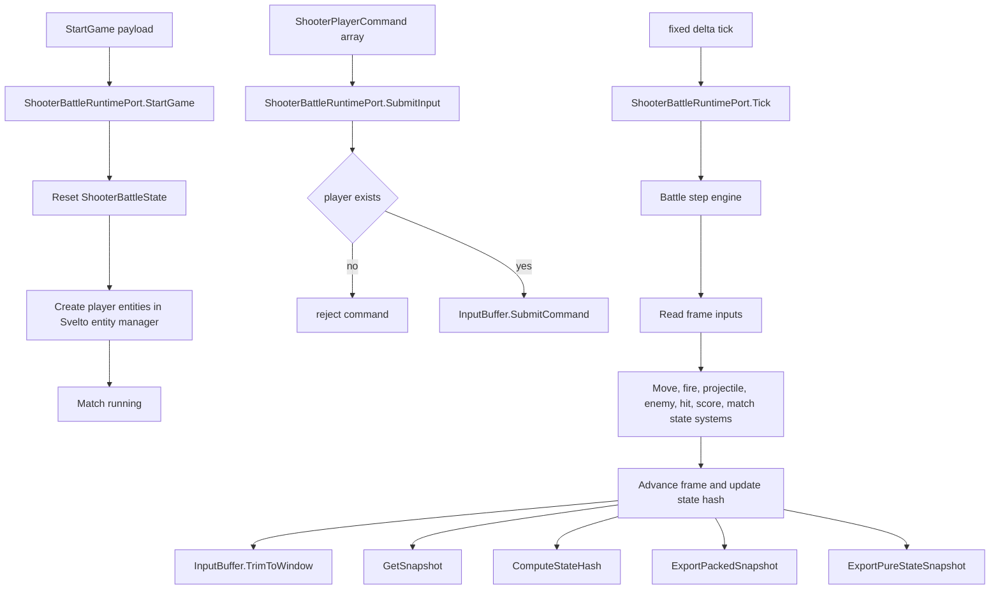
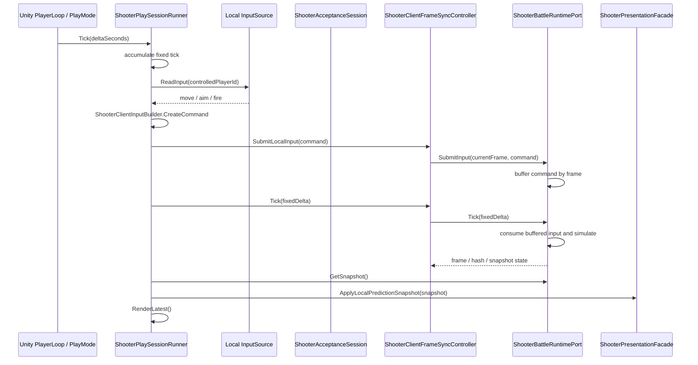
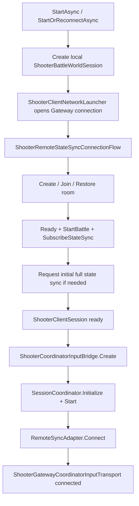
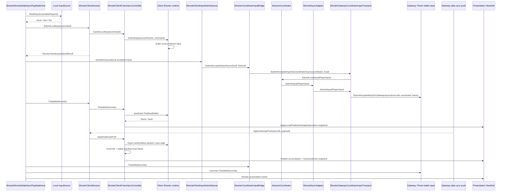
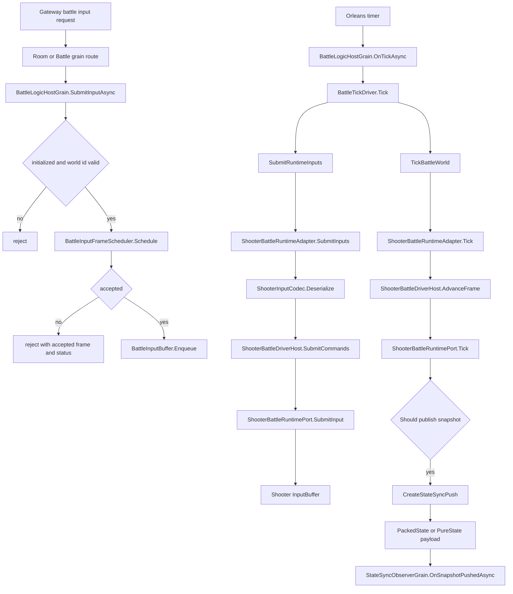

# Shooter 逻辑层流程：输入、处理、输出与单机/多人模式

> 本文从逻辑层视角拆解 Shooter 示例当前实现，重点回答三件事：输入如何进入逻辑世界，逻辑世界如何处理输入并推进帧，结果如何输出到表现层或网络层。文档同时覆盖单机 PlayMode 和多人远程 PlayMode，便于对照 AbilityKit 框架的 Coordinator / Host / Runtime 分层设计。

## 1. 结论概览

Shooter 当前不是单一同步模型，而是同一套 runtime 被不同宿主方式复用：

| 模式 | 输入入口 | 逻辑处理位置 | 输出目标 | 是否经过服务器转发输入 |
|------|----------|--------------|----------|------------------------|
| 单机 PlayMode | 本地 `InputSource` | 本地 `ShooterAcceptanceSession` / `ShooterBattleRuntimePort` | 本地 `ShooterPresentationFacade` | 否 |
| 多人远程客户端 | 本地 `InputSource` | 本地预测 runtime，同时输入经 Coordinator 发往服务端 | 本地预测表现 + 服务端快照校正 | 是，输入经 Coordinator transport 到 Gateway |
| 多人服务端权威 | Gateway / Orleans battle input | 服务端 `BattleLogicHostGrain` 内的 Shooter runtime | `StateSyncPush` 推送给 observer | 服务端是权威接收与模拟方 |

当前最关键的设计点是：Shooter runtime 本身不关心输入来自单机、客户端预测还是服务端权威。它只暴露 `StartGame`、`SubmitInput`、`Tick`、快照导出和状态哈希等端口。不同模式的差异发生在 runtime 之外的 session host、client sync controller、Coordinator transport 和 Orleans grain 上。

## 2. 逻辑层核心边界

Shooter 逻辑层的核心端口是 `ShooterBattleRuntimePort`。它作为 world service 注册为多个接口，包括 game start、input、clock、snapshot、hash、packed snapshot 和 pure-state snapshot 端口。

核心职责分布如下：

| 职责 | 实现点 | 说明 |
|------|--------|------|
| 初始化比赛 | `ShooterBattleRuntimePort.StartGame` | 重置战斗状态，创建玩家实体，设置胜利目标和时间限制 |
| 输入接收 | `ShooterBattleRuntimePort.SubmitInput` | 校验玩家存在后，把命令写入 `ShooterBattleState.InputBuffer` |
| 帧推进 | `ShooterBattleRuntimePort.Tick` | 调用 battle step engine 推进模拟，并裁剪过期输入 |
| 普通快照 | `ShooterBattleRuntimePort.GetSnapshot` | 输出表现和诊断使用的 `ShooterStateSnapshotPayload` |
| 状态哈希 | `ShooterBattleRuntimePort.ComputeStateHash` | 用于客户端预测校正、烟测、服务端校验 |
| 网络快照 | `ExportPackedSnapshot` / `ExportPureStateSnapshot` | 输出 packed state 或 pure state，用于 Gateway/Orleans state sync |
| Bot AI | `MountBotAi` / `ClearBotAi` | 在同一逻辑世界内挂载 AI 输入来源 |

逻辑层整体流程：



这个图里，`SubmitInput` 只负责把命令放入逻辑层输入缓冲，并不直接改变表现层。真正的状态变化发生在后续 `Tick` 的固定步进中。

## 3. 输入数据结构

Shooter 逻辑输入的领域结构是 `ShooterPlayerCommand`，包含玩家 id、移动方向、瞄准方向和开火标记。网络传输时会被包装成 `ShooterInputPacket` 或框架通用 `PlayerInput`。

输入在不同层的形态如下：

| 层级 | 输入形态 | 作用 |
|------|----------|------|
| Unity / PlayMode | move / aim / fire | 从本地输入源读取的原始操作 |
| Shooter view client | `ShooterPlayerCommand` | Shooter 领域命令 |
| Shooter protocol | `ShooterInputPacket` + `ShooterInputCodec` payload | Gateway 提交使用的 Shooter 协议包 |
| Coordinator | `PlayerInput` | 框架通用输入，携带 frame、playerId、opCode、payload |
| Orleans battle | `BattleInputItem` | 服务端 battle host 缓冲和调度的输入单元 |
| Shooter runtime | `ShooterPlayerCommand[]` | 最终写入 `InputBuffer` 的逻辑命令 |

多人远程路径中有两次转换需要注意：

1. 客户端本地提交时，`ShooterClientInputCoordinator.SubmitLocalInput` 把命令序列化为 packet，同时提交给本地预测 frame sync。
2. Coordinator transport 把已接受的本地输入包装为 `PlayerInput`，再由 `RemoteSyncAdapter.SubmitInput` 转给 `IRemoteBattleSyncTransport`，最终落到 Gateway battle input。

## 4. 单机 PlayMode 流程

单机入口是 `ShooterPlaySessionRunner`。它创建本地 `ShooterAcceptanceSession`，每个固定步读取本地输入，提交到本地 controller，然后推进本地 runtime，最后把快照送给表现层。



单机模式的要点：

| 阶段 | 行为 | 说明 |
|------|------|------|
| 启动 | `ShooterAcceptanceLab.Create` | 在本地创建 runtime、controller、presentation，可选创建本地 authority comparison world |
| 输入 | `InputSource.ReadInput` -> `ShooterClientInputBuilder.CreateCommand` | 输入只来自本机 |
| 提交 | `Session.Controller.SubmitLocalInput` | 写入本地 runtime 的输入缓冲 |
| 推进 | `Session.Controller.Tick` | 本地 frame sync controller 推进 runtime |
| 输出 | `Runtime.GetSnapshot` -> `Presentation.ApplyLocalPredictionSnapshot` | 直接用于本地表现 |
| 可选权威比较 | `AuthoritativeWorld` | 仅用于本地验证，不等同于服务器转发 |

因此，单机帧同步模式是在本地运行的。它不通过 Gateway，也不把输入送到 Orleans。即使启用了 authoritative comparison world，也是在本地 session 内部做对照验证。

## 5. 多人远程客户端流程

多人远程入口是 `ShooterRemoteStateSyncPlayModeHost`。它先连接 Gateway 完成 create/join/restore、ready、start、subscribe，再创建 `ShooterCoordinatorInputBridge`。运行时每 tick 同时做三件事：本地预测、Coordinator 输入提交、Gateway push 接收处理。



多人客户端每帧运行流程：



这里有一个容易误判的点：客户端仍然会先 `SubmitLocalInput` 到本地 runtime，这是预测和立即反馈需要的本地路径，不代表它绕过服务器权威。真正发往服务端的路径已经通过 Coordinator：`ShooterCoordinatorInputBridge` -> `SessionCoordinator.SubmitLocalInput` -> `RemoteSyncAdapter.SubmitInput` -> `IRemoteBattleSyncTransport.SubmitInput` -> `ShooterGatewayCoordinatorInputTransport` -> Gateway。

## 6. 多人服务端权威流程

服务端权威入口由 Gateway 和 Orleans 房间流程驱动。Room 开战后创建 `BattleLogicHostGrain`，再由 `ShooterBattleRuntimeAdapter` 创建 Shooter logic world 和 runtime session。



服务端关键阶段：

| 阶段 | 实现点 | 说明 |
|------|--------|------|
| 初始化 | `BattleLogicHostGrain.InitializeBattleAsync` | 创建 runtime session，发布初始快照，启动 timer |
| 输入调度 | `BattleInputFrameScheduler.Schedule` | 根据当前帧和 input delay 接受、延后或拒绝输入 |
| 输入缓冲 | `BattleInputBuffer.Enqueue` | 按 accepted frame 保存 `BattleInputItem` |
| 输入转换 | `ShooterBattleRuntimeAdapter.SubmitInputs` | 将 `BattleInputItem` 解码为 `ShooterPlayerCommand` |
| 框架桥接 | `ShooterBattleDriverHost.SubmitCommands` | 统一把命令写入 Shooter runtime |
| 帧推进 | `BattleTickDriver.Tick` -> `TickBattleWorld` | 服务端固定 tick 驱动 runtime |
| 快照输出 | `CreateStateSyncPush` | 导出 packed state 或 pure-state payload |
| 推送 | `StateSyncObserverGrain.OnSnapshotPushedAsync` | 推送给已订阅客户端 |

服务端输出分两类：

| 输出 | 来源 | 用途 |
|------|------|------|
| `BattleSnapshot` | `ShooterBattleRuntimeAdapter.GetSnapshot` | 管理后台、诊断、烟测读取 actor 状态 |
| `StateSyncPush` | `ShooterBattleRuntimeAdapter.CreateStateSyncPush` | 多人客户端状态同步、全量恢复、增量更新 |

`StateSyncPush` 支持两种 payload mode：

| Payload | OpCode | 说明 |
|---------|--------|------|
| packed state | `PackedState` / `PackedStateDelta` | 基于 packed snapshot 的同步负载 |
| pure state | `PureState` / `PureStateDelta` | 支持 AOI 和预算控制的纯状态同步负载 |

## 7. 客户端接收服务端输出后的处理

客户端收到 Gateway 推送后，不直接把网络 payload 给表现层，而是先进入 frame sync controller：

```mermaid
flowchart TD
    A[Gateway StateSyncPush] --> B[ShooterClientSession.ApplyGatewayPush]
    B --> C[ShooterClientFrameSyncController.ApplyGatewayPush]
    C --> D{is snapshot push?}
    D -- no --> E[Ignored]
    D -- yes --> F[Decode packed / pure payload]
    F --> G[Framework snapshot pipeline applies authoritative snapshot]
    G --> H{applied?}
    H -- no --> I[mark full snapshot resync if import failed]
    H -- yes --> J[Capture rollback snapshot]
    J --> K[ReconcileAfterAuthoritativeSnapshot]
    K --> L[Replay pending local inputs]
    L --> M{hash matched?}
    M -- no --> N[AwaitingFullSnapshot]
    M -- yes --> O[Normal / Recovered]
    O --> P[Publish reconciliation]
    P --> Q[ApplyLocalPredictionSnapshot(runtime snapshot)]
```

这个输出处理体现了 Shooter 多人客户端的设计选择：表现层看到的是“权威校正后的本地预测 runtime 快照”，而不是原始服务端 snapshot。这样可以保留客户端输入即时反馈，同时由服务端快照负责纠偏。

## 8. 与框架设计的符合性

从当前代码看，Shooter 逻辑层大体符合 AbilityKit 框架的分层设计。此前 remote PlayMode 直接提交 Gateway 的历史问题已经整理为框架标准接入：应用层只提交到 Coordinator，Gateway 位于 transport 实现内部。

符合点：

| 框架期望 | 当前 Shooter 实现 | 结论 |
|----------|-------------------|------|
| 逻辑世界只处理领域输入和 tick | `ShooterBattleRuntimePort.SubmitInput` / `Tick` | 符合 |
| session/host 决定运行模式 | 单机 `ShooterPlaySessionRunner`，多人 `ShooterRemoteStateSyncPlayModeHost`，服务端 `BattleLogicHostGrain` | 符合 |
| 已有客户端 world 可正式接入 Coordinator | `ShooterCoordinatorSessionHost` 复用框架级 `ExistingWorldSessionCoordinatorHost`，只保留 Shooter session policy | 符合 |
| 通用输入可通过 Coordinator 表达 | `ShooterGatewayCoordinatorInputTransport` 把 Shooter 输入包装为 `PlayerInput` | 符合 |
| 远程输入从 Coordinator 进入 transport | `SessionCoordinator.SubmitLocalInput` -> `RemoteSyncAdapter.SubmitInput` -> `IRemoteBattleSyncTransport.SubmitInput` | 符合 |
| 服务端通过 driver host 适配 runtime | `ShooterBattleDriverHost` 实现 `ILogicWorldDriverBridge` | 符合 |
| 输出通过 snapshot/hash/state sync 表达 | `GetSnapshot`、`ComputeStateHash`、packed/pure state exporters | 符合 |

需要注意的边界：

| 点位 | 当前状态 | 影响 |
|------|----------|------|
| 客户端 remote 最终仍调用 Gateway 提交 API | 该调用现在在 `ShooterGatewayCoordinatorInputTransport` 内部，是 transport 的网络出口 | 不再是 PlayMode 直接绕过 Coordinator，但 transport 仍复用已有 Gateway API |
| 客户端 Coordinator 复用已有 world | `ExistingWorldSessionCoordinatorHost` 不销毁外部 world，只叠加 transport service override | 生命周期边界更清楚，避免为了 Coordinator 创建第二套 client runtime |
| 客户端 Coordinator 没有接管本地预测世界 tick | 本地预测仍由 Shooter client frame sync controller 驱动 | 可以接受，因为当前 Shooter 已有专门预测/回滚 pipeline；Coordinator 在 remote path 中承担输入转发与连接抽象 |
| 服务端 Orleans 不是直接由 Coordinator 创建 | 服务端由 Room/Battle grain 管理 runtime lifecycle | 符合服务器侧 Orleans 架构，Coordinator 主要用于客户端 session 组织和 transport 抽象 |

## 9. 推荐用于评审的流程判断点

评审当前流程是否符合框架设计时，可以重点看下面四个判断点：

1. 逻辑层是否保持纯粹：`ShooterBattleRuntimePort` 不依赖 Gateway、Unity 输入或 Orleans observer，只接受领域命令并输出 snapshot/hash。
2. 单机是否本地闭环：`ShooterPlaySessionRunner` 的输入、tick、snapshot、render 都在本地完成，没有网络提交。
3. 多人客户端是否走 Coordinator：远程输入不是从 PlayMode 直接调用 Gateway，而是通过 `ShooterCoordinatorInputBridge` 和 `IRemoteBattleSyncTransport` 到达 Gateway。
4. 服务端是否权威：Orleans `BattleLogicHostGrain` 负责输入调度、权威 tick 和状态推送，客户端只做预测和校正。

按这四点看，当前 Shooter 示例的主流程已经符合框架分层：runtime 是领域逻辑核心，PlayMode/session 决定运行方式，Coordinator/transport 负责远程输入抽象，Orleans battle host 负责服务端权威模拟与状态输出。已有世界接入也已经从 Shooter 私有 overlay 下沉为框架级 `ExistingWorldSessionCoordinatorHost`，后续示例应复用该 host，而不是在示例层复制 world host / resolver 包装逻辑。

## 10. 源码索引

| 模块 | 源码 |
|------|------|
| Shooter runtime port | [ShooterBattleRuntimePort.cs](../../../../Unity/Packages/com.abilitykit.demo.shooter.runtime/Runtime/Application/Runtime/ShooterBattleRuntimePort.cs) |
| Shooter driver host | [ShooterBattleDriverHost.cs](../../../../Unity/Packages/com.abilitykit.demo.shooter.runtime/Runtime/Application/Session/ShooterBattleDriverHost.cs) |
| 单机 PlayMode runner | [ShooterPlaySessionRunner.cs](../../../../Unity/Packages/com.abilitykit.demo.shooter.view.runtime/Runtime/PlayMode/ShooterPlaySessionRunner.cs) |
| 客户端 session facade | [ShooterClientSession.cs](../../../../Unity/Packages/com.abilitykit.demo.shooter.view.runtime/Runtime/Client/ShooterClientSession.cs) |
| 客户端 frame sync controller | [ShooterClientFrameSyncController.cs](../../../../Unity/Packages/com.abilitykit.demo.shooter.view.runtime/Runtime/Client/Synchronization/ShooterClientFrameSyncController.cs) |
| 客户端 input coordinator | [ShooterClientInputCoordinator.cs](../../../../Unity/Packages/com.abilitykit.demo.shooter.view.runtime/Runtime/Client/Session/ShooterClientInputCoordinator.cs) |
| 多人远程 PlayMode host | [ShooterRemoteStateSyncPlayModeHost.cs](../../../../Unity/Packages/com.abilitykit.demo.shooter.view.runtime/Runtime/Unity/PlayMode/ShooterRemoteStateSyncPlayModeHost.cs) |
| Coordinator input bridge | [ShooterCoordinatorInputBridge.cs](../../../../Unity/Packages/com.abilitykit.demo.shooter.view.runtime/Runtime/Hosting/ShooterCoordinatorInputBridge.cs) |
| Shooter Coordinator host policy | [ShooterCoordinatorSessionHost.cs](../../../../Unity/Packages/com.abilitykit.demo.shooter.view.runtime/Runtime/Hosting/ShooterCoordinatorSessionHost.cs) |
| 框架 existing-world host | [ExistingWorldSessionCoordinatorHost.cs](../../../../Unity/Packages/com.abilitykit.coordinator/Runtime/Core/ExistingWorldSessionCoordinatorHost.cs) |
| Gateway Coordinator transport | [ShooterGatewayCoordinatorInputTransport.cs](../../../../Unity/Packages/com.abilitykit.demo.shooter.view.runtime/Runtime/Hosting/ShooterGatewayCoordinatorInputTransport.cs) |
| Coordinator remote adapter | [RemoteSyncAdapter.cs](../../../../Unity/Packages/com.abilitykit.coordinator/Runtime/Adapters/RemoteSyncAdapter.cs) |
| 服务端 battle host grain | [BattleLogicHostGrain.cs](../../../../Server/Orleans/src/AbilityKit.Orleans.Grains/Battle/BattleLogicHostGrain.cs) |
| 服务端 Shooter runtime adapter | [ShooterBattleRuntimeAdapter.cs](../../../../Server/Orleans/src/AbilityKit.Orleans.Grains/Gameplays/Shooter/Battle/ShooterBattleRuntimeAdapter.cs) |
