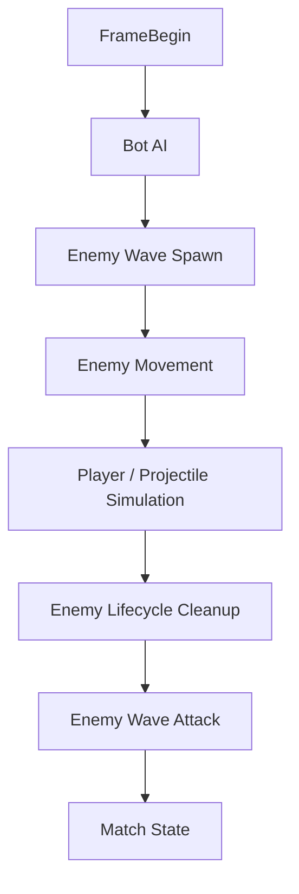
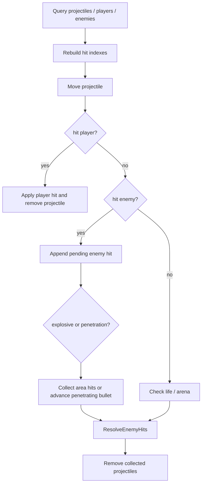

# Shooter 战斗玩法内核深潜：一帧管线、敌人波次、空间索引与 Bot AI

> 本文补齐 Shooter 示例中网络、快照和表现层文档之外的玩法内核视角，聚焦 fixed tick 内部的玩法状态变化。

## 1. 能力定位

Shooter 玩法内核运行在 `com.abilitykit.demo.shooter.runtime` 内部，由 `ShooterBattleRuntimePort.Tick` 驱动 `ShooterBattleSveltoStepEngine`。它不负责 Gateway/Orleans 编排、snapshot/hash 网络格式或 Unity 表现绑定，而是负责玩家输入、子弹、敌人、命中、事件和胜负状态。

| 问题 | 源码落点 | 设计含义 |
|------|----------|----------|
| 一帧内系统顺序 | `ShooterBattlePipelineFactory` / `ShooterBattleSystemOrder` | 用显式 order 固定 begin、AI、生成、移动、模拟、清理、攻击、胜负判定 |
| 玩家输入生效 | `ShooterPlayerCommandBattleModule` | 从 `InputBuffer` 取最新命令，统一处理移动、瞄准、开火 |
| projectile 命中 | `ShooterProjectileCombatBattleModule` | 每帧推进 projectile，重建命中索引，收集后批量结算 |
| 敌人持续运行 | `ShooterEnemyWaveBattleSystem` / `ShooterEnemyWaveSpawnDirector` / `ShooterEnemyWaveCombatModule` | Spawn 与 Attack 拆成两个 phase，中间插入玩家模拟和死亡清理 |
| 命中性能与确定性 | `ShooterSpatialHashGrid` / `ShooterSpatialHitIndex` / `ShooterSpatialPlayerHitIndex` | 空间哈希缩小候选集，再用稳定 component index 选择 first hit |
| Bot AI 接入 | `ShooterBotAiRuntime` / `ShooterBotAiService` | HFSM 只产出 `ShooterPlayerCommand`，不直接修改战斗状态 |

## 2. 一帧管线

`ShooterBattlePipelineFactory.Create` 创建 `ShooterBattleSveltoStepEngine`，step engine 在构造函数中按 `Order` 排序。

| Order | 系统 | 行为 |
|-------|------|------|
| 0 | `ShooterFrameBeginBattleSystem` | `CurrentFrame++`，清空当前帧事件缓冲 |
| 100 | `ShooterBotAiServiceBattleSystem` | AI 生成玩家命令并写入 `InputBuffer` |
| 150 | `ShooterEnemyWaveBattleSystem.Spawn` | 重置或同步波次状态，再生成敌人 |
| 175 | `ShooterEnemyWaveMovementBattleSystem` | 活敌人朝单一或最近玩家移动 |
| 200 | `ShooterSimulationBattleSystem` | 处理玩家命令、生成子弹、推进 projectile、结算命中 |
| 250 | `ShooterEnemyLifecycleCleanupBattleSystem` | 移除死亡敌人实体 |
| 300 | `ShooterEnemyWaveBattleSystem.Attack` | 活敌人按攻击间隔对玩家造成伤害 |
| 400 | `ShooterMatchStateBattleSystem` | 依据击杀数、玩家存活和时间限制完成比赛 |

两个顺序细节很关键：Bot AI 在玩家模拟前运行，所以 AI 与真实玩家共享同一套输入处理；敌人死亡清理在 enemy attack 前运行，所以本帧被击杀的敌人不会继续攻击。

## 3. 当前帧事件契约

`ShooterFrameBeginBattleSystem` 每帧清空 `ShooterBattleState.Events`，因此它是当前帧事件缓冲。`ShooterCombatEventBuffer` 把玩法事件统一写为 `ShooterEventSnapshot`。

| 方法 | 事件 | 编码 |
|------|------|------|
| `AddFire` | 玩家开火 | source 是玩家 id，target 为 0，bullet id 有效 |
| `AddPlayerHit` | 玩家命中玩家 | source/target 都是正玩家 id |
| `AddEnemyHit` | 玩家命中敌人 | target 写成负 enemy entity id |
| `AddEnemyAttack` | 敌人攻击玩家 | source 写成负 enemy entity id，target 是正玩家 id |

负数 id 是 Shooter 的 compact event contract，用同一组 source/target 字段表达玩家和敌人，避免为示例扩展额外事件 schema。

## 4. 玩家命令与 projectile

`ShooterPlayerCommandBattleModule.Tick` 查询玩家组件，跳过死亡玩家，从 `ShooterBattleState.InputBuffer` 读取最新命令。移动和瞄准会被归一化，位置会按 arena 约束 clamp；开火时按 attack slot 生成 projectile。

| Attack slot | 行为 |
|-------------|------|
| 默认 | 单发，方向等于玩家 aim |
| Spread | 三发散射，中心弹带 explosion radius / explosion damage |
| Twin | 双发穿透，两发带 lateral offset，`PenetrationRemaining = 2` |

`SpawnBullet` 会分配 `BulletId`，调用 `IShooterEntityManager.AddProjectile`，并通过 `AddFire` 追加当前帧事件。

## 5. Projectile 命中结算

`ShooterProjectileCombatBattleModule.Tick` 每帧重建玩家和敌人的空间命中索引，倒序推进 projectile，并把敌人命中先收集到 `_pendingEnemyHits`，最后统一结算。

玩家命中会立刻结算；敌人命中先进入 pending 列表，因为同一帧可能有穿透、爆炸和多 projectile 命中。`ResolveEnemyHits` 执行存活检查、扣血、击杀统计、玩家加分和事件追加。击杀时把 enemy health 的 `Alive` 设为 0，并让 `DefeatedEnemies++`，实体移除交给后续 cleanup system。

## 6. 空间索引与稳定命中

`ShooterSpatialPlayerHitIndex` 只索引 alive 玩家，并在命中时排除 owner player；`ShooterSpatialHitIndex` 只索引 alive enemy。底层 `ShooterSpatialHashGrid` 的 cell 前 8 个 id 存在字段 `Id0` 到 `Id7` 中，超过 8 个才进入 `Overflow` list，用低分配方式覆盖常见低拥挤度场景。

命中索引不会按 dictionary 遍历顺序直接返回。它们用 `CollectAabb` 收集候选 cell，再做圆形半径检查，并选择最小 component index 作为 first hit。敌人索引额外返回 Svelto entity id。这样结果依赖稳定查询顺序，而不是哈希表内部枚举顺序。

`ShooterSpatialTargetIndex` 服务 Bot AI，用 ring search 找最近玩家，必要时退回全量扫描；它不参与 projectile hit。

## 7. 敌人波次

敌人逻辑拆成 Spawn、Movement、Attack 三段。Spawn phase 会在 `CurrentFrame <= 1` 时重置波次进度和 enemy id allocator，后续帧通过现有 `GameplayTargets` 同步 allocator 与 spawn progress，避免从 snapshot 或导入状态恢复后 enemy id 冲突或波次倒退。

`ShooterEnemyWaveSpawnDirector.TickWave` 只有在当前帧达到 `StartFrame`、wave 未超过 `EnemyCount`、active enemy 未超过 `MaxActiveEnemies`、并满足 `framesSinceStart % SpawnFrameInterval == 0` 时生成敌人。生成角度来自 `waveId * 97 + spawnIndex * 37`，不依赖随机数。

`ShooterEnemyWaveMovementBattleSystem` 有单活玩家 fast path；多玩家时每个敌人追踪最近 live player，并在 `StopDistance = 0.75f` 外按 `ShooterBattleTuning.EnemySpeed` 移动。

`ShooterEnemyWaveCombatModule` 按 attack interval 运行。单玩家路径把 alive enemy 的伤害累加到同一玩家，多玩家路径按最近玩家分摊攻击；攻击事件每帧最多 `MaxEnemyAttackEventsPerFrame = 64` 条。

## 8. Bot AI 是输入源

Bot AI 不移动实体、不生成子弹、不扣血。`ShooterBotAiRuntime.Tick` 每帧重建 `ShooterSpatialTargetIndex`，让每个 attachment tick HFSM controller，然后把产生的 `ShooterPlayerCommand` 写入 `InputBuffer`；如果玩家不再 live，则移除最新命令。

内置 `simple-battle` profile 来自 `ShooterBotAiJsonCatalog.SimpleBattleJson`：

| 状态 | interval | action | 转移 |
|------|----------|--------|------|
| Wander | 0.2 | `wander` | 有目标转 Chase 或 Attack |
| Chase | 0.05 | `chaseTarget` | 进入攻击距离转 Attack，无目标转 Wander |
| Attack | 0.05 | `attackTarget` | 离开攻击距离转 Chase，无目标转 Wander |

Action 都只写 blackboard command：`wander` 用 frame/playerId/phase 做确定性移动，`chaseTarget` 朝最近目标移动，`attackTarget` 指向目标、侧向 strafe，并按 `Frame % fireInterval == PlayerId % fireInterval` 开火。

## 9. 胜负状态与输出

`ShooterMatchStateBattleSystem` 在一帧最后裁决状态：击杀数达到 `VictoryTargetDefeats` 为 Victory；没有玩家或所有玩家死亡为 Defeat；时间耗尽为 Ended。`ShooterBattleState.TryCompleteMatch` 设置 `MatchState` 和 `MatchCompletedFrame`，并把 match result 写入当前帧事件。

match result 同时存在于状态快照和事件流里：快照适合 late join/reconnect 后恢复最终状态，事件适合表现层或 smoke runner 观察当前帧状态变化。

## 10. 源码阅读路径

1. `Unity/Packages/com.abilitykit.demo.shooter.runtime/Runtime/Domain/Battle/Factories/ShooterBattlePipelineFactory.cs`
2. `Unity/Packages/com.abilitykit.demo.shooter.runtime/Runtime/Domain/Battle/Systems/ShooterBattleSystem.cs`
3. `Unity/Packages/com.abilitykit.demo.shooter.runtime/Runtime/Domain/Battle/ShooterBattleSimulation.cs`
4. `Unity/Packages/com.abilitykit.demo.shooter.runtime/Runtime/Domain/Battle/Systems/ShooterBattleSimulationModules.cs`
5. `Unity/Packages/com.abilitykit.demo.shooter.runtime/Runtime/Domain/Battle/Systems/ShooterCombatEventBuffer.cs`
6. `Unity/Packages/com.abilitykit.demo.shooter.runtime/Runtime/Domain/Battle/Systems/ShooterSpatialHashGrid.cs`
7. `Unity/Packages/com.abilitykit.demo.shooter.runtime/Runtime/Domain/Battle/Systems/ShooterSpatialHitIndex.cs`
8. `Unity/Packages/com.abilitykit.demo.shooter.runtime/Runtime/Domain/Battle/Systems/ShooterSpatialPlayerHitIndex.cs`
9. `Unity/Packages/com.abilitykit.demo.shooter.runtime/Runtime/Domain/Battle/Systems/ShooterEnemyWaveBattleSystem.cs`
10. `Unity/Packages/com.abilitykit.demo.shooter.runtime/Runtime/Domain/Battle/Systems/ShooterEnemyWaveSpawnDirector.cs`
11. `Unity/Packages/com.abilitykit.demo.shooter.runtime/Runtime/Domain/Battle/Systems/ShooterEnemyWaveMovementBattleSystem.cs`
12. `Unity/Packages/com.abilitykit.demo.shooter.runtime/Runtime/Domain/Battle/Systems/ShooterEnemyWaveCombatModule.cs`
13. `Unity/Packages/com.abilitykit.demo.shooter.runtime/Runtime/Domain/Battle/AI/ShooterBotAiRuntime.cs`
14. `Unity/Packages/com.abilitykit.demo.shooter.runtime/Runtime/Domain/Battle/AI/ShooterBotAiService.cs`
15. `Unity/Packages/com.abilitykit.demo.shooter.runtime/Runtime/Domain/Battle/ShooterBattleState.cs`
