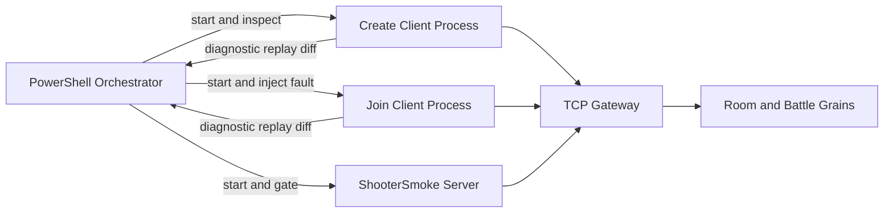
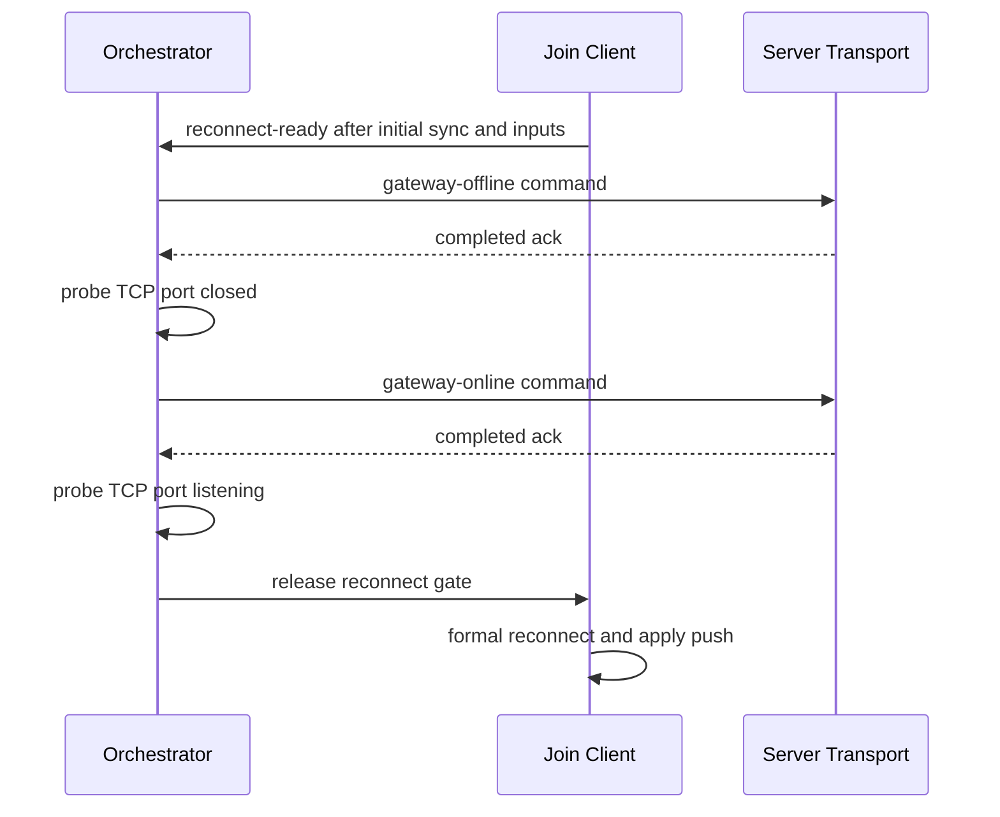

# Shooter 多进程故障矩阵与收敛证据设计

> 状态：已落地并完成真实进程验证
>
> 最近验证日期：2026-07-19
>
> 事实源：`Server/Orleans/tools/run_shooter_multiprocess_smoke.ps1`、`ShooterSmokeClientProcessRunner`、版本化 run manifest 与诊断 artifact

## 1. 文档定位

本文描述 Shooter 多进程 Smoke 如何验证真实服务进程、独立客户端进程、故障注入、恢复收敛和可复现证据。它不重复 PureState 编码、客户端同步控制器或 FrameRecord 容器的内部设计；这些内容分别见：

- [PureState 预算与兴趣范围](06-PureStateBudgetAndInterest.md)
- [客户端同步策略](04-ClientSyncStrategies.md)
- [服务端流程与 Smoke](05-ServerFlowAndSmokeDeepDive.md)
- [回放系统](../../07-NetworkSynchronization/04-ReplaySystem.md)

多进程矩阵的目标不是证明“进程启动后返回零”，而是同时回答：

1. 故障是否在预定阶段真实发生。
2. 客户端是否通过正式业务入口恢复。
3. 状态流、可靠事件流和权威记录是否最终收敛。
4. 失败后是否留下足够 artifact 定位首个分歧。
5. 所有子进程和专用端口是否有界退出与释放。

## 2. 拓扑与所有权

一次场景至少包含四个角色：



Orchestrator 持有场景计划、端口、进程、超时、fault command、assertion 和 manifest。客户端只负责执行正式 create/join/input/reconnect 路径并输出结构化结果，不自行宣布整个矩阵通过。最终判定由 orchestrator 聚合完成。

每个场景使用独立的 TCP Gateway、Silo 和 Orleans Gateway 端口。full profile 中相邻场景的三个端口均按固定偏移隔离，避免前一场景残留污染后一场景。

## 3. 场景计划

当前 fault matrix 支持以下 profile：

| Profile | 场景集合 | 用途 |
|---|---|---|
| `minimal` | `recoverable-retry` | 快速验证重试和基本恢复链路 |
| `full` | `slow-consumer`、`gateway-offline`、`recoverable-retry`、`reconnect-cycles` | 完整 P1 故障矩阵 |
| `custom` | 由 `-Scenario` 指定单场景 | 聚焦复现与开发调试 |

四类故障的设计边界如下：

| 场景 | 故障注入 | 必须观察到的恢复证据 |
|---|---|---|
| `recoverable-retry` | 第一轮 reconnect 注入 3 次可恢复 IOException/Timeout 类失败 | retry 次数与注入次数匹配，随后正式 reconnect 成功并收到新 push |
| `gateway-offline` | join 客户端完成输入后，通过 fault control command 停止 TCP transport，再恢复监听 | offline/online command 都有 ack；离线阶段端口不可达；释放 gate 后正式 reconnect |
| `slow-consumer` | PureState observer 使用 256 B/s、32768 burst、queue length 1、queue age 100 ms、drain 250 ms | 服务端出现 drop 或 coalesce；每个客户端恢复 full baseline；最终队列、baseline 与 diff 收敛 |
| `reconnect-cycles` | join 客户端连续 3 次真实关闭 connection | 每轮都重新走 join/ready/start/subscribe，入口为 `Reconnect`，每轮都有新的成功应用 snapshot push |

`slow-consumer` 强制使用 `pure-state`。其他场景可显式选择 packed 或 pure-state，但 P1 验证优先组合 PureState 与 replay，以覆盖 baseline 生命周期。

## 4. 故障时序不能依赖猜测

故障必须发生在可证明的业务阶段。runner 使用进度行、文件 gate、fault command ack 和端口探测建立时序，不以增加固定 sleep 代替状态确认。

### 4.1 Gateway offline



离线 ack 和 TCP 端口不可达必须同时成立。仅收到控制命令返回不等于网络故障已经生效。

### 4.2 周期断线

join 客户端每轮执行以下顺序：

1. 记录当前 runtime frame 与 push count。
2. 调用真实 connection close。
3. 通过 `JoinReadyStartAndSubscribeAsync` 重新进入房间、ready、start 和 subscribe 流程。
4. 要求 entry kind 为 `Reconnect`。
5. 等待一个新的可应用 push，并要求 push count 严格前进。

三轮检查逐轮执行，不能只比较第一轮前和最后一轮后的总 push 数。这样可以阻止“第一轮恢复成功、后两轮没有真正恢复”被聚合结果掩盖。

## 5. 分层超时

runner 将时间预算拆成不同所有权：

| 预算 | 默认值 | 约束对象 |
|---|---:|---|
| operation timeout | 30 秒 | 单次客户端/Gateway 操作 |
| startup timeout | 60 秒 | server 进程和监听启动 |
| setup timeout | 60 秒 | create/join 初始业务建立 |
| scenario timeout | 45 秒 | 故障注入与恢复阶段 |
| convergence timeout | 最多 20 秒 | 诊断 artifact 与最终收敛检查 |
| execution timeout | startup + setup + scenario + 15 秒 | 单个子场景完整生命周期 |
| global timeout | 各场景 execution timeout 之和，或显式覆盖 | 整个 matrix |

失败后不应优先增加 timeout。应先依据 manifest 的 failure stage、process timeline、fault timeline 和 first divergence 判断卡在启动、setup、故障注入还是收敛阶段。

## 6. 客户端状态推进门禁

客户端结果首先证明状态流确实发生了有效推进。

### 6.1 Packed

非终局场景要求 snapshot hash 校验成功，runtime 与 view frame 均大于零且最终字段一致。输入响应必须成功，accepted frame 不得落后于 requested frame，并包含有效 server ticks。

### 6.2 PureState

PureState 至少应用一个 full baseline。在此之后，以下任一项都可证明状态流继续推进：

- 应用一个或多个 delta。
- 报告 baseline resync request，并由后续 full baseline 恢复。
- 应用重复 full baseline。

重复 full baseline 是协议允许的推进形式，不只属于 slow-consumer。服务端可能因 reconnect、observer baseline invalidation、AOI 或发布策略重新发送 full baseline。

但“有重复 full baseline”只证明状态流推进，不等于最终收敛。最终仍必须单独满足 hash、pending baseline、reliable event 和 authoritative diff 门禁。runner 不应以场景名称决定协议结果是否合法。

如果客户端最终仍报告 PureState resync needed，而整个过程中没有 resync request，则结果自相矛盾并立即失败。

## 7. 最终收敛是组合证据

单个布尔值不能证明跨层恢复。`Assert-BoundedConvergence` 对每个客户端读取结构化 diagnostic artifact，并组合以下证据：

| 证据层 | 通过条件 | 证明范围 |
|---|---|---|
| 状态推进 | full baseline 加后续 delta、resync 或重复 full baseline | 客户端确实持续消费状态流 |
| comparable hash | 同帧、双方非零且来源明确 | 当前应用证据可比较，不误用 stale/ignored push |
| pending baseline | `pureStateLastResyncNeeded=false` | 恢复结束后没有悬挂 baseline 请求 |
| reliable events | epoch 有效、cursor 可读取、`needsResync=false` | 不可替换事件流没有 retention gap 悬挂 |
| authoritative diff | diagnostic `diff.matched=true`，通常状态为 `Identical` | 客户端 FrameRecord 与权威记录最终一致 |
| observer pressure | slow-consumer 存在 drop/coalesce，且每客户端恢复 full baseline | 压力真实发生且恢复不是空跑 |
| health | 汇总 warning/critical/highest severity | 保留质量和故障上下文，不替代正确性断言 |

这些证据互相补充：

- hash 匹配不能证明可靠事件 cursor 已恢复。
- `needsResync=false` 不能证明客户端状态与权威记录一致。
- diff 一致不能证明故障阶段真实发生。
- 进程退出码为零不能证明 replay 文件可消费。

## 8. FrameRecord 与 replay 证据链

默认情况下，每个 create/join 客户端都必须生成：

1. 完整 input-state replay。
2. minimized input-state replay。
3. diagnostic JSON。
4. authoritative diff 报告或其结构化摘要。
5. stdout/stderr 日志。

完整和 minimized replay 必须存在、非空并被验证器消费。replay 必须包含 snapshot；minimized input-state replay 不要求保留 state hash track，因为 authoritative diff 使用独立的权威/客户端记录投影完成。

manifest 在终态扫描 run 根目录下的 artifact，记录相对路径、字节数和 SHA-256。artifact 不能逃逸 run 根目录，避免并行运行之间互相引用或覆盖。

`firstDivergence` 记录第一个失败 assertion 的名称、时间和详情。它是场景级首失败锚点，不等价于 FrameRecord 内首个 divergent frame；后者由 diff artifact 提供。

## 9. Manifest 契约

每个子场景写入 schema version 2 的 `manifest.json`，状态为 `running`、`passed` 或 `failed`。终态至少包含：

- run id、配置、机器、起止时间。
- profile、scenario、payload mode、随机种子和全部 timeout。
- TCP/Silo/Orleans Gateway 端口组。
- server/client PID、correlation id 和日志路径。
- process timeline 与 exit code。
- fault timeline 与 command ack。
- assertion timeline 与 first divergence。
- client replay、diagnostic、diff 路径和摘要。
- reliable、observer、health 与 bounded convergence summary。
- artifact 相对路径、bytes 和 SHA-256。

manifest 使用临时文件写入后原子替换。场景运行中也持续更新 `running` manifest，使父级 global timeout 或外部强杀后仍能定位已启动进程和当前阶段。

## 10. 失败分类

当前分类保持简单且可执行：

| Category | Stage | 含义 |
|---|---|---|
| `PreconditionFailed` | `setup` | 场景尚未建立，或出现 409/conflict、端口占用、监听失败等前置问题 |
| `FaultRecoveryFailed` | `fault-recovery` | 场景已建立，但故障注入、恢复、收敛、replay 或清理门禁失败 |

分类的目的不是替代原始异常，而是让 CI 和矩阵汇总先区分环境/前置失败与真实恢复失败。manifest 必须同时保留原始 error message 和 first divergence。

## 11. 进程与端口治理

多进程 runner 直接执行已构建的 framework-dependent DLL。`-NoBuild` 表示场景不会再触发项目求值或隐式构建；matrix 非 `-NoBuild` 时只在父级构建一次。

清理遵循以下原则：

- 只清理本轮记录的 PID 和端口组。
- 不通过宽泛进程名杀死其他开发任务。
- server/create/join 都必须进入 process timeline 并记录 exit code。
- 场景结束后确认 TCP Gateway、Silo 和 Orleans Gateway 端口释放。
- cleanup 异常不能静默覆盖原始场景失败。

## 12. 最近真实验证快照

2026-07-19 的 `reconnect-cycles + pure-state + replay` 验证使用三轮真实关闭与恢复：

- join 每轮都返回 `Reconnect`。
- 每轮都有 launch returned 和 first push applied 证据。
- 总 push 从 5 前进到 9。
- create/join authoritative diff 均为 `Identical`。
- reliable epoch 一致，cursor 有效，`needsResync=false`。
- PureState pending baseline 已清除。
- 两客户端的完整和 minimized replay 共四个文件均存在、非空且已消费。
- server/create/join 均以 exit code 0 结束，三个专用端口释放。

该验证同时修正了一处 runner 断言：重复 full baseline 原先只在 slow-consumer 场景被视为合法推进，导致 reconnect 场景在 hash、diff 和 baseline 都已收敛时被误拒绝。修正后协议判定不再依赖场景名称，独立收敛门禁保持不变，也没有增加 timeout、sleep 或降低压力。

具体 run id、端口和逐次指标属于验证快照，记录在路线图和 artifact manifest，不作为长期固定值。

## 13. 验证入口

```powershell
# 查看 full profile 计划，不启动进程
.\Server\Orleans\tools\run_shooter_multiprocess_smoke.ps1 -Profile full -PlanOnly

# 执行完整故障矩阵
.\Server\Orleans\tools\run_shooter_multiprocess_smoke.ps1 -Configuration Debug -Profile full -PayloadMode pure-state

# 聚焦三轮周期断线
.\Server\Orleans\tools\run_shooter_multiprocess_smoke.ps1 -Configuration Debug -Profile custom -Scenario reconnect-cycles -PayloadMode pure-state
```

聚焦源码契约测试位于 `AbilityKit.Orleans.ShooterSmoke.Tests`，用于锁定 profile 计划、DLL 直启、timeout 分层、fault gate、PureState 推进、reliable/diff/replay 和 manifest 字段。源码契约不能代替真实多进程运行，两者应同时保留。

## 14. 后续边界

当前仍需继续扩展：

- Grain deactivate/reactivate 后 observer、baseline、AOI 和 reliable cursor 恢复。
- running manifest 已写入后的父级动态强杀真实路径。
- 多 observer 长稳、容量与公平性矩阵。
- 长时间网络 profile 动态切换和恢复时延分布。
- 将 FrameRecord diff 报告接入 Unity Editor 双记录时间线。

这些工作应复用当前 manifest、artifact、timeout 和 convergence 契约，不新建平行 runner 或以更多同步模式枚举表达故障组合。
