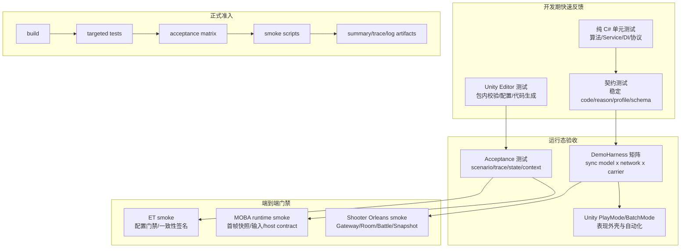
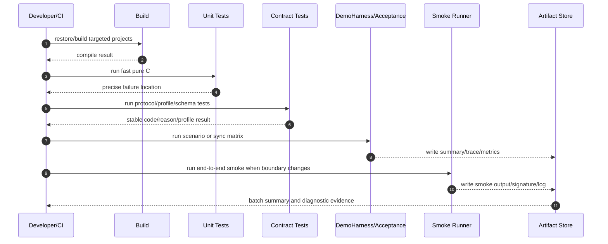
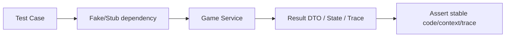
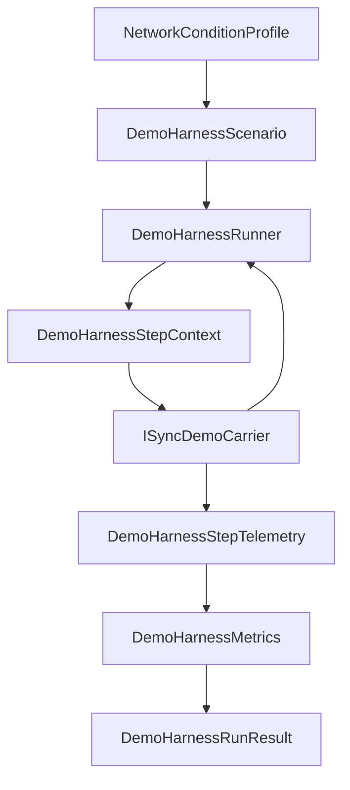
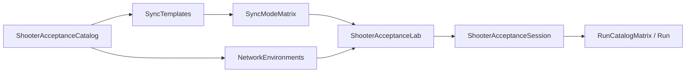
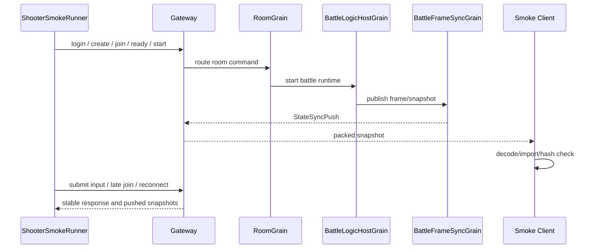
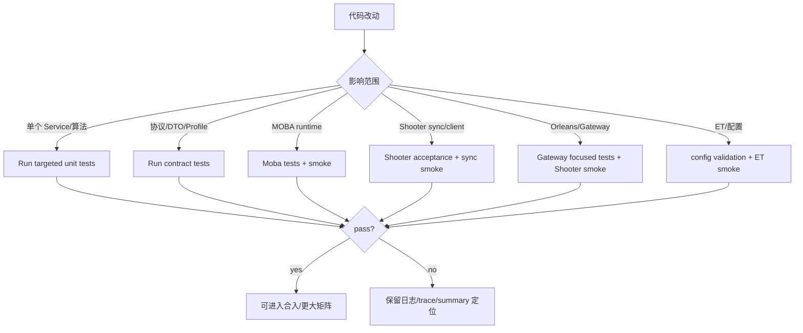

# AbilityKit 正式测试流程、单元测试与冒烟测试设计

> 本文说明 AbilityKit 项目的正式测试代码流程：如何把纯 C# 单元测试、Unity Editor/PlayMode 测试、DemoHarness 矩阵、MOBA/ET/Shooter 冒烟测试和验收脚本组合成一套分层质量门禁。目标不是追求单一“大而全”的测试，而是让不同风险在最便宜、最稳定、最可定位的层级被拦截。MOBA/Shooter 示例级工业化细节见 [03-MOBA 与 Shooter 示例工业化流程](03-MobaShooterIndustrializationFlow.md)。

---

## 1. 能力定位

AbilityKit 的测试体系承担四类职责：

| 职责 | 说明 | 代表入口 |
|------|------|----------|
| 快速反馈 | 在不启动 Unity、不启动 Orleans 的情况下验证核心算法、配置、DI、Service、协议 DTO 与同步策略 | `src/*.Tests` |
| 契约冻结 | 固化跨模块协议、稳定错误码、状态码、Profile、Scenario DSL、Snapshot DTO、Trace 结构 | `src/AbilityKit.Network.Runtime.Tests`、`src/AbilityKit.Demo.Moba.Tests` |
| 示例验收 | 证明 MOBA、Shooter、ET 示例不是“能编译”，而是能按正式流程跑完关键战斗闭环 | `src/AbilityKit.Demo.Moba.Tests/Smoke`、`src/AbilityKit.Demo.Shooter.Runtime.Tests`、`tools/run_et_battle_smoke.ps1` |
| 回归防护 | 在重构 ECS、网络同步、Skill/Buff/Projectile、表现层时，持续保证旧能力不被破坏 | DemoHarness、Acceptance、Smoke、批量矩阵 |

测试体系遵循一个基本原则：

> 能用纯 C# 单元测试验证的内容，优先放在纯 C#；只有必须验证 Unity 生命周期、表现层、真实 Gateway/Orleans 连接时，才进入 Editor/PlayMode 或端到端 smoke。

---

## 2. 测试分层总览



---

## 3. 源码与测试入口

| 测试域 | 入口 | 关注点 |
|--------|------|--------|
| Triggering 包内测试 | `Unity/Packages/com.abilitykit.triggering/Tests`、`Unity/AbilityKit.Triggering.Tests.csproj` | TriggerPlan、Runner、Validator、Pooling hotspot、Unity 包内兼容性 |
| Unity 游戏测试工程 | `Unity/AbilityKit.Game.UnitTests.csproj`、`Unity/AbilityKit.HFSM.Tests.csproj`、`Unity/AbilityKit.Combat.Motion.Tests.csproj` | Unity 生成工程、Editor/PlayMode 外壳、HFSM、Motion 等包内回归入口 |
| World DI 测试 | `src/AbilityKit.World.DI.Tests` | `WorldInject`、Scope seeding、测试注入器 |
| Network Runtime 测试 | `src/AbilityKit.Network.Runtime.Tests` | DemoHarness、SyncClock、TimeSync、Lag Compensation、SyncHealthEvent、Profile Registry |
| MOBA 逻辑测试 | `src/AbilityKit.Demo.Moba.Tests` | Buff、Context、Continuous、Passive、Skill、Smoke、Trace、Triggering |
| MOBA View Runtime 测试 | `src/AbilityKit.Demo.Moba.View.Runtime.Tests` | 客户端同步策略、远端插值播放、DemoHarness carrier |
| Game View Runtime 测试 | `src/AbilityKit.Game.View.Runtime.Tests` | 通用视图运行时、表现会话、跨 Demo 视图基础设施 |
| Shooter Runtime 测试 | `src/AbilityKit.Demo.Shooter.Runtime.Tests` | AcceptanceLab、同步模式 smoke、Svelto benchmark、Gateway flow、client session、rollback、presentation |
| AI Inference 测试 | `src/AbilityKit.AI.Inference.Tests` | AI 推理边界与训练/运行时拆分后的基础回归 |
| Orleans Gateway 测试 | `Server/Orleans/src/AbilityKit.Orleans.Gateway.Tests` | TCP/WebSocket Gateway、RoomGatewaySessionFlow、协议路由 |
| Orleans Grains 测试 | `Server/Orleans/src/AbilityKit.Orleans.Grains.Tests` | RoomGrain、BattleLogicHostGrain、FrameSyncGrain、Grain 状态边界 |
| Shooter Smoke 测试工程 | `Server/Orleans/src/AbilityKit.Orleans.ShooterSmoke.Tests` | Smoke runner、结果格式化、replay artifact、端到端场景保护 |
| ET Smoke 脚本 | `tools/run_et_battle_smoke.ps1` | ET 控制台战斗、配置门禁、确定性签名、临时输出清理 |
| Shooter Orleans Smoke | `Server/Orleans/tools/run_shooter_smoke.ps1` | Gateway、Room、BattleGrain、StateSync push、input submit、late join、reconnect |

---

## 4. 正式测试流水线



流水线按改动范围逐级放大：

| 改动类型 | 最小验证 | 放大验证 |
|----------|----------|----------|
| 纯算法、DTO、错误码、Profile | 对应 `src/*.Tests` | Network Runtime tests / Shooter Acceptance tests |
| MOBA Skill/Buff/Projectile/Trace | `src/AbilityKit.Demo.Moba.Tests` targeted case | MOBA acceptance scenario、ET smoke |
| Shooter 同步/网络/客户端表现 | Shooter targeted tests | `ShooterAcceptanceLab` 矩阵、Shooter Orleans smoke |
| Gateway/Room/Grain 协议 | Gateway/Room focused tests | Shooter smoke、端到端 snapshot/input/reconnect smoke |
| Unity 表现外壳 | Editor/PlayMode batch | 纯 C# acceptance + Unity 自动化入口双跑 |
| 大规模性能路径 | Svelto benchmark / allocation diagnostics | smoke benchmark / long-run stress |

---

## 5. 单元测试的作用

单元测试是 AbilityKit 正式化的第一层防线。它的价值不只是“提高覆盖率”，而是让复杂战斗框架的核心规则可以在无 Unity、无服务端、无网络的情况下稳定复现。

### 5.1 固化小边界行为

MOBA runtime port 测试会直接断言缺失依赖、非法输入帧、首帧快照、稳定失败码等边界。例如 `MobaRuntimeFirstFrameSnapshotAcceptanceTests` 验证：

- runtime 是否具备 `GameStart`、`Input`、`SnapshotOutput`、`StateReadModel` 能力；
- 首帧是否能产出 `EnterGame` 与 `ActorSpawn` 快照；
- 重复收集快照不会重复输出；
- 输入失败返回稳定的 `MobaInputSubmitFailureCode`，而不是依赖日志文案。

这类测试能让 Host 与 runtime 的契约在重构时保持稳定。

### 5.2 支持 Service 优先的架构

MOBA 已采用 System 调度、Service 承载主逻辑的结构。对应测试可以绕过完整 ECS Tick，只构造 Service 需要的依赖：



这种方式带来三个收益：

1. 测试更快，不需要启动完整世界；
2. 失败更精确，能定位到某个 Service 或策略；
3. System 变薄后不再把调度、遍历和业务规则混在一起，重构风险更低。

### 5.3 冻结协议和诊断模型

`SyncHealthEventTests` 证明诊断事件不是临时日志，而是结构化契约：

- `Kind` 表示事件类型；
- `Severity` 表示 Info/Warning/Error；
- `Frame` 和 `Value` 提供可机器读取的定位信息；
- DemoHarness metrics 会聚合 warning/error 数量。

这避免测试依赖自然语言日志，提升 CI 稳定性和失败定位能力。

---

## 6. 契约测试与稳定断言

AbilityKit 的正式测试应优先断言“机器稳定字段”，而不是字符串日志。

| 推荐断言 | 原因 | 示例 |
|----------|------|------|
| stable enum/code | 重构文案不影响测试 | `MobaInputSubmitFailureCode.MissingInputPort` |
| op code | 跨端协议稳定 | `MobaOpCodes.Snapshot.ActorSpawn` |
| profile id / template id | 同步模式可索引 | `predict-rollback-authority`、`hybrid-hero-prediction` |
| trace kind / config id | 技能链路可回放 | `EffectExecution`、`EffectAction` |
| frame/hash/signature | 确定性与同步一致性 | `StateHash`、`DeterminismSignature` |
| metrics count | 自动聚合质量门禁 | `HealthErrorCount == 0` |

不推荐把普通日志作为正式断言依据。日志适合人工排查，正式测试应让失败结果能被脚本、CI 和后台报告稳定读取。

---

## 7. DemoHarness 与验收矩阵

DemoHarness 是 AbilityKit 在“单元测试”和“端到端 smoke”之间的中间层。它把玩法载体、同步模型、网络环境和指标收集统一起来。



`DemoHarnessRunnerTests` 体现了它的核心职责：

- 校验 scenario 与 carrier 的名称、同步模型是否匹配；
- 聚合 tick、frame、rollback、snapshot、hit、network stats；
- 支持 `RunMany` 批量执行多 carrier、多 scenario；
- 把网络抖动、丢包、重排、pending 数转成可断言 metrics。

`DemoHarnessRunnerTests` 还说明了状态分类的边界：carrier 不支持某个同步模型时返回 Unsupported，运行中质量未达标可以标记 Degraded，真实异常才进入 Failed。这让矩阵报告可以区分“能力尚未实现”和“已经实现但退化”。

Shooter 在此基础上建立 `ShooterAcceptanceCatalog` 与 `ShooterAcceptanceLab`，将同步模板、网络环境和验收标准固化为正式矩阵：



这使 Unity 面板、xUnit、CI 可以共享同一套验收边界，而不是各自维护不同判断逻辑。当前 golden baseline 由 `ShooterAcceptanceMatrixSnapshotTests` 固化为 5 个可运行同步模式乘以 6 个网络环境，共 30 个场景，并要求全部 Completed：

| 同步模式 | 默认 carrier 语义 | 验收重点 |
|----------|-------------------|----------|
| `PredictRollback` | `ShooterDemoHarnessCarrier` | 客户端预测、runtime/presentation frame 对齐、无 reconciliation 异常 |
| `AuthoritativeInterpolation` | interpolation carrier | 权威快照插值、remote jitter、snapshot apply |
| `BatchStateSync` | 低频插值兼容 carrier | 批量状态同步、pending 包和 full snapshot 请求 |
| `MassBattleLodSync` | LOD/batch carrier | 大规模实体、LOD 预算、批量同步稳定性 |
| `HybridHeroPrediction` | `ShooterHybridDemoHarnessCarrier` | 英雄预测与远端插值混合、专用 Hybrid controller 约束 |

矩阵的价值不是“多跑几个 case”，而是把新增同步模式、新增网络环境、carrier 能力声明和指标阈值绑定在一起。任何组合数量或状态分布变化，都会迫使开发者显式更新 baseline。

---

## 8. 冒烟测试的作用

冒烟测试不是替代单元测试，而是验证“多个已通过单元测试的模块组合起来是否真的能跑通”。它关注的是链路完整性、协议闭环和运行时稳定性。

### 8.1 MOBA runtime smoke

MOBA smoke 重点验证 runtime/host 边界：

- `TryStartGame` 是否成功；
- 首帧是否输出进入游戏和 ActorSpawn 快照；
- 输入端口对非法帧、空命令、部分处理有稳定失败码；
- state read model 是否走 buffer 填充边界，避免不必要分配；
- pending game start spec 是否能被 host 设置、验证、清理。

这类 smoke 仍运行在纯 C# 测试工程中，成本低、定位准，适合作为大部分 MOBA runtime 改动的默认门禁。

### 8.2 Shooter 同步模式 smoke

Shooter sync mode smoke 覆盖多个同步模型：

- `PredictRollback`；
- `AuthoritativeInterpolation`；
- `BatchStateSync`；
- `MassBattleLodSync`；
- `HybridHeroPrediction`。

它会断言：

- session 使用正确的 carrier 和 controller；
- `DemoHarnessRunStatus.Completed`；
- client runtime、presentation、authoritative world 的 frame 对齐；
- health warning/error 为 0；
- network stats 没有 pending 包；
- snapshot apply result 不为 ignored；
- 多客户端最终 snapshot 能收敛。

这类 smoke 不是简单“启动成功”，而是验证同步模型在最小真实循环下能稳定前进。

### 8.3 Shooter Orleans smoke

Shooter Orleans smoke 把验证范围继续放大到服务端：



它验证的是 Gateway、RoomGrain、BattleAdapter、FrameSyncGrain、StateSyncPush、输入提交、晚加入、重连、stale snapshot 保护等端到端协议语义。

`ShooterSmokeResult` 和 `ShooterSmokeResultFormatter` 把 smoke 输出拆成稳定字段，便于 CI 和人工排查读取：

| 字段组 | 代表字段 | 用途 |
|--------|----------|------|
| 房间与战斗身份 | `RoomId`、`BattleId`、`WorldId` | 定位本次 smoke 的服务端实体和逻辑世界 |
| 输入推进 | `InputCount`、`LastAcceptedFrame`、`LastCurrentFrame`、`LastInputStatus` | 验证输入提交、帧推进、服务端接受状态 |
| 客户端状态 | `Frame`、`ActorCount`、`StateHash` | 验证客户端 runtime 和表现层已经推进并具备有效状态 |
| packed snapshot | `SnapshotApplyResult`、`SnapshotFrame`、`SnapshotStateHash`、`SnapshotEntityCount` | 验证服务端推送 packed snapshot 被客户端应用且 hash 非零 |
| stale 保护 | `StaleSnapshotResult` | 验证旧快照不会覆盖较新的客户端状态 |
| projection | `ProjectionApplyCount`、`ProjectionFullSyncApplyCount`、`ProjectionFinalEntityCount` | 验证状态投影批次、全量同步和最终实体数 |
| late join/reconnect | `LateJoinEntryKind`、`ReconnectEntryKind`、`LateJoinProjectionFinalPlayerCount` | 验证晚加入和重连能获得可用投影 |
| gameplay loop | `GameplayMoved`、`GameplayFired`、`GameplayDefeatedEnemy`、`GameplayFinalMatchState` | 验证不是只连通网络，而是真正跑过战斗行为 |
| replay artifact | `InputLogicReplayPath`、`MinimizedInputLogicReplayPath`、`InputLogicReplayValidation` | 验证 smoke 输入逻辑可录制、可回放、可最小化 |

`ShooterSmokeScenarioBase.ValidateSmokeResult` 会继续检查帧、hash、snapshot op code、投影实体数、late join、reconnect、玩法最终状态和清理逻辑。也就是说，Shooter smoke 不是只看进程退出码，而是把服务端、客户端、投影、回放和玩法结果一起验收。

### 8.4 ET smoke

ET smoke 通过脚本执行控制台战斗，具备更强的流程化门禁：

- smoke 前先执行配置门禁；
- case 文件描述输入和期望；
- 默认双跑并比较 `DeterminismSignature`；
- 成功后清理临时输出，失败时保留 artifact；
- 断言移动输入、技能输入、ActorSpawn、Transform、StateHash、Damage/Projectile/Area 等正式 DTO 输出。

ET smoke 的重点是“同输入下输出一致”，适合暴露状态哈希、事件输出、Actor 映射、快照数量等不稳定问题。

---

## 9. 测试给项目稳定性带来的收益

| 稳定性收益 | 说明 |
|------------|------|
| 回归可控 | 大规模重构 ECS、DI、网络、技能管线时，已有测试能告诉我们哪些行为被破坏 |
| 失败可定位 | 单元测试定位到类/Service/协议；harness 定位到同步模式和网络条件；smoke 定位到链路阶段 |
| 确定性提升 | state hash、determinism signature、frame 对齐可以发现随机顺序、时间漂移和重复输出 |
| CI 友好 | 纯 C# 测试先跑，成本低；端到端 smoke 只在边界改动或合入前放大运行 |
| 文档可信 | 设计文档描述的能力有测试、smoke、artifact 作为证据，不只是架构设想 |
| 示例正式化 | MOBA、Shooter、ET 从 demo 变成可验收工程，便于后续扩展示例而不破坏主链路 |
| 性能稳定 | allocation diagnostics、Svelto benchmark、buffer read model 测试能提前发现 GC 和帧稳定性问题 |

---

## 10. 执行策略分层



测试组合分为三档：

| 档位 | 运行时机 | 内容 | 典型命令 |
|------|----------|------|----------|
| P0 快速本地 | 每次小改 | 目标工程 build + targeted xUnit | `dotnet test src/AbilityKit.Network.Runtime.Tests/AbilityKit.Network.Runtime.Tests.csproj` |
| P1 合入前 | PR / 合入前 | 相关 `src/*.Tests` + DemoHarness/Acceptance matrix 子集 | `dotnet test src/AbilityKit.Demo.Shooter.Runtime.Tests/AbilityKit.Demo.Shooter.Runtime.Tests.csproj --filter ShooterAcceptance` |
| P2 正式回归 | 版本准入 / 大重构后 | 全量测试 + Unity batch + Shooter Orleans smoke + ET smoke + 关键 MOBA smoke | `powershell -ExecutionPolicy Bypass -File Server/Orleans/tools/run_shooter_smoke.ps1` |

常用命令可以按改动面选择：

```powershell
# 网络运行时、DemoHarness、SyncHealthEvent
 dotnet test src/AbilityKit.Network.Runtime.Tests/AbilityKit.Network.Runtime.Tests.csproj

# MOBA 逻辑、技能、Buff、Trace、Smoke
 dotnet test src/AbilityKit.Demo.Moba.Tests/AbilityKit.Demo.Moba.Tests.csproj

# Shooter runtime、同步模式、Acceptance matrix
 dotnet test src/AbilityKit.Demo.Shooter.Runtime.Tests/AbilityKit.Demo.Shooter.Runtime.Tests.csproj

# Orleans Gateway 与 Grain 回归
 dotnet test Server/Orleans/src/AbilityKit.Orleans.Gateway.Tests/AbilityKit.Orleans.Gateway.Tests.csproj
 dotnet test Server/Orleans/src/AbilityKit.Orleans.Grains.Tests/AbilityKit.Orleans.Grains.Tests.csproj

# ET 与 Shooter 端到端 smoke
 powershell -ExecutionPolicy Bypass -File tools/run_et_battle_smoke.ps1
 powershell -ExecutionPolicy Bypass -File Server/Orleans/tools/run_shooter_smoke.ps1
```

Unity batch 命令需要按本机 Unity Editor 路径执行，核心参数保持一致：`-batchmode -projectPath Unity -runTests -testPlatform EditMode` 或 `PlayMode`，并把结果输出到固定 artifact 路径。

---

## 11. 维护原则

1. **新增能力必须同步新增测试入口**：新增同步模式、技能 effect、Buff 策略、Gateway 协议时，至少补单元测试或契约测试。
2. **新增跨模块链路必须补 smoke 或 acceptance**：只测 Service 不足以证明链路可运行。
3. **测试断言优先使用稳定字段**：避免依赖临时日志、中文文案或调用次数细节。
4. **失败 artifact 要可读**：trace、summary、signature、metrics、health events 应能定位到 case、frame、actor、config id。
5. **先小后大**：先跑纯 C# targeted tests，再跑矩阵和端到端 smoke，减少反馈成本。
6. **测试代码也是正式设计的一部分**：当文档更新能力边界时，同步检查测试是否覆盖新边界。

---

## 12. 覆盖补强方向

| 方向 | 说明 |
|------|------|
| 统一测试命令清单 | 在仓库根目录沉淀 `test` / `smoke` / `acceptance` 脚本说明 |
| CI 分层 job | 将 P0/P1/P2 拆成 fast、matrix、smoke、nightly |
| Artifact schema 固化 | 将 summary、trace、health、signature 的 JSON schema 固化为文档与测试 |
| Unity batch 自动化 | 补齐 Editor/PlayMode 可在 CI 批处理运行的入口 |
| 性能 smoke | 为固定玩家数、固定技能输入、固定投射物数量增加帧耗时与 GC 指标 |
| 长稳测试 | 在 nightly 或手动回归中增加长时间同步、重连、状态哈希稳定性验证 |
