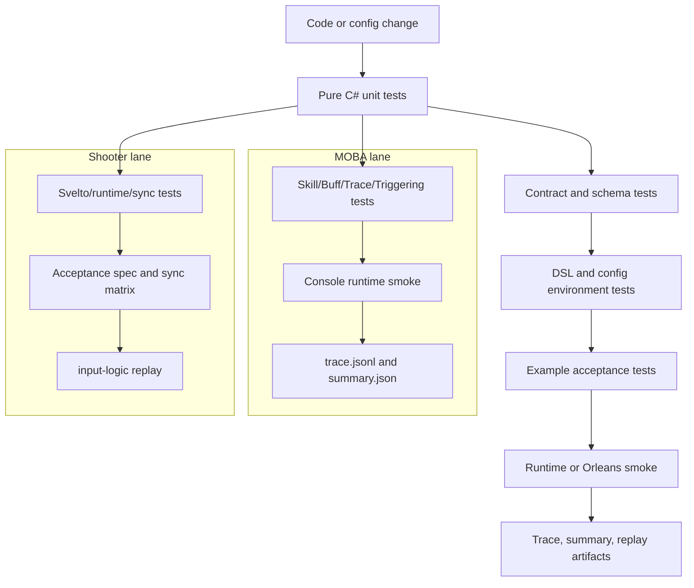

# MOBA 与 Shooter 示例工业化流程设计

> 本文聚焦 MOBA 与 Shooter 两个示例的工业化验证链路：单元测试如何覆盖领域规则，DSL/配置环境测试如何冻结可执行契约，冒烟测试如何证明示例按正式运行路径闭环，并通过 artifact/replay 为回归定位提供证据。全仓测试门禁总览见 [01-正式测试流程、单元测试与冒烟测试](01-TestingWorkflow.md)。

---

## 1. 能力定位

MOBA 与 Shooter 的工业化流程不是简单把测试工程列出来，而是把示例从“源码可编译”提升为“玩法流程、配置 DSL、同步边界、服务端 smoke 和诊断 artifact 都可重复验证”。

| 示例 | 工业化目标 | 主要证据 |
|------|------------|----------|
| MOBA | 验证 Skill/Buff/Projectile/Damage/Trace/Triggering/Continuous Runtime 能在正式 runtime、配置和输入链路下闭环 | xUnit 领域测试、Console smoke、trace jsonl、summary json、runtime input port 断言 |
| Shooter | 验证 Svelto 战斗内核、snapshot/hash、客户端同步、Gateway/Orleans、late join/reconnect 和 replay artifact 能闭环 | runtime tests、acceptance spec、sync smoke、Orleans smoke、input-logic replay |
| DSL/环境 | 验证 TriggerPlan、ExecutionRoot、PlanAction、JSON 配置和兼容性约束在包内与示例内保持一致 | Unity Editor NUnit、Triggering validator、稳定错误码、MOBA PlanActions 测试 |

工业化流程遵循三条边界：

1. 纯领域规则优先放在纯 C# xUnit，避免 Unity/Orleans 启动成本影响快速反馈。
2. 配置、DSL、稳定错误码、artifact schema 必须通过机器可读字段断言，而不是只看日志文本。
3. 端到端 smoke 只承担跨进程、跨网络、真实 runtime 装配的验收职责，失败后应能用 trace/replay 缩小问题。

---

## 2. 分层流水线

这条流水线的核心是“逐级扩大运行面”：先验证纯逻辑，再验证契约和 DSL，再验证示例 runtime，最后验证真实服务端或 smoke 脚本。这样可以让大多数错误停在低成本层级，同时保留端到端证据。

---

## 3. MOBA 工业化流程

### 3.1 测试入口

MOBA 的主测试工程是 `src/AbilityKit.Demo.Moba.Tests/AbilityKit.Demo.Moba.Tests.csproj`。它引用 MOBA Core、Share、Infrastructure、Console、AI、Context、Trace 等项目，并把 Console 配置目录复制到测试输出目录，因此测试不是孤立验证函数，而是在接近正式 Console runtime 的环境中读取同一批配置。

| 层级 | 代表目录/文件 | 验证内容 |
|------|---------------|----------|
| Buff/Skill/Passive | `Buff/`、`Skill/`、`Passive/` | 叠层策略、技能输入结果、技能释放 runtime、被动生命周期 |
| Context/Trace | `Context/`、`Trace/` | `MobaCombatExecutionContext`、lineage、trace registry、root/parent/source 字段 |
| Continuous Runtime | `Continuous/` | 持续行为生命周期、上下文绑定、运行时查询 |
| Triggering | `Triggering/` | `MobaTriggerExecutionGateway`、Owner-bound gate、Projectile/Area trigger、PresentationCue |
| AI | `AI/` | 训练环境、runner 输出、AI 与示例 runtime 的边界 |
| Smoke | `Smoke/` | Console 场景、runtime input port、首帧 snapshot、trace artifact、validation report |

### 3.2 单元测试到 runtime smoke 的放大路径

MOBA 领域测试先验证单个服务的确定性行为，再通过 smoke 证明它们按正式装配协作：

1. Skill/Buff/Projectile/Damage 改动先跑对应 `src/AbilityKit.Demo.Moba.Tests` targeted case。
2. Trigger/PlanAction/Continuous Runtime 改动需要同时覆盖 `Triggering/`、`Continuous/` 和配置加载相关测试。
3. 涉及 Console 入口、runtime port、输入绑定、trace 输出时，需要跑 `Smoke/ConsoleMobaSmokeFlowTests.cs`。
4. 涉及 artifact schema 或前端诊断消费时，需要检查 trace jsonl、summary json、batch summary 的字段稳定性。

### 3.3 Console smoke 验收点

`ConsoleMobaSmokeFlowTests` 固化了两类关键场景：

| 场景 | 稳定断言 | 价值 |
|------|----------|------|
| FullBattleScenario | script name、step count、tick count、smoke passed | 证明完整战斗脚本可通过共享 smoke 环境执行 |
| SkillCastScenario | skill slot、runtime input port、accepted command、actor/skill mapping、SkillCast/EffectExecution trace | 证明技能输入走正式 runtime 端口，效果执行进入 trace 链路 |

这些断言避免 smoke 退化成“启动成功”。例如技能 smoke 必须证明：

- `RuntimeInputPortReady` 为真，说明输入进入 `IMobaBattleInputPort`，不是测试直接调用 sink。
- `SubmitCount`、`AcceptedCount`、`AcceptedCommandCount` 大于零，说明输入被 runtime 接受。
- 本地 player 能映射到 runtime actor，技能槽能映射到 runtime skill id。
- trace 中存在 `SkillCast` 和 `EffectExecution`，并能按 config id 定位技能。

### 3.4 MOBA artifact 契约

MOBA Console smoke 通过 `ConsoleSmokeTraceArtifactExporter` 导出三类 artifact：

| artifact | 路径模式 | 用途 |
|----------|----------|------|
| trace jsonl | `<caseId>_trace.jsonl` | 每条 trace node 的帧、来源、目标、config、root/parent 关系 |
| case summary | `<caseId>_summary.json` | 单个 smoke case 的 scenario、result、traceCounts、retention |
| batch summary | `batch_summary.json` | 多 case 汇总与外部诊断入口 |

artifact 保留策略由环境变量控制：

| 环境变量 | 含义 |
|----------|------|
| `ABILITYKIT_MOBA_CONSOLE_SMOKE_ARTIFACTS` | 控制 artifact 导出策略 |
| `ABILITYKIT_MOBA_CONSOLE_SMOKE_ARTIFACT_DIR` | 指定 artifact 输出目录，默认 `artifacts/moba-console-smoke` |

summary 的稳定字段包括 `caseId`、`worldId`、`tickRate`、`scenario.name`、`scenario.stepCount`、`scenario.tickCount`、`result.passed`、`result.skillCastTraceFound`、`result.effectExecutionTraceFound`、`result.projectileLaunched`、`result.traceNodeCount`、`traceCounts`、`retention.policy`、`traceJsonlPath` 和 `summaryJsonPath`。这些字段是前端诊断、CI 汇总和失败复盘的契约。

---

## 4. Shooter 工业化流程

### 4.1 测试入口

Shooter 的主测试工程是 `src/AbilityKit.Demo.Shooter.Runtime.Tests/AbilityKit.Demo.Shooter.Runtime.Tests.csproj`。它引用 Shooter AI、Runtime、View Runtime、Network Runtime、GameFramework、Host Extension、FrameSync 和 StateSync，因此同一个测试工程覆盖纯战斗内核、客户端同步、网关流程和表现投影边界。

| 层级 | 代表目录/文件 | 验证内容 |
|------|---------------|----------|
| Application/Runtime | `ShooterWorldModuleTests.cs`、runtime snapshot tests、bot AI tests | DI 注册、规则注入、movement/projectile、enemy wave、snapshot/hash、AI runtime |
| Client | `ShooterAcceptanceSpecRunnerTests.cs`、`ShooterSyncModeSmokeTests.cs`、Acceptance matrix | 确定性帧结果、packed snapshot、事件序列、同步模式组合 |
| Gateway | `ShooterRoomGatewayFlowTests.cs`、launcher tests | room create/join/ready/start、client gateway flow |
| Networking | network conditioning、input scheduler、prediction history/reconciliation | 网络抖动、输入帧调度、客户端预测恢复 |
| Presentation | `ShooterSnapshotViewProjectionTests.cs` | snapshot 到 view projection 的表现层投影 |
| Rollback/Synchronization | state recovery、frame sync controller、fast reconnect、pure-state controller | 回滚恢复、重连、状态同步控制器 |
| Orleans smoke | `Server/Orleans/tools/run_shooter_smoke.ps1` | Gateway/Room/Battle/StateSync/replay artifact 端到端验收 |

### 4.2 纯战斗内核与 acceptance

Shooter 单元测试把战斗内核当作可确定性运行的纯逻辑模块验证。`ShooterWorldModuleTests` 先证明 `ShooterWorldModule` 能注册 `IShooterBattleRuntimePort`、`IShooterBattleSimulation`、`IShooterEntityManager`、`IShooterSveltoWorld` 等核心服务，再验证移动、开火、projectile 参数、命中事件、敌人波次、胜负状态和 Svelto component 写入。

`ShooterAcceptanceSpecRunnerTests` 则把一个 acceptance spec 固化成稳定结果：

| 字段 | 验证点 |
|------|--------|
| `SpecId`、`Frame` | 场景身份与最终帧固定 |
| `Snapshot.Players`、`Snapshot.Bullets` | 逻辑实体状态符合预期 |
| `PackedSnapshot.EntityCount`、`PackedSnapshot.StateHash` | packed snapshot 与 runtime state hash 对齐 |
| `Events` | Fire/Hit 事件顺序、source/target、bullet id、value 稳定 |
| repeated run result | 两次运行 frame/hash/player/events 一致 |

这层测试的职责是把 Shooter 战斗玩法内核固定为可重复计算的规格，避免端到端 smoke 失败时无法判断是玩法逻辑、同步层还是网络/服务端装配问题。

### 4.3 同步模式与客户端边界

Shooter 的同步测试不只验证 snapshot codec，还验证客户端如何消费服务端权威状态：

- packed snapshot 和 pure-state snapshot 的 wire compatibility；
- frame sync controller 对输入帧、确认帧和本地状态推进的处理；
- stale snapshot ignore，避免旧权威状态覆盖新状态；
- late join/reconnect 下的 projection 和 full sync；
- authoritative interpolation、hybrid hero prediction 与 diagnostics；
- presentation projection 的实体数、玩家数、最终状态。

这些测试把“网络同步策略”从视觉表现中拆出来，让 snapshot/hash/prediction/reconnect 的错误可以在纯 C# 层定位。

### 4.4 Orleans smoke 与 replay artifact

Shooter 端到端 smoke 由 `Server/Orleans/tools/run_shooter_smoke.ps1` 启动。脚本定位 `AbilityKit.Orleans.ShooterSmoke.csproj`，输出目录为 `artifacts/shooter_smoke`，并强制检查 replay 文件存在且非空：

| artifact | 默认路径 | 断言 |
|----------|----------|------|
| input-logic replay | `artifacts/shooter_smoke/records/input-logic.record.bin` | 文件存在且长度大于 0 |
| minimized input-logic replay | `artifacts/shooter_smoke/records/input-logic.min.record.bin` | 文件存在且长度大于 0 |

smoke 结果应至少覆盖以下机器可读字段：

| 分类 | 字段 | 验收含义 |
|------|------|----------|
| 房间与战斗身份 | `RoomId`、`BattleId`、`WorldId` | 定位服务端实体和逻辑世界 |
| 输入推进 | `InputCount`、`LastAcceptedFrame`、`LastCurrentFrame`、`LastInputStatus` | 输入提交和帧推进有效 |
| 客户端状态 | `Frame`、`ActorCount`、`StateHash` | 客户端 runtime 产生有效状态 |
| snapshot 应用 | `SnapshotApplyResult`、`SnapshotFrame`、`SnapshotStateHash`、`SnapshotEntityCount` | 服务端推送被客户端应用 |
| stale 保护 | `StaleSnapshotResult` | 旧 snapshot 不覆盖新状态 |
| projection | `ProjectionApplyCount`、`ProjectionFullSyncApplyCount`、`ProjectionFinalEntityCount` | 表现投影可恢复最终状态 |
| late join/reconnect | `LateJoinEntryKind`、`ReconnectEntryKind`、`LateJoinProjectionFinalPlayerCount` | 晚加入和重连可获得有效投影 |
| gameplay loop | `GameplayMoved`、`GameplayFired`、`GameplayDefeatedEnemy`、`GameplayFinalMatchState` | smoke 跑过真实战斗行为 |
| replay artifact | `InputLogicReplayPath`、`MinimizedInputLogicReplayPath`、`InputLogicReplayValidation` | 输入逻辑可录制、可回放、可最小化 |

---

## 5. DSL 与配置环境测试

MOBA 与 Shooter 的工业化流程都依赖 Triggering、PlanAction、JSON 配置和稳定错误码。DSL/配置测试的职责是提前拦截“配置能加载但运行时语义不合法”的问题。

| 测试入口 | 验证内容 | 对示例的价值 |
|----------|----------|--------------|
| `Unity/Packages/com.abilitykit.triggering/Tests/Editor/TriggerPlanExecutableTests.cs` | Sequence、Repeat、Until、Duration、Continuous metadata、执行计数、validator | 保证可执行 TriggerPlan 组合语义稳定 |
| `Unity/Packages/com.abilitykit.triggering/Tests/Editor/ValidatingTriggerPlanJsonDatabaseExecutionRootTests.cs` | JSON ExecutionRoot、Timeline action 限制、empty composite warning | 保证配置库导入时能发现不合法执行树 |
| `ActionCallPlanValidatorTests.cs` | action call plan 参数、schedule、validation issue | 保证 ActionCall DSL 的错误码和结构稳定 |
| `TriggeringProductAcceptanceChecklistTests.cs` | 产品化 checklist | 保证 Triggering 包能力不是只覆盖局部单测 |
| MOBA `Triggering/` tests | `MobaTriggerExecutionGateway`、ProjectileArea trigger、PresentationCue、Owner-bound gate | 保证通用 Triggering 能接到 MOBA runtime 上下文 |

工业化文档和测试应优先引用稳定错误码而不是错误文本，例如 `UNSUPPORTED_ACTION_SCHEDULE`、`INVALID_EXECUTION_NODE`、`EMPTY_EXECUTION_NODE`。错误文本可以优化，但错误码和 issue 分类是配置流水线、编辑器提示和 CI 断言的契约。

---

## 6. 推荐执行层级

| 层级 | 触发条件 | 命令/入口 |
|------|----------|-----------|
| P0 targeted | 改动单个领域服务、DTO、validator、codec | `dotnet test src/AbilityKit.Demo.Moba.Tests/AbilityKit.Demo.Moba.Tests.csproj` 或 `dotnet test src/AbilityKit.Demo.Shooter.Runtime.Tests/AbilityKit.Demo.Shooter.Runtime.Tests.csproj` 的 targeted filter |
| P1 example acceptance | 改动 MOBA 技能/Trigger/Trace，或 Shooter snapshot/sync/client | MOBA smoke tests、Shooter acceptance/spec/sync tests |
| P1 DSL environment | 改动 TriggerPlan、ActionCall、ExecutionRoot、PlanAction schema | Unity Triggering Editor NUnit / generated csproj test entry |
| P2 runtime smoke | 改动 Gateway/Room/BattleAdapter、runtime port、端到端同步、artifact/replay | `powershell -ExecutionPolicy Bypass -File Server/Orleans/tools/run_shooter_smoke.ps1` |
| P2 artifact review | 改动 smoke 输出、诊断前端、replay/trace 消费 | 检查 MOBA trace/summary/batch summary 或 Shooter replay artifact |

在 CI 中，这些层级可以独立失败并产出不同诊断：P0 负责精准源码定位，P1 负责示例级行为契约，P2 负责跨进程和真实运行面闭环。

---

## 7. 工业化维护约束

1. 新增 MOBA 技能、Buff、Projectile、Summon、Motion 行为时，至少补齐领域单测和一条 trace/context 断言；如果配置通过 TriggerPlan 或 PlanAction 表达，还要覆盖 DSL/配置校验。
2. 新增 Shooter 战斗规则、敌人波次、Bot AI 或 projectile 行为时，先补 runtime/acceptance 测试，再按是否影响同步决定是否补 sync smoke。
3. 改动 snapshot/hash/replay/artifact schema 时，必须使用字段级断言，不能只依赖人工日志检查。
4. 改动 Gateway/Room/Grain 或端侧同步控制器时，应跑 Shooter Orleans smoke，并保留 replay artifact 作为失败复盘入口。
5. 改动 Triggering validator、ExecutionRoot 或 ActionCall DSL 时，应保证稳定错误码不被无意修改，并同步检查 MOBA 示例是否仍能通过 PlanAction/Triggering 测试。
6. 文档更新后必须运行 Mermaid 校验和 `git diff --check`，防止流程图或 Markdown 空白破坏后续同步。

---

## 8. 源码阅读路径

1. `Docs/design/10-EngineeringQuality/01-TestingWorkflow.md`：全仓测试分层、P0/P1/P2 门禁与 smoke 字段总览。
2. `src/AbilityKit.Demo.Moba.Tests/AbilityKit.Demo.Moba.Tests.csproj`：MOBA 测试工程依赖和配置复制边界。
3. `src/AbilityKit.Demo.Moba.Tests/Smoke/ConsoleMobaSmokeFlowTests.cs`：MOBA Console smoke 场景、runtime input port 和 trace artifact 断言。
4. `src/AbilityKit.Demo.Moba.Tests/Smoke/ConsoleSmokeTraceArtifactExporter.cs`：MOBA trace jsonl、summary json、batch summary 字段契约。
5. `src/AbilityKit.Demo.Shooter.Runtime.Tests/AbilityKit.Demo.Shooter.Runtime.Tests.csproj`：Shooter runtime/sync/view/network 测试工程依赖。
6. `src/AbilityKit.Demo.Shooter.Runtime.Tests/Worlds/ShooterWorldModuleTests.cs`：Shooter runtime DI、Svelto、movement/projectile、enemy wave 和事件断言。
7. `src/AbilityKit.Demo.Shooter.Runtime.Tests/Client/ShooterAcceptanceSpecRunnerTests.cs`：Shooter acceptance spec 的 deterministic frame/hash/events 断言。
8. `Server/Orleans/tools/run_shooter_smoke.ps1`：Shooter Orleans smoke 启动参数、artifact 目录和 replay 文件断言。
9. `Unity/Packages/com.abilitykit.triggering/Tests/Editor/TriggerPlanExecutableTests.cs`：TriggerPlan 可执行 DSL 与 metadata validator。
10. `Unity/Packages/com.abilitykit.triggering/Tests/Editor/ValidatingTriggerPlanJsonDatabaseExecutionRootTests.cs`：JSON ExecutionRoot 校验和稳定错误码。
