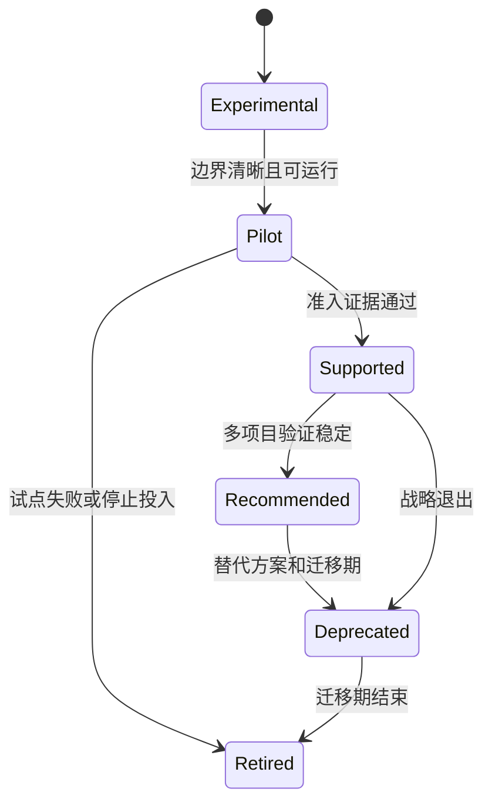
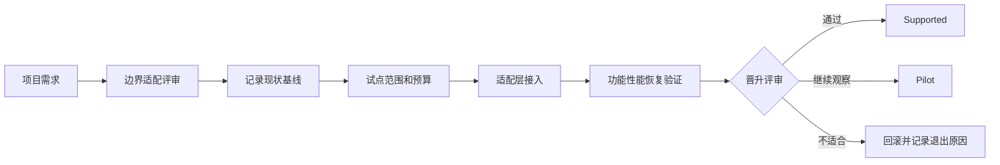
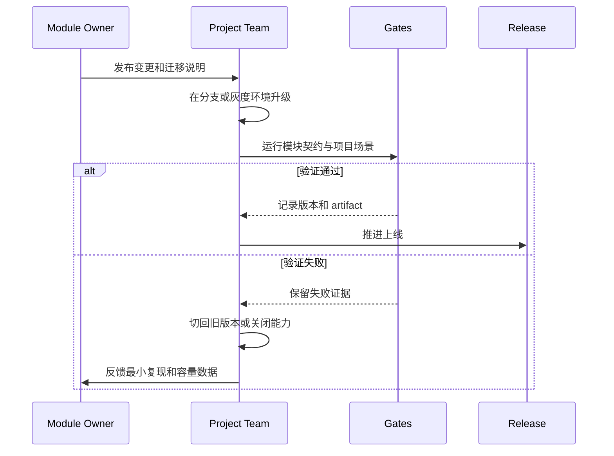
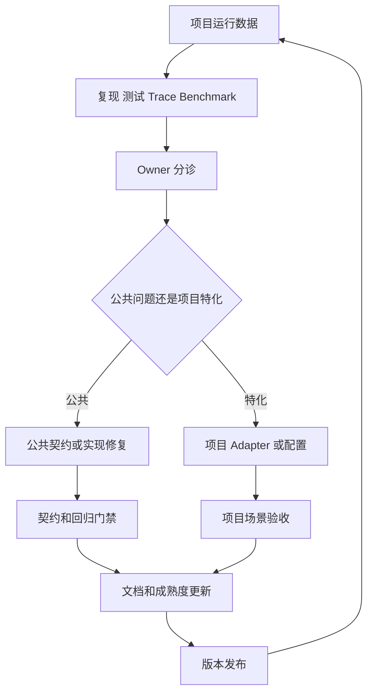

# 10.4 公司级采用与模块治理规范

> 本文定义 AbilityKit 从仓库能力、示例能力演进为公司级共享资产时的准入、试点、发布、升级、回滚、弃用和退出规则。它不把“代码存在”“Demo 可运行”或“接口已定义”等同于生产成熟度，而要求能力声明始终可追溯到源码、测试、场景和责任人。

---

## 1. 治理目标

公司级治理要解决四个问题：

1. 哪些模块可以被项目采用，成熟到什么程度。
2. 谁对公共契约、发布、缺陷和升级负责。
3. 项目如何低风险试点、回滚和退出。
4. 如何把项目反馈沉淀为公共能力，而不是形成私有分叉。

治理对象包括 Unity package、纯 .NET project、Server/Orleans 组件、配置协议、生成器、测试夹具、Demo 和文档。不同对象可以有不同成熟度；不能用一个整体版本号掩盖单个模块的未完成边界。

---

## 2. 资产分类

| 类型 | 定位 | 可否作为公共契约 | 典型例子 |
|------|------|------------------|----------|
| Foundation | 跨项目基础协议与运行时 | 通过准入后可以 | Core、World、Host、Pipeline |
| Domain Module | 可组合玩法领域模块 | 通过领域验证后可以 | Targeting、Projectile、Damage |
| Integration Adapter | 对接引擎、ECS、网络或宿主 | 只承诺已验证适配面 | Entitas、Svelto、Remote Adapter |
| Reference Implementation | 展示推荐组合方式 | 不自动成为通用契约 | MOBA SkillPipelineRunner |
| Validation Asset | 验证流程、协议和恢复能力 | 作为证据，不作为 runtime API | DemoHarness、Smoke、Replay fixture |
| Experimental | 探索中或边界未闭合 | 不允许生产依赖 | 带关键 TODO 的 Hybrid prediction |
| Historical Document | 阶段设计和决策背景 | 不作为当前 API 依据 | 根目录旧设计草稿 |

资产必须在文档和发布说明中标明类型。项目不能把 reference implementation 的业务字段当成 foundation API，也不能因为 validation asset 通过就推断所有相邻模块均已生产化。

---

## 3. 成熟度等级



| 等级 | 可用范围 | 必备证据 | 能力声明 |
|------|----------|----------|----------|
| Experimental | 框架研发或受控实验 | 源码入口、已知 TODO、限制说明 | 仅描述已实现子能力 |
| Pilot | 指定项目、指定场景 | 负责人、试点计划、功能测试、回滚方案 | 可试用，不承诺普遍适用 |
| Supported | 已批准生产接入 | 公共契约测试、版本策略、文档、诊断、维护 SLA | 承诺文档列出的边界 |
| Recommended | 默认推荐选型 | 至少两个真实项目或等价多场景验证、稳定升级记录 | 可进入公司模板和培训主路径 |
| Deprecated | 只维护迁移期 | 替代方案、迁移文档、截止版本 | 禁止新增依赖 |
| Retired | 不再维护 | 最终版本和归档记录 | 不进入构建与新项目清单 |

成熟度按模块和关键能力分别记录。例如 `HybridSyncAdapter` 可以在 transport binding 上达到 Pilot，但“通用预测、对账、校正和 replay”仍是 Experimental。类型存在不构成完整能力证据。

---

## 4. 模块准入标准

模块从 Pilot 晋升 Supported 前，必须满足以下门槛：

| 维度 | 准入要求 | 证据位置 |
|------|----------|----------|
| 边界 | 负责与不负责、依赖方向、扩展点明确 | `Docs/design` canonical 文档 |
| API | 公开类型有稳定命名和所有权语义 | package Runtime 与 API diff |
| 生命周期 | 创建、Tick、终止、Dispose/Release 和异常路径闭合 | 单元测试、trace 或 smoke |
| 正确性 | 公共契约测试覆盖成功、失败和边界用例 | 独立测试工程或 Unity EditMode |
| 确定性 | 涉及同步/回放时有稳定 ID、时钟、顺序和 hash 策略 | replay、跨端或双跑验证 |
| 性能 | 热路径分类、场景预算、分配与耗时基线存在 | benchmark artifact |
| 可观测性 | 错误、状态、trace 或统计可定位 | 日志字段、trace schema、诊断接口 |
| 兼容性 | 支持的 Unity/.NET/Server 版本和依赖矩阵明确 | package manifest、CI matrix |
| 变更 | semantic version、升级说明、弃用期明确 | changelog、release note |
| 所有权 | owner、reviewer、响应范围和替补明确 | CODEOWNERS 或模块清单 |
| 回滚 | 可恢复旧版本、关闭能力或切换 adapter | 试点 runbook |
| 文档 | 索引、源码、流程、风险、验证入口齐全 | `Docs/design/00-index.md` |

缺少任一关键证据时，可以继续 Pilot，但不能用 Supported 或 Recommended 对外宣传。

---

## 5. 试点流程



每个试点必须形成一页式记录：

- 项目、场景、规模和平台。
- 采用模块及其版本、成熟度和 owner。
- 现有方案基线与目标指标。
- 允许修改的 adapter 层，禁止修改的公共契约。
- 功能、性能、稳定性和恢复验收项。
- 开关、回滚版本、数据迁移和退出负责人。
- 反馈进入公共仓库的 issue、设计文档或 PR 路径。

建议直接使用以下模板，未确定项写 `TBD` 并指定关闭日期，不能留空后默认通过：

```md
# 模块试点记录

- 项目/场景：
- 平台/规模/拓扑：
- 模块/版本/资产类型：
- 当前成熟度/目标成熟度：
- Module Owner/项目负责人/回滚负责人：
- Canonical 文档与已知限制：
- 现状基线/目标指标：
- 允许扩展的 Adapter 边界：
- 禁止修改的公共契约：
- 功能/性能/稳定性/恢复验收：
- Feature Flag/回滚版本/数据恢复方式：
- 必跑 Gate 与 Artifact 地址：
- 退出条件与最晚评审日期：
- 公共反馈 Issue/PR：
- 评审结论：继续 Pilot / 晋升 / 回滚退出
```

评审结论必须引用实际 gate 和 artifact；仅填写“测试通过”不构成可追溯证据。涉及多个模块时，每个模块分别记录版本和成熟度，避免用项目整体结论替代模块判断。

试点优先选择边界清晰、可旁路、可比较的模块，例如 Targeting 查询服务或 Pipeline 执行骨架。不要把多个 Experimental 模块一次性绑定到核心上线链路，否则失败后无法归因。

---

## 6. 所有权与决策责任

| 角色 | 责任 |
|------|------|
| Module Owner | 契约、版本、缺陷优先级、发布和弃用决策 |
| Maintainer | 日常 review、测试、文档、兼容矩阵和 issue 分诊 |
| Adopting Team | 业务适配、场景验收、容量数据和升级执行 |
| Architecture Reviewer | 跨模块依赖、破坏性变更和成熟度晋升评审 |
| Release Owner | 版本产物、changelog、门禁结果和回滚制品 |

每个 Supported 模块至少需要一个 owner 和一个可替补 maintainer。只有作者、没有替补的模块最多维持 Pilot。项目侧不得直接在公共 Runtime 中加入仅本项目需要的条件分支；应优先通过接口、配置、adapter 或项目 package 扩展。

---

## 7. 版本与兼容策略

AbilityKit 模块按 semantic version 管理：

- Major：删除或改变公开契约、序列化格式、稳定 ID、生命周期或默认行为。
- Minor：向后兼容的新能力、新 adapter 或可选字段。
- Patch：不改变声明契约的缺陷修复、性能修复和文档修正。

以下变化即使能编译，也视为潜在破坏性变更：

1. 修改阶段执行或事件顺序。
2. 修改稳定 ID、hash、排序 tie-break 或默认时间源。
3. 改变 Dispose、Release、Cancel、Interrupt 的时机。
4. 改变配置缺省值或未知字段处理。
5. 改变快照、回放、网络或 artifact schema。
6. 增加热路径分配或显著改变容量特征。
7. 将 reference behavior 提升为公共默认值。

发布说明必须同时列出源码/API 变化、行为变化、迁移步骤、验证命令和回滚版本。仅写“优化”“重构”不足以支持公司级升级。

---

## 8. 升级、回滚与退出



模块接入必须至少支持一种回滚方式：

- package/version 回退。
- feature flag 关闭新路径。
- adapter/profile 切回旧实现。
- 配置 schema 双读或转换回旧版本。
- 服务端协议在迁移窗口内兼容前一版本。

如果状态或数据格式不可逆，必须在上线前提供迁移备份和恢复演练。无法回滚的变更需要更高级别评审，且不能用普通 Minor/Patch 发布。

项目退出时应移除公共模块依赖、清理 adapter 和配置、归档使用版本及退出原因。退出不是失败记录的终点；原因应反馈到适用边界、准入标准或下一版本设计。

---

## 9. 弃用政策

弃用必须经过以下阶段：

1. 在代码、文档、索引和 release note 同时标记 Deprecated。
2. 提供替代 API、自动或手工迁移步骤。
3. 给出最后支持版本和移除日期/版本。
4. 在门禁中阻止新增依赖，已有依赖仅允许迁移性修改。
5. 收集采用项目清单并跟踪迁移完成度。
6. 到期后移除并归档最后可用制品。

紧急安全或数据损坏问题可以缩短迁移期，但必须明确风险和强制升级路径。不能通过静默改行为代替弃用流程。

---

## 10. 反馈闭环



反馈进入公共层至少应包含：

- 可复现输入、环境和版本。
- 期望与实际行为。
- 日志、trace、replay 或 benchmark artifact。
- 影响范围和临时绕过方式。
- 是否涉及契约、性能预算或兼容性。

没有证据的“项目感觉不好用”可以作为需求线索，但不能直接驱动公共 API 变更。相反，同一类 adapter 逻辑在两个以上项目重复出现时，应评估是否上移为可选公共扩展点。

---

## 11. 门禁与发布证据

`tools/test-gates.json` 当前定义 P0 开发阻断、P1 契约阻断和 P2 回归基线。模块采用时按影响选择门禁：

| 变更 | 最低门禁 |
|------|----------|
| 文档、注释、无行为配置说明 | Markdown/link/diff 检查 |
| 模块内部缺陷修复 | 模块单测 + 受影响项目 smoke |
| 公共生命周期、DI、同步、表现契约 | P1 runtime contracts + 项目场景 |
| 配置 schema 或内容协议 | P1 content contracts + 生成/加载验证 |
| 跨模块重构、版本发布 | P2 regression + release artifact |
| 性能关键路径 | 功能门禁 + 独立 benchmark 对比；进入预算后再设性能阻断 |

门禁通过只证明其覆盖范围，不代表未执行场景也通过。发布记录应保存 gate 名称、源码版本、环境、结果、artifact 地址和已知未覆盖项。

---

## 12. 当前能力声明规则

编写 PPT、README、架构文档或项目选型材料时，使用以下措辞：

| 证据状态 | 推荐表述 | 禁止表述 |
|----------|----------|----------|
| 类型存在但关键逻辑 TODO | “接口/骨架已存在，核心行为部分实现” | “已完整支持” |
| Demo 项目验证 | “已在该 Demo 场景验证” | “所有项目生产可用” |
| 单元测试通过 | “已覆盖列出的纯逻辑契约” | “端到端稳定” |
| Smoke 通过 | “该拓扑和场景闭环通过” | “网络同步无风险” |
| Benchmark 有采样 | “记录了指定环境的耗时/分配基线” | “已有公司级性能门禁” |
| 两个以上生产项目稳定使用 | “具备 Recommended 候选证据” | “无需适配即可接入” |

成熟度说明必须与 canonical `Docs/design` 文档同步。阶段性根文档可保留历史，但不能覆盖当前源码结论。

---

## 13. 采用检查清单

### 13.1 项目开始前

- [ ] 已确认模块资产类型与成熟度。
- [ ] 已阅读 canonical 设计文档和已知限制。
- [ ] 已确认 owner、支持版本和依赖矩阵。
- [ ] 已定义试点场景、基线、预算和退出条件。
- [ ] 已准备 adapter 边界与回滚方式。

### 13.2 上线前

- [ ] 公共契约测试和项目场景均通过。
- [ ] 性能结果在目标硬件和规模上可接受。
- [ ] 日志、trace、replay 或 smoke 可用于定位。
- [ ] 配置、协议和持久数据升级可恢复。
- [ ] 发布版本、artifact 和已知限制已归档。

### 13.3 持续维护

- [ ] 每次升级阅读行为变化和迁移说明。
- [ ] 项目私有补丁已回收为 adapter 或公共 PR。
- [ ] 线上问题包含最小复现和证据。
- [ ] 成熟度、文档与源码状态一致。
- [ ] 弃用模块没有新增依赖。

---

## 14. 关联文档

- [AbilityKit 能力地图](../01-OverviewAndGettingStarted/00-AbilityKitCapabilityMap.md)
- [项目结构](../01-OverviewAndGettingStarted/04-ProjectStructure.md)
- [正式测试流程、单元测试与冒烟测试](01-TestingWorkflow.md)
- [MOBA 与 Shooter 示例工业化流程](03-MobaShooterIndustrializationFlow.md)
- [跨模块性能与热路径治理](05-CrossModulePerformanceAndHotPathGovernance.md)
- [文档治理路线图](../11-DocumentationCompletionPlan.md)
- [会话协调](../07-NetworkSynchronization/05-SessionCoordination.md)

---

## 15. 治理结论

AbilityKit 的公司级价值不由模块数量决定，而由边界、证据、所有权和可逆性决定。公共资产必须能说明当前成熟度、谁维护、如何验证、怎样升级和如何退出。Demo、接口和 PPT 负责建立理解，只有源码契约、场景证据、性能基线、版本纪律和反馈闭环共同成立，模块才有资格从 Pilot 晋升 Supported 或 Recommended。
