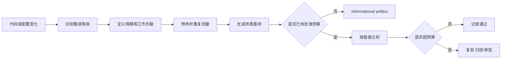
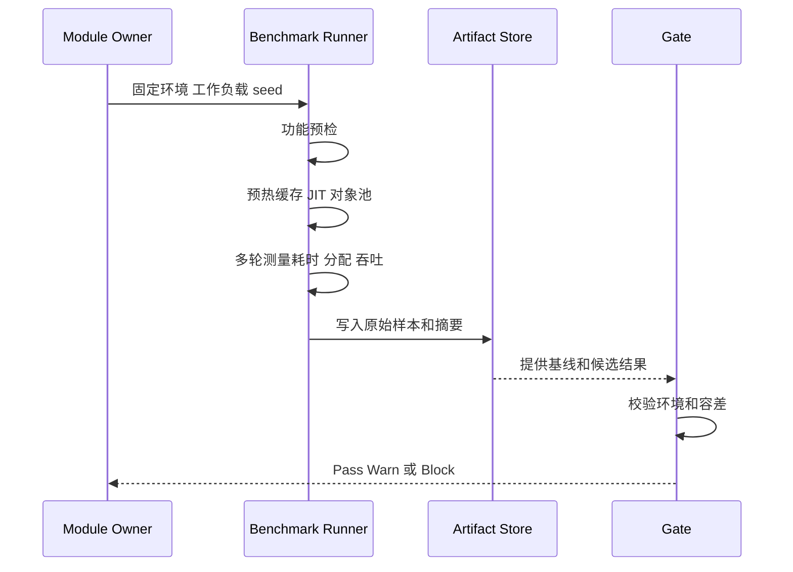
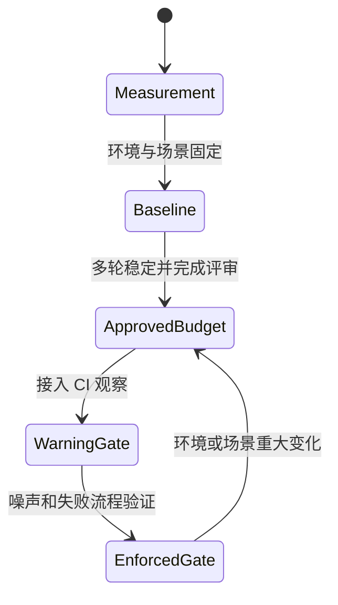

# 10.5 跨模块性能与热路径治理

> 本文定义 AbilityKit 跨模块热路径的识别、测量、基线、预算、回归判断和门禁晋升规则。当前仓库已经存在 Shooter 场景耗时与线程分配采样，也存在 P0/P1/P2 功能门禁，但尚未建立覆盖全框架的统一性能预算或通用性能阻断门禁。本文既记录现状，也规定后续把场景 benchmark 晋升为公司级治理能力所需的证据。

---

## 1. 治理目标与边界

性能治理要回答五个问题：

1. 哪些调用处于热路径，规模和频率是多少。
2. 在什么环境、输入和预热条件下测量。
3. 哪些结果只是观测值，哪些已经成为批准预算。
4. 回归如何处理噪声、平台差异和功能变化。
5. 何时允许性能结果阻断合并或发布。

本文不提供脱离场景的统一毫秒数，也不把对象池、ECS、批处理或零分配接口本身视为性能达标证据。性能结论必须绑定源码版本、运行环境、工作负载、统计窗口和 artifact。

---

## 2. 当前仓库证据

### 2.1 已有测量样板

`ShooterSveltoGameplayBenchmark` 当前会记录场景执行耗时，并通过 `GC.GetAllocatedBytesForCurrentThread()` 计算当前线程在测量区间内的分配差值。它能够回答指定 Shooter/Svelto 场景在指定运行环境中的耗时和线程分配情况。

该证据的边界是：

- 它是场景 benchmark，不是所有 AbilityKit 模块的统一基准。
- 线程分配值不等于进程总分配，也不覆盖其他线程、原生内存和 GPU 内存。
- 单次 elapsed time 不等于稳定吞吐、尾延迟或长稳结果。
- benchmark 可用于建立基线；只有预算、容差、运行频率和失败策略获批后，才能成为阻断门禁。

### 2.2 已有门禁边界

`tools/test-gates.json` 当前定义：

| 策略 | 当前定位 | 与性能的关系 |
|------|----------|--------------|
| P0 | 开发阻断 | 适合快速功能和基础契约，不代表统一性能预算 |
| P1 | 契约阻断 | 可承载稳定、低噪声的关键性能契约，但当前未配置通用性能 gate |
| P2 | 回归基线 | 适合场景、Smoke 和发布前回归，可先接入 informational benchmark |

因此当前准确表述是：“仓库已有场景性能采样和分层功能门禁，但没有框架级通用性能预算门禁。”

---

## 3. 热路径分类

| 等级 | 判定方式 | 典型路径 | 默认治理要求 |
|------|----------|----------|----------------|
| H0 每帧核心路径 | 每 world、每实体或每网络帧高频执行 | ECS Query、Targeting 候选遍历、Pipeline Tick、快照构造 | 必须记录规模、耗时、分配和复杂度 |
| H1 高频事件路径 | 一帧内可能大量触发 | EventDispatcher、Trigger、Damage、Projectile hit | 必须检查分配、稳定顺序和扇出 |
| H2 周期批处理 | 固定间隔或批次运行 | 状态同步、Record 编码、AOI、配置调和 | 记录批大小、吞吐、尾延迟和峰值分配 |
| H3 生命周期路径 | 创建、入场、释放或重连时运行 | World 创建、DI 装配、Pipeline Start/Cleanup | 关注峰值、泄漏、重复注册和恢复时间 |
| H4 工具与离线路径 | 编辑器、生成器、导出和离线分析 | Luban、Source Generator、文档/资源生成 | 关注总耗时、内存上限和可重复性，通常不进帧预算 |

热路径等级由模块 owner 在 canonical 文档中声明。调用频率、实体规模或网络拓扑变化时，应重新分类，不能沿用旧预算。



---

## 4. 指标模型

不同路径至少选择一个主指标和一个保护指标：

| 指标 | 适用问题 | 记录要求 |
|------|----------|----------|
| elapsed time | 一次批次或场景总成本 | 样本数、预热、均值/中位数、P95/P99 或最大值 |
| throughput | 每秒或每帧处理能力 | 操作数、实体数、事件数、字节数及持续时间 |
| allocation | 托管分配压力 | 每次、每帧或每操作字节数；注明线程或进程口径 |
| peak memory | 长稳和批处理峰值 | 托管、原生、容器容量和采样方式 |
| tail latency | 网络、服务端和大型批次抖动 | P95/P99、最大值、超时数 |
| frame budget share | Unity 逻辑帧占比 | 目标帧率、主线程/工作线程、场景规模 |
| payload size | 快照、回放和网络成本 | 原始/压缩字节、实体数、字段版本 |
| cache/pool behavior | 复用是否有效 | rent、miss、expand、return、trim、未归还数 |

“0 GC”必须写明测量范围。例如“Targeting 查询主体在预热后、固定容量下每次查询托管分配为 0”是可验证声明；“Targeting 零 GC”过于宽泛。

---

## 5. 测量环境与流程

### 5.1 环境清单

每份 benchmark artifact 至少记录：

- commit、branch、dirty 状态和模块版本。
- OS、CPU、内存、运行时、Unity/.NET 版本和构建配置。
- Editor、Development、Release、Headless 或 Server 模式。
- 是否启用 profiler、debug log、trace、Burst、Jobs 或安全检查。
- 场景 seed、实体数、玩家数、帧数、tick rate、payload 和网络条件。
- 预热次数、测量次数、超时和异常样本处理规则。

### 5.2 标准流程



执行顺序：

1. 先运行功能契约，避免给错误结果做性能优化。
2. 固定 seed、规模、输入序列和配置版本。
3. 预热 JIT、缓存、注册表和对象池；冷启动另设场景。
4. 采集多轮原始样本，不只保存最终平均值。
5. 将异常、超时和环境变化写入 artifact，不静默删除。
6. 与同环境、同工作负载的批准基线比较。
7. 超预算后复测并定位，禁止仅通过放宽预算消除失败。

---

## 6. 基线、预算与门禁是四种不同证据

| 层级 | 含义 | 是否阻断 |
|------|------|----------|
| Measurement | 代码能够采集指标 | 否 |
| Baseline | 指定环境和场景已有可重复结果 | 否，默认只报告变化 |
| Approved Budget | owner 与采用项目批准阈值、容差和适用范围 | 可告警 |
| Enforced Gate | CI 可稳定复现，失败策略和豁免流程已落地 | 是 |



不得从“存在 benchmark 类”直接跳到 Enforced Gate。预算必须说明适用平台和场景；不同 ECS、同步模式、实体规模或构建配置可以有独立预算。

---

## 7. Artifact 最小结构

建议性能产物至少包含以下字段；JSON 名称可由具体工具确定，但语义必须稳定：

| 字段 | 含义 |
|------|------|
| schemaVersion | artifact schema 版本 |
| benchmarkId | 稳定 benchmark 标识 |
| commit | 被测源码版本 |
| environment | OS、CPU、runtime、build mode |
| workload | seed、规模、帧数、tick rate、配置 hash |
| warmup | 预热次数与方式 |
| samples | 原始样本或可追溯样本地址 |
| summary | median、P95/P99、max、allocation、throughput |
| baseline | 对比基线版本和摘要 |
| budget | 阈值、容差、批准人和生效版本 |
| result | pass、warn、block、invalid |
| notes | 环境漂移、异常样本、已知限制 |

Artifact schema 变化属于行为契约变化。历史基线无法读取时，必须迁移或显式重新批准，不能无声丢弃。

### 7.1 最小 JSON 示例

下面的结构适合从本地 measurement 起步，并可在后续补齐 baseline 和 budget。数值仅用于展示字段形状，不代表 AbilityKit 已批准阈值：

```json
{
  "schemaVersion": 1,
  "benchmarkId": "targeting.streaming-top-k",
  "commit": "GIT_COMMIT",
  "environment": {
    "os": "Windows 11",
    "runtime": ".NET 8 Release",
    "cpu": "CPU_MODEL"
  },
  "workload": {
    "seed": 12345,
    "candidateCount": 10000,
    "ruleCount": 3,
    "topK": 8,
    "iterations": 1000,
    "hash": "WORKLOAD_HASH"
  },
  "warmup": {
    "iterations": 100
  },
  "samples": "artifacts/performance/targeting-streaming-top-k.samples.jsonl",
  "summary": {
    "medianMs": 0.0,
    "p95Ms": 0.0,
    "allocatedBytesPerOperation": 0,
    "operationsPerSecond": 0.0
  },
  "baseline": null,
  "budget": null,
  "result": "measurement",
  "notes": [
    "Replace placeholders and measured values before publishing."
  ]
}
```

当 artifact 进入比较阶段时，`baseline` 至少应记录基线 commit、artifact 地址和摘要；`budget` 至少应记录主指标阈值、保护指标阈值、容差、批准人和生效版本。runner 应把环境或 workload 不匹配写为 `invalid`，不能生成误导性的 pass。

---

## 8. 跨模块热路径要求

### 8.1 Pooling 与生命周期

- 对象池减少稳定态分配，但首次扩容、容量错误和漏归还仍会产生峰值或泄漏。
- benchmark 必须分别记录冷启动和预热后结果。
- 所有异常、Cancel、Interrupt、Dispose 和早退路径都要验证归还。
- 池化对象 Reset 后不得保留跨 world、跨 run 或跨 search 引用。

### 8.2 Stable ID、Registry 与事件分发

- 稳定 ID 的碰撞检查、注册和字符串转换通常应在启动期完成。
- 每帧路径避免重复字符串 hash、反射扫描和动态注册。
- 事件分发需要测量监听者扇出、snapshot 拷贝、once 移除和参数释放。
- 顺序优化不得改变 priority、stable order 或回放语义。

### 8.3 Query、Targeting 与遍历

- 记录候选数、通过规则数、规则数量、Top-K 和 mapper 成本。
- Full sort 与 Streaming Top-K 必须在相同稳定排序语义下比较。
- 复用 stateful selector 时应避免并发和重入；性能优化不能破坏隔离。
- 缺失依赖、空结果和 MaxCount 边界也应进入功能预检。

### 8.4 Pipeline、Trigger 与持续运行时

- 记录 run 数、phase 数、同帧同步完成数、跨帧活跃数和失败/取消清理成本。
- phase 实例隔离、trace 开关和 registry 查询会影响成本，应在 artifact 中标明。
- 优化 phase 合并或短路时不得改变阶段顺序、生命周期回调和 cleanup 语义。
- Trigger 扇出、持续实例数和 effect 数应作为工作负载维度。

### 8.5 Snapshot、Record 与网络批处理

- 同时记录实体数、字段数、原始/编码字节、压缩比和编码/解码耗时。
- 分配下降不能以不可接受的 payload 膨胀或尾延迟换取。
- 状态同步、回放和 hash 相关优化必须保持 schema、顺序和确定性。
- 长稳测试需要观察 buffer、dictionary、registry 和 retained snapshot 的容量增长。

---

## 9. 回归判定与噪声控制

性能比较使用同机、同配置、同工作负载基线。共享 CI 主机噪声较大时，先作为 Warning Gate，不能直接以单次结果阻断。

建议判定顺序：

1. 环境或 workload hash 不一致：结果为 invalid，不做回归结论。
2. 功能预检失败：直接按功能门禁失败，不生成有效性能结论。
3. 样本不足或波动超过稳定阈值：自动重跑，仍不稳定则告警。
4. 主指标超过预算且保护指标恶化：阻断候选。
5. 主指标轻微波动但在容差内：通过并保留趋势。
6. 功能范围扩大导致成本增加：提交新预算评审，不可直接覆盖旧基线。

预算容差应来自历史噪声分布，而不是统一使用任意百分比。对尾延迟和分配突增，可采用绝对阈值与相对阈值同时约束。

---

## 10. 门禁晋升规则

场景 benchmark 进入 P1/P2 阻断前必须满足：

- [ ] benchmark ID、workload 和 artifact schema 稳定。
- [ ] 同环境多次运行可重复，波动和无效结果规则明确。
- [ ] 至少保存一份批准基线和原始样本。
- [ ] 预算由 module owner 和至少一个采用项目确认。
- [ ] 功能预检、超时、崩溃和异常均能产生明确失败。
- [ ] CI 环境容量足够，运行时间符合对应 P1/P2 策略。
- [ ] 有失败复测、豁免、过期和预算调整流程。
- [ ] 结果 artifact 可下载，且能追溯 commit 和环境。
- [ ] 文档准确说明门禁覆盖范围与未覆盖项。

推荐晋升路径：

| 阶段 | 运行位置 | 行为 |
|------|----------|------|
| 本地测量 | 开发机或专用 runner | 输出原始结果，不比较 |
| 基线任务 | 专用环境或 nightly | 与历史趋势比较，不阻断 |
| Warning Gate | P2/nightly | 超预算告警，收集噪声和失败原因 |
| Enforced P2 | 发布/回归 | 稳定场景超预算阻断 |
| Enforced P1 | 快速关键契约 | 仅限低耗时、低噪声、破坏面大的性能契约 |

---

## 11. 变更评审与例外

涉及以下变化时，PR 必须附性能影响说明：

- H0/H1 路径新增分配、排序、反射、字符串处理或容器扩容。
- 改变对象池容量、trim、registry 或缓存生命周期。
- 改变快照、回放、网络 payload 或批大小。
- 改变 ECS 查询、Targeting 候选遍历或空间索引策略。
- 改变 Pipeline/Trigger 的阶段、扇出或同帧执行量。
- 引入新的后台线程、异步队列或跨线程复制。

临时豁免必须包含原因、影响场景、批准人、到期版本和修复任务。永久放宽预算属于预算变更，需要重新建立基线和评审，不能作为普通测试修复提交。

---

## 12. 当前落地顺序

1. 保留 Shooter benchmark 为明确标注环境的场景基线样板。
2. 为 Targeting、Pipeline、EventDispatcher、Snapshot/Record 各选择一个稳定 workload。
3. 统一 artifact 最小字段和结果状态。
4. 在 nightly 或 P2 中先接入 informational 比较。
5. 收集至少一个稳定周期的噪声、趋势和失败数据。
6. 由 owner 与采用项目批准预算。
7. 先晋升低噪声 P2 阻断，再评估少量 P1 性能契约。

在完成第 6 步前，对外只能表述“已有测量/基线”，不能表述“已有统一性能门禁”。

---

## 13. 关联文档与源码入口

- [公司级采用与模块治理规范](04-CompanyAdoptionAndModuleGovernance.md)
- [正式测试流程、单元测试与冒烟测试](01-TestingWorkflow.md)
- [MOBA 与 Shooter 示例工业化流程](03-MobaShooterIndustrializationFlow.md)
- [Targeting 系统](../08-GameplayModules/07-TargetingSystem.md)
- [Pipeline 与 Ability Runtime](../08-GameplayModules/08-PipelineAndAbilityRuntime.md)
- [查询与遍历源码深潜](../06-ECSArchitecture/03-QueryAndIteration.md)
- [Shooter Svelto 性能模式深潜](../09-ImplementationExamples/Shooter/09-SveltoPerformanceModeDeepDive.md)
- `Unity/Packages/com.abilitykit.demo.shooter.runtime/Runtime/Domain/Gameplay/Scenario/ShooterSveltoGameplayBenchmark.cs`
- `tools/test-gates.json`

---

## 14. 治理结论

性能治理不是给每个模块贴上“高性能”标签，而是把工作负载、测量口径、基线、预算和阻断策略逐层建立。AbilityKit 当前已有场景采样和功能门禁基础，但框架级性能治理仍需统一 artifact、稳定 workload、预算审批和 CI 观察期。任何性能声明都必须限定场景和证据；任何优化都不能以破坏生命周期、稳定顺序、确定性、恢复能力或可观测性为代价。

---

*文档版本：v1.0 | 最后更新：2026-07-14*
