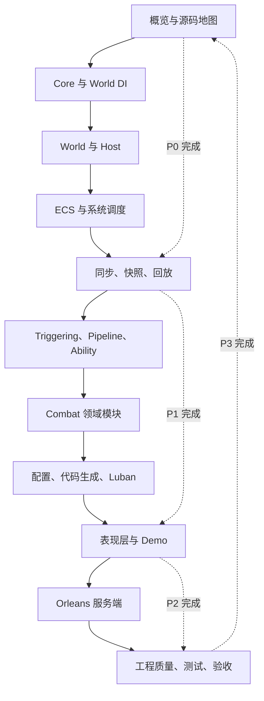
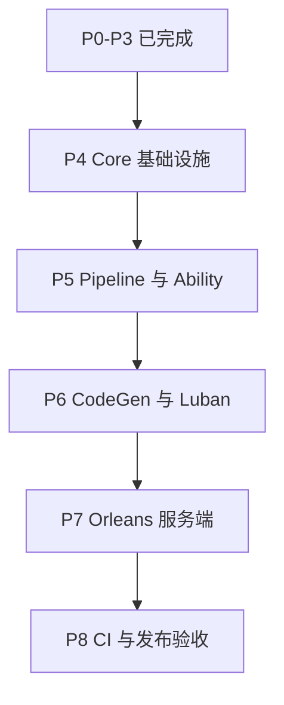
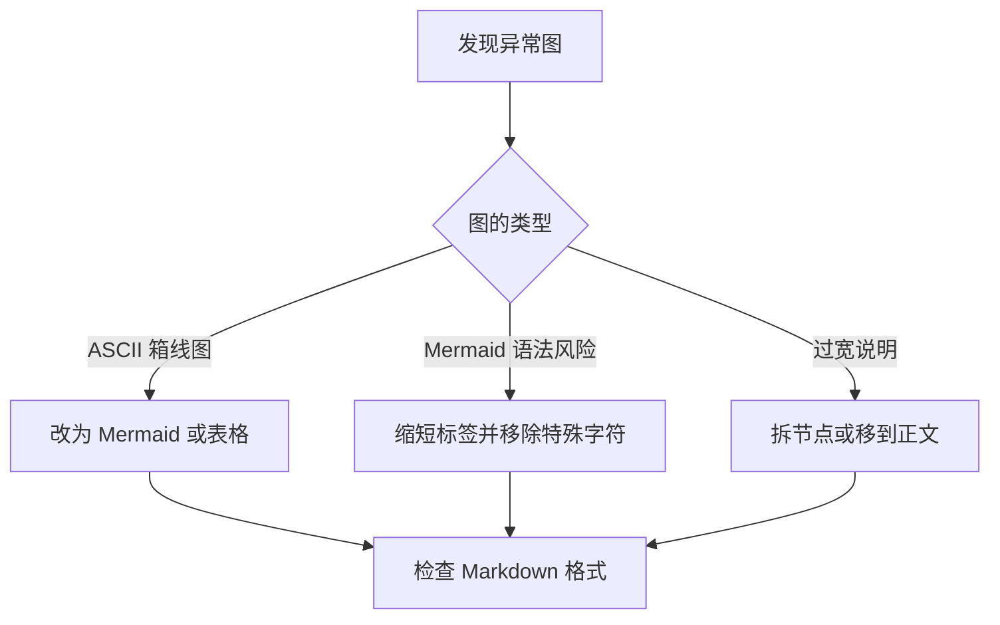
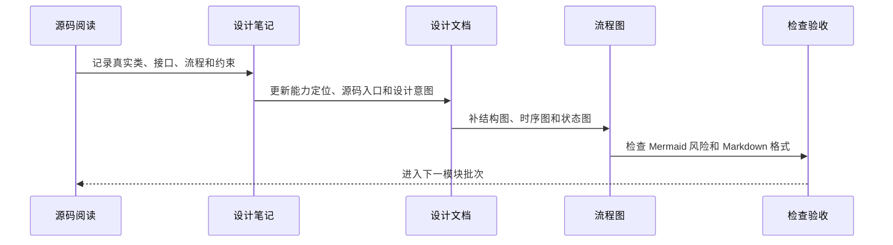
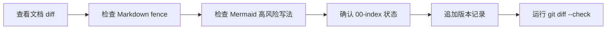

# 11.1 文档补全路线图：按模块阅读源码、补齐设计意图与修复流程图

> 本文是 `Docs/design` 的持续补全文档计划。目标是把 AbilityKit 的源码阅读拆成可执行批次：每批明确要读哪些源码、补哪些设计文档、必须画哪些流程图、需要解释哪些设计意图，以及如何修复 Mermaid 或旧 ASCII 流程图的显示问题。

---

## 1. 总目标

`Docs/design` 后续补全不只追求“有文档”，而是要求每篇文档都能回答新人最关心的五个问题：

| 问题 | 文档必须给出的答案 |
|------|--------------------|
| 这个模块解决什么问题 | 描述业务痛点、工程痛点和框架边界 |
| 为什么这样设计 | 说明核心抽象、生命周期、依赖方向和取舍 |
| 源码从哪里进入 | 列出 Unity package、.NET project、Demo、测试或 Server 入口 |
| 运行时怎么流动 | 至少提供结构图、时序图、状态图或数据流图之一 |
| 新人如何验证理解 | 给出阅读顺序、运行命令、测试入口或调试观察点 |

---

## 2. 文档完成标准

每个模块完成时，至少满足以下标准：

| 标准 | 要求 |
|------|------|
| 源码驱动 | 以真实类、接口、方法和目录为依据，不保留过期伪 API |
| 设计意图 | 解释模块要解决的问题、为什么拆这些对象、为什么保持这些约束 |
| 生命周期 | 说明创建、注册、运行、销毁、回收、取消或清理流程 |
| 流程图 | 至少 3 张图：能力结构图、关键运行流程图、生命周期或状态图 |
| 新手路线 | 标明先读哪个文件、再看哪个 Demo、最后跑哪个测试或命令 |
| 风险边界 | 写清线程、确定性、GC、跨端、回滚、热更新或服务端边界 |
| 索引接入 | 更新 `00-index.md` 的状态、说明和更新记录 |

---

## 3. 总体补全顺序与当前进度



这个顺序遵循依赖方向：先补底座，再补运行时，再补玩法，再补 Demo 与服务端。后面的文档可以引用前面的概念，避免每篇都重新解释基础设施。

当前已经按 P0 到 P3 完成了一轮“源码阅读 + 文档补强 + 索引更新”的闭环：

| 批次 | 状态 | 已落地文档 | 源码验证重点 |
|------|------|------------|--------------|
| P0 入门与结构 | 已完成 | `01-OverviewAndGettingStarted/00-AbilityKitCapabilityMap.md`、`03-QuickStart.md`、`04-ProjectStructure.md` | Unity package、`src` 工程、Server/Orleans、Console Demo、构建与测试入口 |
| P1 网络同步 | 已完成 | `07-NetworkSynchronization/00-SynchronizationCapabilityMap.md`、`04-ReplaySystem.md`、`05-SessionCoordination.md` | `FramePacket`、`RecordSession`、`RemoteFrameAggregator`、`SessionCoordinator`、Gateway/Room/Battle Grain |
| P2 示例总览 | 已完成 | `09-ImplementationExamples/02-ET Demo Analysis.md`、`03-MOBA Demo Analysis.md`、`04-Shooter Demo 与 Orleans Smoke.md` | ET Scene/Component/System、MOBA Blueprint/Bootstrap、Shooter Svelto runtime、Orleans smoke |
| P3 序章与质量 | 已完成 | `00-Prologue.md`、`10-EngineeringQuality/01-TestingWorkflow.md`、本文 | DemoHarness、SyncHealthEvent、Shooter acceptance matrix、Shooter smoke result、测试项目清单 |


---

## 4. 模块批次计划

### 4.1 Batch 0：流程图健康检查与文档规范

| 项目 | 内容 |
|------|------|
| 目标 | 先修复明显显示异常的流程图和旧 ASCII 图，建立后续统一写法 |
| 源码目录 | 不读源码，优先扫描 `Docs/design` |
| 目标文档 | `00-index.md`、本文、已有旧文档中的 Mermaid 和 ASCII 图 |
| 必画图 | 文档补全总路线图、流程图修复流程图、文档验收流程图 |
| 重点问题 | Mermaid 是否含未转义泛型、裸反斜杠换行、过宽节点、ASCII 箱线图 |
| 验收方式 | `git diff --check`，抽样阅读 Mermaid 语法，确认链接入口存在 |


### 4.2 Batch 1：概览、项目结构与阅读入口

| 项目 | 内容 |
|------|------|
| 目标 | 让新人先理解 AbilityKit 是什么、源码在哪里、怎么运行、先读什么 |
| 源码目录 | `Unity/Packages`、`src`、`Server/Orleans`、`LubanConfig` |
| 目标文档 | `01-OverviewAndGettingStarted`、`00-Prologue.md`、`00-index.md` |
| 必画图 | 仓库结构图、包依赖图、Demo 启动路径图、源码阅读路线图 |
| 设计意图 | 为什么源码集中在 Unity package，为什么保留 .NET project，为什么 Demo 和 Server 分层 |
| 验收方式 | 新人能根据文档跑通 build、Console Demo、至少一个测试入口 |

### 4.3 Batch 2：Core 与通用基础设施

| 项目 | 内容 |
|------|------|
| 目标 | 补齐事件、对象池、日志、标识、数值、配置基础能力 |
| 源码目录 | `Unity/Packages/com.abilitykit.core/Runtime` |
| 目标文档 | `05-CommonModules/01-EventSystem.md`、`02-ObjectPool.md`、`04-ConfigurationSystem.md`、后续 Core 数值专题 |
| 必画图 | 事件派发时序图、对象池生命周期图、配置 provider 仲裁图、标识映射图 |
| 设计意图 | 降低 GC、统一事件解耦、稳定字符串 ID、支持配置覆盖和调试统计 |
| 验收方式 | 文档中的 API 与源码签名一致，移除 `Rent/Return`、`ITimerHandle` 等过期伪接口 |

### 4.4 Batch 3：World DI 与逻辑世界

| 项目 | 内容 |
|------|------|
| 目标 | 解释世界级依赖注入、世界生命周期、服务作用域和系统协作 |
| 源码目录 | `Unity/Packages/com.abilitykit.world.di/Runtime`、`Unity/Packages/com.abilitykit.world.ecs/Runtime` |
| 目标文档 | `02-LogicalWorldDesign/01-WorldOverview.md` 到 `05-ServiceContainer.md` |
| 必画图 | World 创建流程、Container/Scope 解析链路、System Tick 顺序、服务生命周期状态图 |
| 设计意图 | 为什么按 World 隔离服务，为什么需要 Scoped，如何避免跨战斗污染 |
| 验收方式 | 能从文档追到 `WorldContainer`、`WorldScope`、`WorldClock` 和系统注册入口 |

### 4.5 Batch 4：Host 运行时与扩展模块

| 项目 | 内容 |
|------|------|
| 目标 | 解释 HostRuntime 如何管理多世界、连接、广播、Tick 和扩展模块 |
| 源码目录 | `Unity/Packages/com.abilitykit.host/Runtime`、`Unity/Packages/com.abilitykit.host.extension/Runtime` |
| 目标文档 | `03-LogicalWorldHostDesign/01-HostRuntime.md` 到 `03-WorldManager.md` |
| 必画图 | HostRuntime Tick 时序图、World 创建销毁图、连接广播图、Blueprint/Module 装配图 |
| 设计意图 | 为什么 Host 不直接承载具体玩法，为什么通过 Hook/Feature/Module 扩展 |
| 验收方式 | 文档能解释 Demo 和 Orleans 如何复用同一 Host 抽象 |

### 4.6 Batch 5：ECS 适配与查询模型

| 项目 | 内容 |
|------|------|
| 目标 | 解释 AbilityKit 自有 ECS、Entitas、Svelto 三种模型的定位和取舍 |
| 源码目录 | `Unity/Packages/com.abilitykit.world.ecs/Runtime`、`com.abilitykit.world.entitas`、`com.abilitykit.world.svelto` |
| 目标文档 | `06-ECSArchitecture` 全目录 |
| 必画图 | EntityWorld 存储结构图、QueryImpl 流程图、Entitas 生命周期图、Svelto 提交流程图 |
| 设计意图 | 为什么保留多 ECS 适配，何时用轻量世界，何时接 Entitas 或 Svelto |
| 验收方式 | 新人能根据文档选择查询模型，并理解 snapshot 遍历和版本校验 |

### 4.7 Batch 6：同步、快照、回滚与回放

| 项目 | 内容 |
|------|------|
| 目标 | 把多人同步链路拆成输入帧、快照、状态同步、预测回滚、录制回放 |
| 源码目录 | `com.abilitykit.world.framesync`、`com.abilitykit.world.snapshot`、`com.abilitykit.world.statesync`、`com.abilitykit.record`、`com.abilitykit.protocol` |
| 目标文档 | `07-NetworkSynchronization` 全目录 |
| 必画图 | 输入帧聚合图、快照封包图、预测回滚状态图、回放轨道图、重连恢复图 |
| 设计意图 | 为什么把输入、状态、表现分开，如何兼顾确定性、弱网、重连和验收 |
| 验收方式 | 能追踪一次客户端输入从采集到服务端推进再到表现层应用的完整链路 |

### 4.8 Batch 7：Triggering、Pipeline 与 Ability 核心玩法

| 项目 | 内容 |
|------|------|
| 目标 | 解释事件触发、条件判断、动作计划、技能阶段和运行上下文 |
| 源码目录 | `com.abilitykit.triggering`、`com.abilitykit.pipeline`、`com.abilitykit.ability`、`src/AbilityKit.Triggering` |
| 目标文档 | `08-GameplayModules/00-GameplayCapabilityMap.md` 到 `03-BuffSystem.md`，新增 Pipeline/Ability 专题 |
| 必画图 | TriggerPlan 执行图、条件表达式图、Pipeline 阶段图、Buff 生命周期图 |
| 设计意图 | 为什么用数据化 Plan，为什么用阶段管线，如何支持热更新、回放和测试 |
| 验收方式 | 文档能解释一个技能输入如何变成触发计划、效果执行和表现提示 |

### 4.9 Batch 8：Combat 领域模块

| 项目 | 内容 |
|------|------|
| 目标 | 补齐目标搜索、投射物、伤害、实体索引、技能库、移动等战斗领域模块 |
| 源码目录 | `com.abilitykit.combat.*`、`com.abilitykit.world.motion` |
| 目标文档 | `08-GameplayModules/04-ProjectileSystem.md` 到 `06-DamageCalculation.md`，新增 Targeting/EntityManager/SkillLibrary/Motion 专题 |
| 必画图 | Targeting 管线图、Projectile 命中图、Damage Pipeline 图、实体索引更新图、移动来源合成图 |
| 设计意图 | 为什么把领域能力拆小包，如何组合成 MOBA/Shooter 不同战斗模型 |
| 验收方式 | 能通过文档追踪一次命中：搜索目标、生成投射物、命中判定、伤害结算、快照输出 |

### 4.10 Batch 9：配置、代码生成与数据链路

| 项目 | 内容 |
|------|------|
| 目标 | 解释 Luban、JSON、ActionSchema、SourceGenerator 和运行时配置门面 |
| 源码目录 | `Unity/Packages/com.abilitykit.codegen`、`LubanConfig`、Demo Configs、`src/AbilityKit.Demo.Moba.Console/Bootstrap` |
| 目标文档 | `05-CommonModules/04-ConfigurationSystem.md`，新增 CodeGen/Luban 专题 |
| 必画图 | 配置生成链路图、加载链路图、Schema 到 Action 图、校验失败定位图 |
| 设计意图 | 为什么配置和代码生成拆开，如何让策划数据变成可验证运行时能力 |
| 验收方式 | 能从一份配置文件追到运行时服务、触发计划和 Demo 行为 |

### 4.11 Batch 10：表现层、Demo 与工程示例

| 项目 | 内容 |
|------|------|
| 目标 | 解释逻辑表现分离、ViewEvent、Snapshot Dispatch、Console/MOBA/Shooter/ET Demo |
| 源码目录 | `com.abilitykit.demo.*`、`src/AbilityKit.Demo.*`、`Docs/design/09-ImplementationExamples` |
| 目标文档 | `04-PresentationLayerDesign`、`09-ImplementationExamples` |
| 必画图 | ViewEvent 转译图、Snapshot 分发图、Demo 启动图、跨平台适配图 |
| 设计意图 | 为什么表现层只消费事件和快照，如何支持 Unity、Console、ET、Server smoke 共用逻辑 |
| 验收方式 | 文档能解释同一个逻辑结果如何在不同端表现，并指出各端适配代码入口 |

### 4.12 Batch 11：Orleans 服务端与 Smoke 验收

| 项目 | 内容 |
|------|------|
| 目标 | 解释 Gateway、RoomGrain、BattleHost、FrameSyncGrain、Shooter Smoke 验收 |
| 源码目录 | `Server/Orleans/src`、`Server/Orleans/tools` |
| 目标文档 | Shooter/Orleans 示例文档，后续新增服务端架构专题 |
| 必画图 | 网关请求图、房间生命周期图、战斗宿主推进图、Smoke 验收图 |
| 设计意图 | 为什么服务端只通过协议和 Host 组合接入，如何保证可测和可恢复 |
| 验收方式 | 能根据文档跑 smoke 或理解 smoke 输出中的帧、hash、reconnect、late join 结果 |

### 4.13 Batch 12：工程质量、测试与发布验收

| 项目 | 内容 |
|------|------|
| 目标 | 统一单元测试、契约测试、DemoHarness、Unity 自动化、Smoke 和文档检查 |
| 源码目录 | `src/*Tests`、`Server/Orleans/src/*Tests`、`tools`、`.github` |
| 目标文档 | `10-EngineeringQuality/01-TestingWorkflow.md`，新增文档检查和发布验收专题 |
| 必画图 | 测试金字塔图、CI 验收图、Demo smoke 图、文档检查图 |
| 设计意图 | 为什么把纯逻辑测试、Demo 验收、服务端 smoke 分层，如何降低回归成本 |
| 验收方式 | 文档列出每类变更至少应该跑的命令和失败排查入口 |

Batch 12 当前已经完成第一轮测试流程补强，后续还可以继续拆出两个专题：

| 后续专题 | 建议内容 | 需要继续读的源码 |
|----------|----------|------------------|
| 文档检查与发布验收 | Markdown fence、Mermaid 风险、索引状态、链接扫描、版本记录规范 | `Docs/design`、`.github`、现有验证脚本 |
| CI 分层 Job 设计 | fast/unit、matrix、smoke、nightly、artifact retention 的 job 拆分 | `.github/workflows`、`tools`、`Server/Orleans/tools` |

---

## 5. 下一轮优先补强方向

P0-P3 完成后，文档已经覆盖入门、结构、同步、示例总览和测试流程。下一轮建议继续补“仍然只有骨架或缺少源码深潜”的专题：

| 优先级 | 方向 | 建议目标文档 | 为什么优先 |
|--------|------|--------------|------------|
| P4 | Core 基础设施深潜 | StableStringId、EventDispatcher、PoolRegistry、配置 provider 专题 | 这些能力被几乎所有模块依赖，且最容易出现过期伪 API |
| P5 | Pipeline 与 Ability 深潜 | Ability runtime、Pipeline stage、ActionSchema、PlanAction 生成 | 玩法表达的主链路还需要从技能输入到效果执行完整串起 |
| P6 | CodeGen/Luban 数据链路 | 配置生成、运行时加载、schema 校验、Demo 配置门禁 | 解释策划数据如何变成可测试的 runtime 能力 |
| P7 | Orleans 服务端专题 | Gateway、RoomGrain、BattleLogicHostGrain、FrameSyncGrain、StateSync observer | P2/P3 已补 smoke，但还需要独立服务端架构文档 |
| P8 | CI 与发布验收 | 测试命令矩阵、artifact schema、文档检查、长稳测试 | 把当前手动检查固化成可重复执行的质量门禁 |



---

## 6. 每篇设计文档模板

后续新增或重写设计文档时，建议保持以下结构：

```md
# 模块编号 标题：能力、边界与源码入口

> 一句话说明本文解决什么理解问题。

## 1. 能力定位
## 2. 解决的问题
## 3. 源码入口
## 4. 总体结构图
## 5. 关键运行流程
## 6. 生命周期或状态机
## 7. 设计意图与取舍
## 8. 新手阅读路线
## 9. 常见误区
## 10. 和其他模块的关系
```

---

## 7. 流程图修复规范

当前 `Docs/design` 中有两类高风险图：旧 ASCII 箱线图，以及 Mermaid 节点标签中包含裸泛型、反斜杠换行或过长文字的图。后续统一按下面规则处理。

| 风险 | 处理方式 |
|------|----------|
| ASCII 箱线图过宽或错位 | 优先改成 Mermaid `flowchart`、`sequenceDiagram`、`stateDiagram-v2` 或表格 |
| 节点标签包含泛型尖括号 | 用文字替代泛型，或写成 `EventKey of Args`，避免裸 `<T>` |
| 节点标签包含反斜杠换行 | 改成短标签，详细解释放到图下正文 |
| 单个节点文字太长 | 拆成多个节点，或把说明移到表格 |
| Mermaid 方向不清 | 结构图用 `TB`，数据流和调用链用 `LR`，状态流转用 `stateDiagram-v2` |
| 时序涉及多个参与者 | 使用 `sequenceDiagram`，参与者命名保持短句 |



---

## 8. 设计意图检查清单

每次补文档前，先对源码提出这些问题：

| 维度 | 需要回答的问题 |
|------|----------------|
| 边界 | 这个模块负责什么，不负责什么 |
| 抽象 | 核心接口为什么是这个粒度，是否隐藏了可替换实现 |
| 生命周期 | 谁创建，谁持有，谁 Tick，谁 Dispose 或 Release |
| 数据流 | 数据从哪里进入，经过哪些对象，最终产生什么输出 |
| 扩展点 | 业务项目可以在哪里接入，哪些点不建议扩展 |
| 确定性 | 是否影响帧同步、回放、预测、回滚或 hash |
| 性能 | 是否涉及对象池、索引、snapshot、批处理或 GC 约束 |
| 跨端 | 是否同时服务 Unity、Console、ET、Server 或纯 .NET 测试 |
| 调试 | 出问题时看哪个日志、测试、快照、trace 或 smoke 输出 |

---

## 9. 后续执行节奏

每一轮补全文档按固定节奏推进：



建议每轮只聚焦 1 到 2 个模块，避免一次性改太多文档导致源码依据变弱。每轮结束时更新 `00-index.md` 的状态和更新记录。

每轮结束的验收顺序固定为：



这条验收线本身也要保持源码驱动：如果某个文档新增了测试命令、smoke 字段或类名，必须能在真实工程、测试或脚本中找到对应入口。
