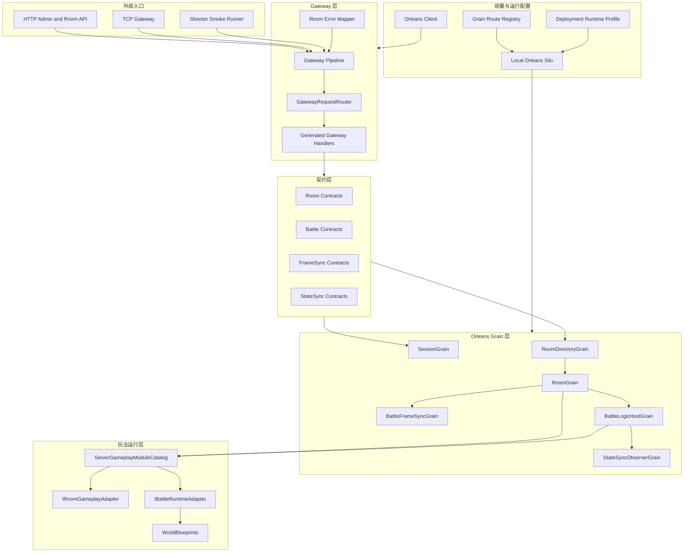

# 12.0 服务端能力地图：把 Orleans 从演示支撑提升为正式运行面

## 1. 能力定位

`Server/Orleans` 不是 Shooter 示例附带的临时启动器，而是 AbilityKit 的服务器运行面。它把客户端/本地逻辑世界中已经存在的 Host、World、FrameSync、StateSync、Room、Battle、Gameplay Adapter 等概念搬到 Orleans 集群模型下，让演示、验收和未来真实服务部署使用同一套边界。

服务端专题需要回答四个问题：

| 问题 | 服务端设计回答 |
|------|----------------|
| 客户端请求从哪里进入 | Gateway 提供 HTTP/TCP 入口，按 opCode/endpoint 映射到 Orleans Grain |
| 房间和战斗谁负责 | RoomGrain 负责大厅、成员、准备、启动路线；BattleLogicHostGrain 负责权威战斗世界、输入缓冲、Tick 和状态推送 |
| 多玩法怎么接入 | ServerGameplayModuleCatalog 统一注册 RoomAdapter、BattleRuntimeAdapter、WorldBlueprint 和同步模板 |
| 演示与正式部署如何统一 | Host/Gateway/ShooterSmoke 共用 Hosting 配置、部署角色、运行 profile、存储和日志约定 |

该专题不替代网络同步专题。网络同步文档解释 FrameSync、StateSync、Rollback、Replay 的技术能力；服务端专题解释这些能力如何被放进可运行、可部署、可观察、可扩展的服务器架构中。

## 2. 源码入口

| 层级 | 源码入口 | 说明 |
|------|----------|------|
| 服务端契约 | `Server/Orleans/src/AbilityKit.Orleans.Contracts` | Grain 接口、DTO、状态码、房间/战斗/同步模型 |
| Gateway | `Server/Orleans/src/AbilityKit.Orleans.Gateway` | HTTP API、TCP Gateway、opCode Handler、请求路由、错误映射 |
| Grain 运行时 | `Server/Orleans/src/AbilityKit.Orleans.Grains` | Session、Room、Battle、FrameSync、StateSync、Automation Grain |
| Hosting 抽象 | `Server/Orleans/src/AbilityKit.Orleans.Hosting` | Orleans client/silo 装配、部署角色、运行 profile、日志和配置 |
| Standalone Host | `Server/Orleans/src/AbilityKit.Orleans.Host` | 本地 silo 进程入口 |
| Smoke 验收 | `Server/Orleans/src/AbilityKit.Orleans.ShooterSmoke` | 自托管 Shooter Gateway + Orleans 端到端冒烟 |
| 服务器分析器 | `Server/Orleans/src/AbilityKit.Server.Analyzers` | Gateway Handler、Endpoint、Gameplay Manifest 的生成与约束 |

## 3. 总体分层

## 4. 设计原则

### 4.1 服务端是运行面，不是示例外壳

Shooter Smoke 只是验收形态之一。服务端代码已经包含独立的 Contract、Gateway、Grain、Hosting、Analyzer 和 Smoke 工程，因此设计上应该把 `Server/Orleans` 看作 AbilityKit 的运行面：

1. Gateway 负责接入协议，不直接承载战斗逻辑。
2. Grain 负责状态归属、生命周期和集群内寻址。
3. Gameplay Adapter 负责把玩法差异收敛成房间与战斗运行接口。
4. Host/Hosting 负责让本地演示、Smoke 和未来多进程部署共用配置模型。

### 4.2 房间与战斗分离

RoomGrain 管理大厅语义：成员、准备、选择英雄、玩法命令、开始战斗、重连和 late join。BattleLogicHostGrain 管理权威战斗语义：战斗初始化、输入帧调度、Tick、运行时快照、状态推送和销毁。

这种拆分让房间可以在 Battle 启动前承载不同玩法的准备阶段，也让 Battle 可以只关注确定性模拟与同步输出。

### 4.3 同步模板决定运行路线

服务端不把 MOBA、Shooter 强行塞进一个同步模型。`ServerGameplayModuleCatalog` 为每个 RoomType 注册同步模板：

| 玩法 | 默认模板 | 默认路线 | 额外模板 |
|------|----------|----------|----------|
| MOBA | `frame-sync-authority` | FrameRelayOnly，不启动完整 Battle Runtime | `state-sync-authority` |
| Shooter | `predict-rollback-authority` | BattleWorld，启动状态同步运行时 | `runtime-snapshot-interpolation`、`state-sync-authority`、`pure-state-authority` |

Room 启动战斗时通过 RoomFrameSyncRoute 判断是否需要 BattleFrameSyncGrain、是否需要 BattleLogicHostGrain。这样 FrameSync 演示、纯状态同步、权威世界推送可以共存。

### 4.4 源码生成用于减少运行时反射边界

Gateway Handler 和服务端 Gameplay Manifest 有 Analyzer/Generator 支撑。它们不是为了炫技，而是为了把这些隐式约束前移：

| 生成/分析能力 | 作用 |
|---------------|------|
| Gateway Handler Registration | 通过 GatewayHandlerAttribute 生成 handler 注册，减少手写漏配 |
| Gateway Endpoint Manifest | 汇总 HTTP/Gateway 端点，便于后台和验收工具理解服务能力 |
| Server Gameplay Manifest | 汇总 RoomType、同步模板、Adapter、WorldBlueprint，避免玩法注册散落 |
| Server Project Boundary Analyzer | 防止服务器工程跨越不该依赖的客户端/表现层边界 |
| Server Magic String Analyzer | 将关键字符串约束从运行期错误前移到构建期 |

## 5. 能力边界

| 能力 | 服务端负责 | 服务端不负责 |
|------|------------|--------------|
| 账号/会话 | SessionGrain、Guest/Login、Token 续期 | 完整商业账号体系、支付、实名、安全审计 |
| 房间 | 创建、列表、加入、准备、离线、重连、关闭 | 大厅推荐算法、跨区匹配策略 |
| 战斗 | 权威世界启动、输入缓冲、Tick、快照、诊断 | 客户端表现、镜头、动画、UI |
| 同步 | FrameSync relay、StateSync push、full snapshot request | 网络运营商级 QoS、全球加速 |
| 部署 | 本地 silo/client、角色/profile 配置、route registry | 生产 Kubernetes、数据库 HA、灰度发布全流程 |
| 验收 | Shooter Smoke、Replay validation、Gateway/Grain tests | 压测平台、生产可观测闭环 |

## 6. 推荐阅读顺序

1. 先读本篇，建立 Server Runtime 的总体能力地图。
2. 阅读 `01-OrleansRuntimeAndDeployment.md`，理解 Host、Gateway、Hosting、部署角色和存储配置。
3. 阅读 `02-GatewayRoomBattleFlow.md`，理解请求如何从 Gateway 进入 RoomGrain，再启动 FrameSync 或 BattleLogicHost。
4. 回到网络同步专题，按需要深入 FrameSync、StateSync、Rollback、Replay。
5. 回到 Shooter/MOBA 示例专题，看具体玩法如何通过 ServerGameplayModuleCatalog 接入。

## 7. 和其他文档的关系

| 文档 | 关系 |
|------|------|
| `07-NetworkSynchronization/00-SynchronizationCapabilityMap.md` | 同步技术能力总览，服务端专题解释这些能力如何部署到 Orleans |
| `07-NetworkSynchronization/05-SessionCoordination.md` | 端侧会话协调视角，服务端专题补齐 Gateway/Room/Battle 归属 |
| `09-ImplementationExamples/Shooter/05-ServerFlowAndSmokeDeepDive.md` | Shooter 示例深潜，服务端专题抽出通用服务器设计理念 |
| `10-EngineeringQuality/01-TestingWorkflow.md` | 测试门禁，服务端专题提供被测试对象和验收链路 |
