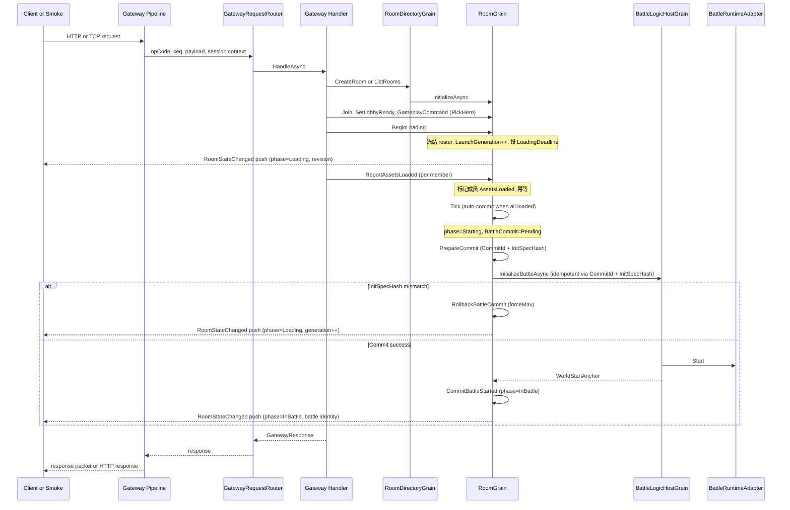
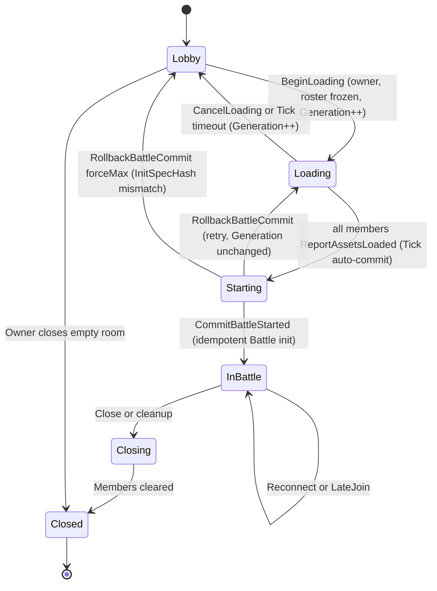
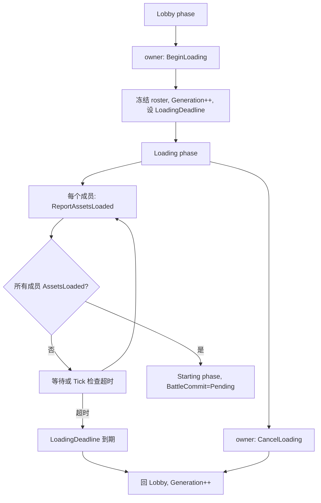
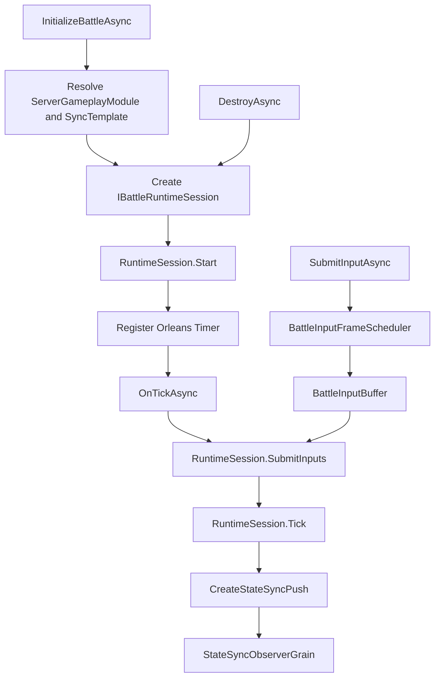

# 12.2 Gateway、Room 与 Battle 主链路设计

## 1. 能力定位

本篇解释一次服务器玩法流程如何从 Gateway 进入 Orleans，再落到 RoomGrain 和 BattleLogicHostGrain。重点不是协议字段罗列，而是状态归属和职责分界：

1. Gateway 负责接入、路由、会话上下文和错误映射。
2. RoomDirectoryGrain 负责房间目录和房间摘要。
3. RoomGrain 负责成员、准备、玩法房间状态、战斗启动、late join 和关闭。
4. BattleFrameSyncGrain 负责帧同步 relay 型战斗的时钟与 observer。
5. BattleLogicHostGrain 负责权威 BattleWorld、输入缓冲、Tick、状态同步推送和诊断。
6. ServerGameplayModuleCatalog 决定不同 RoomType 走哪种同步模板和运行时。

## 2. 源码入口

| 主题 | 源码入口 | 说明 |
|------|----------|------|
| Gateway 路由 | `Server/Orleans/src/AbilityKit.Orleans.Gateway/Gateway/Core/GatewayRequestRouter.cs` | opCode 到 handler，超时和异常映射 |
| Handler 注册 | `Server/Orleans/src/AbilityKit.Server.Analyzers/Generators/Gateway/GatewayHandlerRegistrationGenerator.cs` | GatewayHandlerAttribute 生成注册代码 |
| 房间目录 | `Server/Orleans/src/AbilityKit.Orleans.Grains/Rooms/RoomDirectoryGrain.cs` | Create/List/Notify/Remove Room |
| 房间 Grain | `Server/Orleans/src/AbilityKit.Orleans.Grains/Rooms/RoomGrain.cs` | Join/Ready/Command/BeginLoading/ReportAssetsLoaded/CancelLoading/Tick/LateJoin/Close |
| 房间状态机 | `Server/Orleans/src/AbilityKit.Orleans.Grains/Rooms/RoomStateMachine.cs` | BeginLoading/ReportAssetsLoaded/CancelLoading/PrepareCommit/CommitBattleStarted/RollbackBattleCommit 纯函数转换 |
| 房间生命周期 | `Server/Orleans/src/AbilityKit.Orleans.Grains/Rooms/RoomLifecyclePolicy.cs` | Lobby/Loading/Starting/InBattle/Closing/Closed/Expired |
| 房间持久状态 | `Server/Orleans/src/AbilityKit.Orleans.Contracts/Rooms/RoomModels.cs` | RoomPersistentState、RoomLaunchPersistentState、RoomBattleCommitPersistentState、RoomPhase |
| 加载请求模型 | `Server/Orleans/src/AbilityKit.Orleans.Contracts/Rooms/RoomLoadingModels.cs` | BeginLoadingRequest、ReportAssetsLoadedRequest、CancelLoadingRequest |
| InitSpec 哈希 | `Server/Orleans/src/AbilityKit.Orleans.Grains/Rooms/RoomBattleInitSpecHasher.cs` | BattleInitParams 稳定哈希计算 |
| RoomStateChanged 推送 | `Server/Orleans/src/AbilityKit.Orleans.Grains/Rooms/RoomStatePushBuilder.cs` | 构建 RoomStateChanged push payload（Grains 内联映射，不依赖 Gateway mapper） |
| 战斗路线 | `Server/Orleans/src/AbilityKit.Orleans.Grains/Rooms/RoomFrameSyncRoute.cs` | FrameSync 与 BattleRuntime 启动决策 |
| 战斗主机 | `Server/Orleans/src/AbilityKit.Orleans.Grains/Battle/BattleLogicHostGrain.cs` | 权威战斗世界和状态推送 |
| 玩法模块 | `Server/Orleans/src/AbilityKit.Orleans.Grains/Gameplay/ServerGameplayModuleCatalog.cs` | RoomAdapter、BattleRuntimeAdapter、WorldBlueprint 注册 |
| Gateway 加载 Handler | `Server/Orleans/src/AbilityKit.Orleans.Gateway/Gateway/Handlers/BeginLoadingHandler.cs`、`ReportAssetsLoadedHandler.cs`、`CancelLoadingHandler.cs`、`GetSnapshotHandler.cs` | opCode 112-115 请求处理 |
| StartBattle 废弃 Handler | `Server/Orleans/src/AbilityKit.Orleans.Gateway/Gateway/Handlers/StartRoomBattleHandler.cs` | opCode 106 固定返回 Conflict |
| Wire 映射 | `Server/Orleans/src/AbilityKit.Orleans.Gateway/Gateway/Handlers/RoomGatewayWireMapper.cs` | wire DTO ↔ Grain 请求映射（含 BeginLoading/ReportAssetsLoaded/CancelLoading） |

## 3. 请求主链路

正式多人模式启动流程采用分阶段协议，取代旧的直接 `StartBattle`。主链路覆盖 Lobby 准备、加载屏障、自动 commit 与状态推送：

> 旧的 `StartBattle`（opCode 106）入口已废弃，`StartRoomBattleHandler` 固定返回 `Conflict`，提示客户端改用 `BeginLoading` + `ReportAssetsLoaded` 流程。详见 [5.1 加载屏障与自动开战](#51-加载屏障与自动开战) 与 [5.2 幂等 Battle commit](#52-幂等-battle-commit)。

## 4. Gateway 路由设计

GatewayRequestRouter 的职责很克制：

| 行为 | 说明 |
|------|------|
| 根据 opCode 取 handler | 未注册返回 UnhandledOpCode |
| 为请求创建 timeout token | RequestTimeoutMs 大于 0 时自动 CancelAfter |
| 调用 handler.HandleAsync | 传入 GatewayRequest 和 GatewaySessionContext |
| 捕获超时 | 转换为 GatewayStatusCode.Timeout |
| 捕获异常 | 转换为 GatewayStatusCode.Exception |

这意味着业务错误不应依赖异常穿透到 transport 层。Room/Gateway 层需要把可预期失败映射成明确状态码或 HTTP error response。

## 5. RoomGrain 状态机

RoomGrain 内部状态由几个关键字段构成：

| 字段 | 含义 |
|------|------|
| `_summary` | 房间摘要，包含 RoomId、RoomType、Owner、MaxPlayers 等 |
| `_directoryKey` | RoomDirectoryGrain 的 key，用于通知房间列表变化 |
| `_gameplay` | 当前 RoomType 对应的 IRoomGameplayAdapter |
| `_gameplayState` | 玩法房间阶段状态，例如英雄选择、准备、loadout |
| `_members` | 房间成员、在线状态、bot 状态、AssetsLoaded 标记 |
| `_closed` | 房间是否对大厅动作关闭 |
| `_battleId` | 已启动战斗 ID，当前用 RoomId 作为 battleId |
| `_worldId` | 战斗世界 ID |
| `_worldStartAnchor` | 客户端对齐服务器世界时间的锚点 |
| `Launch` (`RoomLaunchPersistentState`) | 启动代际：`Generation`（只增不减）、`ManifestVersion`、`LoadingDeadlineUnixMs`、`LaunchManifestHash` |
| `BattleCommit` (`RoomBattleCommitPersistentState`) | 战斗提交状态：`CommitId`、`InitSpecHash`、`Status`、`BattleId`、`WorldId`、`WorldStartAnchor`、`AttemptCount`、`LastError`、`Generation` |
| `Revision` | 房间状态单调递增版本号，每次状态变更 +1，用于乐观并发与 push 排序 |
| `LastEventSequence` | 事件序列号，用于客户端检测 push 缺口（gap） |

生命周期由 RoomLifecyclePolicy 计算，而不是散落在各个方法中。正式多人模式状态机包含六个阶段：

各阶段语义：

| 阶段 | 允许的动作 | 不变量 |
|------|-----------|--------|
| Lobby | Join、SetLobbyReady、PickHero、BeginLoading（owner） | roster 可变；`IsOpenForLobbyActions=true` |
| Loading | ReportAssetsLoaded、CancelLoading（owner） | roster 冻结；`LaunchGeneration` 已递增；`LoadingDeadlineUnixMs` 已设置 |
| Starting | Tick 内部 commit；CancelLoading 不允许 | `BattleCommit.Status=Pending`；CommitId/InitSpecHash 首次写入后不可变 |
| InBattle | SubmitBattleInput、LateJoin、Reconnect | `BattleCommit.Status=Committed`；battleId/worldId 已确定 |
| Closing | 等待成员清理 | 不再接受新成员 |
| Closed | 无 | `ShouldRemoveFromDirectory=true` |

### 5.1 加载屏障与自动开战

正式流程用加载屏障取代直接 `StartBattle`，确保所有成员在进入战斗前完成资源加载：

关键设计点：

| 机制 | 语义 |
|------|------|
| LaunchGeneration 隔离 | 每次 BeginLoading/CancelLoading/超时回滚都递增 `Generation`，且只增不减。客户端 `ReportAssetsLoaded` 必须携带匹配的 `LaunchGeneration`，过期 report 被幂等忽略（`LaunchGenerationMismatch`） |
| roster 冻结 | 进入 Loading 后成员集合冻结，不允许 Join/Leave 改变参战名单，保证"所有成员 loaded"判定稳定 |
| 超时回 Lobby | `LoadingDeadlineUnixMs` 到期后 Tick 将房间回退到 Lobby 并递增 `Generation`，避免永久卡在 Loading |
| owner 迁移 | owner 离线或离开时，按 `JoinOrdinal` 稳定排序选择最小 JoinOrdinal 的在线成员作为新 owner，保证 BeginLoading/CancelLoading 始终有合法发起者 |
| RoomStateChanged push | 每次 phase 变更后向所有在线成员推送 `RoomStateChanged`（opCode 9004），携带 phase、revision、LaunchGeneration、battle identity |

### 5.2 幂等 Battle commit

Starting 阶段的 Battle 初始化采用幂等 commit，避免重复创建战斗世界：

| 概念 | 说明 |
|------|------|
| CommitId 格式 | `roomId:LaunchGeneration`（首次 commit 时确定，后续不可变） |
| InitSpecHash | 由 `RoomBattleInitSpecHasher.Compute(BattleInitParams)` 计算，对战斗初始化参数做稳定哈希 |
| AlreadyInitialized 幂等 | 若 `BattleLogicHostGrain` 已用相同 CommitId + InitSpecHash 初始化，直接返回成功，不重复创建世界 |
| CommitId 冲突 | 若已存在 CommitId 但与新值不同，返回 `InvalidOperation`，拒绝覆盖 |
| HashMismatch rollback | 若 Battle 返回 `InitSpecHashMismatch`，调用 `RollbackBattleCommit(forceMax: true)`，清空 CommitId/InitSpecHash/BattleId，回退到 Loading 并递增 `Generation` |
| AttemptCount 重试 | 普通 commit 失败时 `AttemptCount++`，未超过 `DefaultBattleCommitMaxAttempts`（3）时保持在 Starting 重试；超过后回退 Loading |

commit 流程源码入口：`RoomGrain.PrepareCommitAsync` / `RoomGrain.CommitBattleStartedAsync` / `RoomGrain.RollbackCommitAsync`，状态转换由 `RoomStateMachine.PrepareCommit` / `RoomStateMachine.CommitBattleStarted` / `RoomStateMachine.RollbackBattleCommit` 计算。

## 6. 房间启动战斗路线

正式流程中，战斗启动由 Starting 阶段的幂等 commit 触发（见 [5.2 幂等 Battle commit](#52-幂等-battle-commit)），而非客户端直接调用 `StartBattle`。`RoomGrain.CommitBattleStartedAsync` 的核心决策是：当前 RoomType 和 SyncTemplate 到底需要启动什么。

| 路线 | 条件 | 启动对象 | 说明 |
|------|------|----------|------|
| Frame relay | sync template supports frame sync and runtime mode is FrameRelayOnly | BattleFrameSyncGrain | 服务端负责帧时钟和帧包 relay，不创建完整权威 BattleWorld |
| State sync runtime | sync template requires BattleWorld | BattleLogicHostGrain | 服务端创建权威世界，接收输入，Tick 后推送状态 |
| Unsupported template | sync template 不在 profile 中 | 不启动 | 返回/记录不支持的模板，避免隐式 fallback 到错误同步模型 |

路线由 RoomFrameSyncRoute 计算，输入来自 ServerGameplayModuleCatalog 的 sync profile。

> **已废弃入口**：旧的 `StartBattle`（opCode 106）已不再驱动战斗启动。`StartRoomBattleHandler` 固定返回 `Conflict`，客户端必须改用 `BeginLoading` → `ReportAssetsLoaded` → 自动 commit 流程。保留 handler 注册仅为让旧客户端收到明确错误而非 `UnhandledOpCode`。

## 7. BattleLogicHostGrain 运行流程

BattleLogicHostGrain 是权威战斗主机。它包含四个关键子系统：

| 子系统 | 职责 |
|--------|------|
| BattleHostState | 当前 worldId、battleId、frame、tickRate |
| BattleInputBuffer | 按 accepted frame 缓冲输入 |
| BattleTickDriver | 每 Tick 提交输入并推进运行时世界 |
| BattleSnapshotPublisher | 给 StateSync observer 推送 full/delta snapshot |

## 8. Late Join 与 Reconnect

RoomGrain 对进行中战斗的 Join 做了专门处理：

1. 如果玩家已经在房间里，返回 Reconnect。
2. 如果战斗已经开始且不是成员，先检查容量，再加入房间成员集合。
3. 通过 IRoomGameplayAdapter.BuildLateJoinPlayer 创建 PlayerInitInfo。
4. 调用 BattleLogicHostGrain.JoinPlayerAsync 增量加入运行中的 BattleWorld。
5. 如果 Battle 拒绝加入，则回滚 Room 成员和玩法状态。

这个设计避免了 Room 与 Battle 状态单边成功导致的幽灵成员。

## 9. StateSync Observer

StateSync 的订阅目标是 IStateSyncObserverGrain。BattleLogicHostGrain 订阅 observer 后会：

| 场景 | 行为 |
|------|------|
| Subscribe | 保存 observer context，必要时推 full snapshot |
| RequestFullSnapshot | 针对指定 observer 生成 full snapshot |
| Tick publish | 根据 BattleSnapshotSyncPolicy 判断是否推送 |
| Observer-aware runtime | 允许 runtime 按 observer context 生成兴趣范围或个性化快照 |
| Unsubscribe/Destroy | 清理 observer registry 和 context |

这为 Shooter 这类纯状态同步玩法提供了兴趣范围、重连补帧、full snapshot 恢复的扩展点。

## 10. 多玩法接入模型

ServerGameplayModuleCatalog 让 MOBA 和 Shooter 共享服务器主链路，但保留玩法差异：

| 模块字段 | MOBA | Shooter |
|----------|------|---------|
| RoomType | `moba` | `shooter` |
| RoomAdapter | MobaRoomGameplayAdapter | ShooterRoomGameplayAdapter |
| BattleRuntimeAdapter | MobaBattleRuntimeAdapter | ShooterBattleRuntimeAdapter |
| WorldBlueprint | MobaLobbyWorldBlueprint、MobaBattleWorldBlueprint | ShooterBattleWorldBlueprint |
| 默认同步 | FrameSync relay | StateSync authoritative runtime |
| 可选同步 | state-sync-authority | runtime-snapshot-interpolation、state-sync-authority、pure-state-authority |

新增玩法不应该复制 Gateway/Room/Battle 主链路，而应该新增：

1. GameplayRoomDescriptor。
2. IRoomGameplayAdapter。
3. IBattleRuntimeAdapter。
4. IWorldBlueprint。
5. SyncProfile 模板。
6. 对应 Gateway/Admin/Snapshot 验收用例。

## 11. 失败处理原则

| 层级 | 失败处理 |
|------|----------|
| Gateway Router | 未注册 opCode、超时、异常转为统一 GatewayStatusCode |
| Gateway Handler | 业务失败转为协议响应或 HTTP error mapper |
| RoomGrain | 校验 owner/member/open/capacity，不满足时拒绝动作 |
| Room to Battle | Late join 失败时回滚 Room 成员状态 |
| BattleLogicHost | 未初始化、world mismatch、input frame invalid、runtime start fail 都返回明确 result |
| Runtime Adapter | Start/Join/MountBotAI 失败通过 Result 返回，不让异常成为常规控制流 |

## 12. 验收路径

| 验收 | 覆盖内容 |
|------|----------|
| Gateway tests | Handler 注册、错误映射、HTTP endpoint、Admin API 边界 |
| Grains tests | Room lifecycle、Room to Battle、ServerGameplayModuleCatalog、State storage provider plan |
| ShooterSmoke | Guest login、room launch、snapshot push、input submit、late join、reconnect、cleanup |
| Replay validation | Smoke 记录与回放一致性 |
| Mermaid/docs validation | 服务端设计文档中的流程图可解析 |

服务端运行面的验收治理要求是：Smoke 输出、Gateway/Grain 测试和回放校验应进入同一组测试门禁，使服务器设计不只停留在接口描述层，而能被 CI 与验收报告持续验证。
