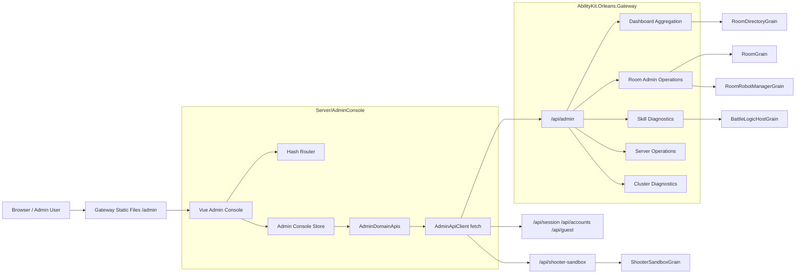
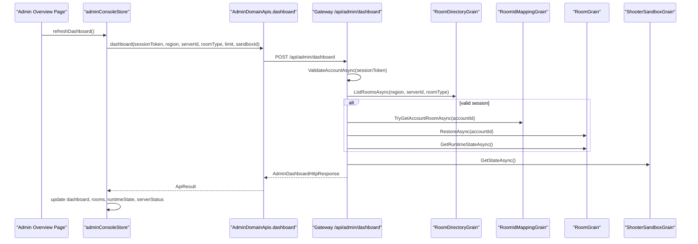

# 12.3 Web 后台：Admin Console 技术选型与职责边界

## 1. 能力定位

`Server/AdminConsole` 是 AbilityKit Orleans Gateway 的 Web 后台前端工程。它不是面向玩家客户端的业务协议实现，也不是单纯的演示页面，而是面向开发、验收、运维和诊断的管理控制台。

后台主要承担四类职责：

| 职责 | 说明 | 典型入口 |
|------|------|----------|
| 聚合总览 | 汇总玩法列表、房间目录、当前房间、运行状态、沙盒状态和服务器状态 | `AdminDashboardApi.dashboard` |
| 会话与房间操作 | 创建/校验会话、创建房间、加入房间、准备、选英雄、启动战斗、添加机器人 | `SessionApi`、`RoomApi` |
| 诊断分析 | 展示 Orleans 集群诊断、技能诊断模型、技能事件、验收 artifact、Shooter world diagnostics | `AdminClusterApi`、`AdminSkillApi` |
| 运维控制 | 维护模式、排空模式、重启请求等 Gateway 进程级控制 | `AdminOpsApi` |

设计上，Web 后台服务于“服务端运行面可观察、可验收、可操作”的目标。它把 `Gateway`、`RoomGrain`、`BattleLogicHostGrain`、Shooter Sandbox、技能验收 artifact 等后端能力收束到一个受控入口，避免测试脚本、临时 HTTP 调用和手工日志排查成为主要工作方式。

## 2. 源码入口

| 主题 | 源码入口 | 说明 |
|------|----------|------|
| 前端工程 | `Server/AdminConsole` | 独立 Vite + Vue 3 + TypeScript 工程 |
| 前端入口 | `Server/AdminConsole/src/main.ts` | 创建 Vue App 并挂载到 `#app` |
| 页面编排 | `Server/AdminConsole/src/App.vue` | Sidebar、Topbar、各功能页和诊断面板的组合入口 |
| 导航定义 | `Server/AdminConsole/src/navigation/adminNavigation.ts` | overview/session/rooms/skills/battle/cluster/ops/debug 路由清单 |
| Hash Router | `Server/AdminConsole/src/router/adminRouter.ts` | 轻量 hash 路由，避免引入完整路由依赖 |
| 状态中心 | `Server/AdminConsole/src/stores/adminConsoleStore.ts` | Composition API 状态、表单、刷新流程和 API 调用日志 |
| API 客户端 | `Server/AdminConsole/src/services/adminApiClient.ts` | 基于浏览器 `fetch` 的统一请求封装 |
| 领域 API | `Server/AdminConsole/src/services/domainApi.ts` | dashboard、ops、cluster、skills、rooms、sandbox、session 分组 |
| API 边界说明 | `Server/AdminConsole/src/services/adminApiBoundaries.ts` | 明确 `/api/admin`、`/api/rooms`、`/api/shooter-sandbox`、`/debug` 职责 |
| Vite 配置 | `Server/AdminConsole/vite.config.ts` | `/admin/` base、开发代理、Gateway 静态产物输出 |
| Gateway 后台接口 | `Server/Orleans/src/AbilityKit.Orleans.Gateway/HttpApi/GatewayHttpApi.cs` | `MapGatewayAdminEndpoints` 注册 `/api/admin` |
| 后台状态与运维 | `Server/Orleans/src/AbilityKit.Orleans.Gateway/HttpApi/GatewayAdminOperations.cs` | 进程状态、维护、排空、重启请求 |
| 集群诊断 | `Server/Orleans/src/AbilityKit.Orleans.Gateway/HttpApi/GatewayClusterDiagnostics.cs` | Orleans client/silo 配置探针 |
| 技能诊断 | `Server/Orleans/src/AbilityKit.Orleans.Gateway/HttpApi/GatewaySkillDiagnostics.cs` | 技能 summary、events、analysis model |
| 验收 artifact | `Server/Orleans/src/AbilityKit.Orleans.Gateway/HttpApi/GatewaySkillAcceptanceArtifacts.cs` | 技能验收批次、用例、执行计划和模板 |

## 3. 技术选型

### 3.1 为什么使用 Vite + Vue 3 + TypeScript

`package.json` 里运行时依赖只有 `vue`，开发依赖为 `vite`、`typescript`、`vue-tsc` 和 `@vitejs/plugin-vue`。这是一种刻意保持轻量的后台技术栈：

| 选择 | 原因 |
|------|------|
| Vite | 启动快、构建配置少，适合和 Orleans Gateway 分离开发再静态托管 |
| Vue 3 Composition API | 页面状态、表单和派生数据较多，组合式 API 比 Options API 更适合集中组织后台逻辑 |
| TypeScript | 后台强依赖 HTTP DTO，类型能降低字段拼写、状态投影和诊断模型维护成本 |
| 原生 `fetch` | 当前请求模型简单，不需要 axios/interceptor 体系，减少依赖面 |
| 自定义 Hash Router | 页面数量有限，使用 hash 路由能适配 Gateway 静态目录 `/admin/`，刷新和部署更简单 |
| 不引入 UI 框架 | 当前后台强调源码可控、调试清晰和低依赖，不把样式体系绑定到外部组件库 |

这套选型的核心取舍是：后台优先覆盖开发、验收和运维闭环，依赖面保持在可直接审计的范围内。Pinia、Vue Router、表格/图表组件或权限框架属于复杂度触发型依赖，只有在页面规模、跨页面状态一致性、权限模型或数据可视化能力超过当前轻量实现边界时才进入选型范围。

### 3.2 开发与构建关系

`vite.config.ts` 明确了两种运行方式：

| 场景 | 行为 |
|------|------|
| 本地开发 | Vite dev server 默认监听 `5173`，将 `/api` 与 `/debug` 代理到 `ABILITYKIT_GATEWAY_URL` 或 `http://localhost:5000` |
| 正式构建 | `npm run build` 输出到 `../Orleans/src/AbilityKit.Orleans.Gateway/wwwroot/admin` |
| Gateway 托管 | 前端以 `/admin/` 为 base，由 Gateway 静态文件服务承载 |

因此 Web 后台源码和 Gateway API 工程保持独立，但构建产物随 Gateway 一起发布。这个结构让前端可以独立热更新开发，也让演示/验收环境只需要启动 Gateway 即可访问后台。

## 4. 总体架构

这张链路体现了一个关键边界：后台页面默认通过 `/api/admin` 使用 Gateway 提供的聚合门面，而不是直接拼接真实玩家协议或 Grain 访问细节。少数会话兼容接口和 Shooter sandbox 接口保留在独立路径下，便于区分玩家登录、后台管理和演示自动化。

## 5. 前端模块设计

### 5.1 页面与路由

`adminNavigation.ts` 将后台分成 8 个路由：

| 路由 | 分组 | 作用 |
|------|------|------|
| `overview` | dashboard | 后台聚合概览、指标、API 边界说明 |
| `session` | runtime | 账号登录、游客登录、会话校验与退出 |
| `rooms` | runtime | 房间创建、房间目录、当前房间操作 |
| `skills` | diagnostics | 技能诊断、技能验收 artifact 和 trace 分析 |
| `battle` | runtime | 启动战斗、同步模板、Shooter world diagnostics |
| `cluster` | diagnostics | Orleans client/silo 配置与集群诊断 |
| `ops` | operations | 维护、排空、重启请求 |
| `debug` | diagnostics | 最近一次接口响应和聚合状态 JSON |

`adminRouter.ts` 只维护 hash path、`routeKey` 和 `currentRoute`。这种路由策略适合当前后台：页面之间没有复杂嵌套路由，Gateway 以 `/admin/` 静态托管时 hash 路由不依赖服务端 rewrite。

### 5.2 状态中心

`adminConsoleStore.ts` 是当前后台的状态中心。它用 `ref`、`reactive`、`computed`、`watch` 管理以下状态：

| 状态类别 | 示例 |
|----------|------|
| 会话上下文 | `sessionToken`、`accountId`、`region`、`serverId` |
| 房间上下文 | `selectedRoomType`、`roomId`、`rooms`、`snapshot`、`runtimeState` |
| 后台聚合 | `dashboard`、`serverStatus`、`clusterDiagnostics` |
| 技能诊断 | `skillSummary`、`skillEvents`、`skillAnalysisModel` |
| 验收 artifact | `acceptanceBatch`、`acceptanceCase`、`acceptanceRunPlan`、`acceptanceTemplates` |
| Shooter 诊断 | `shooterWorldDiagnostics`、`sandbox.state` |
| 操作反馈 | `busy`、`lastResponse`、`apiCallLog` |

这个 store 当前承担三层职责：

1. 表单状态和本地持久化。
2. 调用 `AdminDomainApis` 并统一记录 API 结果。
3. 将后端 DTO 投影为页面所需的树、时间线、筛选项和诊断视图。

领域 store 的拆分条件不是页面数量本身，而是状态所有权是否开始跨领域冲突。session、rooms、skills、ops、cluster 等状态出现独立刷新周期、独立错误处理或独立权限边界时，应拆分为领域 store；在现有页面规模下，单 store 能降低跨页面状态同步成本。

### 5.3 本地存储

`storage.ts` 使用 `abilitykit.admin.` 作为新前缀，同时兼容旧的 `abilitykit.` 前缀。这保证后台从早期实验页面演进到正式 Admin Console 时，不会直接丢失开发者本地会话、房间和环境配置。

## 6. API 边界

`adminApiBoundaries.ts` 已经把后台访问边界写成前端可展示的结构化说明：

| 前缀 | 责任 |
|------|------|
| `/api/admin` | 后台专用聚合、诊断、运维、审计与房间管理门面，后台页面默认只依赖这里 |
| `/api/rooms` | 真实房间/玩家业务接口，面向客户端和自动化流程，后台不直接调用 |
| `/api/shooter-sandbox` | 演示用 Shooter 沙盒自动化入口 |
| `/debug` | 开发者调试控制台，不承载正式后台模块 |

这条边界决定了后台不是复用玩家协议页面化，而是由 Gateway 提供后台语义的门面。后台请求可以携带 region、serverId、roomType、sessionToken、operation reason 等管理上下文，Gateway 也能在服务端统一做默认值、限流、审计、错误映射和后续权限控制。

### 6.1 领域 API 分组

`domainApi.ts` 将接口分成多个领域类：

| 类 | 主要接口 |
|----|----------|
| `AdminDashboardApi` | `/api/admin/dashboard` |
| `AdminOpsApi` | `/api/admin/server/status`、`/server/maintenance`、`/server/drain`、`/server/restart-request` |
| `AdminClusterApi` | `/api/admin/cluster/diagnostics` |
| `AdminSkillApi` | `/skills/summary`、`/skills/events`、`/skills/analysis-model`、`/skills/acceptance/*` |
| `RoomApi` | `/rooms/create`、`/rooms/join`、`/rooms/ready`、`/rooms/start-battle`、`/rooms/add-robots`、`/admin/shooter/world` |
| `SandboxApi` | `/api/shooter-sandbox/start`、`/api/shooter-sandbox/{id}`、`/api/shooter-sandbox/stop` |
| `SessionApi` | `/api/guest/login`、`/api/accounts/login`、`/api/session/validate`、`/api/session/logout` |

### 6.2 后端接口分组

`GatewayHttpApi.cs` 的 `MapGatewayAdminEndpoints` 注册 `/api/admin` 下的后台接口。核心分组如下：

| 分组 | Gateway 入口 | 后端依赖 |
|------|--------------|----------|
| Dashboard | `BuildAdminDashboardAsync` | `IRoomDirectoryGrain`、`IRoomIdMappingGrain`、`IRoomGrain`、`IShooterSandboxGrain`、`GatewayAdminOperations` |
| Room Admin | `CreateAdminRoomAsync`、`JoinAdminRoomAsync`、`StartAdminRoomBattleAsync` 等 | `IRoomDirectoryGrain`、`IRoomGrain`、`IRoomRobotManagerGrain` |
| Server Ops | `GatewayAdminOperations` | Gateway 进程内状态、`IWebHostEnvironment`、当前 session |
| Cluster Diagnostics | `GatewayClusterDiagnostics.GetDiagnostics` | Orleans cluster options、Gateway client 状态 |
| Skill Diagnostics | `GatewaySkillDiagnostics` | Room/Battle 上下文、技能分析模型 |
| Acceptance Artifacts | `GatewaySkillAcceptanceArtifacts` | 文件系统 artifact 根目录、模板、执行计划、用例 trace |
| Shooter World | `GetAdminShooterWorldDiagnosticsAsync` | `IBattleLogicHostGrain.GetWorldDiagnosticsAsync` |

## 7. Dashboard 聚合流程

`BuildAdminDashboardAsync` 是后台体验的核心聚合点。它把多个 Grain 和进程状态合成单个 DTO，前端一次刷新即可得到当前页面大部分需要的信息。这减少了后台页面对多个接口时序的依赖，也让 Gateway 能统一处理默认 region、serverId、roomType、limit 和 session 校验。

## 8. 运维与诊断能力

### 8.1 进程运维

`GatewayAdminOperations` 保存 Gateway 进程内状态：维护模式、排空模式、重启请求和最近操作信息。这个实现适用于演示、开发和单进程 Gateway 验收：

| 能力 | 当前语义 |
|------|----------|
| maintenance | 标记后台希望 Gateway 进入维护模式 |
| drain | 标记后台希望 Gateway 排空连接或停止接收新流量 |
| restart-request | 同时置位 restart、maintenance、drain，表达受控重启意图 |
| status | 返回环境名、应用名、机器名、进程 ID、内存、线程数、运行时长和最后操作 |

生产化时，这些状态不能只保存在进程内存里，需要接入共享配置、控制面或 Orleans Grain 状态，并且要让 Gateway pipeline、负载均衡、房间调度和连接接受策略真正消费这些标记。

### 8.2 Orleans 集群诊断

`GatewayClusterDiagnostics` 提供 Orleans Gateway Client 与 Local Silo 的配置探针。源码中已经暴露 runtime metrics 的扩展位置，生产化诊断需要把该位置接入实际指标来源：

| 指标 | 用途 |
|------|------|
| Silo membership | 判断集群节点是否稳定 |
| Activation count | 判断 Grain 热点和容量 |
| Request throughput | 观察 Gateway 到 Grain 的调用压力 |
| Failure rate | 发现超时、反序列化、业务异常 |
| Reminder / Stream status | 支撑定时任务和推送链路诊断 |

### 8.3 技能诊断与验收 artifact

技能诊断和验收模块让后台成为玩法运行时的观测入口：

| 能力 | 说明 |
|------|------|
| summary | 汇总房间/战斗维度的技能指标、演员、警告 |
| events | 按 battleId、actorId、skillId、limit 读取技能事件 |
| analysis-model | 输出技能分析模型、阶段、字段和投影 schema |
| acceptance batch | 读取技能验收 artifact 批次和用例列表 |
| acceptance case | 查看单个验收用例的 summary、trace、assertions |
| acceptance run-plan | 展示可执行脚本、策略和审批要求 |

这部分让后台不只是“点按钮发请求”，而是能把 MOBA 技能链路、trace、验收产物和运行态事件组织成可分析的页面。

## 9. 设计约束与治理边界

| 约束 | 源码边界 | 治理要求 |
|------|----------|----------|
| 权限 | 后台请求主要依赖 sessionToken，`/api/admin` 已形成独立路径边界 | 管理员角色、scope、操作审批和审计日志应由 Gateway 统一建模 |
| 状态管理 | `adminConsoleStore.ts` 集中承载后台状态、表单、刷新流程和 API 调用日志 | 领域状态出现独立生命周期或权限边界时拆分为 session、rooms、skills、ops、cluster 等 store |
| API 类型 | 前端 `types.ts` 手写 DTO，与 Gateway HTTP DTO 需要人工保持一致 | Gateway DTO 或 OpenAPI 生成链路可作为类型一致性来源 |
| 运维状态 | `GatewayAdminOperations` 使用进程内静态字段表达维护、排空和重启请求 | 多 Gateway 部署需要持久化到 Grain、配置中心或控制面，并接入 Gateway pipeline |
| 集群指标 | `GatewayClusterDiagnostics` 已提供配置探针和 runtime metrics 扩展位置 | Orleans metrics、Dashboard 或 OpenTelemetry 是生产化指标来源 |
| UI 组件 | 页面和样式由 Admin Console 自研，未绑定第三方组件库 | 表格、图表、筛选器和权限控件复杂度超过本地组件能力后再局部引入组件库 |
| 安全 | `/api/admin` 是后台路径边界，部署层鉴权仍需外部配置配合 | Gateway middleware、反向代理鉴权、CSRF、审计和速率限制构成正式安全边界 |

## 10. 源码阅读路径

1. `Server/AdminConsole/README.md`：开发、构建和 Gateway 托管关系。
2. `Server/AdminConsole/vite.config.ts`：`/admin/` base、开发代理和构建输出位置。
3. `Server/AdminConsole/src/App.vue`、`adminNavigation.ts`、`adminRouter.ts`：页面结构、导航模型和 hash route 映射。
4. `Server/AdminConsole/src/stores/adminConsoleStore.ts`：后台状态、刷新流程、操作反馈和 API 调用日志。
5. `Server/AdminConsole/src/services/domainApi.ts` 与 `adminApiBoundaries.ts`：领域 API 分组和路径责任边界。
6. `Server/Orleans/src/AbilityKit.Orleans.Gateway/HttpApi/GatewayHttpApi.cs` 的 `MapGatewayAdminEndpoints`：前端领域 API 到 Gateway 与 Orleans Grain 主链路的映射。

## 11. 与其他服务端文档的关系

| 文档 | 关系 |
|------|------|
| `00-ServerCapabilityMap.md` | 本文补充服务端能力地图中的后台控制面和诊断面 |
| `01-OrleansRuntimeAndDeployment.md` | 本文使用其中的 Gateway 托管和部署角色作为运行基础 |
| `02-GatewayRoomBattleFlow.md` | 本文的房间、战斗、技能诊断最终落到 Gateway/Room/Battle 主链路 |
| `07-NetworkSynchronization/05-SessionCoordination.md` | 后台会话、房间恢复、启动战斗依赖会话协调能力 |
| `09-ImplementationExamples/Shooter/05-ServerFlowAndSmokeDeepDive.md` | Shooter sandbox、world diagnostics 和 smoke 验收可通过后台观察 |
