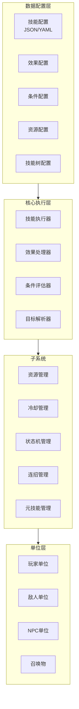

# 通用技能系统架构设计

## 需求概述

- **设计目标**：与具体游戏引擎和框架无关的纯技能系统需求分析和架构规划
- **规模支持**：超大规模 (1000+ 技能)，支持职业/天赋树
- **复杂度**：全复杂度支持 (基础伤害、复杂指向、时序系统、资源系统、连招、状态机、元技能)
- **驱动方式**：数据驱动，配置优先，减少代码

---

## 核心设计理念

采用**层次化 + 数据驱动 + 组件化**的架构，将技能系统分解为：

1. **数据层** - 纯数据配置，与代码解耦
2. **执行层** - 可组合的效果组件
3. **规则层** - 可配置的技能规则
4. **管理层** - 生命周期和状态管理

---

## 一、技能数据模型设计

### 1.1 核心数据结构

```
Skill (技能)
├── BaseInfo (基础信息)
│   ├── skillId: int
│   ├── name: string
│   ├── description: string
│   ├── icon: string
│   ├── skillType: enum (主动/被动/触发/形态)
│   └── levelRange: (minLevel, maxLevel)
│
├── CostInfo (消耗信息)
│   ├── resourceType: enum (Mp/Sp/怒气/生命值/金币等)
│   ├── baseCost: float
│   ├── costPerLevel: float
│   └── costPercent: bool (是否百分比消耗)
│
├── CooldownInfo (冷却信息)
│   ├── baseCooldown: float
│   ├── cooldownGroup: string (冷却组，同组技能共享冷却)
│   └── reductionPerLevel: float
│
├── TargetingInfo (目标信息)
│   ├── targetType: enum (敌方/友方/自身/地面/方向/无)
│   ├── targetCount: int
│   ├── targetFilter: FilterConfig
│   ├── range: RangeConfig
│   └── aoeShape: enum (圆形/扇形/矩形/环形/自定义)
│
├── ExecutionInfo (执行信息)
│   ├── castTime: CastTimeConfig
│   ├── channelTime: ChannelConfig (引导)
│   ├── interruptible: bool
│   └── phases: List<PhaseConfig> (多阶段技能)
│
├── Effects: List<Effect> (效果列表)
│
├── Prerequisites: List<Prerequisite> (前置条件)
│
└── Branches: List<SkillBranch> (技能分支/升级链)
```

### 1.2 效果组件数据

```
Effect (效果基类)
├── effectId: string
├── effectType: enum (伤害/治疗/Buff/Debuff/位移/召唤/资源/视觉效果...)
│
├── TimingConfig
│   ├── triggerTiming: enum (立即/施法开始/命中/结束/持续tick)
│   └── delay: float
│
├── ValueConfig
│   ├── baseValue: float
│   ├── valuePerLevel: float
│   ├── valuePercentOf: enum (自身属性/目标属性/固定值)
│   └── valueCalculation: enum (直接/公式引用)
│
├── ScalingConfig
│   ├── attribute: enum (力量/智力/敏捷/攻速/暴击等)
│   ├── scalingCoefficient: float
│   └── coefficientPerLevel: float
│
├── ApplicationConfig
│   ├── applicationType: enum (附加/替换/传播/反射)
│   ├── applicationCondition: FilterConfig
│   └── stackRule: enum (刷新/叠加/不生效)
│
└── EffectSpecificData (各类型特有数据)
```

---

## 二、技能类型分类体系

### 2.1 按触发方式分类

| 类型 | 说明 | 示例 |
|-----|------|-----|
| `Active` | 主动施放 | 火焰冲击 |
| `Passive` | 被动生效 | 生命偷取 |
| `Trigger` | 条件触发 | 受击时反击 |
| `Toggle` | 开关切换 | 防御姿态 |
| `Aura` | 范围光环 | 团队增益 |
| `Transform` | 形态切换 | 变熊/变豹 |

### 2.2 按执行模式分类

| 模式 | 说明 | 配置参数 |
|-----|------|---------|
| `Instant` | 瞬发 | 无额外参数 |
| `CastTime` | 读条施法 | 读条时间、可被打断 |
| `Channel` | 引导技能 | 持续时间、tick间隔、可被打断 |
| `Charge` | 蓄力技能 | 蓄力时间范围、最大蓄力效果 |
| `Bezier` | 轨迹技能 | 发射物速度、曲线参数 |

---

## 三、核心子系统设计

### 3.1 资源管理系统

```
ResourceSystem
├── ResourceType (资源类型定义)
│   ├── name: string
│   ├── maxCalculation: enum (固定值/属性百分比/公式)
│   ├── regenCalculation: enum (固定值/属性百分比/公式)
│   └── uiConfig: (颜色、图标等)
│
├── ResourceInstance (单位资源实例)
│   ├── currentValue: float
│   ├── maxValue: float
│   ├── regenRate: float
│   └── modifiers: List<ResourceModifier>
│
└── CostValidator
    ├── validate(caster, skill) -> ValidationResult
    ├── calculateCost(skill, level) -> CostInfo
    └── applyCost(caster, cost)
```

**支持的资源类型**：
- 法力值 (Mp)
- 能量 (Sp/气力)
- 怒气 (Rage)
- 生命值百分比
- 冷却时间返还
- 充能层数
- 组合键消耗

### 3.2 目标系统

```
TargetingSystem
├── TargetFilter (目标过滤器)
│   ├── relationship: enum (敌方/友方/自身/中立)
│   ├── unitType: enum (英雄/小兵/建筑/召唤物/自身)
│   ├── aliveState: enum (存活/死亡/无敌/不可选中)
│   ├── statusFilter: (有特定buff/debuff)
│   ├── distanceRange: (min, max)
│   └── customConditions: List<Condition>
│
├── RangeCalculator (范围计算)
│   ├── fromSource: enum (施法者/目标点/目标单位)
│   ├── shape: enum (圆形/扇形/矩形/环形/球形)
│   ├── parameters: ShapeParams
│   └── occlusion: bool (是否考虑遮挡)
│
└── TargetSelector
    ├── selectTargets(source, config) -> List<Unit>
    ├── prioritize(config) -> 排序规则
    └── limitCount(targets, maxCount)
```

### 3.3 效果系统

```
EffectSystem
├── IEffectComponent (效果组件接口)
│   ├── Apply(context)
│   ├── Tick(context)
│   ├── Remove(context)
│   └── CanApply(context) -> bool
│
├── EffectTypes (效果类型)
│   ├── DamageEffect (伤害)
│   │   ├── damageType: enum (物理/魔法/真实)
│   │   ├── damageCategory: enum (穿刺/爆发/AOE)
│   │   └── damageCalculation: enum (固定/攻击百分比/技能百分比)
│   │
│   ├── HealEffect (治疗)
│   │   ├── healType: enum (直接/持续/生命上限百分比)
│   │   └── overhealRule: enum (溢出转护盾/直接溢出)
│   │
│   ├── BuffEffect (增益)
│   │   ├── buffType: enum (属性提升/免疫/霸体/移速加成)
│   │   ├── statModifiers: List<StatModifier>
│   │   └── stacking: enum (刷新/叠加/不叠加)
│   │
│   ├── DebuffEffect (减益)
│   │   ├── debuffType: enum (减速/沉默/眩晕/缴械)
│   │   ├── duration: float
│   │   └── cleansingPriority: int
│   │
│   ├── DisplacementEffect (位移)
│   │   ├── moveType: enum (冲刺/闪烁/击退/拉取/跳跃)
│   │   ├── targetPosition: enum (施法者/目标/指定点)
│   │   ├── speed: float
│   │   └── interruptOnHit: bool
│   │
│   ├── SummonEffect (召唤)
│   │   ├── summonTemplate: UnitTemplate
│   │   ├── maxCount: int
│   │   ├── duration: float
│   │   └── inheritStats: float
│   │
│   ├── ProjectileEffect (投射物)
│   │   ├── projectileSpeed: float
│   │   ├── trajectory: enum (直线/追踪/抛物线/弧线)
│   │   ├── onHitEffect: Effect
│   │   ├── piercing: bool
│   │   └── maxTargets: int
│   │
│   └── AreaEffect (区域效果)
│       ├── aoeShape: Shape
│       ├── duration: float
│       ├── tickInterval: float
│       └── effectsPerTick: List<Effect>
│
└── EffectComposer (效果组合器)
    ├── sequential: 顺序执行
    ├── parallel: 并行执行
    ├── conditional: 条件执行
    └── loop: 循环执行
```

### 3.4 条件系统

```
ConditionSystem
├── ICondition (条件接口)
├── BasicConditions
│   ├── HealthCondition (生命值条件)
│   │   ├── comparison: enum (大于/小于/等于/百分比)
│   │   └── value: float
│   │
│   ├── ResourceCondition (资源条件)
│   │   ├── resourceType: ResourceType
│   │   ├── comparison: enum
│   │   └── value: float
│   │
│   ├── StatusCondition (状态条件)
│   │   ├── statusType: enum (眩晕/隐身/无敌/沉默等)
│   │   └── require: bool (有/无此状态)
│   │
│   ├── DistanceCondition (距离条件)
│   │   ├── targetFilter: TargetFilter
│   │   └── distanceRange: (min, max)
│   │
│   ├── CooldownCondition (冷却条件)
│   │   ├── skillId: int
│   │   └── ready: bool
│   │
│   ├── ComboCondition (连击条件)
│   │   ├── comboCount: int
│   │   └── comboWindow: float
│   │
│   └── TimeCondition (时间条件)
│       ├── gameTime: TimeRange
│       └── timeOfDay: enum (白天/黑夜)
│
└── ConditionComposer
    ├── AndCondition
    ├── OrCondition
    ├── NotCondition
    └── CountCondition (满足N个条件)
```

### 3.5 冷却系统

```
CooldownSystem
├── CooldownGroup (冷却组)
│   ├── groupId: string
│   ├── shareType: enum (完全共享/分层共享)
│   └── skills: List<SkillId>
│
├── CooldownTracker
│   ├── currentCooldown: float
│   ├── maxCooldown: float
│   ├── remainingTime: float
│   └── onCooldownEnd: callback
│
└── CooldownModifier
    ├── flatReduction: float
    ├── percentReduction: float
    ├── affectedGroup: string
    └── condition: Condition
```

### 3.6 状态机系统 (支持姿态/形态)

```
StateMachineSystem
├── StateDefinition (状态定义)
│   ├── stateId: string
│   ├── stateType: enum (姿态/形态/变身/连击状态)
│   ├── enterCondition: Condition
│   ├── onEnter: List<Action>
│   ├── onExit: List<Action>
│   ├── onUpdate: Action
│   └── transitions: List<Transition>
│
├── Transition (状态转换)
│   ├── toState: StateId
│   ├── triggerType: enum (条件/时间/技能触发/被击中)
│   ├── condition: Condition
│   └── transitionEffect: VisualEffect
│
├── ActiveState (当前激活状态)
│   ├── stateId: string
│   ├── enterTime: float
│   ├── modifiers: List<Modifier>
│   └── blockedSkills: List<SkillId> (该状态禁止的技能)
│
└── StateExamples
    ├── 战斗姿态/防御姿态
    ├── 潜行/显形
    ├── 变身形态 (熊/豹/人)
    ├── 连击计数器
    └── 狂暴状态
```

### 3.7 技能链/连招系统

```
ComboSystem
├── ComboChain (连招链)
│   ├── chainId: string
│   ├── skills: List<SkillInChain>
│   │   ├── skillId: int
│   │   ├── inputWindow: float (输入窗口)
│   │   └── nextSkillAlternatives: List<int>
│   │
│   ├── comboWindow: float (总连招窗口)
│   └── comboBonus: ComboBonus (连招加成)
│
├── ComboTracker
│   ├── currentChain: ChainId
│   ├── currentIndex: int
│   ├── remainingWindow: float
│   └── comboCount: int
│
└── ComboBonus
    ├── effects: List<Effect> (满足条件触发的额外效果)
    ├── costModifier: float (消耗改变)
    └── cooldownModifier: float (冷却改变)
```

### 3.8 元技能系统 (学习/升级/遗忘)

```
MetaSkillSystem
├── SkillTree (技能树)
│   ├── treeId: string
│   ├── profession: string
│   ├── nodes: List<SkillNode>
│   └── edges: List<TreeEdge>
│
├── SkillNode (技能节点)
│   ├── nodeId: string
│   ├── skillId: int
│   ├── position: (x, y)
│   ├── unlockCondition: Condition
│   ├── pointCost: int
│   ├── prerequisites: List<NodeId>
│   └── maxRank: int
│
├── SkillRank (技能等级)
│   ├── currentRank: int
│   ├── maxRank: int
│   └── rankEffects: List<Effect> (每级效果)
│
├── LearningSystem
│   ├── availablePoints: int
│   ├── canLearn(skillId) -> ValidationResult
│   ├── learn(skillId) -> bool
│   └── resetTree() -> bool (洗点)
│
└── TalentSpecialization (天赋专精)
    ├── specializationId: string
    ├── bonusEffects: List<Effect>
    └── modifiedSkills: List<SkillModification>
```

---

## 四、数据驱动配置格式

### 4.1 技能配置文件 (JSON/YAML)

```json
{
  "skillId": 10001,
  "name": "火焰冲击",
  "description": "向目标发射火焰弹，造成大量魔法伤害",
  "icon": "icons/fire_bolt",
  "type": "Active",
  "maxLevel": 5,
  
  "cost": {
    "type": "Mp",
    "baseCost": 40,
    "costPerLevel": 10
  },
  
  "cooldown": {
    "baseCooldown": 4.0,
    "cooldownGroup": "fire_basic"
  },
  
  "targeting": {
    "targetType": "Enemy",
    "range": {
      "shape": "Cone",
      "angle": 45,
      "distance": 15
    },
    "maxTargets": 1
  },
  
  "castTime": {
    "baseTime": 0.5,
    "canMove": false,
    "interruptible": true
  },
  
  "effects": [
    {
      "type": "Projectile",
      "speed": 12,
      "trajectory": "Straight",
      "onHit": {
        "type": "Damage",
        "damageType": "Magic",
        "baseValue": 100,
        "scaling": [
          { "stat": "SpellPower", "coefficient": 1.5 },
          { "stat": "Intelligence", "coefficient": 0.5 }
        ],
        "perLevelBonus": 25
      }
    }
  ],
  
  "levelUpEffects": [
    {
      "level": 2,
      "effects": [
        { "type": "Damage", "baseValue": 125 }
      ]
    },
    {
      "level": 5,
      "effects": [
        { "type": "Buff", "addEffect": "Ignite" }
      ]
    }
  ]
}
```

### 4.2 效果定义配置

```json
{
  "effectId": "fireball_aoe",
  "type": "AreaOfEffect",
  "shape": {
    "type": "Circle",
    "radius": 5
  },
  "duration": 0,
  "tickInterval": 0,
  "effects": [
    {
      "type": "Damage",
      "damageType": "Magic",
      "baseValue": 80
    },
    {
      "type": "Debuff",
      "debuffType": "Burning",
      "duration": 3,
      "effects": [
        {
          "type": "Damage",
          "damageType": "Magic",
          "baseValue": 10,
          "tickInterval": 1
        }
      ]
    }
  ],
  "application": {
    "targetFilter": {
      "relationship": "Enemy",
      "aliveState": "Alive"
    }
  }
}
```

---

## 五、架构层次图



---

## 六、实施建议

### 阶段一：核心框架
1. 基础数据结构定义
2. 效果组件系统
3. 条件评估系统
4. 目标选择系统

### 阶段二：主要功能
1. 资源/冷却系统
2. 状态机系统
3. 技能链系统

### 阶段三：高级功能
1. 元技能/天赋树
2. 技能可视化编辑器
3. 平衡性调优工具

### 关键技术选型
- **数据格式**：JSON (可读性好) 或 YAML (编辑友好)
- **脚本系统**：可选DSL或表达式引擎
- **持久化**：Protobuf 或 MessagePack
- **热更新**：ILRuntime 或 Lua

---

## 附录：设计模式参考

### 组件模式
使用组件化设计，效果系统由独立的、可组合的组件构成，便于扩展新的效果类型。

### 策略模式
条件评估、目标选择等使用策略模式，允许运行时替换评估/选择算法。

### 观察者模式
技能事件（施放、命中、结束等）使用观察者模式，支持技能事件的订阅和广播。

### 职责链模式
效果应用使用职责链模式，每个效果组件负责处理自己能处理的部分，将不相关的部分传递给下一个组件。

### 对象池模式
投射物、召唤物等频繁创建销毁的对象使用对象池管理，减少GC压力。

### 享元模式
技能配置数据作为享元，多个相同技能的实例共享同一份配置数据。
