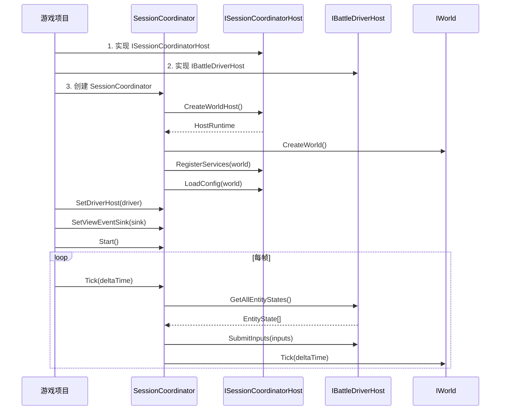

# AbilityKit Coordinator 模块设计文档

## 概述

AbilityKit Coordinator 是一个**通用战斗会话协调框架**，用于客户端-服务器同步。它封装了帧同步/状态同步的复杂性，让接入方只需实现少量接口即可接入不同的战斗逻辑世界。

### 核心定位

```
┌─────────────────────────────────────────────────────────────────────────────┐
│                          Coordinator 定位                                  │
├─────────────────────────────────────────────────────────────────────────────┤
│                                                                             │
│  接入方 (游戏项目)                                                         │
│  ┌─────────────────────────────────────────────────────────────────────┐   │
│  │ 需要实现的核心接口：                                                   │   │
│  │ • ISessionCoordinatorHost    - 提供 WorldHost、注册服务、加载配置       │   │
│  │ • IBattleDriverHost          - 封装战斗逻辑世界，提交输入，获取状态      │   │
│  │ • IViewEventSink (可选)       - 处理视图事件                           │   │
│  └─────────────────────────────────────────────────────────────────────┘   │
│                                    │                                        │
│                                    ▼                                        │
│  ┌─────────────────────────────────────────────────────────────────────┐   │
│  │                     AbilityKit.Coordinator                             │   │
│  │                                                                        │   │
│  │  SessionCoordinator ── 管理会话生命周期                                  │   │
│  │  ├── ISyncAdapter ── 同步策略 (Local/Remote/Hybrid)                    │   │
│  │  ├── ISessionSubFeature ── 可扩展功能 (TickLoop, SnapshotRouting 等)   │   │
│  │  ├── SessionHooks ── 事件钩子                                           │   │
│  │  └── ViewTimeline ── 视图插值                                          │   │
│  │                                                                        │   │
│  └─────────────────────────────────────────────────────────────────────┘   │
│                                    │                                        │
│                                    ▼                                        │
│  ┌─────────────────────────────────────────────────────────────────────┐   │
│  │                    AbilityKit.Host                                     │   │
│  │                                                                        │   │
│  │  HostRuntime ── 宿主运行时                                               │   │
│  │  ├── IWorldManager ── 世界管理器                                        │   │
│  │  └── Tick 管理                                                         │   │
│  │                                                                        │   │
│  └─────────────────────────────────────────────────────────────────────┘   │
│                                    │                                        │
│                                    ▼                                        │
│  ┌─────────────────────────────────────────────────────────────────────┐   │
│  │                    AbilityKit.World                                    │   │
│  │                                                                        │   │
│  │  IWorld ── 逻辑世界                                                    │   │
│  │  ├── IWorldResolver ── 服务容器                                        │   │
│  │  └── 业务逻辑 (Entity, Component, System)                              │   │
│  │                                                                        │   │
│  └─────────────────────────────────────────────────────────────────────┘   │
│                                                                             │
└─────────────────────────────────────────────────────────────────────────────┘
```

---

## 一、核心接口定义

### 1.1 ISessionCoordinatorHost - 宿主接口

**职责**：提供平台特定的实现，包括创建 WorldHost、注册服务、加载配置。

```csharp
public interface ISessionCoordinatorHost
{
    /// <summary>
    /// 创建 WorldHost 实例
    /// </summary>
    IWorldHost CreateWorldHost(SessionConfig config);

    /// <summary>
    /// 注册服务到世界
    /// </summary>
    void RegisterServices(IWorld world, SessionConfig config);

    /// <summary>
    /// 加载会话配置
    /// </summary>
    void LoadConfig(IWorld world, SessionConfig config);

    /// <summary>
    /// 创建玩家生成数据
    /// </summary>
    PlayerSpawnData[] CreatePlayerSpawnData(SessionConfig config);
}
```

**实现提示**：
- `CreateWorldHost` 应返回 `HostRuntime` 实例
- `RegisterServices` 中注册战斗逻辑所需的服务（输入处理、技能执行等）
- `LoadConfig` 中加载配置文件（角色、技能、Buff 等）
- `CreatePlayerSpawnData` 返回玩家和 AI 的生成数据

### 1.2 IBattleDriverHost - 战斗驱动宿主

**职责**：封装战斗逻辑世界，提供输入提交和状态查询能力。

```csharp
public interface IBattleDriverHost
{
    /// <summary>
    /// 当前帧号
    /// </summary>
    int CurrentFrame { get; }

    /// <summary>
    /// 逻辑时间（秒）
    /// </summary>
    double LogicTimeSeconds { get; }

    /// <summary>
    /// 是否正在运行
    /// </summary>
    bool IsRunning { get; }

    /// <summary>
    /// 提交输入
    /// </summary>
    void SubmitInputs(PlayerInput[] inputs);

    /// <summary>
    /// 获取所有实体状态（用于渲染）
    /// </summary>
    EntityState[] GetAllEntityStates();
}
```

**实现提示**：
- `SubmitInputs` 应将输入转换为战斗逻辑世界能理解的格式
- `GetAllEntityStates` 返回所有实体的渲染状态（位置、旋转、动画参数等）
- 如果战斗逻辑世界有自己的帧概念，`CurrentFrame` 应与其同步

### 1.3 IViewEventSink - 视图事件接收（可选）

**职责**：接收视图事件，用于渲染层响应战斗事件。

**设计原则**：
- 框架定义契约，应用层解释数据
- 快照事件携带原始数据，由应用层决定如何渲染
- 简单的生命周期事件由框架定义
- 复杂业务事件通过 `CustomPayload` 传递原始数据

```csharp
public interface IViewEventSink
{
    // ============== Frame Snapshot Events ==============

    /// <summary>
    /// 进入游戏快照（初始化状态）
    /// 包含所有实体及其初始状态
    /// </summary>
    void OnEnterGameSnapshot(in FrameSnapshotData snapshot);

    /// <summary>
    /// 角色变换快照
    /// 包含位置/旋转变化
    /// </summary>
    void OnActorTransformSnapshot(in FrameSnapshotData snapshot);

    /// <summary>
    /// 伤害事件快照
    /// 包含伤害信息用于显示
    /// </summary>
    void OnDamageEventSnapshot(in FrameSnapshotData snapshot);

    /// <summary>
    /// 帧同步完成
    /// 所有快照事件已处理完毕
    /// </summary>
    void OnFrameSyncComplete(int frame);

    // ============== Lifecycle Events ==============

    /// <summary>
    /// 战斗开始
    /// </summary>
    void OnBattleStart(int frame);

    /// <summary>
    /// 战斗结束
    /// </summary>
    void OnBattleEnd(int frame, int winTeamId);

    // ============== Extension Events ==============

    /// <summary>
    /// 自定义事件
    /// 用于传递业务特定的事件数据
    ///
    /// 常见事件类型（应用定义）：
    /// - "SkillCast" - 技能释放
    /// - "BuffApply" - Buff 施加
    /// - "ProjectileSpawn" - 投射物生成
    /// </summary>
    void OnCustomEvent(string eventType, int entityId, byte[] customData);
}
```

**FrameSnapshotData 结构**：

```csharp
public readonly struct FrameSnapshotData
{
    public int FrameIndex { get; }      // 帧索引
    public double Timestamp { get; }     // 时间戳
    public SnapshotType Type { get; }   // 快照类型 (Full/Delta/KeyFrame)
    public EntityState[] Entities { get; }  // 实体状态数组
    public byte[] CustomPayload { get; }     // 自定义数据（应用定义格式）
}
```

**EntityState 结构**：

```csharp
public struct EntityState
{
    public int EntityId;     // 实体 ID
    public float X, Y, Z;   // 位置
    public float Rotation;   // 旋转
    public float VelocityX, VelocityZ;  // 速度
    public float Hp, HpMax;  // 生命值
    public int TeamId;       // 队伍 ID
    public bool IsDead;      // 是否死亡
}
```

**设计优势**：
1. **通用性**：`EntityState` 包含所有游戏都需要的通用属性
2. **可扩展**：`CustomPayload` 允许应用层定义自己的数据格式
3. **解耦**：框架只负责传递，不关心具体如何渲染

---

## 二、会话配置

### 2.1 SessionConfig - 会话配置

```csharp
public sealed class SessionConfig
{
    /// <summary>
    /// 会话 ID
    /// </summary>
    public SessionId SessionId { get; }

    /// <summary>
    /// 同步模式
    /// </summary>
    public SyncMode SyncMode { get; }

    /// <summary>
    /// 本地玩家 ID
    /// </summary>
    public int LocalPlayerId { get; }

    /// <summary>
    /// 帧率
    /// </summary>
    public int TickRate { get; }

    /// <summary>
    /// 世界 ID
    /// </summary>
    public string WorldId { get; }
}
```

### 2.2 SyncMode - 同步模式

| 模式 | 说明 | 适用场景 |
|------|------|----------|
| `Lockstep` | 帧同步，本地运行所有逻辑 | 单机、局域网 |
| `StateSync` | 状态同步，服务器权威 | 网络游戏 |
| `Hybrid` | 混合模式，客户端预测 | 网络游戏（低延迟） |

### 2.3 创建配置

```csharp
// 本地游戏配置
var localConfig = SessionConfig.CreateLocal(playerId: 1);

// 网络游戏配置
var serverConfig = SessionConfig.CreateServer(playerId: 1);
var clientConfig = SessionConfig.CreateClient(playerId: 2, serverEndpoint);
```

---

## 三、使用流程

### 3.1 完整使用流程



### 3.2 代码示例

```csharp
// ============== Step 1: 实现 ISessionCoordinatorHost ==============

public sealed class MyGameCoordinatorHost : ISessionCoordinatorHost
{
    public IWorldHost CreateWorldHost(SessionConfig config)
    {
        return new HostRuntime();
    }

    public void RegisterServices(IWorld world, SessionConfig config)
    {
        var resolver = world.Services;

        // 注册配置加载器
        resolver.Register<ITextAssetLoader>(new MyTextAssetLoader());

        // 注册输入处理
        resolver.Register<IWorldInputSink>(new MyInputSink());

        // 注册战斗服务
        resolver.Register<SkillExecutor>(new SkillExecutor());
        resolver.Register<DamagePipelineService>(new DamagePipelineService());
    }

    public void LoadConfig(IWorld world, SessionConfig config)
    {
        var loader = world.Services.Resolve<ITextAssetLoader>();

        // 加载角色配置
        var characters = loader.LoadJson<CharacterConfig[]>("characters.json");

        // 加载技能配置
        var skills = loader.LoadJson<SkillConfig[]>("skills.json");

        // 加载 Buff 配置
        var buffs = loader.LoadJson<BuffConfig[]>("buffs.json");
    }

    public PlayerSpawnData[] CreatePlayerSpawnData(SessionConfig config)
    {
        return new[]
        {
            PlayerSpawnData.CreateLocalPlayer(1, 10001, 0, 0),
            PlayerSpawnData.CreateLocalPlayer(2, 10001, 10, 10),
        };
    }
}

// ============== Step 2: 实现 IBattleDriverHost ==============

public sealed class MyBattleDriverHost : IBattleDriverHost
{
    private readonly MyBattleWorld _world;
    private int _currentFrame;
    private double _logicTime;

    public int CurrentFrame => _currentFrame;
    public double LogicTimeSeconds => _logicTime;
    public bool IsRunning => _world.IsRunning;

    public MyBattleDriverHost(MyBattleWorld world)
    {
        _world = world;
    }

    public void SubmitInputs(PlayerInput[] inputs)
    {
        foreach (var input in inputs)
        {
            switch (input.Type)
            {
                case InputType.Move:
                    HandleMoveInput(input);
                    break;
                case InputType.Skill:
                    HandleSkillInput(input);
                    break;
            }
        }
    }

    public EntityState[] GetAllEntityStates()
    {
        return _world.GetAllEntityStates()
            .Select(e => new EntityState
            {
                EntityId = e.Id,
                X = e.Position.X,
                Y = e.Position.Y,
                Z = e.Position.Z,
                Rotation = e.Rotation,
                AnimationState = e.AnimationState,
                CurrentHp = e.CurrentHp,
                MaxHp = e.MaxHp,
                IsDead = e.IsDead,
            })
            .ToArray();
    }

    private void HandleMoveInput(PlayerInput input)
    {
        // 将 PlayerInput 转换为战斗世界的移动命令
        var cmd = new MoveCommand
        {
            ActorId = input.PlayerId,
            TargetX = input.Payload.GetFloat("x"),
            TargetZ = input.Payload.GetFloat("z"),
        };
        _world.SubmitCommand(cmd);
    }

    private void HandleSkillInput(PlayerInput input)
    {
        var cmd = new SkillCommand
        {
            ActorId = input.PlayerId,
            Slot = input.Payload.GetInt("slot"),
            TargetX = input.Payload.GetFloat("x"),
            TargetZ = input.Payload.GetFloat("z"),
        };
        _world.SubmitCommand(cmd);
    }
}

// ============== Step 3: 使用 Coordinator ==============

public class BattleManager
{
    private ISessionCoordinator _coordinator;

    public void StartBattle()
    {
        // 创建配置
        var config = SessionConfig.CreateLocal(playerId: 1);

        // 创建宿主
        var host = new MyGameCoordinatorHost();

        // 创建战斗世界
        var world = new MyBattleWorld();
        var driver = new MyBattleDriverHost(world);

        // 创建协调器
        _coordinator = new SessionCoordinator();
        _coordinator.Initialize(config, host);

        // 设置驱动宿主
        _coordinator.SetDriverHost(driver);

        // 设置视图事件接收
        _coordinator.SetViewEventSink(new MyViewEventSink());

        // 启动
        _coordinator.Start();
    }

    public void Update(float deltaTime)
    {
        // 提交本地输入
        if (Input.GetKeyDown(KeyCode.W))
        {
            _coordinator.SubmitLocalInput(new PlayerInput
            {
                Type = InputType.Move,
                PlayerId = 1,
                Payload = new InputPayload { { "x", 0f }, { "z", 5f } },
            });
        }

        // 协调器 Tick
        _coordinator.Tick(deltaTime);
    }
}
```

---

## 四、SyncAdapter 策略

### 4.1 LocalSyncAdapter - 帧同步模式

```
┌─────────────────────────────────────────────────────────────────────────────┐
│                         LocalSyncAdapter (帧同步)                           │
├─────────────────────────────────────────────────────────────────────────────┤
│                                                                             │
│   ┌──────────┐     ┌──────────┐     ┌──────────┐                          │
│   │  Input   │────▶│ Coordinator │────▶│  World   │                          │
│   │ (本地)    │     │            │     │ (逻辑)    │                          │
│   └──────────┘     └──────────┘     └──────────┘                          │
│                         │                                                      │
│                         │ 每帧同步                                            │
│                         ▼                                                      │
│                    ┌──────────┐                                               │
│                    │   View   │                                              │
│                    │ (渲染)   │                                               │
│                    └──────────┘                                               │
│                                                                             │
│   特点：                                                                     │
│   • 所有客户端运行相同逻辑                                                    │
│   • 输入确定性                                                             │
│   • 无网络延迟                                                              │
│                                                                             │
└─────────────────────────────────────────────────────────────────────────────┘
```

### 4.2 RemoteSyncAdapter - 状态同步模式

```
┌─────────────────────────────────────────────────────────────────────────────┐
│                         RemoteSyncAdapter (状态同步)                         │
├─────────────────────────────────────────────────────────────────────────────┤
│                                                                             │
│   客户端：                              服务器：                             │
│   ┌──────────┐     ┌──────────┐         ┌──────────┐                        │
│   │  Input   │────▶│ Coordinator │──────▶│  Network │                        │
│   │ (本地)    │     │            │        │          │                        │
│   └──────────┘     └──────────┘         └────┬─────┘                        │
│                         │                      │                              │
│                         │ 快照同步             │ 每帧快照                      │
│                         ▼                      ▼                              │
│                    ┌──────────┐         ┌──────────┐                        │
│                    │   View   │◀────────│  Server  │                        │
│                    │ (渲染)   │  快照    │  World   │                        │
│                    └──────────┘         └──────────┘                        │
│                                                                             │
│   特点：                                                                     │
│   • 服务器权威                                                              │
│   • 客户端只负责渲染                                                        │
│   • 无客户端预测                                                            │
│                                                                             │
└─────────────────────────────────────────────────────────────────────────────┘
```

### 4.3 HybridSyncAdapter - 混合模式

```
┌─────────────────────────────────────────────────────────────────────────────┐
│                         HybridSyncAdapter (混合模式)                         │
├─────────────────────────────────────────────────────────────────────────────┤
│                                                                             │
│   客户端：                              服务器：                             │
│   ┌──────────┐     ┌──────────┐         ┌──────────┐                        │
│   │  Input   │────▶│  Predict │──────▶│  Network │                        │
│   │ (本地)    │     │  (预测)   │        │          │                        │
│   └──────────┘     └──────────┘         └────┬─────┘                        │
│                         │                      │                              │
│                         │ 预测结果              │ 校正                         │
│                         ▼                      │                              │
│                    ┌──────────┐         ┌──────────┐                        │
│                    │   View   │◀────────│  Recon-  │                        │
│                    │ (渲染)   │  校正    │  cile   │                        │
│                    └──────────┘         └──────────┘                        │
│                                                                             │
│   特点：                                                                     │
│   • 客户端本地预测                                                          │
│   • 服务器校正                                                              │
│   • 低延迟体验                                                              │
│                                                                             │
└─────────────────────────────────────────────────────────────────────────────┘
```

---

## 五、SubFeature 扩展

### 5.1 内置 SubFeature

| SubFeature | 职责 |
|------------|------|
| `SessionEventsSubFeature` | 会话生命周期事件管理 |
| `SessionTickLoopSubFeature` | 帧循环控制 |
| `SessionSnapshotRoutingSubFeature` | 快照路由和分发 |

### 5.2 自定义 SubFeature

```csharp
// 实现 ISessionSubFeature 接口
public sealed class MyCustomSubFeature : ISessionSubFeature, ISessionPreTickSubFeature
{
    public string Name => "MyCustom";
    public int Priority => 400;

    private ISessionHost _host;

    public void OnAttach(ISessionHost host)
    {
        _host = host;
        // 订阅事件
    }

    public void OnDetach()
    {
        // 取消订阅
        _host = null;
    }

    public void OnTick(float deltaTime) { }

    public void OnPreTick(float deltaTime)
    {
        // 每帧前执行
    }
}

// 注册 SubFeature
coordinator.AddSubFeature(new MyCustomSubFeature());
```

---

## 六、Event Hooks

### 6.1 可用 Hooks

```csharp
public class SessionHooks
{
    /// <summary>
    /// 会话即将开始
    /// </summary>
    public Action<SessionConfig> OnSessionStarting { get; set; }

    /// <summary>
    /// 会话已开始
    /// </summary>
    public Action<SessionConfig> OnSessionStarted { get; set; }

    /// <summary>
    /// 会话即将停止
    /// </summary>
    public Action OnSessionStopping { get; set; }

    /// <summary>
    /// 会话已停止
    /// </summary>
    public Action OnSessionStopped { get; set; }

    /// <summary>
    /// 会话失败
    /// </summary>
    public Action<Exception> OnSessionFailed { get; set; }

    /// <summary>
    /// 每帧前
    /// </summary>
    public Action<float> OnPreTick { get; set; }

    /// <summary>
    /// 每帧后
    /// </summary>
    public Action<float> OnPostTick { get; set; }

    /// <summary>
    /// 首帧已收到
    /// </summary>
    public Action OnFirstFrameReceived { get; set; }
}
```

### 6.2 使用示例

```csharp
// 订阅 Hooks
_coordinator.Hooks.OnSessionStarted += config =>
{
    Log.Info($"Battle started! Frame: {config.TickRate}");
};

_coordinator.Hooks.OnFrameSyncComplete += frame =>
{
    Log.Debug($"Frame {frame} synced");
};

_coordinator.Hooks.OnSessionFailed += ex =>
{
    Log.Error($"Battle failed: {ex.Message}");
};
```

---

## 七、接入检查清单

### 7.1 必须实现

| 检查项 | 说明 |
|--------|------|
| `ISessionCoordinatorHost` | 宿主接口，提供 WorldHost、服务、配置 |
| `IBattleDriverHost` | 战斗驱动宿主，封装战斗逻辑世界 |
| `CreateWorldHost()` | 返回 `HostRuntime` 实例 |
| `RegisterServices()` | 注册战斗所需服务 |
| `LoadConfig()` | 加载配置文件 |
| `SubmitInputs()` | 将 PlayerInput 转换为战斗命令 |
| `GetAllEntityStates()` | 返回实体渲染状态 |

### 7.2 可选实现

| 检查项 | 说明 |
|--------|------|
| `IViewEventSink` | 视图事件处理 |
| 自定义 `ISessionSubFeature` | 扩展功能 |

### 7.3 最小接入代码量

```csharp
// 1. 实现宿主（约 50-80 行）
public class MyGameCoordinatorHost : ISessionCoordinatorHost { /* ... */ }

// 2. 实现驱动宿主（约 40-60 行）
public class MyBattleDriverHost : IBattleDriverHost { /* ... */ }

// 3. 创建会话（约 20 行）
var config = SessionConfig.CreateLocal(1);
var coordinator = new SessionCoordinator();
coordinator.Initialize(config, new MyGameCoordinatorHost());
coordinator.SetDriverHost(new MyBattleDriverHost(myWorld));
coordinator.Start();

// 总计：约 110-160 行代码
```

---

## 八、架构优势

### 8.1 最小改动

- 接入方只需实现 2-3 个接口
- 复用 AbilityKit.Coordinator 的同步逻辑
- 无需理解帧同步/状态同步的内部复杂性

### 8.2 解耦设计

```
┌─────────────────────────────────────────────────────────────────────────────┐
│                              解耦关系                                       │
├─────────────────────────────────────────────────────────────────────────────┤
│                                                                             │
│   接入方                     AbilityKit.Coordinator         战斗逻辑世界    │
│                                                                             │
│   ┌──────────────────┐                                                     │
│   │ IBattleDriverHost │◀──── 只需实现接口 ────▶┌─────────────────────────┐ │
│   │                   │                           │ IWorld                 │ │
│   │ SubmitInputs()   │──── 提交命令 ───────────▶│ Tick()                 │ │
│   │ GetAllEntityStates()◀── 查询状态 ──────────│ GetEntity()            │ │
│   └──────────────────┘                           └─────────────────────────┘ │
│                                                                             │
│   优势：                                                                     │
│   • Coordinator 不依赖具体战斗实现                                           │
│   • 战斗逻辑可以替换（ECS、OOP、混合等）                                    │
│   • 同步策略可以切换（帧同步/状态同步/混合）                                 │
│                                                                             │
└─────────────────────────────────────────────────────────────────────────────┘
```

### 8.3 可扩展性

| 扩展点 | 说明 |
|--------|------|
| SyncAdapter | 可添加新的同步策略 |
| SubFeature | 可添加新的会话功能 |
| ViewEventSink | 可处理不同的视图事件 |
| Hooks | 可在任意生命周期点插入逻辑 |

---

## 九、文件结构

```
Unity/Packages/com.abilitykit.coordinator/
├── Runtime/
│   ├── Core/
│   │   ├── ISessionCoordinator.cs         # 会话协调器接口
│   │   ├── ISessionCoordinatorHost.cs     # 宿主接口
│   │   ├── IBattleDriverHost.cs           # 战斗驱动宿主接口
│   │   ├── IViewEventSink.cs              # 视图事件接收接口
│   │   ├── SessionCoordinator.cs          # 会话协调器实现
│   │   ├── SessionConfig.cs               # 会话配置
│   │   ├── SessionId.cs                   # 会话 ID
│   │   ├── SessionState.cs                # 会话状态
│   │   ├── SessionHooks.cs                # 会话事件钩子
│   │   └── SessionEnums.cs                # 枚举定义
│   │
│   ├── Adapters/
│   │   ├── ISyncAdapter.cs                # 同步适配器接口
│   │   ├── LocalSyncAdapter.cs            # 帧同步适配器
│   │   ├── RemoteSyncAdapter.cs           # 状态同步适配器
│   │   ├── HybridSyncAdapter.cs           # 混合同步适配器
│   │   └── SyncAdapterFactory.cs          # 适配器工厂
│   │
│   ├── SubFeatures/
│   │   ├── ISessionSubFeature.cs          # SubFeature 接口
│   │   ├── SessionEventsSubFeature.cs     # 事件管理
│   │   ├── SessionTickLoopSubFeature.cs   # 帧循环
│   │   └── SessionSnapshotRoutingSubFeature.cs  # 快照路由
│   │
│   ├── Timeline/
│   │   ├── IViewTimeline.cs               # 视图时间线接口
│   │   └── ViewTimeline.cs                # 视图时间线实现
│   │
│   └── Data/
│       ├── PlayerInput.cs                 # 玩家输入
│       ├── EntityState.cs                 # 实体状态
│       ├── PlayerSpawnData.cs             # 玩家生成数据
│       └── NetworkEndpoint.cs             # 网络端点
│
└── README.md                              # 本文档
```

---

## 十、常见问题

### Q1: 如何处理不同战斗逻辑世界的差异？

A: 通过 `IBattleDriverHost` 抽象。不同战斗实现只需：
1. 实现 `SubmitInputs()` 将输入转换为世界命令
2. 实现 `GetAllEntityStates()` 返回标准化实体状态

### Q2: 如何添加自定义同步策略？

A: 实现 `ISyncAdapter` 接口：
```csharp
public interface ISyncAdapter : IDisposable
{
    void Attach(ISessionCoordinator coordinator, IBattleDriverHost driverHost);
    void Tick(float deltaTime);
    void SubmitInput(PlayerInput input);
    EntityState[] GetAllEntityStates();
    // ...
}
```

### Q3: 如何在帧循环中插入自定义逻辑？

A: 使用 SubFeature：
```csharp
public class MyFrameLogic : ISessionPreTickSubFeature
{
    public void OnPreTick(float deltaTime) { /* 自定义逻辑 */ }
}
coordinator.AddSubFeature(new MyFrameLogic());
```

### Q4: 如何处理网络断开？

A: 监听 Hooks：
```csharp
hooks.OnConnectionChanged += connected =>
{
    if (!connected)
    {
        // 显示断线提示
        // 尝试重连
    }
};
```

---

## 十一、ET Demo 接入指南

详细的 ET Demo 最小化接入方案请参考：[ET Integration Guide](./docs/ET-Integration-Guide.md)

该指南包含：
- 接入前后代码量对比
- 三个核心接口的实现模板
- 简化后的 ETBattleComponent 示例
- 同步模式切换方法
- 文件清单和删除建议
