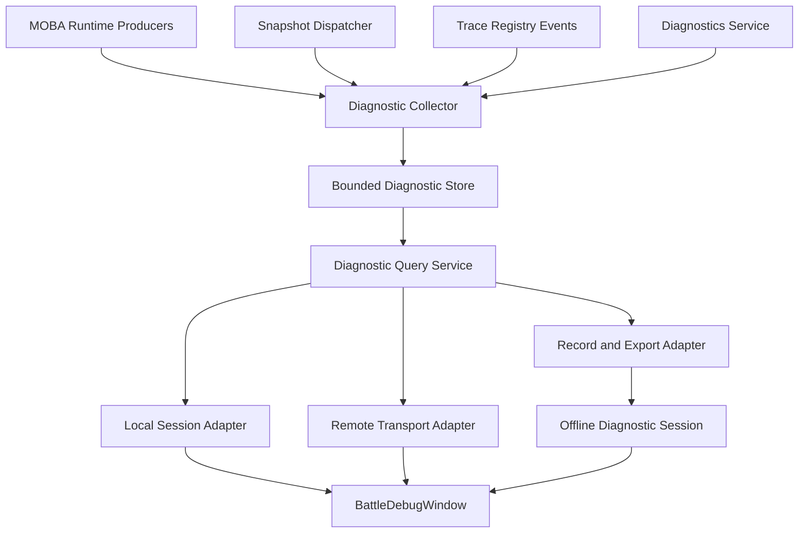

# MOBA 战斗诊断与溯源工具设计

> 状态：架构基线与演进设计
> 适用范围：`com.abilitykit.demo.moba.runtime`、`com.abilitykit.demo.moba.view.runtime`、`com.abilitykit.demo.moba.editor`
> 目标读者：战斗框架、MOBA 玩法、同步、Unity Editor 工具开发者
> 冻结对象：MVP 用户工作流、模块边界、核心 DTO、查询语义、验收门禁
> 最后更新：2026-07-19
>
> 当前实现以 [当前能力与限制](CURRENT-CAPABILITIES.md) 为准；使用入口见 [工具指南](README.md)；批次落地记录见 [实施历史](IMPLEMENTATION-HISTORY.md)。本文中的“现状盘点”和第 39 节分别是设计启动基线与历史归档，不替代当前能力快照。

## 1. 背景

MOBA 示例已经具备可运行的英雄、技能、效果、Buff、投射物、区域、召唤物、伤害流水线和同步快照。设计启动时，`BattleDebugWindow` 只能在 Play Mode 下枚举实体，并直接查看 `IUnitFacade` 暴露的属性、标签和活动效果，仍是“当前对象查看器”，不能完整回答以下问题：

- 当前战场有哪些实体、临时对象和活动技能，它们处于什么状态？
- 某个角色的属性为什么是当前值，最近发生了哪些变化？
- 一次伤害经过了哪些计算阶段，最终数值由什么技能、效果、Buff 或投射物产生？
- 某个异常效果属于哪次技能释放，它的父子对象是否正确结束？
- 问题发生在历史帧或权威服时，如何离线复现和分析？
- 客户端看到的状态与权威状态从哪一帧开始分歧？

本设计在现有窗口和运行时基础设施上演进一套完整的战斗诊断工具。它不是新的战斗逻辑入口，也不是正式游戏 UI。

## 2. 设计目标

### 2.1 核心目标

1. **战场可见**：查看世界、帧、实体、技能运行时、Buff、投射物、区域、召唤物和同步健康状态。
2. **过程可查**：按帧和时间查看技能、效果、触发器、伤害、治疗、Buff 与临时实体生命周期。
3. **结果可溯**：从伤害、治疗、Buff 或表现结果跳转至 Trace 节点、技能运行时和源实体。
4. **问题可复现**：保留有界历史，可导出结构化分析产物，并逐步接入 Record/Replay。
5. **环境可扩展**：使用相同查询契约支持本地 Play Mode、远端权威服和离线文件。
6. **低侵入**：战斗代码只依赖纯 C# 诊断契约和观察接口，禁止依赖 Unity Editor。

### 2.2 主要用户场景

- 战斗开发选择角色，检查位置、阵营、生命、属性、标签、技能和活动 Buff。
- 技能开发选择一次释放，查看阶段、输入、子运行时、黑板、结束原因及完整 Trace 树。
- 数值策划选择一条伤害结果，查看攻击创建、基础值、减伤、护盾、最终应用等阶段。
- QA 在问题发生后冻结采集，导出最近一段时间的战斗诊断文件。
- 网络开发对比本地帧、权威帧、状态哈希、回滚和快照应用状态。
- 服务端开发连接远端会话，使用与本地一致的过滤和溯源体验。

### 2.3 非目标

首期明确不做：

- 不在运行时直接修改属性、生命、Buff、技能冷却或 Trace 数据。
- 不从任意 Trace 节点重放单个 Action；重放必须通过正式 Record/Replay 会话完成。
- 不替代 Unity Profiler、Memory Profiler 或通用网络抓包工具。
- 不把所有内部对象序列化；只输出版本化、白名单化诊断 DTO。
- 不要求正式发布包默认开启详细采集。
- 不让 Editor 面板持有或修改战斗实体、BuffRuntime、技能运行时等可变对象。

## 3. 设计启动时现状盘点

本节记录立项时的输入和缺口，用于解释后续架构决策。它不是当前实现清单；现状请查阅 [当前能力与限制](CURRENT-CAPABILITIES.md)。

### 3.1 可直接复用的基础

| 能力 | 当前基础 | 工具用途 |
| --- | --- | --- |
| 实体状态 | `MobaBattleStateQueryService` | 填充基础实体状态，避免面板直接遍历 Entitas |
| 世界快照 | `MobaBattleIOPort`、Snapshot Dispatcher/Pipeline | 帧状态与远端状态输入 |
| 战斗事件 | Damage、Projectile、Area、Presentation、SkillState 快照 | 构建时间线基础事件 |
| 技能运行时 | `MobaSkillCastRuntimeService`、生命周期 Hook、Diagnostics | 技能释放与子对象生命周期 |
| 溯源 | `MobaTraceRegistry`、`RegistryEvent`、`ExportRoots` | 因果树、保留、导出与健康检查 |
| 运行时诊断 | `IMobaBattleDiagnosticsService` | 指标、警告、异常、采样和上下文关联 |
| 分析产物 | `MobaAnalysisArtifactBuilder`、`abilitykit-analysis.v1` | 离线导出和 Web 分析基础 |
| 回放 | `com.abilitykit.record` | 输入、快照、哈希及自定义事件轨道 |
| Editor | `BattleDebugWindow`、Panel Registry | Unity 入口与面板扩展机制 |

### 3.2 设计启动时缺口

1. `BattleDebugWindow` 通过 `IBattleDebugFacade` 返回活动 `IUnitFacade`，只能观察本地当前状态。
2. 状态、事件、Trace、指标分别存在，但没有统一的诊断会话和查询入口。
3. Damage 快照包含原因字段，但没有统一携带 `RootContextId`、`SourceContextId` 和技能运行时句柄。
4. 技能运行时结束后会从服务中删除，历史详情只能依赖额外采集。
5. Trace 可以导出，但缺少面向工具的增量事件存储、索引和冻结语义。
6. 警告与异常列表当前无明确容量上限，长会话需要有界保留策略。
7. 现有 Editor 面板没有帧选择、时间线、Trace 树、导出与远端连接模型。

## 4. 总体架构

### 4.1 分层



分层职责：

- **Producer**：战斗系统产生强类型事实，不感知 Editor。
- **Collector**：把不同来源标准化为诊断帧、事件和关联信息。
- **Store**：按容量保留最近状态与事件，并维护查询索引。
- **Query**：只读、分页、过滤、可取消，不暴露活动运行时对象。
- **Adapter**：适配本地对象、远端协议和离线文件。
- **Editor**：只负责交互、布局、筛选、选择联动和可视化。

### 4.2 当前包边界与后续演进

当前先在 MOBA 示例包内验证契约，依赖方向保持单向：

```text
com.abilitykit.demo.moba.runtime
  DiagnosticsCore/
    Domain/
    Query/
    Storage/
  Runtime/Application/Services/Diagnostics/
    Collection/
    Inspection/

com.abilitykit.demo.moba.view.runtime
  Runtime/Game/Battle/Debug/
    BattleDebugFacadeProvider.cs

com.abilitykit.demo.moba.editor
  Editor/BattleDebug/
    Diagnostics/
    Panels/
    ViewModels/
  Document/
  Tests/
```

Diagnostics Core 是 `noEngineReferences` 的纯 C# 边界，不引用 Unity、Editor、MOBA Runtime 或活动战斗对象。MOBA Runtime 负责采集、投影、Store 和 Local Session；Editor 只通过只读 Session 与不可变 DTO 消费诊断数据。现阶段主窗口实体枚举仍通过 View Runtime 提供的 Facade，具体边界见 [当前能力与限制](CURRENT-CAPABILITIES.md)。

当 MOBA 与 Shooter 验证出相同抽象后，再评估把通用契约下沉为 `com.abilitykit.combat.diagnostics`。禁止通用包引用 Demo MOBA 类型；MOBA 通过业务 DTO 和投影器适配。

## 5. 数据模型

### 5.1 统一关联键

所有历史事实使用统一信封，避免通过日志文本解析关联：

```csharp
public readonly struct BattleDiagnosticEventEnvelope
{
    public string SessionId { get; }
    public long Sequence { get; }
    public int Frame { get; }
    public long Timestamp { get; }
    public BattleDiagnosticEventKind Kind { get; }
    public int SourceActorId { get; }
    public int TargetActorId { get; }
    public long RootContextId { get; }
    public long ContextId { get; }
    public long ParentContextId { get; }
    public long SkillRuntimeId { get; }
    public int ConfigId { get; }
    public int PayloadVersion { get; }
    public BattleDiagnosticEventPayload Payload { get; }
}
```

约束：

- `Sequence` 在单会话内严格递增，用于同帧稳定排序。
- `Frame` 是逻辑帧；非帧驱动事件仍记录最近已知帧。
- `RootContextId` 标识一次因果树根。
- `ContextId` 标识当前事实所属 Trace 节点。
- `ParentContextId` 支持缺失 Trace 节点时的降级关联。
- `SkillRuntimeId` 关联一次技能释放；跨进程传输时同时保留 generation。
- `ConfigId` 的含义由 `Kind` 和字典定义，不能脱离类型解释。
- Payload 使用版本化的纯值类型判别联合 `BattleDiagnosticEventPayload`；远端和导出层禁止传输任意 `object` 实例。

### 5.2 当前状态与历史事实分离

**状态快照**回答“某帧是什么”：

- 世界摘要：会话、世界 ID、当前帧、实体数、状态哈希、运行模式。
- 实体摘要：ActorId、类型、阵营、位置、生命、死亡状态。
- 实体详情：属性、资源、标签、技能槽、Buff、活动运行时引用。
- 临时实体：投射物、区域、召唤物及拥有者、模板、生命周期。
- 同步状态：权威帧、本地帧、插值帧、回滚、快照间隙和重同步状态。

**历史事实**回答“为何变成这样”：

- 技能运行时生命周期。
- 技能阶段开始、结束、失败和中断。
- Effect 会话开始、条件结果、Action 结果和结束。
- Buff 应用、叠层、刷新、Tick、移除。
- 投射物生成、命中、穿透、退出和销毁。
- 区域生成、进入、退出、Tick 和过期。
- 伤害/治疗各流水线阶段与最终应用。
- Trace 节点创建、结束、保留、释放和清理。
- 警告、异常、预算阻断及同步健康事件。

状态快照不承担事件历史，事件流不反向推导所有当前状态。

### 5.3 DTO 组

建议首期定义：

- `BattleWorldDiagnosticSnapshot`
- `BattleEntitySummaryDto`
- `BattleEntityDetailDto`
- `BattleAttributeValueDto`
- `BattleTagDto`
- `BattleBuffRuntimeDto`
- `BattleSkillRuntimeDto`
- `BattleTemporaryEntityDto`
- `BattleDiagnosticEventEnvelopeDto`
- `BattleDamageStageDto`
- `BattleTraceNodeDto`
- `BattleSyncDiagnosticSnapshot`
- `BattleDiagnosticCapabilities`

每个 DTO 包含 `SchemaVersion` 或由外层协议声明版本。字段新增保持向后兼容；字段改变语义时升级版本。

### 5.4 伤害与效果溯源补强

现有 Damage 事件应补充或通过旁路诊断事件提供：

- `AttackId` 或单次伤害流水线 ID。
- `RootContextId`、`ContextId`、`ParentContextId`。
- 技能运行时句柄。
- EffectConfigId、ActionId、BuffRuntimeContextId。
- 基础值、倍率、暴击、减伤、护盾吸收、最终值。
- 每个阶段的阶段名、输入值、输出值和贡献项。
- 阻断、免疫、目标无效等未应用原因。

不要把高频阶段全部塞入面向表现的 `MobaDamageEventSnapshotEntry`。正式同步快照保持紧凑，详细阶段进入可开关的诊断事件通道。

## 6. 采集层

### 6.1 采集来源

| 来源 | 接入方式 | 采集内容 |
| --- | --- | --- |
| `MobaBattleStateQueryService` | 每 N 帧投影 | 实体基础状态 |
| 属性/标签/Buff 服务 | 选中实体按需查询 | 实体详情 |
| `MobaSkillCastRuntimeService.LifecycleHooks` | Hook | 技能生命周期与子对象 |
| `MobaTraceRegistry.RegistryEvent` | Event | Trace 增量变化 |
| `MobaEffectExecutionService` | Observer/诊断 Sink | Effect、条件、Action 结果 |
| `DamagePipelineService` | Stage Observer | 伤害阶段与结果 |
| Snapshot Dispatcher | Subscribe | Damage、Projectile、Area、Skill、Cue 事件 |
| `IMobaBattleDiagnosticsService` | Snapshot/record hook | 指标、警告和异常 |
| Sync Runtime | Health/Reconciliation event | 帧差、回滚、快照健康 |

### 6.2 采集配置

```csharp
public readonly struct BattleDiagnosticCaptureProfile
{
    public BattleDiagnosticCaptureLevel Level { get; }
    public int StateSampleIntervalFrames { get; }
    public int MaxRetainedFrames { get; }
    public int MaxEvents { get; }
    public int MaxTraceNodes { get; }
    public BattleDiagnosticChannelMask Channels { get; }
    public BattleDiagnosticFilter Filter { get; }
}
```

建议等级：

- `Off`：不创建 Collector。
- `Summary`：世界/实体摘要、最终伤害、警告、同步健康。
- `Standard`：增加技能、Effect、Buff、临时实体和 Trace 生命周期。
- `Verbose`：增加伤害阶段、条件求值、Action 结果和黑板 Debug 字段。

默认开发配置为 `Standard`；详细伤害排查时临时切换 `Verbose`。

### 6.3 热路径要求

- Producer 检查通道是否启用后再构造复杂 Payload。
- 使用值类型头部、小型 DTO、对象池和 buffer-fill API。
- Collector 不在战斗 Tick 内做 JSON 序列化、树构建或 GUI 格式化。
- 字符串使用稳定 ID 或字典；高频事件不重复保存完整显示文本。
- 单个观察器异常不得中断战斗执行，转为受限诊断异常。
- Editor 轮询只读取 Store 快照，不跨线程读取活动 ECS 对象。

## 7. 存储与索引

### 7.1 有界内存存储

`BattleDiagnosticRingStore` 建议维护：

- 帧快照环：默认 600 帧。
- 事件环：默认 20,000 条。
- Trace 节点上限：默认 10,000 个。
- 警告/异常：按 key 聚合，并保留最近样本。
- 选中/Pin 的 Trace 根：独立引用，直到取消 Pin 或达到硬上限。

达到容量时按最旧帧淘汰。若事件仍引用已淘汰状态，UI 显示“状态已淘汰”，不得静默展示错误状态。

### 7.2 索引

至少维护：

- `Frame -> EventRange`
- `ActorId -> EventSequence[]`
- `RootContextId -> TraceNode/EventSequence[]`
- `ContextId -> TraceNode`
- `SkillRuntimeId -> EventSequence[]`
- `AttackId -> DamageStage[]`
- `EventKind -> EventSequence[]`

索引随环形淘汰增量更新。MVP 可以用字典和有界列表，数据量证明需要后再引入更复杂结构。

### 7.3 冻结、Pin 与清空

- **Pause View**：暂停 UI 游标，采集继续。
- **Freeze Capture**：停止写入 Store，保证问题现场不被覆盖。
- **Pin Trace**：保留指定根的 Trace 与相关事件。
- **Clear**：仅清理诊断 Store，不影响战斗世界。

四种语义必须在 UI 和契约中分开。

## 8. 查询层

### 8.1 会话契约

```csharp
public interface IBattleDiagnosticSession : IDisposable
{
    BattleDiagnosticSessionInfo Info { get; }
    BattleDiagnosticCapabilities Capabilities { get; }
    bool IsConnected { get; }

    bool TryGetWorldSnapshot(int frame, out BattleWorldDiagnosticSnapshot snapshot);
    int FillEntitySummaries(int frame, BattleEntityFilter filter, IList<BattleEntitySummaryDto> output);
    bool TryGetEntityDetail(int frame, int actorId, out BattleEntityDetailDto detail);
    int FillEvents(in BattleEventQuery query, IList<BattleDiagnosticEventEnvelopeDto> output);
    bool TryGetTrace(long rootContextId, out BattleTraceTreeDto trace);
    bool TryGetSkillRuntime(long runtimeId, out BattleSkillRuntimeDto runtime);

    void SetCaptureProfile(in BattleDiagnosticCaptureProfile profile);
    void FreezeCapture(bool frozen);
    void ClearCapture();
}
```

查询要求：

- 所有集合采用调用方 buffer 或分页 API。
- 查询结果是不可变 DTO，不返回 `ActorEntity`、`IUnitFacade` 或 Runtime 对象。
- 远端不支持的能力通过 `Capabilities` 禁用 UI，而不是抛出异常。
- 历史帧不可用时明确返回原因：尚未产生、已淘汰、远端不支持或会话断开。

### 8.2 查询过滤

统一过滤维度：

- 帧范围、事件类型、严重级别。
- SourceActorId、TargetActorId、任一相关 ActorId。
- SkillId、EffectId、BuffId、ProjectileId、AreaId。
- RootContextId、ContextId、SkillRuntimeId、AttackId。
- 仅失败、仅未结束、仅等待子对象、仅发生回滚。
- 文本搜索只作用于字典解析后的显示名，不作为主索引。

## 9. 本地、远端与离线适配

### 9.1 本地 Play Mode

`LocalBattleDiagnosticSessionAdapter` 从活动 World 解析查询服务和 Store。`BattleDiagnosticSessionProvider.Current` 替代窗口对 `BattleDebugFacadeProvider.Current` 的强绑定。

迁移期保留旧 Facade：

- 新会话可用时，所有新面板走诊断会话。
- 新会话不可用时，旧总览、属性、标签和效果面板可降级读取 Facade。
- 完成实体详情 DTO 后，旧面板改为只读 DTO，最终移除直接对象读取。

### 9.2 远端权威服

远端协议采用请求/响应加增量流：

- `Hello/Capabilities`
- `SetCaptureProfile`
- `GetWorldSnapshot`
- `GetEntityDetail`
- `QueryEvents`
- `GetTrace`
- `SubscribeLiveEvents`
- `Freeze/Clear/Export`

安全约束：

- 默认只读，调试命令需开发环境和明确授权。
- 限制查询帧范围、页大小、事件速率和导出大小。
- 协议携带 schema version、session ID、world ID 和服务器构建版本。
- 断线重连后创建新 epoch，禁止把不同世界的相同 ActorId 混合。

远端传输在第二阶段实现，不阻塞本地 MVP。

### 9.3 离线文件

离线会话读取统一分析产物。短期扩展 `abilitykit-analysis.v1` 的 Runtime/Trace/Diagnostics；中期增加专用战斗轨道：

- `battle.diagnostic.events`
- `battle.diagnostic.frames`
- `battle.trace`
- `battle.dictionaries`

与 Record 集成时，诊断事件作为独立轨道，不改变 Inputs、Snapshots、StateHash 三条正式轨道语义。

## 10. Editor 信息架构

保留 `BattleDebugWindow` 菜单入口，窗口升级为三栏加底部时间轴：

```text
+---------------------------------------------------------------+
| Session | Live/Pause | Frame | Capture | Filter | Export      |
+-------------+-----------------------------+-------------------+
| Battlefield | Main View                   | Inspector         |
| entity tree | Overview / Timeline / Trace | selected details  |
| and filters | Sync / Diagnostics          | links and actions |
+-------------+-----------------------------+-------------------+
| frame ruler, event density, bookmarks, current cursor          |
+---------------------------------------------------------------+
```

### 10.1 战场总览

显示：

- 会话、WorldId、当前帧、采集等级和内存占用。
- 按类型和阵营汇总实体。
- 活动技能、Buff、投射物、区域、召唤物数量。
- Trace 根、活动根、被保留根、陈旧保留根。
- 警告、异常、回滚和同步健康摘要。
- SceneView 可选绘制实体位置、区域范围和投射物路径。

交互：选择实体、跳到异常帧、冻结现场、导出。

### 10.2 实体检查器

标签页：

- **摘要**：ID、类型、阵营、位置、生命、存活状态。
- **属性**：基础值、最终值；后续增加 Modifier 来源。
- **资源**：生命、法力及自定义资源。
- **标签**：当前标签及来源；后续增加获得/移除历史。
- **技能**：槽位、等级、状态、最近运行时。
- **Buff**：实例、配置、来源、层数、时长、下次 Tick、运行时上下文。
- **相关事件**：该实体作为 Source 或 Target 的时间线。

所有 ContextId、RuntimeId 和 ConfigId 都提供跳转，不只提供复制文本。

### 10.3 战斗时间线

泳道建议：

- Skill
- Effect/Trigger/Action
- Buff
- Projectile/Area/Summon
- Damage/Heal
- Sync/Warning/Exception

能力：

- 按帧缩放和平移。
- 事件密度聚合，避免大量 Tick 逐条绘制。
- 多条件过滤和仅失败视图。
- 点击事件联动实体、Trace、技能运行时和配置资产。
- 同帧事件按 `Sequence` 稳定排序。
- Bookmark 问题帧并附简短备注，备注只存在工具侧。

### 10.4 因果溯源

Trace 视图同时提供树和路径两种模式：

- 树模式：技能 -> 阶段 -> Effect -> Action -> Buff/Projectile/Area/Summon -> Damage。
- 路径模式：从选中结果向父节点回溯至根，突出单条因果链。

节点显示：

- Kind、ConfigId 和解析后的名称。
- Source/Target Actor。
- 创建帧、结束帧、结束原因和子节点数。
- 关联技能运行时和诊断警告。
- 数据是否截断、是否被淘汰、是否仍被外部保留。

错误提示：孤儿节点、父节点缺失、活动根超时、Ended Root 仍被保留、技能等待子对象。

### 10.5 伤害分析

选择最终伤害后显示：

- 攻击者、目标、技能、Effect、Action、Buff/投射物来源。
- HP Before/After、最终伤害、伤害类型和命中结果。
- 阶段瀑布：Base -> Modifier -> Mitigation -> Shield -> Final -> Apply。
- 每阶段输入、输出、差值、贡献者和条件结果。
- 一键切换到 Trace 路径、源实体、目标实体和对应帧。

### 10.6 同步与健康

复用现有 FrameSync 面板经验，统一显示：

- 本地、权威、表现帧和时间锚。
- 状态哈希、最后应用快照、缺口、饥饿与恢复。
- 回滚次数、范围、原因和最近结果。
- 网络条件统计和 reconciliation report。
- 世界组合报告、缺失服务、快照输出契约和临时实体健康。

## 11. UI 状态与扩展模型

现有 `IBattleDebugPanel` 反射注册可保留，但 Context 应升级为：

```csharp
internal readonly struct BattleDebugContext
{
    public IBattleDiagnosticSession Session { get; }
    public BattleDebugSelection Selection { get; }
    public BattleDebugFrameCursor FrameCursor { get; }
    public BattleDebugFilterState Filters { get; }
    public Action RequestRepaint { get; }
}
```

统一选择模型支持：

- Frame
- Actor
- Event
- TraceRoot/TraceNode
- SkillRuntime
- Attack
- ConfigAsset

面板之间通过 Selection Controller 联动，不直接互相调用。Panel Registry 应记录构造异常并缓存可见面板，避免每次 GUI 绘制重复分配列表和字符串数组。

## 12. 性能与可靠性预算

建议 MVP 验收预算，以开发机构建、典型 10 名英雄与常规临时实体负载为基线：

- `Standard` 采集平均 CPU 开销不超过战斗 Tick 的 3%。
- 未打开窗口时，Editor 展示层无轮询和分配。
- 窗口打开时普通帧 GC Alloc 目标小于 10 KB，时间线重建除外。
- 默认 Store 内存上限 32 MB，可配置但必须有硬上限。
- Editor 刷新频率默认 4 Hz，时间线播放时最高 15 Hz，不绑定 `OnGUI` 无限采样。
- 单次查询默认最多 500 条事件；大结果分页。
- 导出在战斗线程外完成；导出前先冻结不可变快照。
- Collector、Transport、Editor 任一异常不得改变战斗结果。

应提供诊断自监控：事件写入数、丢弃数、淘汰数、采集耗时、序列化耗时、Store 字节估算和远端积压。

## 13. 实施路线

### Phase 0：契约与地基

目标：从直接对象读取迁移到统一只读会话。

- 定义 Session、Capabilities、World/Entity/Event/Trace DTO。
- 实现本地 Collector、Ring Store 和 Query Service。
- 接入实体基础状态、Trace Registry Event、技能运行时生命周期。
- 为已有 Damage/Projectile/Area/SkillState 快照建立事件投影。
- 增加开关、容量、采样和自监控。
- 为 DTO、环形淘汰、索引和关联键编写纯 .NET 测试。

### Phase 1：本地 Editor MVP

目标：可以在 Play Mode 完成一次战斗问题定位闭环。

- 改造 `BattleDebugWindow` 为诊断会话入口。
- 完成战场总览、实体列表、实体详情、时间线和 Trace 树。
- 完成事件到实体、技能运行时、Trace 和配置的跳转。
- 完成 Pause View、Freeze Capture、Clear、Pin Trace。
- 完成 JSON 分析产物导出。
- 保留旧面板降级路径，随后迁移属性、标签和效果面板。

### Phase 2：效果与伤害深度诊断

目标：解释最终数值，而不仅是展示结果。

- 增加 Effect Session、条件、Action 结果观察器。
- 增加 Damage Pipeline Stage Observer 和 AttackId。
- 补齐 Buff 生命周期、Modifier 来源和属性变化历史。
- 增加技能黑板 Debug 字段投影。
- 增加因果路径视图、异常规则和对比视图。

### Phase 3：录制、离线与远端

目标：脱离问题现场分析权威服和历史战斗。

- 接入 Record 自定义诊断轨道。
- 实现 Offline Diagnostic Session。
- 定义远端协议、权限、限流和版本协商。
- 实现权威服 Adapter 与增量订阅。
- 支持本地/权威同帧状态和事件对比。

### Phase 4：框架化与生产化

目标：从 MOBA 示例经验提炼通用战斗诊断能力。

- 评估下沉 `com.abilitykit.combat.diagnostics`。
- Shooter 与其他示例适配统一 Session 契约。
- 增加自动规则、CI 产物、Web 报告和问题包上传流程。
- 建立 schema 兼容策略和长周期性能基线。

## 14. MVP 范围

MVP 必须包含：

- 本地 Play Mode 会话。
- 世界与实体基础快照。
- 实体属性、标签、活动效果的只读详情。
- Damage、Projectile、Area、Skill 生命周期事件时间线。
- Trace 根列表、树展示和从事件跳转 Trace。
- 技能运行时摘要与等待子对象诊断。
- 警告、异常和基础同步健康摘要。
- 采集等级、过滤、冻结、清空和容量显示。
- 导出 `abilitykit-analysis.v1` 或其向后兼容扩展。

MVP 不包含：远端连接、完整伤害阶段瀑布、属性 Modifier 来源、任意状态修改和任意节点重放。

## 15. 验收标准

### 15.1 功能验收

1. 进入 MOBA Play Mode 后，窗口能连接当前会话并显示当前帧和实体总数。
2. 选择英雄后能查看位置、阵营、生命、属性、标签、技能和活动 Buff/效果。
3. 释放包含投射物或区域的技能后，时间线能按稳定顺序显示技能、临时实体和伤害事件。
4. 选择一条伤害事件能跳到 Source、Target、技能运行时和 Trace 路径；缺失信息有明确提示。
5. 技能等待未释放子对象时，窗口能显示子对象类型和引用信息。
6. Freeze 后 Store 内容不再变化，但战斗继续正常运行；恢复后采集继续。
7. 事件超过容量后按策略淘汰，索引查询不返回悬空或错误记录。
8. 导出文件可被现有分析模型读取，包含会话、时间轴、诊断和 Trace。
9. 关闭工具或设置 `Off` 后，战斗行为、状态哈希和回放结果不变。

### 15.2 性能验收

- 采集开关关闭时无高频事件对象分配。
- `Standard` 负载满足第 12 节 CPU、GC 和内存目标。
- 连续运行 30 分钟后 Store 不超过配置硬上限。
- 20,000 条事件下常用过滤和选中跳转不产生明显编辑器卡顿。

### 15.3 架构验收

- Runtime 程序集不引用 UnityEditor 或 Editor 程序集。
- Editor 不直接持有可变 ECS Entity、BuffRuntime 或 SkillRuntime。
- DTO、协议和导出 Schema 有明确版本。
- 当前状态、历史事件、指标和同步报告保持独立模型。
- 所有关键结果可通过稳定 ID 关联，不依赖解析日志字符串。

## 16. 测试策略

### 16.1 单元测试

- 环形 Store 写入、淘汰、冻结、清空和 Pin。
- 同帧 Sequence 排序与多索引一致性。
- Trace 创建/结束/清理事件投影。
- 技能运行时生命周期投影和结束后历史保留。
- DTO 版本兼容、序列化和未知事件降级。
- 过滤组合、分页和已淘汰状态错误码。

### 16.2 集成测试

- 普通攻击伤害链。
- 技能 -> Effect -> Projectile -> Hit -> Damage 链。
- 技能 -> Area -> Buff Tick -> Damage 链。
- 召唤物继承技能来源并造成伤害。
- 技能取消、角色死亡、回滚清理和强制结束。
- Trace 根保留泄漏与技能等待子对象告警。
- 状态快照与事件流处于相同 Session/World epoch。

### 16.3 Editor 测试

- 无会话、连接中、活动、冻结、断开和离线状态。
- 大量实体和事件下列表虚拟化与布局稳定性。
- 面板跳转、筛选、Frame Cursor 和 Selection 联动。
- 导出进度、取消和错误提示。

## 17. 风险与决策

| 风险 | 决策 |
| --- | --- |
| 详细采集影响确定性或性能 | 采集只观察；关闭时不构造 Payload；建立状态哈希回归 |
| Trace 生命周期短于工具查看周期 | Collector 增量复制 DTO；Pin 只保留必要根并设置硬上限 |
| 正式同步 DTO 被诊断需求膨胀 | 详细字段走独立诊断通道，不污染表现快照 |
| Editor 直接读活动对象产生竞态 | 统一使用不可变查询快照 |
| 本地、远端和离线能力不同 | Capabilities 协商和显式降级 |
| 日志、指标、事件模型混淆 | 保持独立模型，在查询层通过关联键聚合 |
| 过早抽象通用包 | 先在 MOBA 完成两个阶段，再依据跨 Demo 重复度下沉 |
| 长时间运行内存增长 | 所有流和列表有界，警告按 key 聚合，导出使用冻结副本 |

## 18. 首批开发任务建议

1. 建立 `Inspection/Contracts`，定义会话、能力、世界、实体、事件和 Trace DTO。
2. 实现 `BattleDiagnosticRingStore` 及索引单元测试。
3. 实现 Trace 与技能运行时生命周期 Collector。
4. 实现实体基础状态 Projector，复用 `FillDiagnosticEntityStates`。
5. 实现 Snapshot 事件 Projector，先覆盖 Damage、Projectile、Area、SkillState。
6. 实现本地 `IBattleDiagnosticSession` 与 Provider。
7. 改造窗口 Session Toolbar、Frame Cursor 和 Selection Controller。
8. 实现 Overview、Entity、Timeline、Trace 四个 MVP 面板。
9. 接入现有 Diagnostics Snapshot 和分析产物导出。
10. 运行技能组合验收与 30 分钟有界内存测试。

## 19. 需求基线与优先级

### 19.1 优先级定义

- **P0**：缺失时无法形成一次完整排障闭环，属于 MVP 发布阻断项。
- **P1**：不阻断基础排障，但显著影响复杂技能、数值或长会话问题定位。
- **P2**：面向远端、离线、自动化和跨项目复用，在本地 MVP 稳定后实现。

### 19.2 功能需求清单

| 编号 | 优先级 | 需求 | 完成定义 |
| --- | --- | --- | --- |
| FR-001 | P0 | 自动发现并连接本地活动战斗会话 | 窗口能区分无会话、连接中、活动、冻结、断开状态，不依赖面板读取活动对象 |
| FR-002 | P0 | 查看指定历史帧的世界和实体状态 | 帧存在时返回一致快照；不可用时返回明确原因，不回退到当前帧冒充历史状态 |
| FR-003 | P0 | 按实体、帧、事件类型和关联 ID 查询事件 | 同帧按 Sequence 稳定排序，分页和组合过滤结果可重复 |
| FR-004 | P0 | 从结果事件跳转到 Source、Target、技能运行时和 Trace | 每个不可达目标都显示缺失、淘汰或能力不支持原因 |
| FR-005 | P0 | 展示 Trace 树与单条父链路径 | 支持根、节点选择，识别孤儿节点、未结束节点和截断数据 |
| FR-006 | P0 | 控制 Pause View、Freeze Capture、Pin Trace 和 Clear | 四种操作语义独立，均不得改变战斗世界 |
| FR-007 | P0 | 导出当前诊断现场 | 导出包含会话元数据、字典、状态范围、事件、Trace、指标及截断说明 |
| FR-008 | P0 | 诊断系统有界运行并自监控 | 展示容量、内存估算、写入、丢弃、淘汰和采集耗时 |
| FR-009 | P0 | 保证关闭采集不改变确定性 | Off 前后相同输入的状态哈希和回放结果一致 |
| FR-010 | P1 | 展示 Effect、条件和 Action 执行过程 | 可定位失败条件、跳过 Action 和异常结束原因 |
| FR-011 | P1 | 展示伤害阶段瀑布和贡献项 | 最终伤害可回溯基础值、修正、减免、护盾和应用结果 |
| FR-012 | P1 | 展示 Buff、属性和 Modifier 变化来源 | 可从最终属性或 Buff 实例跳转到来源事件和 Trace |
| FR-013 | P1 | 对比两个帧或两个实体快照 | 差异按字段分组，明确字段缺失与数据淘汰 |
| FR-014 | P2 | 打开离线诊断文件 | 离线会话复用相同选择、过滤、时间线和 Trace 视图 |
| FR-015 | P2 | 连接远端权威会话 | 完成能力协商、版本校验、限流、断线 epoch 隔离和只读查询 |
| FR-016 | P2 | 本地与权威数据同帧对比 | 可定位首次哈希或关键状态分歧帧并导出证据 |

### 19.3 非功能需求清单

| 编号 | 约束 |
| --- | --- |
| NFR-001 | Runtime 不引用 UnityEditor；Editor 不持有活动 ECS 或技能、Buff 运行时对象 |
| NFR-002 | Standard 采集平均开销不超过战斗 Tick 的 3%，默认内存硬上限 32 MB |
| NFR-003 | 所有集合查询有容量或分页边界；所有长生命周期存储有淘汰策略 |
| NFR-004 | DTO、导出和远端协议版本可协商；未知字段和未知事件可降级读取 |
| NFR-005 | Collector、查询、导出或界面异常不能传播到战斗执行路径 |
| NFR-006 | 高频事件关联依赖稳定 ID，不依赖显示文本、对象引用或日志解析 |
| NFR-007 | 相同 Store 内容、查询参数和游标必须得到稳定结果，便于测试和复现 |
| NFR-008 | 所有“数据不可用”都必须区分未采集、未产生、已淘汰、已截断、能力不支持和连接断开 |

## 20. 核心用户工作流

### 20.1 当前角色状态排查

1. 用户进入 Play Mode，窗口连接本地会话并跟随最新帧。
2. 用户从战场树或 SceneView 选择 Actor，选择模型同步到实体检查器。
3. 工具读取同一 Frame Cursor 下的实体摘要和详情，不混用不同帧数据。
4. 用户从属性、技能或 Buff 跳转到相关事件，再跳转到 Trace 或配置资产。
5. 若详情只支持当前帧，界面明确标注 Live-only，不在历史帧展示当前值。

闭环结果：用户能够回答“这个角色当前有什么状态，以及这些状态来自哪里”。

### 20.2 伤害结果溯源

1. 用户在时间线、实体相关事件或异常列表中选择最终伤害。
2. 工具以 AttackId 聚合同一伤害流水线，以 RootContextId 聚合完整因果链。
3. 主视图显示结果摘要；P1 阶段显示各计算阶段、输入输出和贡献项。
4. 用户可跳转攻击者、目标、技能运行时、Effect/Action、Buff/投射物和 Trace 路径。
5. 任一链路缺失时显示缺失类型和数据边界，不推测或伪造关联。

闭环结果：用户能够回答“谁通过什么执行链，在什么计算阶段造成了这个数值”。

### 20.3 技能未结束或子对象泄漏排查

1. 用户从活动技能、告警或仅未结束过滤器定位 SkillRuntimeId。
2. 工具展示技能阶段、开始帧、结束状态、待释放子对象和关联 Trace 根。
3. Trace 树突出仍活动、超时、孤儿、外部保留和父节点缺失状态。
4. 用户 Pin 根后继续运行战斗，确认子对象是否结束或保留计数是否下降。
5. 用户冻结并导出现场，导出物保留运行时、Trace、告警和相关事件。

闭环结果：用户能够区分正常异步等待、生命周期泄漏和强制结束异常。

### 20.4 历史问题现场保全

1. 用户发现异常后使用 Pause View 停住观察游标；采集仍继续。
2. 若需防止覆盖，使用 Freeze Capture 固化 Store；战斗仍继续。
3. 用户添加 Bookmark、选择相关实体/事件/Trace 并检查 Store 截断状态。
4. 导出服务从冻结的不可变视图生成文件，不阻塞战斗线程。
5. 导出完成后可解除冻结或清空诊断数据，均不影响世界状态。

闭环结果：现场操作语义清楚，导出内容能够独立说明数据范围与完整性。

### 20.5 同步分歧排查

1. 用户从同步健康摘要定位哈希失败、回滚或快照缺口。
2. 时间线跳到首次异常帧，并显示本地帧、权威帧、快照和 reconciliation 事件。
3. P2 阶段加载权威数据，以同一逻辑帧和字段 Schema 对比世界及关键实体。
4. 工具导出分歧前后状态、输入、事件和 Trace，不把表现帧当作逻辑帧。

闭环结果：用户能够回答“从哪一帧开始、哪些字段首先出现分歧，以及当时执行了什么”。

## 21. Editor 行为规格

### 21.1 会话状态机

| 状态 | 可用行为 | 界面要求 |
| --- | --- | --- |
| NoSession | 重新发现、打开离线文件 | 清空活动选择，保留工具侧过滤预设 |
| Connecting | 取消连接 | 禁止数据操作，显示目标和进度 |
| Live | 查询、跟随、Pause View、Freeze、Pin、Export | 显示最新帧、采集档位和 Store 健康 |
| ViewPaused | 浏览保留帧、筛选、Pin、Export | 明确显示“仅视图暂停”，采集状态单独显示 |
| CaptureFrozen | 查询、Pin、Export、解除冻结、Clear | 显示冻结帧和冻结时容量，不显示为战斗暂停 |
| Disconnected | 浏览已缓存数据、导出、重连 | 禁止需要活动端点的命令，缓存数据标记只读 |
| Offline | 查询、筛选、导出派生报告 | 隐藏采集控制，显示文件 Schema 和完整性 |
| Incompatible | 查看版本信息 | 不尝试部分反序列化必需契约，给出版本原因 |

状态可以组合：例如 Live + ViewPaused，或 Disconnected + CaptureFrozen。实现中会话连接状态、视图播放状态和采集状态必须使用独立字段，禁止压缩成一个布尔值。

### 21.2 Frame Cursor 规则

- Follow Live 开启时，游标跟随 Store 最新完整帧；用户拖动时间轴后自动关闭 Follow Live。
- Pause View 只关闭 Follow Live，不调用 Runtime Pause，也不停止 Collector。
- 切换帧后，所有声明支持历史查询的面板必须使用同一游标帧。
- 面板仅支持 Live 详情时，在非最新帧禁用内容并显示 Live-only，不自动读取最新对象。
- 当前帧被淘汰后，游标移动到最早可用帧并显示一次非阻塞提示。
- 事件选择保留原始帧；跳转实体时默认在事件帧查看该实体。

### 21.3 选择与跳转规则

- Selection Controller 是唯一选择写入口；面板发布选择意图，不直接调用其他面板。
- 选择对象包含 Kind、稳定 ID、SessionId、WorldEpoch、Frame 和可选关联 ID。
- 跨会话或 epoch 的选择必须失效，禁止复用相同 ActorId 自动命中。
- 跳转不改变用户过滤器；目标被过滤时显示临时定位结果，并允许用户显式放宽过滤。
- 配置资产解析失败不影响运行时关联，仍显示 ConfigId 和字典名称。
- Back/Forward 维护工具侧导航历史，最多保留 100 条，不写入诊断 Store。

### 21.4 查询、加载与错误

- 列表首次最多请求 500 条，继续滚动或翻页时增量请求。
- 查询必须有 Loading、Empty、Partial、Evicted、Unsupported、Error 六类结果表现。
- 新查询开始后，旧查询结果可显示但标记 Stale；完成后原子替换。
- 远端与大查询支持取消；晚到结果需校验请求 ID 和会话 epoch 后再应用。
- 错误面板提供错误码、简短说明和关联上下文，不展示无法操作的堆栈大文本。
- UI 不通过捕获异常判断能力是否存在，必须先读取 Capabilities。

### 21.5 面板首期字段冻结

| 区域 | P0 必须显示 | P1/P2 延后 |
| --- | --- | --- |
| Toolbar | 会话、连接状态、Follow/Pause、帧、Capture 档位、Freeze、容量、Export | 远端地址、权限、对比会话 |
| Battlefield | ActorId、类型、阵营、生命、位置、存活状态 | 自定义分组、空间查询 |
| Entity Inspector | 摘要、属性最终值、资源、标签、技能槽、活动 Buff、相关事件 | Modifier 贡献、属性历史对比 |
| Timeline | 帧、Sequence、Kind、Source、Target、结果摘要、关联状态 | 自定义泳道、跨会话对比 |
| Trace | 根/父子树、路径、Kind、ConfigId、Actor、起止帧、结束原因 | 图布局、规则建议 |
| Diagnostics | 告警、异常、同步健康、Store 自监控 | 自动根因分类、趋势报告 |

## 22. 组件职责与所有权

| 组件 | 所属包 | 负责 | 明确不负责 |
| --- | --- | --- | --- |
| Producer Observer | MOBA Runtime | 在语义发生点产生强类型诊断事实 | 存储、序列化、Editor 格式化 |
| Diagnostic Collector | MOBA Runtime | 分配 Sequence、补齐关联头、投影 Payload | GUI 查询、远端权限、长期文件管理 |
| Ring Store | MOBA Runtime | 有界保存、索引、冻结、Pin、淘汰 | 从活动运行时反查缺失事实 |
| Query Service | MOBA Runtime | 一致只读视图、过滤、分页、错误原因 | 返回活动对象、保存 Editor 状态 |
| Local Session Adapter | MOBA View Runtime | 发现本地会话并适配统一 Session | 直接遍历 ECS、复制采集逻辑 |
| Remote Adapter | Host/Transport 扩展 | 能力协商、请求、增量流、限流 | 定义 MOBA 事件语义、执行战斗命令 |
| Offline Session | Record/Analysis 适配层 | 从版本化文件提供统一查询 | 推测文件中未记录的数据 |
| Selection Controller | MOBA Editor | 选择、导航历史、跨面板联动 | 访问 Runtime 服务、持有活动对象 |
| BattleDebugWindow | MOBA Editor | 布局、状态展示、刷新调度 | 采集、因果计算、业务对象修改 |
| Panels/Views | MOBA Editor | 查询并绘制 DTO、发出选择意图 | 面板间直接依赖、维护第二份业务状态 |

### 22.1 依赖方向

允许的依赖方向为：Editor -> View Runtime Adapter -> Runtime Contracts/Query。Runtime Collector 只能依赖 Runtime 内诊断契约和现有战斗服务。远端、Record 和 Web 客户端都消费同一 Schema，但不要求共享 Unity 程序集。

### 22.2 扩展点

- 新事件类型：增加稳定 Kind、版本化 Payload DTO、Producer 投影器和可选 Renderer。
- 新实体详情：通过能力位和详情分区扩展，不扩大所有实体摘要。
- 新查询索引：由真实性能数据驱动，不改变既有查询语义。
- 新 Editor 面板：消费 Session 和 Selection，不获取 World 或 Facade。
- 新传输方式：实现 Session/协议适配，不复制 Collector 和 Store。
- 新游戏 Demo：定义业务投影 DTO；只有两个以上 Demo 语义稳定相同时才下沉通用契约。

## 23. 契约冻结清单

进入 Phase 0 实现前，下列内容必须评审并标记 Baseline 1.0；实现中如需改变，必须走第 25 节变更流程：

1. 会话身份：SessionId、WorldId、WorldEpoch、BuildId、SchemaVersion 的定义和生命周期。
2. 顺序语义：逻辑 Frame 与单会话严格递增 Sequence 的排序规则。
3. 关联键：ActorId、Root/Context/ParentContextId、SkillRuntimeId + Generation、AttackId、ConfigId。
4. 数据可用性：Available、NotProduced、NotCaptured、Evicted、Truncated、Unsupported、Disconnected。
5. 查询一致性：查询针对 Store Revision 或不可变 Read View，分页期间不能静默混入新数据。
6. 控制语义：Pause View、Freeze Capture、Pin Trace、Clear 的作用域和权限。
7. 版本策略：信封版本、Payload 版本、导出 Schema、能力位和未知事件降级规则。
8. 所有权边界：Producer、Collector、Store、Query、Adapter、Editor 各层职责。

### 23.1 实现前必须消除的契约歧义

| 决策项 | 建议基线 | 评审输出 |
| --- | --- | --- |
| 时间戳单位 | 单调时钟 Tick，并由 SessionInfo 提供频率；展示层换算 | 确认 Runtime 可用时钟来源 |
| Frame 无效值 | 使用明确常量 InvalidFrame，不用 0 表示未知 | 确认首帧是否允许为 0 |
| ActorId 作用域 | 仅在 SessionId + WorldEpoch 内唯一 | 确认实体重建后的 ID 策略 |
| Runtime Generation | 与 RuntimeId 一起构成完整句柄 | 复用现有 Handle 定义 |
| Store 一致性 | 每次查询返回 StoreRevision，分页固定 revision | 选择快照视图或 revision 游标实现 |
| Freeze 恢复 | 恢复后只采集新事实，不补采冻结区间 | 产品与技术共同确认 |
| Pin 淘汰 | 软上限内保留，硬上限时拒绝新 Pin 并告警 | 确认默认软/硬容量 |
| 导出一致性 | 从 Store 冻结副本导出，不要求冻结战斗采集 | 确认复制预算和后台线程模型 |

未经确认的字段可以放入 Payload 扩展区，但不得污染稳定信封或让 UI 依赖其存在。

## 24. 需求追踪与交付门禁

### 24.1 需求追踪矩阵

| 需求 | 主要组件 | 主界面 | 验证 |
| --- | --- | --- | --- |
| FR-001/002 | Session、State Projector、Query | Toolbar、Battlefield | 会话状态集成测试、历史帧一致性测试 |
| FR-003 | Store Index、Query | Timeline | 组合过滤、分页、同帧排序单元测试 |
| FR-004/005 | Event/Trace Collector、Selection | Timeline、Trace、Inspector | 四类跳转链与缺失数据 Editor 测试 |
| FR-006 | Store、Frame Cursor | Toolbar、Timeline | Pause/Freeze/Pin/Clear 语义隔离测试 |
| FR-007 | Export Adapter | Toolbar、Diagnostics | 导出 round-trip 与截断元数据测试 |
| FR-008/009 | Collector、Store、Self Metrics | Overview、Diagnostics | 30 分钟压力测试、哈希/回放回归 |
| FR-010/011/012 | Effect/Damage/Buff Observer | Timeline、Damage、Inspector | 典型技能因果链集成测试 |
| FR-014/015/016 | Offline/Remote Adapter | Session、Compare | Schema 兼容、断线 epoch、同帧对比测试 |

每个开发任务必须关联至少一个 FR/NFR 编号、一个契约或 DTO、一个测试项。没有需求编号的功能不得直接进入 MVP。

### 24.2 Phase 0 进入门禁

- 本文的 P0 范围、核心工作流和非目标完成评审。
- 第 23 节八类稳定契约及歧义表有明确结论。
- 确认 DTO 所属程序集和依赖方向。
- 确认基准战斗负载、性能采样方法和确定性对照用例。

### 24.3 Phase 0 退出门禁

- Session、Capabilities、基础 DTO、Store 和 Query API 通过契约测试。
- Trace、技能生命周期、实体和基础快照事件完成采集。
- 冻结、淘汰、Pin、分页和 revision 一致性测试通过。
- Off 模式确定性回归通过；Standard 达到初步性能预算。
- 不允许以 Editor 直接读取活动对象作为新面板的临时实现。

### 24.4 Phase 1 退出门禁

- FR-001 至 FR-009 全部满足并完成需求演示。
- 五条核心工作流中除 P1/P2 部分外均可闭环。
- 老面板已迁移到 DTO 或被标记为明确的兼容隔离区。
- 30 分钟有界内存、20,000 事件查询和导出 round-trip 通过。
- 已知缺陷、数据缺口和性能例外进入发布说明，不以静默降级处理。

后续阶段不得绕过前一阶段门禁来扩展 UI。若底层契约不满足，优先修复采集、存储或查询层，而不是在面板中建立旁路数据源。

## 25. 变更控制

### 25.1 允许直接演进

以下变化不改变既有语义时可以常规评审合入：

- 新增可选 DTO 字段和能力位。
- 新增事件 Kind 及其独立 Payload。
- 新增面板、过滤预设或 Renderer。
- 调整默认容量和刷新频率，但不突破硬预算。
- 新增索引优化且查询结果保持一致。

### 25.2 必须提交设计变更记录

以下变化必须记录动机、兼容影响、迁移方案和测试影响：

- 修改稳定关联 ID、Frame、Sequence 或 epoch 语义。
- 改变 Freeze、Pin、Clear 或查询一致性语义。
- 删除/重命名字段，或改变字段单位、默认值和作用域。
- 引入 Editor 到 Runtime 的反向依赖，或允许面板读取活动对象。
- 把诊断字段加入正式同步快照或确定性状态。
- 新建通用诊断包或改变 DTO 所有权。

建议在本文“决策记录”表追加条目；大范围变更单独建立 ADR，并从表中链接。

### 25.3 决策记录

| ID | 决策 | 原因 | 状态 |
| --- | --- | --- | --- |
| ADR-001 | 演进现有 BattleDebugWindow，不创建第二个战斗诊断窗口 | 复用入口和面板生态，避免两套选择与连接模型 | Accepted |
| ADR-002 | Editor 仅消费不可变 DTO 和只读 Session | 支持历史、远端、离线并消除活动对象竞态 | Accepted |
| ADR-003 | 状态快照、历史事件、Trace、指标和 Record 保持独立模型 | 各自回答不同问题，避免单一巨型模型 | Accepted |
| ADR-004 | 详细伤害数据走可开关诊断通道 | 避免膨胀正式同步和表现快照 | Accepted |
| ADR-005 | 先在 MOBA 验证，再评估通用包 | 防止依据单一 Demo 过早抽象 | Accepted |
| ADR-006 | MVP 只读，不提供状态修改和任意节点重放 | 保证工具不改变问题现场和战斗结果 | Accepted |

## 26. 开发拆分规则

为减少多人并行开发时的重复实现，任务按纵向契约拆分，不按“每个面板自己做全套数据”拆分：

1. **契约任务**：DTO、能力位、错误码和版本测试，先于 Producer 与 UI。
2. **采集任务**：一个事实只能有一个权威 Producer；Snapshot 投影与语义 Observer 不得重复发同一事件。
3. **存储任务**：统一 Store 和索引，不允许每个面板维护独立历史缓存。
4. **查询任务**：过滤、分页和关联聚合在 Query 层实现，不在 UI 重复扫描全量事件。
5. **交互任务**：选择、帧游标、过滤和导航属于共享 Editor 状态，不由单个面板私有实现。
6. **视图任务**：Panel 只渲染 DTO 和发布意图，允许并行实现但必须通过统一状态测试夹具。
7. **集成任务**：按第 20 节工作流验收，不以“面板能打开”作为完成标准。

首个实现 PR 应只包含 Baseline 1.0 契约、错误模型和测试夹具；第二批实现 Store/Query；第三批接入 Producer；第四批才开始主窗口与面板迁移。这样可以尽早暴露关联键、历史语义和容量策略问题，避免 UI 完成后反向重构数据层。

## 27. Editor 技术选型

### 27.1 MVP 选择

现有 `BattleDebugWindow` 和全部面板使用 IMGUI。Phase 0/1 保留 `EditorWindow.OnGUI` 外壳，避免数据架构迁移与 UI 框架迁移同时发生，但不继续堆叠无状态 `EditorGUILayout` 代码。新增共享组件：

- `BattleDebugLayoutState`：分栏尺寸、折叠、选项卡和滚动位置。
- `BattleDebugStyles`：颜色、字体、行高、间距和图标缓存。
- `BattleDebugSplitView`：可拖拽、可折叠分栏。
- `BattleDebugTableView`：固定表头、列宽、排序、虚拟可见行和键盘选择。
- `BattleDebugTimelineView`：时间标尺、泳道、聚合、命中测试和视口变换。
- `BattleDebugTraceView`：树行虚拟化、展开状态、路径突出和节点状态绘制。
- `BattleDebugInspectorView`：分区、键值行、链接字段和数组折叠。
- `BattleDebugViewStateStore`：按项目保存纯 Editor 偏好，不写入 Runtime Store。

只有 Toolbar 和短表单允许继续使用自动布局。三栏框架、表格、时间线、Trace、状态条使用显式 `Rect`，保证尺寸稳定并减少布局与重绘阶段的临时分配。

### 27.2 UI Toolkit 评估门槛

Phase 1 不要求迁移 UI Toolkit。满足任一条件时在独立 ADR 中评估：

- 目标 Unity LTS 的 `MultiColumnListView`、TreeView 和分栏控件已在项目中稳定使用。
- IMGUI 表格虚拟化或文本输入状态成为可测量维护瓶颈。
- 需要将同一视图复用到独立运行时工具或复杂样式主题。

迁移只能替换 View 层，Session、DTO、Selection、Frame Cursor 和 Query 契约必须保持不变。禁止为了 UI Toolkit 改变诊断数据语义。

## 28. 窗口布局规格

### 28.1 标准布局

设计基准为停靠窗口 1440 x 900；推荐最小尺寸 960 x 600，硬最小尺寸 720 x 480。标准布局由四个稳定区域组成：

```text
+--------------------------------------------------------------------------------+
| Global Toolbar: session | status | follow | frame | capture | filter | export  | 24
+----------------------+-------------------------------------+-------------------+
| Battlefield          | Workspace Tabs                      | Inspector         |
| Search / Filters     | Overview Timeline Trace Sync Health | Header + Tabs     |
| Entity Tree/Table    |                                     | Detail Sections   |
| 240 default          | flexible, >= 420                    | 320 default       |
| 180..360             |                                     | 260..480          |
+----------------------+-------------------------------------+-------------------+
| Timeline Overview: ruler | density | bookmarks | cursor | retained range       | 112
+--------------------------------------------------------------------------------+
| Status Bar: revision | rows | query | dropped | memory | schema | repaint       | 20
+--------------------------------------------------------------------------------+
```

- Toolbar 固定 24 px，状态条固定 20 px。
- 底部时间轴默认 112 px，可在 72..260 px 调整；双击分隔条恢复默认。
- 左栏默认 240 px，可在 180..360 px 调整。
- 右栏默认 320 px，可在 260..480 px 调整。
- 中心区最小 420 px，剩余空间全部归中心区。
- 分隔条命中宽度 5 px、可见线 1 px，拖动时不触发数据查询。
- 所有尺寸使用 Editor point，不按视口宽度缩放字体。

### 28.2 宽度降级

| 可用宽度 | 布局模式 | 行为 |
| --- | --- | --- |
| >= 1180 | ThreeColumn | 三栏并列，完整 Toolbar |
| 960..1179 | CompactThreeColumn | 左右栏使用最小宽度，Toolbar 次要操作进入更多菜单 |
| 720..959 | TwoColumn | 左栏保留，右侧 Inspector 变为中心区可切换标签 |
| < 720 | UnsupportedCompact | 禁止继续压缩；显示尺寸提示，仍允许导出和会话控制 |

用户可手动折叠左栏或右栏。折叠按钮使用 Unity 内置左右箭头图标并提供 Tooltip；折叠后保留 22 px 边缘条用于恢复。用户尺寸优先，但不得突破中心区和各栏硬最小值。

### 28.3 高度降级

- 高度低于 700 px 时，底部时间轴收缩到 72 px，仅显示密度和游标。
- 高度低于 560 px 时，时间轴可折叠为 24 px 标尺条，点击展开为临时覆盖层。
- Inspector 标题保持可见，内容区独立滚动；Toolbar 和状态条不参与滚动。
- 不允许整个窗口使用一个外层 ScrollView，否则表头、选择上下文和时间游标会离开视野。

### 28.4 布局持久化

按项目和窗口实例保存：左右栏宽度、时间轴高度、折叠状态、Workspace 标签、Inspector 标签、表格列宽、排序和泳道显示。Session、Actor、Event 等运行时选择不跨 Unity 重启恢复，避免误用旧 epoch 的稳定 ID。

## 29. 全局 Toolbar 与状态条

### 29.1 Toolbar 分组

Toolbar 从左到右固定为：

1. **Session**：来源图标、会话名、连接状态；点击打开本地/离线/远端来源菜单。
2. **Navigation**：Back、Forward、Follow Live、Pause View；使用图标按钮和 Tooltip。
3. **Frame**：整数帧输入、上一个/下一个事件、跳到最新帧。
4. **Capture**：Capture Level 下拉、Freeze Toggle、Pin 当前 Trace。
5. **Filter**：全局搜索框和漏斗按钮；过滤器启用时显示数量徽标。
6. **Actions**：Clear、Export、更多菜单；Clear 必须二次确认并注明只清诊断数据。

危险或容易混淆的操作不只用颜色区分：Freeze 显示雪花图标和 `Frozen` 文本状态，Pause View 显示暂停图标和 `View` Tooltip，Clear 使用清除图标并确认。

### 29.2 状态条

状态条保持低视觉权重，从左到右显示：

- SessionId 短值、WorldEpoch、StoreRevision。
- 当前查询结果数和耗时；进行中显示旋转进度图标。
- Store 使用量/硬上限、事件丢弃数和淘汰帧范围。
- Schema/Build 兼容状态。
- 最近一次 Editor 重绘耗时，仅在超过预算时着色。

正常状态使用普通文本，不用大面积绿色背景。Warning/Error 只给图标、数字和关键字段着色，点击后跳到 Diagnostics。

## 30. Battlefield 导航区

### 30.1 结构

左栏从上到下为：

- 搜索输入：支持 ActorId、显示名、类型、阵营关键词。
- 快速过滤行：Alive、Hero、Temporary、Selected Team；使用 Toggle/菜单而非一排文字按钮。
- 分组切换：By Team、By Type、Flat。
- 实体树或表格，占据剩余高度。
- 底部摘要：可见数/总数、历史帧状态。

### 30.2 实体行

固定行高 20 px，缩进步长 14 px。标准实体行字段：

```text
[foldout/icon] DisplayName               HP 640/800   ActorId 1024
               Type · Team · Dead/Live
```

紧凑模式只显示单行：类型图标、名称、生命百分比、ActorId。生命值使用窄进度条加数值 Tooltip，不用纯颜色表达生死。临时实体显示 owner 链接图标；已死亡、已淘汰、数据不完整分别使用独立图标。

排序默认 Team -> Type -> ActorId；用户搜索时改为匹配优先、ActorId 次序。分组标题固定 22 px，可折叠并显示数量。列表只绘制可见行，1,000 个实体时不创建 1,000 个 GUIContent。

### 30.3 选择交互

- 单击选择实体；双击在 SceneView Frame Selected，并移动 Frame Cursor 到实体数据帧。
- 上下箭头移动，左右箭头折叠/展开，Enter 聚焦 Inspector。
- 右键菜单提供 Copy ActorId、Filter Related Events、Frame in Scene、Pin Selection。
- 选择实体不自动切换 Workspace；Inspector 始终响应当前选择。

## 31. Workspace 信息架构

### 31.1 一级标签

中心区固定一级标签：Overview、Timeline、Trace、Sync、Diagnostics。Damage 不作为永久一级标签；选择伤害时在 Timeline 右侧详情或 Inspector 中显示 Damage Analysis，减少顶层标签膨胀。

- **Overview**：全局统计、热点和最近异常，回答“哪里值得看”。
- **Timeline**：历史事实主工作区，回答“发生了什么”。
- **Trace**：因果树与路径，回答“为什么发生”。
- **Sync**：帧、快照、回滚和对账，回答“哪里开始分歧”。
- **Diagnostics**：警告、异常、预算和 Store 健康，回答“工具与运行时是否健康”。

标签栏固定 26 px。标签可显示未处理异常数量，但不显示持续动画。切换标签不清除 Selection、Frame Cursor 或全局过滤。

### 31.2 Overview 排版

Overview 是紧凑仪表面，不使用嵌套卡片：

```text
Session summary row: Frame | Actors | Active Skills | Trace Roots | Store
--------------------------------------------------------------------------
Entity counts by Team/Type       | Runtime health / Sync health
Recent warnings and exceptions   | Hot traces / waiting runtimes
Event rate mini chart            | Memory and dropped events mini chart
```

- 摘要指标使用 2 列标签 + 数值，不使用大号营销式数字。
- 两列内容在中心宽度小于 700 px 时改为单列。
- 最近异常表固定最多 8 行，热点列表固定最多 10 行；完整内容跳转 Diagnostics。
- 小型趋势图只显示最近窗口和 Tooltip，不使用渐变填充。

### 31.3 Inspector 排版

Inspector 顶部固定选择标题：Kind 图标、显示名、稳定 ID、帧、数据完整性图标，以及 Copy/Pin/Locate 三个图标按钮。下方标签依据选择类型变化：

| 选择 | 标签 |
| --- | --- |
| Actor | Summary、Attributes、Resources、Tags、Skills、Buffs、Events |
| Event | Summary、Payload、Links、Raw |
| Trace Node | Summary、Lifecycle、Relations、Events |
| Skill Runtime | Summary、Stages、Children、Blackboard、Events |
| Attack | Summary、Stages、Contributors、Trace |
| Warning/Exception | Summary、Context、Occurrences |

内容使用可折叠 Section 和固定键值网格：标签列默认 112 px，值列自适应，行高 19 px。ID 和上下文字段绘制成可点击链接样式；长文本默认单行省略，点击展开或复制。Raw 只显示 DTO 序列化预览，不成为主要排障界面。

## 32. 表格绘制规范

### 32.1 通用规则

- 表头固定 22 px，数据行默认 20 px，选中行不改变高度。
- 列宽由用户拖拽，设置最小宽度；双击分隔线按当前可见内容自动适配并限制最大值。
- 文本左对齐，整数和数值右对齐，状态图标居中。
- 单元格不换行；超出时省略并通过 Tooltip 展示完整值。
- 排序字段在表头显示单一方向图标；Shift 点击支持最多三级稳定排序。
- 斑马纹仅使用极轻微明度差；选中、悬停、错误状态必须仍可区分。
- 表格无数据时在内容区中心显示空态和当前过滤摘要，不生成一行“无数据”。
- 键盘支持上下选择、PageUp/PageDown、Home/End、Ctrl/Cmd+C 复制选中行。

### 32.2 Timeline 事件表列

| 列 | 默认宽度 | 最小宽度 | 说明 |
| --- | ---: | ---: | --- |
| Frame | 68 | 56 | 逻辑帧，右对齐 |
| Seq | 72 | 60 | 可显示低位短值，Tooltip 完整值 |
| Kind | 112 | 88 | 图标 + 稳定事件类型 |
| Source | 132 | 84 | 名称优先，ActorId 次级 |
| Target | 132 | 84 | 同上 |
| Result | flexible | 160 | 结构化摘要，不拼接完整 Payload |
| Context | 104 | 84 | Root/Context 状态和跳转图标 |
| Status | 72 | 60 | Success/Failed/Partial 等图标与文本 |

### 32.3 Trace 树列

| 列 | 默认宽度 | 说明 |
| --- | ---: | --- |
| Node | flexible | Foldout、Kind、名称和 ConfigId |
| Source -> Target | 180 | Actor 链接 |
| Start | 64 | 创建帧 |
| End | 64 | 结束帧或 Active |
| Duration | 72 | 帧数 |
| Reason | 130 | 结束/失败原因 |
| Health | 84 | Orphan、Retained、Truncated 等 |

### 32.4 Inspector 子表

Attributes、Buffs、Skills 和 Damage Stages 都使用相同表格基础组件。P0 建议列：

- Attributes：Name、Final、Raw/Unknown、Id。
- Buffs：Name、Stacks、Remaining、NextTick、Source、Context。
- Skills：Slot、Name、State、Cooldown、LastRuntime。
- Damage Stages：Order、Stage、Input、Delta、Output、Contributor、Result。

字段未采集时显示短横线和原因 Tooltip，禁止用数值 0 代替未知。

## 33. Timeline 绘制规格

### 33.1 视图组成

Timeline Workspace 从上到下：局部工具条 24 px、时间标尺 24 px、泳道画布、可选事件表。画布与事件表共享过滤和 Selection，可通过水平分隔条调整；默认画布占 55%。

局部工具条包含缩放、仅失败、聚合开关、泳道菜单、可见帧范围和跳到选择。缩放使用按钮与滑块组合，支持 Ctrl/Cmd + 滚轮；普通滚轮纵向滚动，Shift + 滚轮横向平移。

### 33.2 坐标与几何

- 横轴唯一使用逻辑 Frame；像素映射为 `x = origin + (frame - startFrame) * pixelsPerFrame`。
- `pixelsPerFrame` 离散为 0.25、0.5、1、2、4、8、16、32，避免缩放时文字抖动。
- 标尺主刻度目标间距 80..140 px，次刻度不显示文字。
- 泳道标题宽 132 px，可在 100..220 px 调整；标题区不随横向滚动。
- 泳道头 22 px，普通事件行 18 px；重叠事件采用最多 4 层堆叠，更多内容聚合。
- Frame Cursor 使用 1 px 高对比竖线和顶部三角命中柄，不遮挡事件文字。

### 33.3 事件符号

- 瞬时事件绘制 8 x 8 菱形或圆点，持续事件绘制最小 3 px 宽的横条。
- 颜色表示事件家族，不表示成功失败；失败、警告、截断通过独立边框/图标表达。
- Skill、Effect、Buff、Temporary、Damage、Sync、Diagnostic 使用 7 种可区分且适配 Pro/Personal Skin 的颜色 token。
- 选中事件使用 2 px 外轮廓；关联事件使用 1 px 次级轮廓，不能只改变透明度。
- 低缩放时按像素列和泳道聚合，显示数量与最高严重度；点击聚合块放大或打开列表。

### 33.4 命中与 Tooltip

绘制阶段只建立当前视口命中项，按 y 泳道与 x 范围索引。悬停 300 ms 后显示：帧/Sequence、Kind、Source -> Target、结果摘要、关联完整性。Tooltip 不执行额外远端查询；详细信息由单击选择后异步加载。

### 33.5 Bookmark 与范围

Bookmark 绘制在标尺层，使用旗标图标和可选短标签；标签最多 24 个字符，超出省略。用户可拖拽选择帧范围用于过滤或导出，范围使用半透明中性底色，不覆盖 Cursor 与事件状态。

## 34. Trace 绘制规格

### 34.1 双模式布局

Trace Workspace 顶部提供 Tree/Path 分段控件、根选择、仅异常和 Collapse All。Tree 使用虚拟化多列表格；Path 使用单列因果链，不首期实现自由节点图，避免大 Trace 自动布局的性能与可读性问题。

### 34.2 树层级

- 默认展开根和通向当前选择的祖先，其他节点保持折叠。
- 缩进 16 px，最大可视缩进 12 层；更深层显示深度徽标，避免内容区被挤空。
- 每个节点只出现一次；共享关联通过链接图标，不复制子树。
- 数据截断时在缺口位置插入不可选择的 Truncated 行，不能让缺失看起来像叶节点。
- 活动节点显示 `Active` 文本和静态状态点，不使用持续闪烁动画。

### 34.3 Path 模式

路径按 Root -> Result 纵向排列，每行显示 Kind/名称、Frame、Source -> Target 和结果。节点之间用 1 px 连接线，跨帧距离通过文本表示，不按时间比例拉长。分支数量显示在节点右侧，点击切回 Tree 并定位该节点。

### 34.4 Trace 健康视觉

| 状态 | 表达 |
| --- | --- |
| Normal Ended | 普通文本，无额外颜色块 |
| Active | 蓝灰状态点 + Active 文本 |
| Failed/Force Ended | 红色错误图标 + Reason |
| Orphan/Missing Parent | 断链图标 + 虚线左边界 |
| Retained | Pin 图标 + retain count |
| Stale Retained | 黄色警告图标 + age |
| Truncated/Evicted | 空心缺口图标 + 原因 |

## 35. SceneView 叠加绘制

### 35.1 范围与默认状态

SceneView Overlay 为辅助定位能力，默认关闭，且只绘制当前 Frame Cursor 可获得的快照。禁止读取当前 Transform 冒充历史帧位置。

可选图层：Actors、Selection、Projectile Paths、Areas、Targeting、Damage Links。图层通过 Overlay 菜单独立开关并保存 Editor 偏好。

### 35.2 几何规则

- Actor：脚底圆环 + ActorId/名称标签；未选中 Actor 标签随距离裁剪。
- Selection：高对比双环和垂直标记，不使用填充遮挡模型。
- Area：依据真实形状绘制线框圆/扇形/矩形；持续时间用标签，不用动画透明度。
- Projectile：历史采样点折线 + 方向箭头；截断路径使用虚线尾端。
- Damage Link：Source 到 Target 的细线，中点显示最终值；仅绘制当前选择或指定帧窗口，禁止全场常驻。
- 所有线宽和图标大小保持屏幕空间可读，不随世界尺度无限放大。

### 35.3 交互与预算

- 点击 Actor 标记写入统一 Selection；双击同步窗口并聚焦。
- SceneView 只绘制已查询的不可变 Overlay DTO，不直接遍历 World。
- 默认最多绘制 200 Actor、500 图元、2,000 路径点；超出时按选择相关性裁剪并显示计数提示。
- Overlay 关闭时不注册持续重绘；窗口不可见且无选择时不请求 Overlay 数据。

## 36. 视觉与文案规范

### 36.1 视觉 token

所有颜色从 `BattleDebugStyles` 集中提供，并分别验证 Unity Personal/Pro Skin。禁止在面板中硬编码颜色。首期 token：

- Background、Panel、Header、RowAlternate、Border。
- TextPrimary、TextSecondary、TextDisabled、Link。
- Selection、Hover、Focus。
- Info、Warning、Error、Success、Unknown。
- Skill、Effect、Buff、Temporary、Damage、Sync、Diagnostic。

颜色不作为唯一信息通道，必须配合图标、文本或线型。卡片圆角不超过 4 px；大区块不绘制漂浮卡片，使用分隔线、表头和留白建立层级。

### 36.2 字体与间距

- 使用 Unity Editor 默认字体；正文 12 px 等效，辅助文本 10/11 px，区块标题沿用 `miniBoldLabel`/`boldLabel`。
- 不使用随窗口宽度缩放的字体。
- 基础间距单位 4 px；常用间距 4、8、12，区块之间最多 16。
- 紧凑工具界面不使用大标题；选择名称最多 14 px 等效加粗。
- 字母间距保持默认，不做负间距。

### 36.3 图标与文本

优先使用稳定的 Unity 内置 Editor 图标；自定义图标必须集中放置、同时提供亮/暗主题并设置 Tooltip。图标按钮固定 20 x 20 或 Toolbar 22 x 22，不因文本或 Loading 改变尺寸。

状态文案使用“对象 + 状态/原因”：例如“事件已淘汰”“远端不支持 Trace 查询”，避免只显示“失败”。ID、Frame、Sequence、Config 等技术字段保留英文缩写，用户操作与状态说明使用中文，事件 Kind 保留稳定代码名并可显示中文别名。

### 36.4 空态与异常态

- Empty：说明当前范围无数据，并展示生效过滤器。
- NotCaptured：说明采集档位/通道未开启，并提供切换入口。
- Evicted：显示可用帧范围和跳到最早帧操作。
- Unsupported：显示来源能力限制，不展示无效控件。
- Disconnected：保留缓存内容并明确最后 Store Revision。
- Error：显示错误码、上下文和重试；堆栈放入可折叠详情。

不用大面积 HelpBox 堆叠页面。全局问题显示顶部通知条；局部问题显示在对应表格或 Section 内。

## 37. 绘制与交互性能门禁

### 37.1 IMGUI 分配纪律

- GUIStyle、GUIContent、列定义、图标、格式模板和可见面板列表全部缓存。
- `Layout` 与 `Repaint` 不触发 Session 查询；数据刷新由独立调度器驱动。
- 表格和树只格式化可见行；字符串展示结果按 DTO revision 缓存。
- 不在每次 `OnGUI` 创建 List、数组、LINQ 迭代器或闭包。
- 鼠标移动只重绘受影响窗口，不请求新数据。
- 时间线命中索引只针对当前视口重建，视口未变化时复用。

### 37.2 刷新调度

| 内容 | 默认频率 | 上限 |
| --- | ---: | ---: |
| Toolbar/Status | 4 Hz | 10 Hz |
| Entity Summary | 4 Hz | 10 Hz |
| Inspector Detail | 4 Hz 或选择变化 | 10 Hz |
| Timeline Live | 8 Hz | 15 Hz |
| Frozen/Offline | 事件驱动 | 选择/过滤变化时 |
| Scene Overlay | SceneView repaint | 不主动超过 15 Hz |

查询完成、选择变化、会话状态变化可立即 Repaint；其余更新合并到下一刷新周期。窗口未显示时停止 UI 查询，但 Runtime Capture 按配置继续。

### 37.3 UI 验收矩阵

至少验证以下窗口尺寸与皮肤：

- 1440 x 900：完整三栏，默认开发布局。
- 1180 x 720：紧凑三栏，无文本重叠。
- 960 x 600：最小推荐尺寸，Toolbar 菜单正确收纳。
- 720 x 480：双栏/提示模式，仍可连接、冻结和导出。
- Personal 与 Pro Skin：文本、选中、警告和事件家族均有足够区分。

数据规模：10、100、1,000 个实体；100、20,000 条事件；100、10,000 个 Trace 节点。验收要求：布局不跳动，滚动选择稳定，Tooltip 不遮挡主要操作，长名称/ID 不溢出，普通重绘满足窗口 GC Alloc 目标。

## 38. UI 原型与实施门禁

在主窗口重构前先完成无数据源的静态交互原型，使用确定性 Fixture DTO 覆盖 Live、Frozen、Evicted、Partial、Disconnected 和 Offline。原型只验证布局和联动，不自行定义第二套 DTO。

UI 实施顺序：

1. 样式 token、图标和 Layout State。
2. Split View、Toolbar、Status Bar、Selection/Frame Cursor Fixture。
3. Table、Inspector Section 和各类空态组件。
4. Battlefield 与 Overview。
5. Timeline 标尺、泳道、聚合和事件表。
6. Trace Tree/Path。
7. SceneView Overlay。
8. 接入真实 Session 并执行工作流验收。

UI 原型退出门禁：五种窗口尺寸无重叠；键鼠导航可用；所有状态有明确表现；表格与时间线在最大 Fixture 下满足 GC/重绘预算；产品和战斗开发确认信息层级后，才允许连接真实 Producer 数据。

## 39. 阶段落地历史归档

> 本节保留第一至第二十五批原始实施记录，便于审计设计落地过程。当前能力、限制和验证口径分别以 [当前能力与限制](CURRENT-CAPABILITIES.md)、[测试与验证](TESTING.md) 为准；便于持续维护的批次摘要见 [实施历史](IMPLEMENTATION-HISTORY.md)。下述测试数量和“当前”措辞只代表对应批次结束时的状态。

截至第十六批时，Phase 0 已完成两批平台无关地基、首批 Runtime Producer/Collector 接入、World/Actor 状态 Store 与运行时状态采样器/Local Session Adapter、每帧自动状态采样调度与 Buff 生命周期 Producer、Projectile 生成/结束 Producer、Heal 与直接伤害 Producer、Summon 生命周期 Producer、TraceNode 生命周期 Producer、Area 生命周期 Producer、Effect 执行生命周期 Producer、首批诊断面板迁移、Projectile 命中 Producer 与诊断面板 ViewModel 分层重构、Warning/Exception Producer，以及首批同步诊断 Producer。第十批完成 Trace 事件采集，满足当时的 Phase 0 退出门禁“Trace 事件完成采集”。

第一批完成共享交互与查询语义：

- 在 MOBA Editor 包内建立 `AbilityKit.Demo.Moba.Diagnostics.Core` 程序集，启用 `noEngineReferences`，不引用 Unity、Editor、MOBA Runtime 或活动战斗对象。
- 实现 Session/World/Epoch 身份、稳定选择、Follow Live 与历史帧游标、保留范围约束、不可变过滤、查询状态和 Store revision 分页模型。
- 实现有界 Back/Forward 导航、跨 epoch 历史失效和共享 Workspace 状态控制器，可供 IMGUI、Web、CLI 或远端客户端复用。
- MOBA Editor 程序集单向引用 Diagnostics Core；Core 不反向引用 Editor 或 Runtime。

第二批完成稳定数据契约与事件存储：

- 实现 Session 信息、Capabilities、连接/采集状态和由 Runtime ID 与 Generation 组成的稳定运行时句柄。
- 实现 World、Actor、Event、Trace 基础不可变 DTO；事件信封包含 Frame、Sequence、单调时间戳、来源/目标、配置、Trace、技能运行时和 Attack 等稳定关联字段。
- 实现统一只读 Session/Query 契约、显式数据可用性和复制后的只读查询结果；本地、远端与离线适配器后续共享同一查询表面。
- 实现固定容量事件 Ring Store，支持严格 Sequence、有界淘汰、Freeze、Clear、自监控指标、组合过滤以及基于 Store revision 的一致分页。
- Store 保留有限数量的不可变 revision 读视图；新事件不会进入已开始的分页，已丢弃 revision 明确返回 `Evicted`。
- Pin Trace 暂不以通用事件保留近似实现，待 Trace 图和根级保留语义完成后接入。
- 独立 EditMode 测试程序集共 21 个测试全部通过，覆盖交互状态、DTO 身份、能力位、事件排序、拒绝规则、淘汰、冻结、过滤、revision 分页和查询结果不可变性。

第三批完成 Runtime Producer/Collector 与首批真实战斗事件接入：

- 将 `AbilityKit.Demo.Moba.Diagnostics.Core` 程序集从 Editor 包提升到 Runtime 包，保持 `noEngineReferences`；MOBA Runtime 程序集单向引用 Core，Editor 测试程序集同时引用 Core 与 Runtime，依赖方向仍为 Runtime -> Core、Editor -> Runtime/Core，无 Runtime -> Editor 反向依赖。
- 在 Runtime 包内实现 `MobaBattleDiagnosticEventCollector`，以 `WorldLifetime.Scoped` 注册，持有 `BattleDiagnosticEventRingStore`，负责分配 Scope、Frame、单调时间戳和严格递增 Sequence；提供 `EnabledChannels` 开关，被关闭的通道不分配 Sequence、不写入 Store。
- Collector 通过 `MobaBattleDiagnosticEventDraft` 只读结构体接收 Producer 提交，Producer 不感知 Ring Store；Store 拒绝或 Provider 异常时 `TryCollect` 返回 `false` 且不传播异常，Sequence 仅在 Store 成功追加后前进。
- Collector 默认 Scope 为临时本地会话（随机 SessionId、`local` World、Epoch 0），后续由 Session Adapter 显式配置稳定会话/世界/纪元身份。
- 接入技能生命周期 Producer：`MobaSkillTriggering.Publish` 在解析事件总线前提交诊断草稿，覆盖 PreCast/Cast 的 start、complete、fail、interrupt 四种语义，分别映射为 `SkillRuntimeStarted`/`SkillRuntimeEnded` 及 None/Succeeded/Failed/Interrupted 结果；诊断提交独立于技能事件总线，`FailReason` 在 `finally` 中恢复。
- 接入最终伤害 Producer：`DamagePipelineService` 在活动记录与事件发布后提交诊断草稿，映射为 `Damage`/`DamageAndHeal`/`Succeeded`，通过 `MobaGameplayOrigin` 解析 RootContextId、ContextId、ConfigId 和 SkillRuntime；不生成人工 AttackId，伤害事件 `AttackId = 0`。
- 映射函数（`TryCreateDiagnosticDraft`、`CreateDiagnosticDraft`）为 public static，使聚焦测试可在不构造完整 World 的情况下验证语义映射。
- 现有面向指标的 `IMobaBattleDiagnosticsService` 与事件 Collector 保持分离，互不依赖。
- EditMode 测试程序集扩展到 30 个测试全部通过：原有 21 个 Core 测试不变，新增 9 个 Collector 测试覆盖关闭通道不分配 Sequence、Scope/Frame/时间戳/严格 Sequence、冻结 Store 拒绝不消耗 Sequence、Provider 异常隔离、技能生命周期四种参数化映射和伤害溯源关联映射。

第四批完成 World/Actor 状态 Store、运行时状态采样器与 Local Session Adapter：

- 在 Core 实现平台无关的 `BattleDiagnosticStateStore`（`IBattleDiagnosticStateStore`），与事件 Ring Store 互补，负责当前帧 World/Actor 状态快照；支持 Scope 校验（拒绝跨 Scope 写入）、Freeze（冻结后拒绝替换）、Clear、Revision 跟踪和复制后只读查询；空 Store 查询 World 返回 `null`、查询 Actors 返回 `NotProduced`。
- Collector 扩展为同时持有事件 Ring Store 和状态 Store，以 `WorldLifetime.Scoped` 注册 `IBattleDiagnosticStateStore`；`IMobaBattleDiagnosticEventCollector` 接口暴露 `StateStore` 属性，使 Local Session Adapter 可统一路由。
- 在 Runtime 实现 `MobaBattleDiagnosticStateSampler`（`WorldLifetime.Scoped`），依赖 `MobaActorRegistry` 和 `IBattleDiagnosticStateStore`；`Sample()` 遍历注册表活动实体，读取 actorId、team、entityMainType、unitSubType、transform.Position、resourceContainer（Hp）、attributeGroup（MAX_HP）、modelId，映射为 `BattleDiagnosticActorSummary`；`ResolveActorKind` 将 EntityMainType + UnitSubType 映射为诊断 ActorKind（Hero/Minion/Monster/Building/Projectile/Summon/Area/Unknown）；每个 Actor 采样独立异常隔离，单条失败不影响整批。
- 在 Runtime 实现 `MobaBattleDiagnosticLocalSession`（`WorldLifetime.Scoped`），实现 `IBattleDiagnosticReadOnlySession`；QueryWorld/QueryActors 路由到 StateStore，QueryEvents 路由到事件 Ring Store，QueryTrace 返回 `NotProduced`；SessionInfo 声明 AllLocal 能力位和 Connected/Capturing 状态，为后续远端/离线适配器共享同一查询表面奠定基础。
- EditMode 测试程序集扩展到 59 个测试全部通过：原有 30 个测试不变，新增 9 个 StateStore 测试（空查询、替换 World/Actors、跨 Scope 拒绝、冻结拒绝、Clear、无效帧）、13 个 StateSampler 测试（10 个参数化 ActorKind 映射 + 3 个 TrySampleActor 边界用例）、7 个 LocalSession 测试（能力位、查询路由、NotProduced 状态、Store Revision 一致性）。

第五批完成每帧自动状态采样调度与 Buff 生命周期 Producer：

- 在 Runtime 实现 `MobaDiagnosticStateSampleSystem`（`WorldSystemBase`），以 `MobaSystemOrder.DiagnosticStateSample`（`Base + WorldSystemOrder.Late + 30`）、`Phase = WorldSystemPhase.PostExecute` 注册；`OnExecute` 将 `MobaBattleDiagnosticStateSampler` 作为可选依赖解析，解析成功后调用 `Sample()`，异常以 try/catch 隔离，不传播到战斗主循环；采样器不可用时静默跳过，不产生诊断事件。
- `MobaSystemOrder` 新增 `DiagnosticStateSample` 常量，并在 `ValidateKeyDependencies()` 中加入 `ActorDespawnCleanup < DiagnosticStateSample` 顺序约束，确保状态采样在 Actor 清理之后执行，避免采样到已销毁实体。
- 接入 Buff 生命周期 Producer：`MobaBuffService` 通过 `[WorldInject(required: false)]` 注入 `IMobaBattleDiagnosticEventCollector`，在 `ExecuteApply` 成功应用生命周期后提交 `BuffAdded` 草稿，在 `ExecuteRemove` 成功移除生命周期后提交 `BuffRemoved` 草稿；诊断提交独立于 Buff 命令队列，Collector 不可用时静默跳过。
- Buff 草稿映射函数（`CreateBuffAddedDraft`、`CreateBuffRemovedDraft`）为 internal static，使聚焦测试可在不构造完整 World 的情况下验证语义映射；`BuffAdded` 通过 `BuffOriginContext` 解析 RootContextId/ContextId，`BuffRemoved` 以 SourceContextId 为 ContextId 并携带 Reason 摘要；两者均映射为 `BattleDiagnosticEventChannel.Buff` 通道。
- 为支持测试访问 internal 的 `BuffApplyRequest`/`BuffRemoveRequest`，在 Runtime `AssemblyInfo.cs` 增加 `InternalsVisibleTo("AbilityKit.Demo.Moba.Diagnostics.Core.Tests")`。
- EditMode 测试程序集扩展到 70 个测试全部通过：原有 59 个测试不变，新增 8 个 Buff Producer 测试（BuffAdded/BuffRemoved 草稿字段映射、无 Duration 摘要、无 Origin 回退、Collector 流转、关闭通道不分配 Sequence、Added/Removed 严格序列）和 3 个系统顺序测试（DiagnosticStateSample 运行在 Late 阶段且晚于 ActorDespawnCleanup、晚于全部业务与清理系统、ValidateKeyDependencies 包含采样检查）。

第六批完成 Projectile 生成 Producer：

- 接入 Projectile 生成 Producer：`MobaProjectileService` 通过 `[WorldInject(required: false)]` 注入 `IMobaBattleDiagnosticEventCollector`，在 `Shoot` 成功路径（弹丸 Actor 生成、链接绑定、技能运行时保留之后）提交 `ProjectileSpawned` 草稿；诊断提交独立于弹丸发射流程，Collector 不可用时静默跳过。
- Projectile 草稿映射函数（`CreateProjectileSpawnedDraft`）为 internal static，使聚焦测试可在不构造完整 World 的情况下验证语义映射；通过 `ProjectileSourceContext` 解析 SourceActorId、InitialTargetActorId、ProjectileConfigId、RootContextId、ContextId 和 SkillRuntimeHandle，映射为 `BattleDiagnosticEventKind.ProjectileSpawned` / `BattleDiagnosticEventChannel.TemporaryEntity` 通道；RootContextId 缺失时回退到 SourceContextId，SkillRuntimeHandle 无效时产生默认句柄。
- EditMode 测试程序集扩展到 77 个测试全部通过：原有 70 个测试不变，新增 7 个 Projectile Producer 测试（草稿字段映射、无 SkillRuntime 默认句柄、无 RootContext 回退、Origin 解析 RootContext、Collector 流转、关闭通道不分配 Sequence、严格序列）。

第七批完成 Projectile 结束 Producer：

- 接入 Projectile 结束 Producer：`MobaProjectileLinkService` 通过 `[WorldInject(required: false)]` 注入 `IMobaBattleDiagnosticEventCollector`，在 `UnlinkByActorId` 和 `UnlinkByProjectileId` 移除链接后提交 `ProjectileEnded` 草稿；移除前先捕获 `ProjectileSourceContext`，确保结束事件携带完整的溯源上下文；诊断提交独立于弹丸销毁流程，Collector 不可用时静默跳过，异常以 try/catch 隔离不传播。
- Projectile 结束草稿映射函数（`CreateProjectileEndedDraft`）为 internal static，使聚焦测试可在不构造完整 World 的情况下验证语义映射；通过 `ProjectileSourceContext` 解析 SourceActorId、InitialTargetActorId、ProjectileConfigId、RootContextId、ContextId 和 SkillRuntimeHandle，映射为 `BattleDiagnosticEventKind.ProjectileEnded` / `BattleDiagnosticEventChannel.TemporaryEntity` 通道；RootContextId 缺失时回退到 SourceContextId，SkillRuntimeHandle 无效时产生默认句柄。
- EditMode 测试程序集扩展到 84 个测试全部通过：原有 77 个测试不变，新增 7 个 ProjectileEnded Producer 测试（草稿字段映射、无 SkillRuntime 默认句柄、无 RootContext 回退、Origin 解析 RootContext、Collector 流转、关闭通道不分配 Sequence、严格序列）。

第八批完成 Heal 与直接伤害 Producer：

- 接入 Heal 与直接伤害 Producer：`MobaDamageService` 通过构造函数可选参数注入 `IMobaBattleDiagnosticEventCollector`（保持与既有构造函数注入风格一致），在 `ApplyDamage` 扣血成功后提交 `Damage` 草稿、在 `ApplyHeal` 回血成功后提交 `Heal` 草稿；直接伤害与管线伤害共用 `BattleDiagnosticEventKind.Damage` / `BattleDiagnosticEventChannel.DamageAndHeal` 通道，治疗使用 `BattleDiagnosticEventKind.Heal` / `BattleDiagnosticEventChannel.DamageAndHeal` 通道；诊断提交独立于伤害/治疗流程，Collector 不可用时静默跳过，异常以 try/catch 隔离不传播。
- Heal 与直接伤害草稿映射函数（`CreateHealDraft`、`CreateDirectDamageDraft`）为 internal static，使聚焦测试可在不构造完整 World 的情况下验证语义映射；由于直接伤害/治疗路径不携带 `MobaGameplayOrigin` 与 `DamageResult`，草稿仅映射 SourceActorId、TargetActorId、ConfigId（取自 ReasonParam）和 Summary（含 value/type/reasonKind/targetHp/maxHp），RootContextId/ContextId/SkillRuntime 留空，与管线伤害草稿形成互补覆盖。
- EditMode 测试程序集扩展到 92 个测试全部通过：原有 84 个测试不变，新增 8 个 Heal 与直接伤害 Producer 测试（直接伤害字段映射、无 ReasonParam 零 ConfigId、治疗字段映射、治疗无 ReasonParam 零 ConfigId、直接伤害 Collector 流转、治疗 Collector 流转、关闭 DamageAndHeal 通道不分配 Sequence、伤害与治疗严格序列）。

第九批完成 Summon 生命周期 Producer：

- 扩展 `BattleDiagnosticEventKind` 枚举：新增 `SummonSpawned = 16` 和 `SummonEnded = 17`，与既有 `ProjectileSpawned`/`ProjectileEnded` 保持对称，归属 `BattleDiagnosticEventChannel.TemporaryEntity` 通道。
- 接入 Summon 生命周期 Producer：`MobaSummonService` 通过 `[WorldInject(required: false)]` 注入 `IMobaBattleDiagnosticEventCollector`，在 `TrySummonInternal` 生成成功（`RecordSpawn` 后）提交 `SummonSpawned` 草稿、在 `ExecuteRequestedDespawn` 销毁成功（`RecordDespawn` 后）提交 `SummonEnded` 草稿；两端均通过 `SummonSourceContext` 携带完整溯源上下文；诊断提交独立于召唤生成/销毁流程，Collector 不可用时静默跳过，异常以 try/catch 隔离不传播。
- Summon 草稿映射函数（`CreateSummonSpawnedDraft`、`CreateSummonEndedDraft`）为 internal static，使聚焦测试可在不构造完整 World 的情况下验证语义映射；通过 `SummonSourceContext` 解析 SourceActorId、SummonActorId、SummonConfigId、RootContextId、ContextId 和 SkillRuntimeHandle，映射为 `SummonSpawned`/`SummonEnded` / `TemporaryEntity` 通道；RootContextId 缺失时回退到 SourceContextId，SkillRuntimeHandle 无效时产生默认句柄；Ended 草稿额外携带 despawnReason。
- EditMode 测试程序集扩展到 102 个测试全部通过：原有 92 个测试不变，新增 10 个 Summon Producer 测试（Spawned 字段映射、无 SkillRuntime 默认句柄、无 RootContext 回退、Ended 字段映射、Ended 无 SkillRuntime 默认句柄、Spawned Collector 流转、Ended Collector 流转、关闭 TemporaryEntity 通道不分配 Sequence、Spawn+End 严格序列）。

第十批完成 TraceNode 生命周期 Producer：

- 接入 TraceNode 生命周期 Producer：`MobaTraceRegistry` 通过 `[WorldInject(required: false)]` 注入 `IMobaBattleDiagnosticEventCollector`，在构造函数中订阅基类 `TraceTreeRegistryBase.RegistryEvent`（`event Action<TraceRegistryEvent>`），统一捕获 `RootCreated`/`ChildCreated`（映射为 `TraceNodeStarted`）和 `NodeEnded`（映射为 `TraceNodeEnded`）三类事件；采用集中网关订阅而非逐服务插桩，因为 `MobaTraceRegistry` 是所有 Trace 上下文创建/结束的唯一入口，单一挂接点即可覆盖全系统 Trace 节点生命周期。
- TraceNode 归属 `BattleDiagnosticEventChannel.Skill` 通道，因为 Trace 主要服务于技能因果链可视化；`TraceNodeStarted=3`/`TraceNodeEnded=4` 枚举值在第三批已预留，本批无需扩展枚举。
- TraceNode 草稿映射函数（`CreateTraceNodeStartedDraft`、`CreateTraceNodeEndedDraft`）为 internal static，使聚焦测试可在不构造完整 World 的情况下验证语义映射；通过 `TryGetNodeSnapshot(contextId)` 解析 `MobaTraceMetadata`，提取 TraceKind、ConfigId、SourceActorId、TargetActorId；RootContextId 缺失时回退到 ContextId；Ended 草稿额外携带 Reason 摘要。
- 提供 `AttachDiagnosticCollector` internal 方法，使测试可在不构造完整 DI 容器的情况下注入 Collector，验证端到端 `RegistryEvent` 订阅链路；`OnRegistryEvent` 处理器以 try/catch 隔离异常不传播，Collector 不可用时静默跳过。
- EditMode 测试程序集扩展到 114 个测试全部通过：原有 102 个测试不变，新增 12 个 TraceNode Producer 测试（Started 字段映射、无 RootContext 回退、Ended 字段映射、Ended 无 RootContext 回退、Started Collector 流转、Ended Collector 流转、关闭 Skill 通道不分配 Sequence、Start+End 严格序列、RootCreated 端到端、ChildCreated 端到端、NodeEnded 端到端、完整生命周期 Start→End 端到端）。

第十一批完成 Area 生命周期 Producer：

- 接入 Area 生命周期 Producer：`MobaAreaSyncSystem` 通过 `Services.TryResolve(out _eventCollector)` 在 `OnInit` 中可选解析 `IMobaBattleDiagnosticEventCollector`，在 spawn 循环（`RequireAreaInfo` 之后、`PublishAreaEvent` 之后）提交 `AreaSpawned` 草稿、在 expire 循环（`PublishAreaEvent` 之后、`Unregister` 之前）提交 `AreaEnded` 草稿；诊断提交独立于区域同步流程，Collector 不可用时静默跳过，异常以 try/catch 隔离不传播。
- Area 草稿映射逻辑抽离为独立静态类 `MobaAreaDiagnosticProducer`（`AbilityKit.Demo.Moba.Services` 命名空间），而非内联在 `MobaAreaSyncSystem` 中；这是因为 `MobaAreaSyncSystem` 继承 `WorldSystemBase`（`AbilityKit.World.Entitas` 程序集），将映射函数留在系统类内会迫使诊断测试程序集额外引用 Entitas 程序集才能解析基类类型；抽离后测试只需引用 Runtime 与 Core 即可验证草稿语义映射。
- `AreaSpawned=11`/`AreaEnded=12` 枚举值在第三批已预留，归属 `BattleDiagnosticEventChannel.TemporaryEntity` 通道；通过 `MobaAreaRuntimeInfo` 解析 OwnerActorId、TemplateId、SourceContextId、RootContextId；RootContextId 缺失时回退到 SourceContextId；Area 无 SkillRuntime 句柄，草稿不携带 Runtime Handle。
- EditMode 测试程序集扩展到 121 个测试全部通过：原有 114 个测试不变，新增 7 个 Area Producer 测试（Spawned 字段映射、Spawned 无 RootContext 回退、Ended 字段映射、Ended 无 RootContext 回退、Spawned Collector 流转、Ended Collector 流转、关闭 TemporaryEntity 通道不分配 Sequence、Spawn+End 严格序列）。

第十二批完成 Effect 执行生命周期 Producer：

- 扩展 `BattleDiagnosticEventKind` 枚举：新增 `EffectStarted = 18` 和 `EffectEnded = 19`，归属 `BattleDiagnosticEventChannel.Effect` 通道。
- 接入 Effect 执行生命周期 Producer：`MobaEffectExecutionService` 通过 `[WorldInject(required: false)]` 注入 `IMobaBattleDiagnosticEventCollector`，在 `BeginExecutionSession`（Trace 作用域创建后、Action 子节点创建后）提交 `EffectStarted` 草稿、在 `MobaEffectExecutionSession.Complete(bool executed)`（Trace 结束后）提交 `EffectEnded` 草稿（executed=true → Succeeded，executed=false → Failed）、在 `Dispose`（未 Complete 的异常路径）提交 `EffectEnded` 草稿（executed=false → Failed）；诊断提交独立于效果执行流程，Collector 不可用时静默跳过，异常以 try/catch 隔离不传播。
- Effect 草稿映射逻辑抽离为独立静态类 `MobaEffectDiagnosticProducer`（`AbilityKit.Demo.Moba.Services` 命名空间），与 Area Producer 保持一致的抽离模式；通过 `EffectExecutionTraceScope` 解析 EffectConfigId、TriggerId、SourceActorId、TargetActorId、EffectContextId，通过 `MobaEffectLineageInput.EffectiveRootContextId` 解析 RootContextId；RootContextId 缺失时回退到 EffectContextId；EffectStarted 使用 `Outcome.None`（尚未知结果），EffectEnded 根据 executed 参数映射 Succeeded/Failed。
- `MobaEffectExecutionSession` 内部类扩展构造函数接收 `in MobaEffectLineageInput`，使 Complete/Dispose 路径可携带完整溯源上下文提交 EffectEnded 草稿。
- EditMode 测试程序集扩展到 130 个测试全部通过：原有 121 个测试不变，新增 9 个 Effect Producer 测试（Started 字段映射、Started 无 RootContext 回退、Ended executed=true Succeeded、Ended executed=false Failed、Ended 无 RootContext 回退、Started Collector 流转、Ended Collector 流转、关闭 Effect 通道不分配 Sequence、Start+End 严格序列）。

第十三批完成首批诊断面板迁移（渐进式新增，不重构主窗口）：

- 采用渐进式新增面板策略而非主窗口重构，尊重第 38 节 UI 原型门禁：在现有 `IBattleDebugPanel` 反射注册机制和 `BattleDebugContext` 基础上新增诊断面板，不改变既有面板（总览/帧同步/标签/属性/效果）的活动对象读取路径，避免数据架构迁移与 UI 重构同时发生。
- 实现共享诊断会话解析器 `BattleDebugDiagnosticSessionResolver`（internal static），统一从 `BattleDebugContext.Facade` → `TryGetSession` → `TryGetWorld` → `world.Services.TryResolve<IBattleDiagnosticReadOnlySession>()` 解析只读诊断会话；所有新面板通过该解析器获取查询表面，不绕过 Local Session Adapter 直接访问 Store 或 Runtime 服务。
- 实现 `BattleDebugDiagnosticEventsPanel`（Order=400，"诊断事件"面板）：通过 `QueryEvents` 读取事件 Ring Store，支持按选中 Actor 过滤（ActorRelation.Either）、仅失败事件、文本搜索；按 StoreRevision 缓存查询结果避免重复查询；DisplayLimit=200；事件行显示 Sequence/Frame/Kind/Outcome/SourceActorId/TargetActorId/Summary，按 Outcome 着色（Failed 红色、Interrupted 黄色、Succeeded 绿色）。
- 实现 `BattleDebugDiagnosticStatePanel`（Order=410，"诊断状态"面板）：通过 `QueryWorld`/`QueryActors` 读取状态 Store，显示 World 摘要（Frame/ActorCount/ActiveSkillRuntimeCount/ActiveTraceRootCount/StateHash）和 Actor 列表（ActorId/Kind/DisplayName/HP/TeamId），按存活状态着色。
- 两面板均遵循 ADR-002（Editor 仅消费不可变 DTO 和只读 Session）：查询结果不可用时显示明确的 Phase 原因（Idle/Loading/Empty/Unavailable/Error），不回退到活动对象读取；查询失败时显示错误信息，不通过捕获异常判断能力是否存在。
- 修复迁移过程中暴露的预先存在 RoomGateway 重构编译错误（struct null 比较 CS0019、缺失接口方法 CS0535、struct 属性引用传递 CS8156/CS1615），确保 EditMode 测试可运行。
- EditMode 测试全部通过（退出码 0），编译无错误；新面板通过反射注册自动发现，无需手动注册。

当前实现边界：

- 已实现事件 Ring Store、World/Actor 状态 Store、运行时状态采样器、每帧自动采样系统和 Local Session Adapter；状态采样由 `MobaDiagnosticStateSampleSystem` 在 Late 阶段自动驱动，不再需要外部手动调用 `Sample()`。
- 已接入技能生命周期、最终伤害（管线 + 直接）、治疗、Buff 生命周期、Projectile 生成/结束/命中、Summon 生成/结束、TraceNode 生命周期、Area 生命周期、Effect 执行生命周期、Warning/Exception 和首批状态哈希同步十三类 Producer；Trace 事件采集已完成，满足 Phase 0 退出门禁"Trace 事件完成采集"。同步首批仅采集真实发生的权威状态哈希 `SnapshotReceived`；SnapshotGap、Rollback、ReplayCompleted、FullSnapshotRequested 等丰富同步健康事件仍等待 MOBA 同步控制器暴露真实事件来源。
- Collector 默认 Scope 仍为临时本地会话，Local Session Adapter 复用该 Scope；尚未接入稳定 Session/World/Epoch 身份的外部配置入口。
- 首批诊断面板（诊断事件 Order=400、诊断状态 Order=410）已迁移到 Local Session 查询表面，通过 `BattleDebugDiagnosticSessionResolver` 统一解析只读会话；既有面板（总览/帧同步/标签/属性/效果）仍保留原有活动对象读取路径，待后续 DTO 化迁移。
- 尚未开始静态 UI Fixture 原型、Timeline、Trace 图查询、SceneView Overlay、导出、离线和远端能力。
- 当前完成项不代表 Phase 0 退出门禁或 Editor MVP 已完成。

首批诊断面板（诊断事件、诊断状态）已迁移到 Local Session 查询表面。后续将继续把既有面板（总览/帧同步/标签/属性/效果）从活动对象读取迁移到 DTO 化只读会话；同步控制器实际暴露 Gap、Rollback、Replay 或 FullSnapshot 健康事件后，再扩展对应 Producer，不从空对账报告推断事件。Trace 事件采集已完成，后续可基于已采集的 TraceNode 事件构建 Trace 图查询能力。UI 继续遵守第 38 节原型门禁，不从面板建立旁路数据源。

第十四批完成 Projectile 命中事件 Producer 接入与诊断面板 ViewModel 分层重构：

- 诊断面板 ViewModel 分层重构：将 `BattleDebugDiagnosticEventsPanel` 和 `BattleDebugDiagnosticStatePanel` 的查询/状态逻辑抽离到独立 ViewModel 类（`DiagnosticEventsViewModel`、`DiagnosticStateViewModel`），Panel 只负责绘制；ViewModel 不依赖 UnityEditor，可在 EditMode 单元测试中直接验证查询逻辑与缓存行为。
- Projectile 命中事件 Producer 接入：在 `BattleDiagnosticEventKind` 枚举新增 `ProjectileHit = 20`；草稿映射逻辑抽离为独立静态类 `MobaProjectileHitDiagnosticProducer`（`AbilityKit.Demo.Moba.Services.Projectile` 命名空间），与 Area/Effect Producer 保持一致的抽离模式；通过 `ProjectileHitEvent` + `hitActorId`（由 `ResolveActorIdByCollider` 解析）+ `ProjectileSourceContext`（由 `MobaProjectileLinkService.TryGetSource` 解析）映射草稿，SourceActorId 取施法者、TargetActorId 取命中目标、ConfigId 取 ProjectileConfigId，RootContextId/ContextId 通过 `MobaGameplayOrigin` 解析并回退。
- `MobaProjectileSyncSystem` 通过 `Services.TryResolve` 注入 `IMobaBattleDiagnosticEventCollector` 并以 `internal EventCollector` 属性暴露；`MobaProjectileHitSyncHandler.HandleHits` 在解析出有效 hitActorId 后、执行 `ExecuteProjectileHit` 前调用 `CollectProjectileHit`，诊断提交独立于命中处理流程，Collector 不可用时静默跳过，异常以 try/catch 隔离不传播。
- EditMode 测试新增 7 个 ProjectileHit Producer 测试（字段映射、无 SkillRuntime 默认 Handle、无 RootContext 回退、Origin 解析 RootContext、Collector 流转、关闭 TemporaryEntity 通道不分配 Sequence、多次命中严格序列）；测试程序集 `AbilityKit.Demo.Moba.Diagnostics.Core.Tests` 扩展引用 `AbilityKit.Combat.Projectile` 和 `AbilityKit.Combat.Collision.Abstractions`。
- 首次 Unity EditMode 测试运行退出码 0 通过（编译无错误、测试全绿）；二次全量编译暴露 Shooter 包预存 CS0117（`SyncHealthEventKind.SnapshotRejected` 缺失），与本次改动无关。

第十五批完成 Warning/Exception Producer：

- 新增独立静态映射器 `MobaExceptionDiagnosticProducer`，以 `MobaBattleDiagnosticContext` 为统一输入，分别构造 `Warning`/`Outcome.None` 与 `Exception`/`Outcome.Failed` 草稿，归属 `BattleDiagnosticEventChannel.WarningAndException`；映射 ActorId、SkillId、RootContextId、SourceContextId 和 SkillRuntimeHandle，显式 RootContextId 缺失时回退到有效运行时句柄的 RootTraceContextId，异常摘要附带异常类型。
- `MobaBattleDiagnosticsService` 通过 `[WorldInject(required: false)]` 可选注入 `IMobaBattleDiagnosticEventCollector`，在两个 Warning 重载及 Exception 的既有 `ShouldLog` 限流通过后统一提交结构化事件；因此既覆盖 ExceptionPolicy 路径，也覆盖 Runtime 中直接调用诊断服务的警告路径，并保留原有计数、抑制和日志语义。`MobaBattleExceptionPolicyService` 不直接提交事件，避免同一异常重复采集。
- 诊断提交统一以 try/catch 隔离，Collector 缺失或提交失败不影响原有警告/异常处理；被关闭的 WarningAndException 通道不写入 Store，也不消耗 Sequence。
- 新增 7 个 EditMode 测试，覆盖 Warning 字段映射、Exception 失败结果与异常类型、RootContext 回退、无运行时默认句柄、Warning/Exception 严格序列、关闭通道不消耗 Sequence，以及 `MobaBattleDiagnosticsService` 到 Collector 的集成流转。
- 聚焦 `MobaExceptionDiagnosticProducerTests` 与完整 `DiagnosticProducer` 过滤回归均以 Unity batchmode 返回码 0 正常退出，日志无编译错误或测试失败；本机 Test Runner 未生成请求的 XML 结果文件，因此本批以命令返回码和日志退出标记作为验证依据。

第十六批完成首批同步诊断 Producer：

- 新增 `MobaSyncDiagnosticProducer` 纯映射器，只接收 authoritativeFrame 与 stateHash 稳定原语，构造 `BattleDiagnosticEventKind.Sync` / `BattleDiagnosticEventChannel.Sync` / `Outcome.Succeeded` 草稿，摘要明确记录 `kind=SnapshotReceived`、权威帧和无符号状态哈希；不把同步值误用为 ConfigId、ContextId 或 SkillRuntime。
- `BattleSyncFeature.OnStateHashSnapshot` 在状态哈希应用、RuntimeWorldId 更新和预测校正目标通知完成后调用独立采集方法；通过当前 Battle Session 的 World Services 可选解析 `IMobaBattleDiagnosticEventCollector`，Collector 缺失时静默跳过，解析或提交异常以 try/catch 隔离，不影响快照应用与预测对账。
- View Runtime 显式引用 Diagnostics Core，并继续单向引用 MOBA Runtime；Runtime Producer 不依赖 Network Runtime 或 View Runtime，网络快照契约到诊断草稿的适配边界保留在 View Runtime。
- 新增 4 个 EditMode 测试，覆盖 Sync Kind/Channel/Outcome 与空关联字段、摘要保留权威帧和完整 uint 状态哈希、多个草稿严格 Sequence，以及关闭 Sync 通道不消耗 Sequence。
- 聚焦 `MobaSyncDiagnosticProducerTests` 与完整 `DiagnosticProducer` 过滤回归均以 Unity batchmode 返回码 0 正常退出，日志无编译错误或测试失败；本机 Test Runner 仍未生成请求的两个 XML 结果文件，因此本批继续以命令返回码和日志退出标记作为验证依据。
- 当前只采集真实存在的权威状态哈希快照接收事实。`MobaClientAuthoritativeInterpolationSyncController.GetReconciliationReport()` 仍返回 `SyncReconciliationReport.None`，所以本批不伪造 SnapshotGap、Rollback、ReplayCompleted、FullSnapshotRequested 或 FullSnapshotApplied 事件；这些事件必须在同步层提供真实 `SyncHealthEvent` 或非空对账报告后再接入。

第十七批完成诊断查询与状态快照正式化：

- `IBattleDiagnosticReadOnlySession` 将事件与状态 revision 拆分为 `EventStoreRevision` 和 `StateStoreRevision`；`StoreRevision` 保留为事件 revision 的兼容别名。事件查询结果携带事件 revision，World/Actors 查询结果携带状态 revision，状态采样不再导致事件面板刷新，事件写入也不再使状态面板重复查询。
- `BattleDebugDiagnosticEventsViewModel` 的缓存键包含事件 revision、`FilterBySelectedActor`、`FailuresOnly`、`SearchText`、`selectedActorId` 和 `hasSelection`；`BattleDebugDiagnosticStateViewModel` 的缓存键包含状态 revision 与 `FrameInput`，并缓存不可用结果。过滤条件、选择或帧输入变化后无需调用方手动 `InvalidateCache()`。
- `IBattleDiagnosticStateStore` 新增原子入口 `TryReplaceSnapshot(world, actors)`。提交前统一校验 Store Scope、World/Actor Scope、Actor Frame 和 World ActorCount；全部通过后防御性复制 Actors，并一次替换 World 与 Actors、只推进一次状态 revision。生产 `MobaBattleDiagnosticStateSampler` 只使用原子入口，旧分离替换 API 仅保留兼容。
- 状态查询正式定义为 latest-only：`frame=0` 返回当前最新快照；非零 frame 仅在等于当前快照 Frame 时返回；未采样返回 `NotProduced`，请求其他帧返回 `NotCaptured` 并提示当前 latest frame。World 与 Actors 始终来自同一批次、同一帧；已采样的空 Actors 是 Ready 空集合，不等同于未生产。
- `MobaBattleDiagnosticLocalSession` 的 Capabilities 收敛为当前公开查询表面真实支持的 `WorldState | ActorState | Events`。Local Session 不声明 Trace、PinTrace、Export、FreezeCapture、Clear、SelfMetrics 或 SkillRuntime；内部存在 Store 或兼容方法不构成能力声明。
- EditMode 测试补充原子提交、防御性复制、Scope/Frame/ActorCount 拒绝、冻结、latest-only、空 Actors、revision 独立性、能力位与 ViewModel 完整缓存键覆盖。聚焦三组 fixture 的结果 XML 为 24/24 通过；修正 Warning/Exception 集成测试避免把 `maxCount=1` 的抑制通知误计为业务事件后，失败单项结果 XML 为 1/1 通过；完整 `AbilityKit.Demo.Moba.Diagnostics.Core.Tests` 结果 XML 为 156/156 通过。三轮最终日志均无 `error CS` 或测试失败，完整回归日志包含 Tundra build success，Unity batchmode 退出码为 0。
- Diagnostics Core 继续保持纯 C# 与 `noEngineReferences`；未引入 Runtime 到 Editor 引用，未扩展强类型 Payload，也未收窄 Collector 接口。为恢复脏工作区全项目编译，仅将依赖 View Runtime 类型的 `GatewayMultiplayerRoomSession` 放回主 View Runtime 程序集边界，并为既有 `IGatewayRoomClient` 测试替身补齐新增接口桩，不改变诊断契约。

第十八批完成版本化强类型诊断 Payload 正式化：

- Diagnostics Core 新增纯值类型判别联合 `BattleDiagnosticEventPayload`，以固定数值 `BattleDiagnosticPayloadKind`、显式 `SchemaVersion` 和原语存储槽承载结构化字段；不使用 `object`、反射或字符串字典，不引入装箱或 Unity 引用。默认值等价于 `None`，未迁移 Producer 继续安全使用空 Payload。
- 首批 schema 仅覆盖真实发生的 `SyncSnapshotReceived`，版本固定为 1，结构体 `BattleDiagnosticSyncSnapshotReceivedPayload` 保存 `AuthoritativeFrame` 与完整 `uint StateHash`；专用 `TryGetSyncSnapshotReceived` 只在 Kind 与 schema version 同时匹配时返回数据，错误类型或未知版本均返回 `false`。
- `MobaSyncDiagnosticProducer` 在保留原有 Summary 文本格式的同时构造结构化 Payload；`MobaBattleDiagnosticEventDraft` 和 `MobaBattleDiagnosticEventCollector` 原样透传到 `BattleDiagnosticEvent.Payload`。事件面板和 Ring Store 文本搜索继续消费 Summary，因此首批迁移不改变展示、过滤或旧文本搜索行为。
- `BattleDiagnosticEvent` 的旧构造参数顺序保持不变，仅在末尾追加可选 Payload；无结构化 Payload 时允许保留既有 `PayloadVersion`。有 Payload 时要求 `PayloadVersion` 等于 schema version，并要求 `SyncSnapshotReceived` Payload 只能附着到 `Sync` 事件；违反版本或事件类型约束时立即拒绝。事件值相等性与哈希已包含 Payload。
- EditMode 测试覆盖强类型读取、完整无符号哈希、错误类型/空 Payload 安全读取、Summary 兼容、Collector 保真与严格 Sequence、关闭通道、schema version 拒绝、Event Kind 拒绝和旧事件兼容。单 fixture 结果为 5/5 通过，三 fixture 聚焦结果为 26/26 通过，完整 `AbilityKit.Demo.Moba.Diagnostics.Core.Tests` 结果为 161/161 通过；最终日志无 `error CS` 或测试失败。
- 为恢复脏工作区全项目编译，额外将两个既有 Scene Gizmo 对旧 `TransformComponent.Position` 的读取更新为现行 `TransformComponent.Value.Position`，并将一处测试中的歧义 `GamePhaseContext` 完全限定；均为局部兼容修复，不改变诊断契约。Collector 写入、只读 Store 与控制能力的接口收窄仍留到下一阶段，本批不扩展其他 Producer Payload。

第十九批完成 Collector 能力端口收窄：

- 删除职责混杂的 `IMobaBattleDiagnosticEventCollector`，按所有权拆分为 Producer 专用写入端口 `IMobaBattleDiagnosticEventSink`、事件只读端口 `IBattleDiagnosticEventReadStore`、状态只读端口 `IBattleDiagnosticStateReadStore`、状态写入端口 `IBattleDiagnosticStateStore` 和采集控制端口 `IMobaBattleDiagnosticCaptureControl`。Sink 只暴露 `TryCollect`；只读端口不暴露 Append、Replace、Freeze 或 Clear；控制端口统一管理通道开关、Sequence、冻结和清理。
- `MobaBattleDiagnosticEventCollector` 仅以具体类型注册为 scoped 服务；`MobaBattleDiagnosticCollectorPorts` 分别注册各窄接口并转发到同一个具体 Collector。该适配层规避 World DI 以 service type 作为 scoped 缓存键导致的多接口多实例问题，确保所有端口共享事件 Store、状态 Store、Sequence 和采集状态；事件 revision 与状态 revision 保持独立转发。
- 全部 Runtime/View Producer 和系统解析点改为依赖 `IMobaBattleDiagnosticEventSink`，不再获得查询、状态写入或采集控制能力；`MobaBattleDiagnosticLocalSession` 仅依赖事件/状态只读端口，并保留具体 Collector 兼容构造；`MobaBattleDiagnosticStateSampler` 仅依赖状态写 Store。Producer 的 Draft 映射、通道拒绝、严格 Sequence 和异常隔离语义未改变。
- 采集控制的 Freeze/Clear 同时作用于事件与状态 Store。接口表面测试验证各端口不泄漏越权成员；端口共享测试和 World DI 测试验证跨接口写入、查询、revision、冻结与清理均落到同一 Collector；Local Session 窄构造测试验证既有查询语义兼容。
- Unity EditMode 结构化结果：Collector 单 fixture 11/11 通过；Collector、State Sampler、Local Session 三 fixture 聚焦回归 35/35 通过（分别为 11、15、9）；完整 `AbilityKit.Demo.Moba.Diagnostics.Core.Tests` 165/165 通过，无失败、跳过或未决项。命令行运行移除 `-quit`，由 Test Runner 在脚本刷新后接管退出，恢复了可靠的 NUnit XML 输出。
- 为恢复脏工作区 Unity 编译，仅将并行 HUD 文件中两处对只读 `TemplateId` 属性的内部赋值改为私有字段 `_templateId`，未扩大公开写权限，也未改变诊断契约。本批不扩展其他 Producer Payload。

第二十批完成 Trace 图只读查询正式化：

- `TraceTreeRegistryBase` 将真实 `CreatedFrame` 写入节点记录，并在非泛型快照、泛型快照与导出 DTO 中完整保留；新增显式 `IsEnded`，不再用 `EndedFrame == 0` 推断活动状态，因此 frame 0 创建并结束的节点仍可准确表达生命周期。节点结束只采样一次当前帧。
- Trace Registry 增加独立、单调的 `Revision`，在节点创建、结束、清理与淘汰等可观察图变化时推进。`MobaTraceRegistry` 接入真实 `IFrameTime`，保留无参构造与未注入帧源时的兼容行为；查询直接导出 Registry 的真实节点、父链与树前序，不从诊断事件 Summary 文本重建因果图。
- Diagnostics Core 新增窄只读端口 `IBattleDiagnosticTraceReadStore`。Runtime 适配器把 Registry 导出的节点映射为 `BattleDiagnosticTraceNodeSummary`，保留 Context/Root/Parent、Kind、Actor、Config、创建帧、结束帧、状态和结束原因；根尚未生产时返回 `NotProduced`，Registry 已有历史但目标根不存在时返回 `Evicted`。
- `MobaBattleDiagnosticLocalSession` 仅在同 Scope 的真实 Trace Store 存在时声明 `BattleDiagnosticCapabilities.Trace`，并通过独立 `TraceStoreRevision` 路由查询；事件或状态 revision 推进不污染 Trace 缓存键。无 Trace Store 构造继续兼容并返回 `Unsupported`，跨 Scope Trace Store 在构造时立即拒绝。
- 新增 7 个聚焦测试，覆盖真实帧、父链和树前序、frame 0 显式结束、Completed/Failed/ForceEnded/Active 状态映射、`NotProduced`/`Evicted` 区分、动态 capability、三类 revision 独立性、Scope 拒绝，以及 World DI 共享 scoped Registry/Store/Session 解析链路；测试源已同步进入 Unity 生成测试项目。
- `AbilityKit.Trace` 与 MOBA Runtime 的既有生成项目构建已通过。包含新测试的 Diagnostics Core 测试项目增量构建和 Unity EditMode Test Runner 均被并行 `com.abilitykit.demo.moba.view.runtime` 中缺失 Presentation、Pool、Spawner、Resolver 等类型的无关编译错误阻塞，尚未触达测试程序集，因此本批不宣称 NUnit XML 或结构化回归通过，也未修改或回退这些并行 View Runtime 改动。

第二十一批完成 Actor Attributes 只读诊断正式化：

- Diagnostics Core 新增平台无关、不可变的 Actor Attribute 与 Attribute Modifier DTO，以及窄只读属性 Store 契约；DTO 仅保存 Scope、Frame、ActorId、AttributeId、Base/Final Value、修改器数量、操作、原始幅值、优先级、SourceId 和幅值类型，不引用 Unity、Attributes、Modifiers 或 Entitas 程序集。
- 属性 Store 使用 latest-only 快照和独立 `ActorAttributeStoreRevision`。`frame=0` 查询最新快照，非零帧仅接受当前快照帧；未采样返回 `NotProduced`，Actor 不在快照返回 `NotCaptured`，Actor 存在但没有属性返回正常 `Empty`。替换操作防御性复制输入，并拒绝无效 AttributeId、跨 Scope/Frame 项以及没有对应属性项的悬空修改器，失败替换不改变上一快照或 Revision。
- Runtime 通过独立 scoped World Service 暴露属性读写端口；状态采样器在同一次 Actor 遍历中投影 `AttributeGroup` 与活动修改器。修改器幅值记录 `MagnitudeSource.BaseValue` 和类型，不在缺少 `IModifierContext` 时调用动态求值。属性 Store 参与且未冻结时，属性提交失败会使 `Sample()` 返回 false，不再静默报告成功；状态与属性 Store 保持独立 Revision，本批不引入跨 Store 回滚事务。
- Local Session 仅在同 Scope 属性 Store 存在时声明 `ActorAttributes` capability，并路由属性与修改器查询；旧构造和无属性端口场景继续兼容，无端口查询明确返回 `Unsupported`。Capture Control 的 Freeze/Clear 同步覆盖事件、状态和属性 Store。
- 既有属性面板已迁移到只读 Diagnostics Session，不再直接读取 `IUnitFacade.Attributes` 或持有 Runtime `AttributeInstance`。属性 ViewModel 的缓存键包含 Session Scope、属性 Revision、ActorId 和 Frame，状态或事件 Revision 变化不会触发属性重复查询。
- 聚焦测试覆盖 latest-only 可用性、空 Actor 属性、深复制、输入不变量、冻结/清理、动态 capability、无端口路由、ViewModel 缓存键，以及 World DI 和 Capture Control 生命周期。Diagnostics Core、MOBA Runtime、Editor 与 Diagnostics Core Tests 四个生成项目均以 `dotnet build --no-restore` 编译通过且为 0 errors；Unity EditMode Test Runner 因同一项目已由另一个 Editor 实例打开而未执行，本批不宣称 NUnit 运行结果，也未结束用户 Editor 进程。

第二十二批完成 Actor Buffs 只读诊断正式化：

- Diagnostics Core 新增平台无关、不可变的 Actor Buff DTO，以及独立 latest-only Buff Store 与窄读写契约。DTO 保存 Scope、Frame、ActorId、BuffId、SourceActorId、StackCount、剩余时间、间隔剩余时间、Source/Runtime/Root Context、Runtime Context Version、Skill Runtime Handle 和 Modifier Binding 数量，不引用 Unity、Entitas 或 MOBA Runtime 类型。
- Buff Store 使用独立 `ActorBuffStoreRevision`。`frame=0` 查询最新快照，非零帧仅接受当前快照帧；未采样返回 `NotProduced`，Actor 不在快照返回 `NotCaptured`，Actor 存在但没有 Buff 返回正常 `Empty`。替换操作防御性复制输入并拒绝跨 Scope/Frame 项；仅当 SourceContextId 或 RuntimeContextId 非零、具备稳定实例身份时执行实例判重，避免把上下文尚未绑定的合法同类 Buff 误判为重复。
- Runtime scoped World Service 让 Buff 窄读写端口共享同一 Core Store；状态采样器在 Actor 遍历中从 `ActorEntity.buffs.Active` 投影真实运行时 Buff。采样边界把 NaN、正负 Infinity 和负时间统一归零，避免非有限时间进入诊断 DTO。Capture Control 的 Freeze/Clear 同步覆盖事件、状态、属性和 Buff Store。
- Local Session 仅在同 Scope Buff Store 存在时声明 `ActorBuffs` capability，并通过独立 revision 路由按 Actor 查询；无端口时明确返回 `Unsupported`。World DI 聚焦测试显式解析只读 Session，验证最长可解析构造器获得 Buff 端口、动态 capability、共享 revision 和空 Actor 查询语义。
- Editor 新增独立“Buff”面板与 ViewModel，仅消费只读 Session 和不可变 DTO；缓存键包含 Session Scope、Buff Revision、ActorId 和 Frame。通用 Ability `BattleDebugEffectsPanel` 继续保留“效果”语义，没有改造成 MOBA Buff 面板。
- 聚焦测试覆盖 latest-only 可用性、空 Actor Buff、防御性复制、稳定实例判重、缺失 Context ID 的多实例、冻结/清理、非有限时间规范化、动态 capability、查询路由、World DI 和 Capture Control 生命周期。Diagnostics Core、MOBA Runtime、Editor 与 Diagnostics Core Tests 四个生成项目均完成范围化构建且为 0 errors；Editor 与 Tests 使用 `BuildProjectReferences=false` 隔离无关脏工作区编译问题。五个新增源码 `.meta` GUID 均全仓唯一，范围化 `git diff --check` 通过。Unity EditMode Test Runner 因同一项目正由用户 Editor 进程打开而未执行，本批不宣称 NUnit 或结果 XML 通过，也未结束用户进程。

第二十三批完成 Actor Tags 只读诊断正式化：

- Diagnostics Core 新增平台无关、不可变的 Actor Tag DTO，以及独立 latest-only Tag Store 与窄读写契约。DTO 只保存 Scope、Frame、ActorId、TagId 和采样时固化的 Name，不引用 Unity、Entitas、GameplayTags 或 MOBA Runtime 类型，也不伪造当前标签容器无法提供的来源信息。
- Tag Store 使用独立 `ActorTagStoreRevision`。`frame=0` 查询最新快照，非零帧仅接受当前快照帧；未采样返回 `NotProduced`，Actor 不在快照返回 `NotCaptured`，Actor 存在但没有标签返回正常 `Empty`。替换操作防御性复制输入，拒绝跨 Scope/Frame、悬空 Actor 和重复 `(ActorId, TagId)`；整批校验失败时保留旧快照与 revision。
- Runtime scoped World Service 让 Tag 窄读写端口共享同一 Core Store；状态采样器通过可选 `IUnitResolver` 获取 `IUnitFacade.Tags`，复制有效 TagId 与当时名称并按 TagId 排序，不从没有 Tag 组件的 `ActorEntity` 猜测数据。单 Actor 投影先完整构造 DTO 再写入输出集合，避免构造异常造成部分追加。Capture Control 的 Freeze/Clear 同步覆盖事件、状态、属性、Buff 和 Tag Store。
- Local Session 仅在同 Scope Tag Store 存在时声明 `ActorTags` capability，通过独立 revision 路由按 Actor 查询；无端口时明确返回 `Unsupported`。World DI 聚焦测试显式解析 Tag 读写端口和只读 Session，验证最长可解析六参数构造器、共享 revision、空标签查询以及 Freeze/Clear 生命周期。
- 既有“标签”面板已迁移到只读 Diagnostics Session，不再直接读取活动 `SelectedUnit.Tags`。独立 Tags ViewModel 只消费不可变 DTO，缓存键包含 Session Scope、Tag Revision、ActorId 和 Frame；状态、事件或其他 Actor Store revision 变化不会触发标签重复查询。
- 聚焦测试覆盖 latest-only 可用性、防御性复制、空 Actor 标签、重复标签整批拒绝、冻结/清理、动态 capability、查询路由、ViewModel 缓存键，以及 World DI 和 Capture Control 生命周期。Diagnostics Core、MOBA Runtime、Editor 与 Diagnostics Core Tests 四个生成项目均完成范围化构建且为 0 errors；Unity EditMode Test Runner 的执行状态以本批最终验证记录为准，不以项目编译代替 NUnit 结果。

第二十四批完成 Actor Effects 只读诊断正式化：

- Diagnostics Core 新增平台无关、不可变的 Actor Effect DTO，以及独立 latest-only Effect Store 与窄读写契约。DTO 保存实例 ID、持续策略、层数、elapsed、remaining、next tick、duration、period、组件数量和 periodic-on-apply；不泄漏 Unity、Entitas、GameplayTags 或 Ability Runtime 类型。`HasRemainingTime` 与 `HasPeriodicTick` 显式表达计时字段是否适用，Runtime 的负数哨兵不进入 Core，Core 同时拒绝负数、NaN 和 Infinity。
- Effect Store 使用独立 `ActorEffectStoreRevision`。`frame=0` 查询最新快照，非零帧仅接受当前快照帧；未采样返回 `NotProduced`，Actor 不在快照返回 `NotCaptured`，Actor 存在但没有 Effect 返回正常 `Empty`。替换操作防御性复制输入，拒绝跨 Scope/Frame、悬空 Actor和重复 `(ActorId, InstanceId)`；整批校验失败时保留旧快照与 revision。
- Runtime scoped World Service 让 Effect 窄读写端口共享同一 Core Store；状态采样器通过 `IUnitResolver` 获取 `IUnitFacade.Effects.Active`，按实例 ID 排序并投影真实运行时状态。负时间和非有限时间归零，Duration 才声明 remaining 适用，正且有限的 period 才声明 periodic tick 适用；单 Actor 投影先完整构造 DTO 再追加。Capture Control 的 Freeze/Clear 同步覆盖 Effect Store。
- Local Session 仅在同 Scope Effect Store 存在时声明 `ActorEffects` capability，通过独立 revision 路由按 Actor 查询；旧构造与无端口场景继续兼容，无端口查询明确返回 `Unsupported`。World DI 使用最长可解析七参数构造器，读写端口、Session revision、查询及 Capture 生命周期共享同一 scoped Store。
- 既有“效果”面板已迁移到只读 Diagnostics Session，不再读取活动 `SelectedUnit.Effects`。独立 Effects ViewModel 只消费不可变 DTO，缓存键包含 Session Scope、Effect Revision、ActorId 和 Frame；不适用的 remaining 与 next tick 显示为 `N/A`。
- 聚焦测试覆盖 latest-only 可用性、防御性复制、空 Actor Effect、输入不变量、冻结/清理、动态 capability、查询路由、ViewModel 缓存键、真实 `EffectContainer.Apply/Step` 计时投影，以及 World DI 生命周期。Diagnostics Core、MOBA Runtime、Editor 与 Diagnostics Core Tests 生成项目均以 `dotnet build --no-restore` 完成编译验证且为 0 errors；四个新增源码 `.meta` GUID 全仓唯一，Effects 面板直接 Runtime 读取检查通过。Unity Editor 进程仍在运行，本批未启动第二实例、未结束用户进程，也不宣称 NUnit/EditMode Test Runner 通过。

第二十五批完成 Battle Debug Overview 只读诊断聚合迁移：

- 既有“总览”面板移除对活动 `SelectedUnit`、`IUnitFacade.Tags` 和 `EffectContainer.Active` 的直接读取，仅保留稳定的选中 ActorId，并通过 `BattleDebugDiagnosticSessionResolver` 获取只读 Session。面板要求 `ActorState | ActorTags | ActorEffects` 三项 capability，能力不足或会话不可用时明确展示状态，不回退到 Runtime 旁路。
- 新增平台无关的 `BattleDebugDiagnosticOverviewViewModel`，组合现有 `QueryActors`、`QueryActorTags` 和 `QueryActorEffects`，没有新增 Core DTO、Store、revision、World DI 服务或 Runtime 采样逻辑。选中 Actor 摘要从 Actor 列表按 ActorId 匹配，标签数和 Effect 数来自各自查询结果；复制标签使用采样时固化的 Tag Name，名称缺失时回退到稳定 TagId。
- Overview 联合缓存键包含 Session Scope、State/Tag/Effect 三类 Store revision、ActorId 和 Frame；任一关联快照变化都会重新执行三项聚合查询，不相关的事件、Trace、属性或 Buff revision 不参与缓存。显式刷新只使 ViewModel 缓存失效，并请求窗口重绘。
- 聚焦测试新增联合缓存键与聚合投影覆盖，验证选中 Actor 筛选、标签/Effect 计数和复制文本。Editor 生成项目已加入新 ViewModel，新增脚本 `.meta` GUID 全仓唯一；范围化 `git diff --check` 和 Battle Debug 面板活动对象读取搜索通过。
- `AbilityKit.Demo.Moba.Editor` 与 `AbilityKit.Demo.Moba.Diagnostics.Core.Tests` 均使用 `BuildProjectReferences=false` 完成范围化构建且为 0 errors；Tests 为 0 warnings，Editor 的 8 个警告均来自既有弃用 API。Unity Editor 进程仍在运行，本批没有启动第二实例、结束用户进程或运行 EditMode Test Runner，因此不宣称 NUnit 通过。

## 40. 最终原则

这套工具的核心不是增加更多面板，而是建立稳定的战斗观察契约：

- 用快照描述状态。
- 用事件描述变化。
- 用 Trace 描述因果。
- 用 Runtime Handle 描述一次执行生命周期。
- 用指标和报告描述健康度。
- 用 Record/Export 描述可复现证据。

Editor 只是在这些契约上的一个客户端。只要保持这一边界，同一套能力才能可靠服务本地调试、权威服排查、离线分析和后续框架化。Editor 的排版也必须服从同一原则：共享状态和交互由公共控制器负责，图形视图只绘制 DTO，不通过视觉层建立新的业务事实来源。
