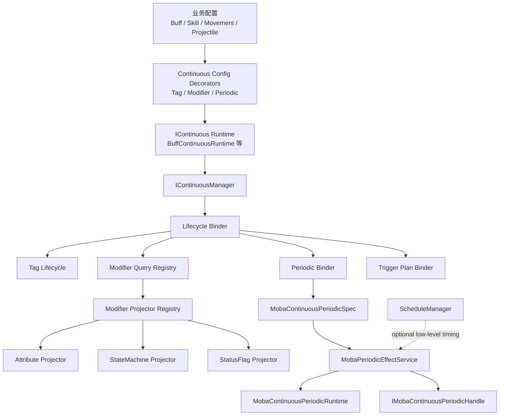

# Ability-Kit MOBA 持续行为系统设计文档

> **阅读对象**：希望了解 MOBA 业务包如何基于 AbilityKit Core 的持续行为抽象，统一管理 Buff、技能持续阶段、位移、投射物生成流程、周期性效果等运行时对象的开发者
>
> **文档目标**：让你理解“持续行为的统一抽象”、“持续行为注册中心的职责”、“Tag / Modifier 如何跟随持续对象生命周期”、“周期性能力如何作为持续行为的修饰能力落地”、“周期性能力如何接入触发器条件-行为管线”、“旧周期效果模型为何删除”

---

## 一、设计理念：为什么需要统一的持续行为系统？

### 1.1 传统实现的问题

```
❌ 传统持续状态实现的问题：

┌─────────────────────────────────────────────────────────────────────────┐
│                                                                         │
│  1. 每个业务模块各管一套生命周期                                          │
│                                                                         │
│     Buff 有 BuffRuntime / BuffService                                    │
│     技能引导有 SkillPipelineContext                                      │
│     位移有 MovementAction                                                │
│     旧周期效果模型有独立 Runtime                                          │
│                                                                         │
│     问题：暂停、恢复、中断、归属、查询、清理规则无法统一。                  │
│                                                                         │
│  2. Tag / Modifier 分散在业务逻辑里                                      │
│                                                                         │
│     有些模块动态加 tag，有些模块动态加 modifier，                         │
│     有些模块只在属性系统里体现，有些模块只存在于组件字段。                 │
│                                                                         │
│     问题：很难回答“某个 actor 当前由哪些持续对象贡献了哪些状态”。           │
│                                                                         │
│  3. 周期性逻辑被误认为是 Buff 或旧周期效果模型的专属能力                    │
│                                                                         │
│     但实际需求包括：                                                      │
│     - 中毒 Buff 每秒结算一次伤害                                          │
│     - 引导技能每 200ms 执行一次判定                                       │
│     - 持续位移按周期修正位置                                              │
│     - 投射物出生流程按周期发射子弹                                        │
│                                                                         │
│     问题：周期性执行是一种能力，不应该绑定在某个临时模型上。                │
│                                                                         │
└─────────────────────────────────────────────────────────────────────────┘
```

### 1.2 当前推荐的解决方案

```
✅ AbilityKit 的持续行为设计思路：

┌─────────────────────────────────────────────────────────────────────────┐
│                                                                         │
│  【Core 层】                                                             │
│  ┌─────────────────────────────────────────────────────────────────┐  │
│  │                                                                  │  │
│  │  IContinuous：持续行为实例契约                                    │  │
│  │  IContinuousConfig：持续行为配置契约                              │  │
│  │  IContinuousManager：注册、激活、暂停、恢复、中断、查询             │  │
│  │                                                                  │  │
│  └─────────────────────────────────────────────────────────────────┘  │
│                                                                         │
│  【MOBA 层】                                                             │
│  ┌─────────────────────────────────────────────────────────────────┐  │
│  │                                                                  │  │
│  │  BuffContinuousRuntime：Buff 是一种 IContinuous                  │  │
│  │  Continuous Tag Config：持续对象携带标签                         │  │
│  │  Continuous Modifier Config：持续对象携带修饰器                  │  │
│  │  Periodic Config：持续对象可声明周期性能力                       │  │
│  │                                                                  │  │
│  └─────────────────────────────────────────────────────────────────┘  │
│                                                                         │
│  【执行层】                                                              │
│  ┌─────────────────────────────────────────────────────────────────┐  │
│  │                                                                  │  │
│  │  ContinuousManager 负责生命周期与归属                             │  │
│  │  ScheduleManager 负责低层时间调度                                  │  │
│  │  PeriodicRuntime 负责周期实例状态                                  │  │
│  │                                                                  │  │
│  └─────────────────────────────────────────────────────────────────┘  │
│                                                                         │
└─────────────────────────────────────────────────────────────────────────┘
```

### 1.3 核心原则

- **持续行为先抽象生命周期，再组合能力**：Buff、技能引导、位移、投射物出生流程都可以是持续行为，但它们不一定都需要周期性、标签或修饰器。
- **Tag / Modifier 跟随持续对象，不单独飘在外面**：持续对象激活时贡献 tag / modifier，结束时一起失效。
- **Modifier 是通用修饰，不只代表属性修改器**：属性、状态机参数、布尔状态标记、业务计数、控制参数都可以通过不同 kind 的 modifier 表达。
- **周期性是持续行为能力，不是旧周期效果专属模型**：旧周期效果模型已删除，周期能力统一走正式 continuous periodic。
- **调度器不等于持续行为管理器**：ScheduleManager 只解决“什么时候触发”，ContinuousManager 解决“谁存在、归谁、处于什么生命周期”。

---

## 二、术语表


| 名词                      | 含义                                                             |
| ----------------------- | -------------------------------------------------------------- |
| **IContinuous**         | Core 层持续行为实例接口，表示一个可激活、暂停、恢复、中断、结束的运行时对象。                      |
| **IContinuousConfig**   | Core 层持续行为配置接口，提供 Id、OwnerId、Duration、Stack 等基础信息。             |
| **IContinuousManager**  | Core 层持续行为注册中心，统一管理持续对象生命周期与 owner 维度查询。                       |
| **Continuous Binder**   | 生命周期绑定器，在持续对象注册、激活、暂停、恢复、结束时接入业务侧逻辑。                           |
| **Continuous Tag**      | 由持续对象贡献的 GameplayTag，生命周期跟随持续对象。                               |
| **Continuous Modifier** | 由持续对象贡献的通用修饰器，可能作用于属性、状态机参数、状态标记或其他业务目标。                       |
| **Modifier Projector**  | 将通用 modifier 投影到具体业务系统的适配器，例如属性投影器。                            |
| **Periodic Capability** | 持续行为声明周期性执行能力的配置/运行时能力。                                        |
| **ScheduleManager**     | 触发器包中的低层时间调度器，用于 delay/repeat/continuous schedule，不负责上层持续对象归属。 |
| **旧周期效果模型**             | 早期临时周期效果模型，已删除，不再保留兼容层。                                        |


---

## 三、Core 层持续行为抽象

### 3.1 IContinuous：持续对象的最小契约

`IContinuous` 表达的是“一个持续存在的运行时对象”，它不关心这个对象是 Buff、技能阶段、位移还是其他行为。

核心职责：

- 暴露配置：`Config`
- 暴露状态：`State`、`IsActive`、`IsPaused`、`IsTerminated`
- 暴露时间：`ElapsedSeconds`
- 提供生命周期操作：`Activate`、`Pause`、`Resume`、`Abort`
- 在结束时发出 `OnEnded`

推荐理解：

```
┌─────────────────────────────────────────────────────────────────────────┐
│                          IContinuous                                    │
├─────────────────────────────────────────────────────────────────────────┤
│                                                                         │
│  它不是 Buff 接口                                                       │
│  它不是周期效果接口                                                     │
│  它不是调度器接口                                                       │
│                                                                         │
│  它只是描述：                                                           │
│                                                                         │
│  “有一个对象，从某个时刻开始存在，                                      │
│   可以暂停/恢复/中断，最终会结束，                                      │
│   并且这个生命周期可以被统一管理。”                                     │
│                                                                         │
└─────────────────────────────────────────────────────────────────────────┘
```

### 3.2 IContinuousConfig：持续对象的配置入口

`IContinuousConfig` 负责提供 Core 层能够理解的最小配置，包括：

- 持续对象 id
- owner id
- duration
- stack policy
- 其他 Core 级通用数据

MOBA 侧不应该把所有业务字段都塞进 Core 配置接口，而应该通过扩展接口表达业务能力：

- `IMobaContinuousTagConfig`
- `IMobaContinuousModifierConfig`
- `IMobaContinuousPeriodicConfig`
- 未来的技能持续阶段配置、位移持续配置、投射物持续配置等

### 3.3 IContinuousManager：持续行为注册中心

`IContinuousManager` 是持续行为的统一注册中心，负责回答这些问题：

- 某个 owner 当前有哪些持续对象？
- 哪些持续对象处于 active？
- 是否允许注册或激活？
- owner 被沉默、死亡、切场景时，如何统一暂停或中断？
- 持续对象结束后，如何统一触发清理？

```
┌─────────────────────────────────────────────────────────────────────────┐
│                       ContinuousManager 职责                             │
├─────────────────────────────────────────────────────────────────────────┤
│                                                                         │
│  Register     ：纳入统一管理                                             │
│  TryActivate  ：经过 admission policy 后激活                              │
│  PauseAll     ：按 owner 暂停持续对象                                     │
│  ResumeAll    ：按 owner 恢复持续对象                                     │
│  InterruptAll ：按 owner 中断持续对象                                     │
│  Unregister   ：结束清理并移除索引                                        │
│                                                                         │
│  维护索引：                                                              │
│  - owner -> continuous list                                              │
│  - registered set                                                        │
│  - active set                                                            │
│                                                                         │
└─────────────────────────────────────────────────────────────────────────┘
```

### 3.4 Admission Policy 与 Lifecycle Binder

Core 层提供两个关键扩展点：


| 扩展点                            | 作用                                |
| ------------------------------ | --------------------------------- |
| **IContinuousAdmissionPolicy** | 决定持续对象是否可以注册或激活，例如互斥、上限、状态限制。     |
| **IContinuousLifecycleBinder** | 监听注册、激活、暂停、恢复、结束、注销，把生命周期桥接到业务系统。 |


MOBA 侧的 tag、modifier、periodic、trigger plan 都应该优先通过 binder 或类似生命周期适配器接入，而不是分散在各个系统里手动维护。

---

## 四、MOBA 层持续行为组合能力

### 4.1 为什么 MOBA 层需要自己的扩展接口？

Core 层只关心通用生命周期。MOBA 业务关心的是：

- 这个持续对象会提供哪些 GameplayTag？
- 这个持续对象会提供哪些 Modifier？
- 这个持续对象是否需要周期性执行？
- 这个持续对象结束时是否要清理触发计划、表现、上下文？

因此 MOBA 层采用“配置接口 + 生命周期绑定器 + 查询/投影服务”的方式扩展，而不是修改 Core 接口。

### 4.2 Tag 作为持续行为的配置修饰

Tag 不应该被临时动态散落地添加/移除，而应当来自持续对象配置。

推荐链路：

```
┌──────────────────┐
│ BuffMO / SkillMO │
│ TagTemplateId    │
└────────┬─────────┘
         │
         ▼
┌──────────────────────────┐
│ IMobaContinuousTagConfig │
│ Tags / Requirements      │
└────────┬─────────────────┘
         │
         ▼
┌──────────────────────────┐
│ BuffContinuousRuntime    │
│ carries tag config       │
└────────┬─────────────────┘
         │ activate/end
         ▼
┌──────────────────────────┐
│ BuffTagLifecycle         │
│ add/remove by lifecycle  │
└──────────────────────────┘
```

设计约束：

- TagTemplateId 适合用于资产侧复用一组标签配置。
- 持续对象激活后贡献标签，结束时清理标签。
- 标签归属应能追踪到持续对象实例或 ownerKey，避免不同来源互相误删。
- Buff 只是 tag config 的一个消费者，后续技能持续阶段也可以消费同一套接口。

### 4.3 Modifier 作为持续行为的通用修饰

Modifier 不应该只等于 AttributeModifier。

更正式的定义是：

```
Modifier = 某个持续对象在生命周期内对某类目标产生的持续贡献
```

可能的目标包括：


| TargetKind        | 示例                                       |
| ----------------- | ---------------------------------------- |
| Attribute         | 攻击力 +10%、移速 -20%                         |
| StateMachineParam | 设置 MoveSpeedScale、AimLock、CastSpeedScale |
| StatusFlag        | Rooted、Silenced、Invisible、CanNotAttack   |
| Counter           | 连击层数、充能层数、易伤来源计数                         |
| Custom            | 项目自定义目标，由业务 projector 解释                 |


推荐结构：

```
┌──────────────────────────────┐
│ IMobaContinuousModifierConfig│
│ ModifierSpecs                │
└──────────────┬───────────────┘
               │
               ▼
┌──────────────────────────────┐
│ IMobaContinuousModifierSpec  │
│ Kind / TargetKind / Value    │
└──────────────┬───────────────┘
               │
               ▼
┌──────────────────────────────┐
│ Modifier Query Service       │
│ collect active continuous    │
└──────────────┬───────────────┘
               │
               ▼
┌──────────────────────────────┐
│ Projector Registry           │
│ TargetKind -> Projector      │
└──────────────┬───────────────┘
               │
               ▼
┌──────────────────────────────┐
│ Attribute / FSM / Flag / ... │
└──────────────────────────────┘
```

设计约束：

- Modifier 列表应属于持续对象配置/装饰能力，不应该在运行中任意增删。
- 查询方只读取自己关心的 TargetKind。
- Projector 负责解释 modifier，不让 modifier spec 绑定到具体系统实现。
- Buff、技能持续阶段、位移等应共享 modifier 容器，而不是各自定义一套字段。

### 4.4 Tag 和 Modifier 与 GAS 思路的关系

这个设计参考 GAS 的核心思想：

- GameplayEffect 激活后贡献 tag / modifier。
- tag / modifier 生命周期跟随 effect spec / active effect。
- 查询时从 active effect 汇总当前有效贡献。

但 MOBA 侧做得更业务中立：

- Modifier 不限定为属性。
- TargetKind 和 Projector 由项目扩展。
- 持续对象不限定为 Buff，也可以是技能流程、位移、投射物出生流程。
- Core 层不强依赖 GameplayTag 或 Attribute 包，保持能力组合。

---

## 五、Buff 作为持续行为的一种实现

### 5.1 Buff 不应是独立孤岛

Buff 是 MOBA 中最典型的持续行为，但它不应该成为持续行为系统本身。

推荐定位：

```
Buff = IContinuous 的一种业务实现
     + Tag Config
     + Modifier Config
     + Periodic Config
     + Trigger Plan Hooks
     + Buff 自己的叠加/刷新/移除规则
```

### 5.2 Buff 生命周期与持续行为生命周期对齐

```
┌─────────────────────────────────────────────────────────────────────────┐
│                         Buff as IContinuous                              │
├─────────────────────────────────────────────────────────────────────────┤
│                                                                         │
│  ApplyBuffRequest                                                        │
│       │                                                                 │
│       ▼                                                                 │
│  BuffService 创建/刷新 BuffRuntime                                       │
│       │                                                                 │
│       ▼                                                                 │
│  ContinuousManager.Register                                              │
│       │                                                                 │
│       ▼                                                                 │
│  ContinuousManager.TryActivate                                           │
│       │                                                                 │
│       ├── BuffLifecycleExecutor 执行 OnAdd                               │
│       ├── BuffTagLifecycle 挂载 GameplayTag                              │
│       ├── Modifier Query Service 可查询该 Buff 的 modifier               │
│       ├── BuffPeriodicEffectBinder 启动周期性实例                         │
│       └── OngoingTriggerPlanService 启动持续触发订阅                      │
│                                                                         │
│  结束/驱散/到期                                                          │
│       │                                                                 │
│       ▼                                                                 │
│  OnEnded / Unregister                                                    │
│       │                                                                 │
│       ├── 执行 OnRemove                                                  │
│       ├── 停止周期性实例                                                  │
│       ├── 清理 GameplayTag                                                │
│       ├── 停止 TriggerPlan 订阅                                           │
│       └── 移除 active modifier 贡献                                       │
│                                                                         │
└─────────────────────────────────────────────────────────────────────────┘
```

### 5.3 Buff 配置中的触发器字段语义

当前 Buff 配置里保留了历史字段名 `OnAddEffects`、`OnRemoveEffects`、`OnIntervalEffects`，但在正式触发器架构下它们的语义是 trigger id 列表，而不是底层 effect id 列表：


| 字段                  | 正式语义                                | 执行入口                                                                                                |
| ------------------- | ----------------------------------- | --------------------------------------------------------------------------------------------------- |
| `OnAddEffects`      | Buff 应用或刷新成功时执行的 TriggerPlan id 列表  | `BuffStageEffectExecutor` 构造 `BuffTriggerContext` 后调用 `MobaEffectExecutionService.ExecuteTriggerId` |
| `OnRemoveEffects`   | Buff 移除时执行的 TriggerPlan id 列表       | `BuffStageEffectExecutor` 构造 `BuffTriggerContext` 后调用 `MobaEffectExecutionService.ExecuteTriggerId` |
| `OnIntervalEffects` | Buff 周期 tick 时执行的 TriggerPlan id 列表 | `BuffPeriodicEffectBinder` 写入 `MobaContinuousPeriodicSpec.OnTickTriggerIds`，由 periodic runtime 触发   |
| `TriggerIds`        | Buff 生命周期内持续监听的 TriggerPlan id 列表   | 写入 `OngoingTriggerPlans`，由持续触发对账系统按 ownerKey 订阅/清理                                                  |


后续可以在配置层增加更清晰的别名或迁移字段名，但运行时解释必须以 trigger id 为准，避免 Buff 阶段逻辑绕过统一的条件-行为管线。

### 5.4 Buff 服务层与组件层职责


| 层级                         | 职责                                                 |
| -------------------------- | -------------------------------------------------- |
| **BuffService / Executor** | 创建运行时、应用叠加规则、注册 continuous、执行生命周期副作用。              |
| **BuffComponent**          | 保存可回滚/可快照的 BuffRuntime 数据。                         |
| **ContinuousManager**      | 保存跨业务的持续对象索引、active 状态与 owner 查询。                  |
| **Lifecycle Binder**       | 把 Buff 生命周期映射到 tag、modifier、periodic、trigger plan。 |
| **Tick System**            | 推进时间或检查到期，但不应承担业务配置解释职责。                           |


组件层只保存状态，不应该成为业务规则中心；服务层负责解释配置和发起生命周期动作；注册中心负责统一可见性与 owner 维度管理。

---

## 六、周期性能力：Periodic 是持续行为的装饰能力

### 6.1 周期性不等于旧周期效果模型

周期性能力的真实含义是：

```
某个持续对象在自己的生命周期内，按一定间隔执行某个动作。
```

它可以由 Buff 使用，也可以由技能引导、位移、召唤、投射物生成流程使用。

### 6.2 推荐模型


| 类型                                | 职责                                                                                             |
| --------------------------------- | ---------------------------------------------------------------------------------------------- |
| **IMobaContinuousPeriodicConfig** | 持续对象配置层声明是否具备周期性能力。                                                                            |
| **MobaContinuousPeriodicSpec**    | 启动周期实例时使用的规格，包含 action kind、目标、周期、sourceContext、开始/周期/结束 trigger id 与兼容 effect。                |
| **MobaContinuousPeriodicRuntime** | 运行时状态，包含 instanceId、ownerKey、sourceContextId、period、remaining、elapsed、tickIndex、trigger ids 等。 |
| **IMobaContinuousPeriodicHandle** | 外部持有的句柄，可用于停止、调整周期速率、调整周期毫秒。                                                                   |
| **MobaPeriodicEffectService**     | 当前周期实例注册/管理服务，负责启动、停止、查询、按 ownerKey 清理。                                                        |


```
┌──────────────────────────────┐
│ Continuous Object             │
│ Buff / Skill / Movement / ... │
└──────────────┬───────────────┘
               │ has periodic config
               ▼
┌──────────────────────────────┐
│ MobaContinuousPeriodicSpec    │
└──────────────┬───────────────┘
               │ Start
               ▼
┌──────────────────────────────┐
│ MobaPeriodicEffectService     │
│ instance registry             │
└──────────────┬───────────────┘
               │ returns handle
               ▼
┌──────────────────────────────┐
│ IMobaContinuousPeriodicHandle │
│ Stop / SetPeriodScale / ...   │
└──────────────────────────────┘
```

### 6.3 为什么需要 handle / instanceId？

持续行为在运行过程中可能需要调整自己的周期参数：

- 急速 Buff 让中毒 Tick 变快。
- 减速区域让位移修正频率下降。
- 技能引导被干扰后周期判定变慢。
- 表现或网络同步需要定位某个周期实例。

因此周期性实例需要稳定 `InstanceId`，持续对象也可以记录对应 `PeriodicInstanceId` 或持有 handle。

### 6.4 周期实例与 ownerKey

`ownerKey` 是周期实例的归属锚点，推荐复用持续对象的上下文 id 或 source context id。

设计收益：

- 同一持续对象结束时，可以按 ownerKey 停止关联周期实例。
- 刷新 Buff 时，可以替换同 ownerKey 的周期实例。
- 回滚或重建时，可以用 ownerKey 对账。

### 6.5 周期执行与触发器管线

周期能力只负责“何时触发”，不应该自己解释复杂条件与行为。正式执行路径是：周期实例在 start / tick / stop 阶段构造上下文，然后进入触发器模块的条件-行为管线，由 trigger plan 决定是否执行以及执行哪些 action。

推荐链路：

```
┌──────────────────────────────┐
│ Continuous Object             │
│ Buff / Skill / Movement / ... │
└──────────────┬───────────────┘
               │ start periodic with sourceContextId
               ▼
┌──────────────────────────────┐
│ MobaContinuousPeriodicSpec    │
│ OnStartTriggerIds             │
│ OnTickTriggerIds              │
│ OnStopTriggerIds              │
└──────────────┬───────────────┘
               │ create runtime
               ▼
┌──────────────────────────────┐
│ MobaPeriodicEffectService     │
│ ownerKey / instance registry  │
└──────────────┬───────────────┘
               │ phase dispatch
               ▼
┌──────────────────────────────┐
│ MobaPeriodicTriggerContext    │
│ IEffectContext payload        │
└──────────────┬───────────────┘
               │ ExecuteTriggerId
               ▼
┌──────────────────────────────┐
│ Trigger Plan                  │
│ Predicate -> Actions          │
└──────────────┬───────────────┘
               │
               ▼
┌──────────────────────────────┐
│ Effect / Action Modules       │
└──────────────────────────────┘
```

当前落地约束：

- `MobaContinuousPeriodicSpec` 提供 `OnStartTriggerIds`、`OnTickTriggerIds`、`OnStopTriggerIds` 作为正式列表入口，同时保留单个 trigger id 字段用于简单场景。
- `MobaPeriodicTriggerContext` 实现 `IEffectContext`，缓存 source actor、target actor、source context、instance id、owner key、phase、elapsed、remaining、period、tick index 等数据。
- `MobaPeriodicEffectService` 在每个阶段优先执行 trigger id / trigger id list；当对应 trigger id 不存在时，才回退到旧的 `OnStartEffectId` / `OnTickEffectIds` / `OnStopEffectId` 兼容路径。
- Buff 周期绑定会把 `BuffRuntime.SourceContextId` 传入周期实例，并把 `OnIntervalEffects` 解释为 `OnTickTriggerIds`，保证周期触发产生的效果仍然能追踪到原始 Buff 来源链。
- Trigger plan 的 source / target 解析已经允许从任意 `IEffectContext` 读取 actor id，因此周期上下文可以复用现有 action 模块。

这意味着周期性效果不再是“时间到了直接打一个 effect id”，而是“时间到了发起一次带来源上下文的触发事件”。复杂条件、分支行为、动作组合、后续调度都应放到 trigger plan/action 模块中表达。

---

## 七、触发调用上下文与效果溯源

### 7.1 为什么触发入口不能只是任意 payload

TriggerPlan 的执行入口需要同时服务两个目标：

- 条件/行为模块读取业务数据，例如 Buff 层数、子弹命中点、区域半径、周期 tickIndex。
- 溯源系统稳定记录来源链，例如谁触发、命中了谁、来自哪个配置、属于哪个持续对象、当前 trigger id 是什么。

如果每个入口都随手传一个普通对象，触发计划也许还能读取某些业务字段，但 trace root、ownerKey、sourceContextId、contextKind 会丢失，后续很难回答“这个效果到底来自哪个 Buff / Projectile / Area / Summon”。

因此运行时 payload 不再走单一胖基类，而是拆成三层契约：

- 最小触发调用接口，只暴露执行入口必需的静态字段。
- 独立 trace/provenance 对象，专门承载根链路、来源配置、归属锚点等静态溯源信息。
- 可选的 runtime access provider，专门暴露 BuffRuntime、周期 runtime 等实时对象访问。

### 7.2 推荐契约

`IMobaTriggerInvocationContext` 负责描述一次触发调用的最小必要信息：


| 字段                                | 含义                                                  |
| --------------------------------- | --------------------------------------------------- |
| `Kind`                            | 业务上下文类型，例如 Buff、ContinuousPeriodic、Projectile、Area。 |
| `TriggerId`                       | 当前执行的 TriggerPlan id。                               |
| `SourceActorId` / `TargetActorId` | 效果来源 actor 与目标 actor。                               |
| `SourceContextId`                 | 上游来源上下文 id，通常来自技能施放、BuffRuntime 或持续对象。              |


`IMobaTriggerTraceContextProvider` 负责额外提供 `MobaTriggerTraceContext`：


| 字段                                | 含义                                                    |
| --------------------------------- | ----------------------------------------------------- |
| `ContextKind`                     | 业务上下文类型。                                              |
| `TraceKind`                       | 溯源节点类型，例如 BuffApply、BuffTick、ProjectileHit、AreaEnter。 |
| `SourceActorId` / `TargetActorId` | 来源和目标 actor。                                          |
| `SourceContextId`                 | 上游来源上下文 id。                                           |
| `RootContextId`                   | 当前触发链路的根 id。                                          |
| `OwnerKey`                        | 生命周期归属锚点，用于停止、清理、回滚对账。                                |
| `SourceConfigId`                  | 触发来源配置 id，例如 buffId、projectileTemplateId、areaId。      |


`IMobaTriggerRuntimeContext<TRuntime>` 负责描述动态运行时访问能力：


| 字段 / 方法                               | 含义                                                                         |
| ------------------------------------- | -------------------------------------------------------------------------- |
| `TryGetRuntime(out TRuntime runtime)` | 尝试取得当前仍有效的业务 runtime。返回值为 false 时，说明 runtime 已不存在、已停止或当前 payload 本身是纯事件快照。 |


`IMobaTriggerDataContext` 负责承载各业务自己的扩展数据，不要求所有字段统一到一个基类里。DataContext 中推荐写入触发瞬间快照值，而不是写入会随时间变化的实时引用。

### 7.3 各业务入口的上下文映射


| 入口                                 | 运行时 payload                  | trace/provenance 重点                                                                            |
| ---------------------------------- | ---------------------------- | ---------------------------------------------------------------------------------------------- |
| Buff add/remove                    | `BuffTriggerContext`         | `SourceContextId` 来自 BuffRuntime，`SourceConfigId` 为 buffId，`TraceKind` 为 BuffApply/BuffRemove。 |
| Buff interval / 通用周期               | `MobaPeriodicTriggerContext` | 周期实例只决定触发时机，`RootContextId` 和 `OwnerKey` 回到持续对象本体。                                             |
| Projectile hit                     | `ProjectileHitArgs`          | `TraceKind` 为 ProjectileHit，source actor 为发射者，target actor 为命中对象。                              |
| Area enter/exit/expire             | `AreaTriggerPayload`         | `TraceKind` 区分 AreaEnter/AreaExit，`SourceConfigId` 记录区域实例或模板来源。                                |
| 后续 Summon / Movement / Skill phase | 各自独立 payload                 | 仅实现最小触发接口和 trace provider，不再继承通用基类。                                                            |


设计上不要求所有业务字段都统一到一个类里。业务对象继续保留强类型字段，方便 trigger condition/action 直接读取；溯源信息通过 provider 单独提供。

需要区分两类业务数据：

- 快照数据：触发那一刻固定下来的值，例如 `StackCountSnapshot`、`RemainingSecondsSnapshot`、`TickIndexSnapshot`、`ElapsedMsSnapshot`。这类值适合用于确定性执行、日志、回放、trace 对账，也会同步到 DataContext。
- 动态数据：触发后仍可能变化的 runtime，例如 `BuffRuntime`、`MobaContinuousPeriodicRuntime`。这类值通过 `IMobaTriggerRuntimeContext<TRuntime>` 或领域便捷方法读取，例如 `TryGetBuffRuntime`、`TryGetPeriodicRuntime`。

旧字段名如 `StackCount`、`ElapsedMs` 可以作为兼容别名保留，但正式语义应以 `Snapshot` 字段为准。

### 7.4 执行服务的职责

`MobaEffectExecutionService.ExecuteTriggerId` 现在按以下顺序提取信息：

1. 优先读取 `IMobaTriggerTraceContextProvider`，得到完整 trace/provenance。
2. 如果没有 trace provider，再读取 `IMobaTriggerInvocationContext`，至少保证 source/target/kind/triggerId 可用。
3. 最后兼容旧的 `IEffectContext`，只作为迁移过渡。
4. 保留原始 payload 进入 TriggerPlan，让条件/行为模块读取业务字段。

这使得“触发计划执行”和“效果溯源记录”不再是两套互相脱节的数据流。

### 7.5 后续约束

- 新增正式触发入口时，优先实现最小触发接口、trace provider，并按需实现 runtime provider，而不是继承通用上下文类。
- `SourceContextId` 表达效果链路来源，`OwnerKey` 表达生命周期清理锚点，二者可以相同但语义不能混淆。
- `Raw` 只应放在业务 payload 自己的字段里，不能再成为统一基类的一部分。
- 可回滚数据应落在 runtime/component/event 的纯数据字段中，上下文对象只在本次触发调用期间存在。
- TraceKind 应尽量使用领域类型，例如 BuffTick、ProjectileHit、AreaEnter，而不是统一退化成 EffectExecution。
- 实时状态读取必须显式走 runtime provider；条件/行为模块不能把 DataContext 中的快照值误当作实时值。

---

## 八、ScheduleManager 与 ContinuousManager 的关系

### 7.1 两者不冲突

触发器包中的 `IScheduleManager` / `GroupedScheduleManager` 是合理的，但它处在更低一层。


| 维度     | ScheduleManager                         | ContinuousManager                                    |
| ------ | --------------------------------------- | ---------------------------------------------------- |
| 核心问题   | 什么时候执行一次回调？                             | 哪些持续对象存在、归谁、是什么状态？                                   |
| 管理对象   | schedule handle / effect                | IContinuous 实例                                       |
| 典型能力   | delay、repeat、interval、speed、group pause | register、activate、pause、resume、interrupt、owner query |
| 生命周期语义 | 时间调度生命周期                                | 业务持续对象生命周期                                           |
| 使用场景   | 快速验证、低层定时、无上层抽象的周期动作                    | Buff、技能持续阶段、位移、投射物流程等正式持续对象                          |


### 7.2 推荐分层

```
┌─────────────────────────────────────────────────────────────────────────┐
│                         业务持续对象层                                   │
│                                                                         │
│  BuffContinuousRuntime / SkillChannelRuntime / MovementRuntime           │
│                                                                         │
└──────────────────────────────┬──────────────────────────────────────────┘
                               │ register / activate / end
                               ▼
┌─────────────────────────────────────────────────────────────────────────┐
│                         ContinuousManager                                │
│                                                                         │
│  owner 查询、生命周期、tag、modifier、periodic binder                     │
│                                                                         │
└──────────────────────────────┬──────────────────────────────────────────┘
                               │ optional scheduling implementation
                               ▼
┌─────────────────────────────────────────────────────────────────────────┐
│                         ScheduleManager                                  │
│                                                                         │
│  delay / repeat / interval / speed / group pause                         │
│                                                                         │
└─────────────────────────────────────────────────────────────────────────┘
```

### 7.3 使用建议

- 如果项目只是想快速周期性执行一些逻辑，可以直接使用 ScheduleManager。
- 如果这个周期动作已经有明确 owner、生命周期、tag/modifier、可中断/可暂停语义，应抽象为 IContinuous。
- ContinuousManager 可以在内部使用 ScheduleManager 实现周期调度，但不应把生命周期所有权交给 ScheduleManager。
- `RegisterContinuous` 在 ScheduleManager 语境里表示“持续调度直到取消”，不等价于 Core 层 `IContinuous`。

---

## 九、旧周期效果模型的删除边界

### 8.1 历史定位

旧周期效果模型是早期为了让 Buff 拥有周期性效果而做的临时方案。它可以表达：

- OnApply
- OnTick
- OnRemove
- Duration
- Period

但它的问题是：

- 名字过于绑定 effect，不适合表示位移、投射物生成、技能引导等周期行为。
- 配置结构过窄，只适合效果触发，不适合作为通用周期能力。
- 生命周期没有天然对齐 Core 层 IContinuous。
- 容易让人误以为周期性能力属于 Buff/Effect，而不是属于持续行为。

### 8.2 当前删除状态

当前处理策略：

- 删除旧 DTO / MO / Component / Runtime / System / Editor asset / config table。
- 删除 Buff 配置中的旧周期字段，Buff 周期能力直接使用 `IntervalMs` 与语义上代表 tick trigger id 列表的 `OnIntervalEffects` 生成正式 `MobaContinuousPeriodicSpec`。
- 删除旧上下文枚举，周期效果执行统一使用 `EffectContextKind.ContinuousPeriodic`。
- `MobaPeriodicEffectService` 只接收正式 continuous periodic spec/config，不再保留旧 id 兼容入口。
- 新代码应直接使用正式 continuous periodic spec/config。

### 8.3 后续扩展路线

推荐演进路线：

1. 按业务需要新增正式的 continuous periodic 配置表或资产结构。
2. 技能持续阶段、位移、投射物生成流程统一接入 periodic capability。
3. 周期性 runtime 快照和回滚对账统一围绕 `MobaContinuousPeriodicRuntime` 建模。
4. 调试视图按 actor / ownerKey 查询 active continuous 与 active periodic 实例。

---

## 十、推荐落地约束

### 9.1 配置侧约束

- Buff、技能持续阶段、位移等配置都可以组合：tag config、modifier config、periodic config。
- Modifier DTO 应按 kind / targetKind 表达修饰类型，不应绑定 Buff 字段。
- TagTemplateId 适合表达一组可复用 tag requirement / granted tags。
- 周期性配置应表达 action kind，而不是固定旧周期效果 id。

### 9.2 运行时约束

- 所有正式持续对象应注册到 ContinuousManager。
- 生命周期副作用应优先通过 binder 接入。
- 持续对象结束时必须清理 tag、modifier、periodic、trigger subscription、effect context。
- 运行时对象应保留 instance id / owner key，便于查询、停止和回滚对账。

### 9.3 查询侧约束

- 属性系统不应直接扫描 Buff 字段，而应从 continuous modifier query service 获取属性类 modifier。
- 状态机、控制状态、业务标记也应通过对应 TargetKind 的 projector 获取贡献。
- 查询服务应该只暴露 active continuous 的有效贡献。
- 不同业务系统只消费自己关心的 TargetKind，避免互相耦合。

### 9.4 回滚/确定性约束

- 可回滚状态应是纯数据：持续对象 runtime、ownerKey、instanceId、剩余时间、周期状态。
- delegate、订阅句柄、service handle 不应直接进入快照。
- 对订阅类能力应采用“意图数据 + reconcile 运行时订阅”的方式。
- ownerKey / instanceId 应稳定生成，避免回滚后无法对账。

---

## 十、整体架构图




---

## 十一、模块职责速查


| 模块                                 | 当前定位                                                                         |
| ---------------------------------- | ---------------------------------------------------------------------------- |
| **AbilityKit.Core Continuous**     | 提供持续行为最小抽象和默认注册中心。                                                           |
| **AbilityKit.Triggering Schedule** | 提供低层时间调度能力，可独立使用，也可被上层持续系统复用。                                                |
| **MOBA Buff 模块**                   | 持续行为的业务实现之一，组合 tag、modifier、periodic、trigger plan。                           |
| **MOBA Modifier Query/Projector**  | 汇总 active continuous 的 modifier，并投影到属性/状态机/标记等目标系统。                          |
| **MOBA Periodic Service**          | 管理周期性 runtime 实例、句柄、ownerKey 清理、周期参数修改，并在 start/tick/stop 阶段分发 trigger plan。 |
| **旧周期效果模型**                        | 已删除，不再作为兼容层保留；周期能力统一走正式 continuous periodic capability。                      |


---

## 十二、推荐演进顺序

### 12.1 短期

- 保持 Buff 作为 `IContinuous` 的正式实现。
- 确保 Buff 的 tag / modifier / periodic 都从持续对象生命周期进入和退出。
- 持续周期能力统一使用正式 continuous periodic spec/config，并优先通过 trigger id 进入条件-行为管线。
- 属性系统优先接入 continuous modifier query service。

### 12.2 中期

- 为技能引导、持续施法、持续位移、投射物出生流程补充 IContinuous runtime。
- 按业务需要补充正式 periodic config，并为 Buff / Skill / Movement / Projectile 配置 start/tick/stop trigger id。
- 增加状态机参数、状态标记等更多 TargetKind projector。
- 将 schedule manager 作为 periodic 或 timeline 的底层时间工具接入，而不是替代 continuous manager。

### 12.3 长期

- 建立稳定的 continuous runtime 快照/回滚对账方案。
- 形成统一调试视图：按 actor/owner 查询所有 active continuous、tag、modifier、periodic 实例。
- 让项目方新增持续玩法时优先组合现有能力，而不是新建孤立生命周期系统。

---

## 十三、结论

持续行为系统的核心不是“再做一个 Buff 框架”，而是为所有带生命周期的运行时对象提供共同底座。

正式设计应保持这条边界：

- Core 层负责持续对象生命周期抽象。
- MOBA 层通过配置修饰和生命周期绑定器组合 tag、modifier、periodic、trigger plan。
- ScheduleManager 保持低层时间调度职责。
- 旧周期效果模型已删除，周期能力统一沉淀到正式 continuous periodic，并通过 trigger plan 执行复杂条件-行为。

这样 Buff、技能管线、位移、投射物、召唤物、状态机参数等系统都可以在同一套持续行为模型下协作，既保留业务扩展自由度，也能统一查询、暂停、中断、清理和调试。