# MOBA 战斗上下文整体设计指南

本文记录 `com.abilitykit.demo.moba.runtime` 当前战斗上下文设计，用于后续扩展 Buff、AOE、Projectile、Summon、Continuous、延迟执行和触发器条件/行为时保持一致。

当前结论：项目内已有阶段性设计文档和模块说明，但缺少一份以当前代码为准的维护向总览。后续维护应以本文为入口，再按需要跳转到更细的阶段文档或模块 README。

## 设计目标

战斗上下文要解决三个问题：

1. 当前这次触发在执行什么。
2. 这次触发从哪里来，和上游链路是什么关系。
3. 跨帧对象的实时/快照数据如何被条件和行为稳定读取。

这三类问题不能混成一个大对象。当前设计把它们拆成三条线：执行上下文、溯源上下文、运行时上下文。

## 三类上下文边界

### 执行上下文

执行上下文描述当前这次执行需要的事实。核心类型是 `MobaCombatExecutionContext`。

它承载：

- 原始 payload。
- source actor、target actor。
- trigger id、config id、frame。
- execution snapshot。
- skill runtime handle。
- 已归一化的 origin、lineage、source view。

它是条件和行为执行时的主模型。触发入口可以来自 Buff、Projectile、Summon、AOE、持续行为或旧 pipeline 数据，但进入效果执行服务后应尽量归一化成 `MobaCombatExecutionContext`。

维护规则：

- 不要把业务字段持续追加到 `MobaCombatExecutionContext`。
- 新领域需要额外数据时，优先放到领域 payload 或领域 action input。
- 只有执行期通用事实才进入 `MobaCombatExecutionContext`。

### 溯源上下文

溯源上下文描述这次执行从哪里来、父子链路如何关联、如何用于追踪和诊断。

核心概念：

- `MobaGameplayOrigin`：回答来源是什么。
- `MobaTriggerLineageContext`：回答当前执行如何接入 trace lineage。
- `MobaTriggerTraceContext`：轻量触发 trace 表示。
- `MobaContextSourceView`：用于查询、保留、调试和诊断的 source view。
- `MobaPersistentContextSourceSnapshot`：跨帧、异步生命周期保留的 source snapshot。

维护规则：

- trace/source/origin 是溯源，不等于 runtime context。
- Buff、Projectile、Summon、AOE 这类对象即使没有实时可变状态，也仍然可以有 origin/source/trace。
- 跨帧对象不能长期持有上游 live runtime 对象，应保留 `MobaPersistentContextSourceSnapshot` 或稳定 id。

### 运行时上下文

运行时上下文描述一个跨帧对象当前可读的实时/快照值。核心入口是 `MobaRuntimeContextReference` 和 `IMobaRuntimeContextPayload`。

运行时上下文只适合这类场景：对象有跨帧生命周期，并且条件或行为需要通过 context id 读取它的实时或销毁后快照数据。

当前 Buff 已接入运行时上下文：

- Buff 创建或刷新时，绑定 live provider。
- Buff 周期触发时，payload 暴露 context id 和 version。
- 条件和行为通过 runtime context accessor 读取实时值。
- Buff 移除时，保存最终 snapshot，销毁 live provider 绑定。

维护规则：

- 不是所有跨帧对象都必须注册 runtime context。
- 只需要溯源的对象使用 origin/source/trace 即可。
- 只有需要被条件/行为按 id 读取实时/快照数据的对象，才实现 `IMobaRuntimeContextPayload`。

## 触发到条件到行为流程

整体流程：

```text
Trigger payload
  -> MobaEffectExecutionService.ExecuteTrigger / ExecuteRulePlan
  -> Create MobaCombatExecutionContext
  -> Create MobaTriggerConditionContext
  -> MobaTriggerConditionRegistry.Evaluate
  -> MobaTriggerPlanExecutor
  -> MobaPlanActionInputResolver
  -> MobaPlanActionInput / MobaEffectActionInput / MobaProjectileActionInput / MobaSummonActionInput
  -> Action module
```

关键点：

- payload 是入口，负责暴露它天然拥有的信息。
- `MobaEffectExecutionService` 是归一化边界。
- 条件读取 `MobaTriggerConditionContext`。
- 行为读取 action input。
- action input 不重新创造上下文，只包装 `MobaCombatExecutionContext` 和服务解析结果。

## 代码流程图

本节用 `mermaid` 记录当前代码结构中的主要上下文传递路径。维护时如果代码入口变化，应同步更新本节。

### 总体执行时序

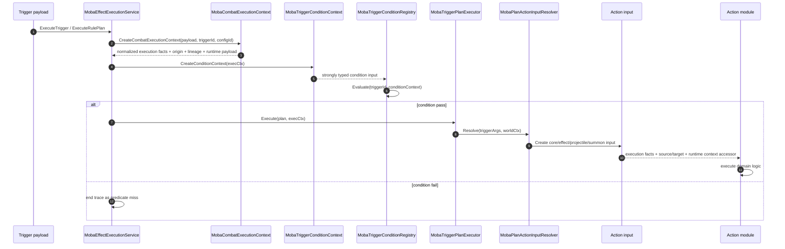

### 三类上下文数据流

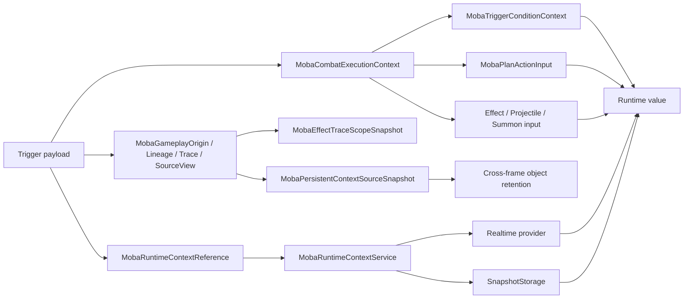

### 条件读取 runtime context

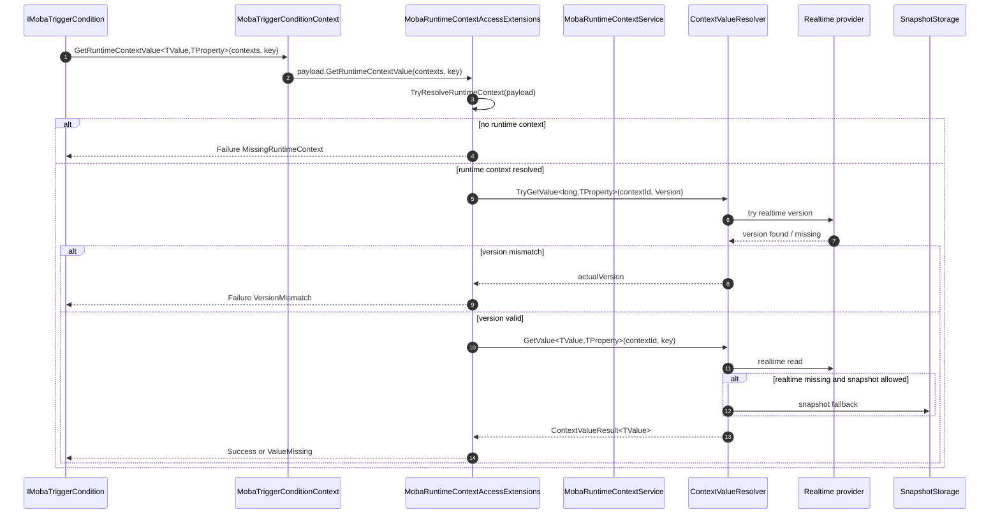

### 行为读取 runtime context

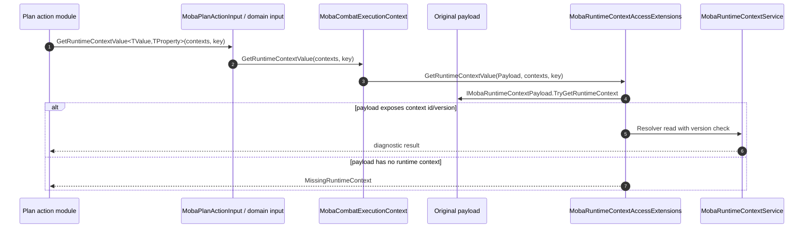

### Buff 生命周期与上下文同步

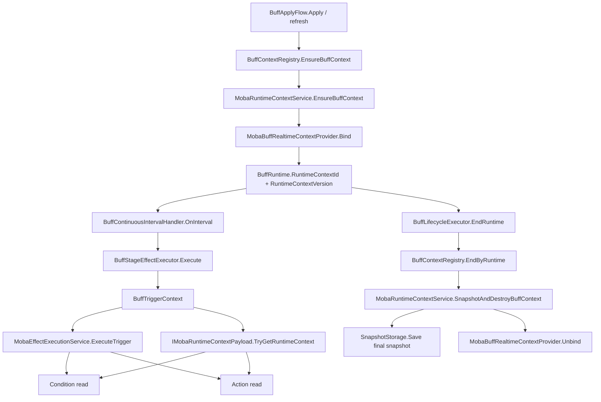

### Buff 周期触发到效果行为

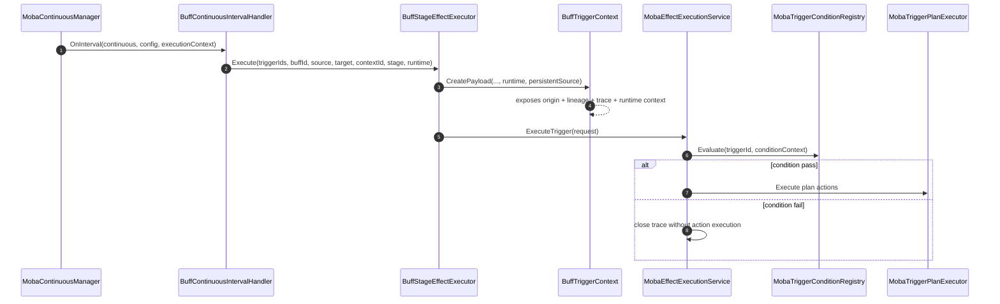

### Projectile 行为接入

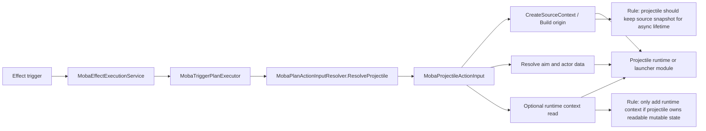

### Summon 行为接入

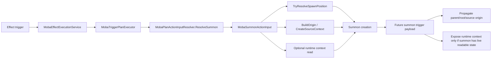

### AOE 与 Continuous 接入判断

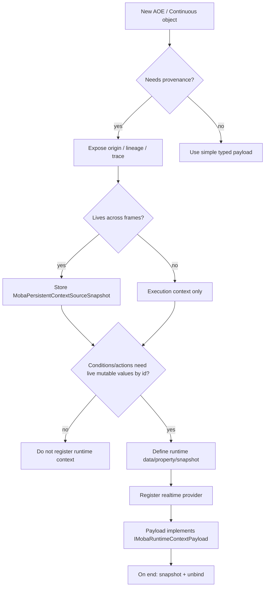

### 上下文归一化决策树

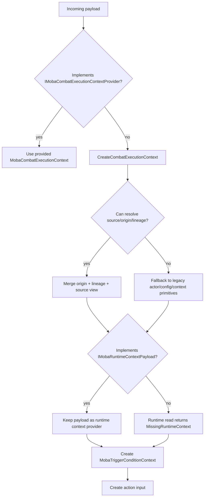

## Runtime Context 读取流程

条件和行为统一通过 runtime context accessor 读取值：

```text
Condition or Action Input
  -> GetRuntimeContextValue<TValue, TProperty>
  -> payload.TryResolveRuntimeContext
  -> MobaRuntimeContextService.Resolver
  -> ContextValueResolver
  -> Realtime provider first, snapshot fallback
  -> diagnostic result
```

读取结果使用 `MobaRuntimeContextValueResult<TValue>` 表达，不只返回 bool。

失败原因包括：

- `MissingContextService`：没有传入 `MobaRuntimeContextService`。
- `MissingPayload`：payload 为空。
- `MissingRuntimeContext`：payload 没有运行时上下文。
- `InvalidRuntimeContext`：context id 无效。
- `VersionUnavailable`：需要校验版本，但上下文内没有版本值。
- `VersionMismatch`：payload 携带的版本与当前上下文版本不一致。
- `ValueMissing`：上下文存在，但目标 key 不存在。

兼容接口 `TryGetRuntimeContextValue` 仍然保留，适合不关心失败原因的旧调用点。新条件和新行为建议优先用诊断结果，方便定位配置错误、生命周期错误和过期引用。

## 版本校验

`MobaRuntimeContextReference` 包含 `ContextId` 和 `Version`。

当 `Version > 0` 时，读取值前会先从运行时上下文读取 `MobaRuntimeContextKeys.Version`：

- 读不到版本，返回 `VersionUnavailable`。
- 版本不一致，返回 `VersionMismatch`。
- 版本一致，继续读取目标 key。

这个校验防止旧 payload 读到同 id 的新对象或已经过期的 snapshot。当前校验放在 MOBA runtime 层，没有修改底层 `AbilityKit.Context` 包协议。

## 网络同步与数据恢复边界

上下文读取模型不是网络同步的权威状态模型。网络同步游戏需要把写入、同步输出、诊断读取和状态恢复拆开维护，否则很容易把调试视图或 runtime context 误用成可回放、可重连、可校验的战斗状态。

四类模型的职责如下：

- 写入模型：由输入命令、生命周期服务和领域系统修改真实运行时对象，例如 Actor、Buff、Projectile、Random、SkillRuntime。
- 同步快照模型：由 snapshot emitter 输出给表现层、网关或录像系统，描述某一帧需要广播的状态或事件。
- 诊断读取模型：由 runtime port 或调试服务导出当前可观察状态，用于工具、面板、日志和低频检查。
- 恢复模型：由显式 state export/import/hash 契约导出纯状态，并能在重连、校验失败、回滚或权威覆盖时还原。

维护规则：

- `ContextRegistry` 只负责上下文实体、实时 provider、snapshot fallback 和条件/行为读取，不作为 MOBA 的权威网络状态仓库。
- `SnapshotStorage` 保存的是上下文快照，不等价于完整 battle state baseline。
- `MobaCombatExecutionContext`、`MobaTriggerConditionContext` 和 action input 是执行期读模型，不能承担状态恢复职责。
- `WorldStateSnapshot` 面向同步输出，可以包含事件快照和状态快照；是否可用于恢复必须由恢复契约显式声明。
- `GetLogicWorldEntityStates` 这类接口只能作为诊断或低频 read model，不能作为正式同步源。
- 新增会影响逻辑结果的跨帧状态时，除 runtime context 外，还要评估是否需要加入 state export/import/hash 覆盖。

首批恢复域按风险和已有结构落地：

1. Actor transform：已有 transform snapshot 和 rollback provider，先保证位置/朝向/缩放可导出、导入和参与 hash。
2. Random：已有确定性随机和 rollback payload，必须参与 hash，避免随机消耗漂移无法定位。
3. Buff：先导出 BuffRuntime 的纯字段状态，导入时重建运行时列表并重新绑定 runtime context，不走普通 Apply 流程以避免表现事件和触发副作用。

后续 Projectile、AOE、SkillRuntime、Continuous、Attribute 等领域如果影响逻辑判定，也应逐步加入恢复模型。只用于表现的 cue 不进入逻辑恢复状态。

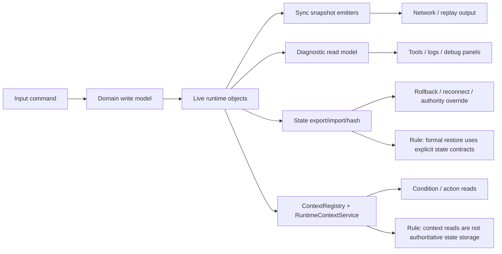

## Buff 生命周期

Buff 是当前 runtime context 的标准接入样例。

创建或刷新：

```text
BuffLifecycle / BuffContextRegistry
  -> MobaRuntimeContextService.EnsureBuffContext
  -> MobaBuffRealtimeContextProvider.Bind
  -> BuffRuntime.RuntimeContextId / RuntimeContextVersion
```

周期触发：

```text
BuffContinuousIntervalHandler
  -> BuffStageEffectExecutor
  -> BuffTriggerContext
  -> IMobaRuntimeContextPayload.TryGetRuntimeContext
  -> condition/action runtime value read
```

移除：

```text
BuffLifecycleExecutor.EndRuntime
  -> BuffContextRegistry.EndByRuntime
  -> MobaRuntimeContextService.SnapshotAndDestroyBuffContext
  -> SnapshotStorage.Save
  -> Realtime provider Unbind
```

维护规则：

- Buff 移除时必须同步 snapshot 和 provider unbind。
- 移除后仍需要查询最终状态时，从 snapshot 读取。
- 新增 Buff 字段如果要开放给条件/行为读取，应先加入 `MobaBuffRuntimeContextData.TryGetValue` 和 key 常量。

## AOE / Projectile / Summon / Continuous 接入规则

新增跨帧对象时先判断它需要哪类上下文。

只需要知道来源和链路：

- 提供 origin/source/trace。
- 跨帧保留 `MobaPersistentContextSourceSnapshot`。
- 不注册 runtime context。

需要实时可变状态被条件/行为读取：

- 分配稳定 context id。
- 实现对应 runtime context data/property/snapshot。
- 注册 realtime provider。
- payload 实现 `IMobaRuntimeContextPayload`。
- 生命周期结束时 snapshot + unbind。

需要领域行为参数：

- 增加领域 action input 或 resolver。
- 不把领域字段塞进通用 `MobaCombatExecutionContext`。

## 条件开发规范

条件应优先读取 `MobaTriggerConditionContext` 暴露的强类型信息。

当条件需要读取跨帧对象运行时值时：

- 使用 `GetRuntimeContextValue<TValue, TProperty>` 获取诊断结果。
- 对 `VersionMismatch` 和 `MissingRuntimeContext` 给出明确失败 key。
- 不直接依赖 BuffRuntime，除非该条件明确只服务 Buff 并且不要求跨对象复用。

建议模式：

```text
context.GetRuntimeContextValue<TValue, TProperty>(runtimeContexts, key)
  -> result.Found ? pass : fail with result.Failure
```

## 行为开发规范

行为模块应通过 `MobaPlanActionInputResolver` 取得输入。

通用行为使用 `MobaPlanActionInput`。效果行为使用 `MobaEffectActionInput`。投射物行为使用 `MobaProjectileActionInput`。召唤行为使用 `MobaSummonActionInput`。

维护规则：

- action input 是执行入口，不是长期状态容器。
- 行为需要 runtime context 值时，从 action input 调用 runtime accessor。
- 行为需要新领域能力时，扩展领域 action input，而不是扩大通用上下文。

## 不应做的事

- 不要把 trace 当成 runtime context。
- 不要把 runtime context 当成任意业务 data bag。
- 不要为了统一而让所有对象都实现 Buff 风格上下文。
- 不要在跨帧对象中长期保存 live runtime 引用作为溯源依据。
- 不要绕过 `MobaEffectExecutionService` 直接拼装零散条件/行为输入。
- 不要新增 key/value 读取替代已有强类型 payload。

## 维护检查清单

新增一种触发 payload 时检查：

- 是否能暴露 origin、lineage、trace。
- 是否需要 `MobaPersistentContextSourceSnapshot`。
- 是否真的需要 runtime context。
- 是否能被 `MobaEffectExecutionService` 归一化成 `MobaCombatExecutionContext`。

新增一种跨帧对象时检查：

- 生命周期创建、刷新、移除是否都有明确入口。
- 移除时是否 snapshot + unbind。
- 是否存在 context id/version 过期读取风险。
- 条件/行为是否通过 accessor 读取，而不是直接拿 live 对象。

新增一个条件或行为时检查：

- 是否优先使用强类型输入。
- 是否正确处理 runtime context diagnostic failure。
- 是否避免依赖 Buff 专属类型，除非它就是 Buff 专属逻辑。

## 现有文档索引

- `Runtime/Application/Services/Context/README.md`：Context 模块规则和主模型优先级。
- `Runtime/Application/Services/Triggering/PlanActions/README.md`：Plan Action 输入和模块边界。
- `Runtime/Docs/GoldenSkillFlowGuide.md`：技能和效果执行主流程。
- `Runtime/Docs/RuntimeArchitectureGuide.md`：runtime 包整体结构。
- `Docs/Moba触发器事件上下文与溯源设计.md`：早期触发器上下文和溯源设计。
- `Docs/Moba效果触发上下文溯源与技能释放运行时阶段性设计.md`：效果触发上下文阶段设计。
- `Docs/Moba战斗上下文阶段性代码总结.md`：战斗上下文阶段性代码总结。

当这些文档与当前代码不一致时，以本文和当前代码为准；阶段文档主要作为背景和演进记录。
