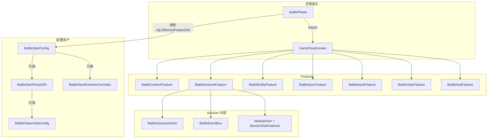
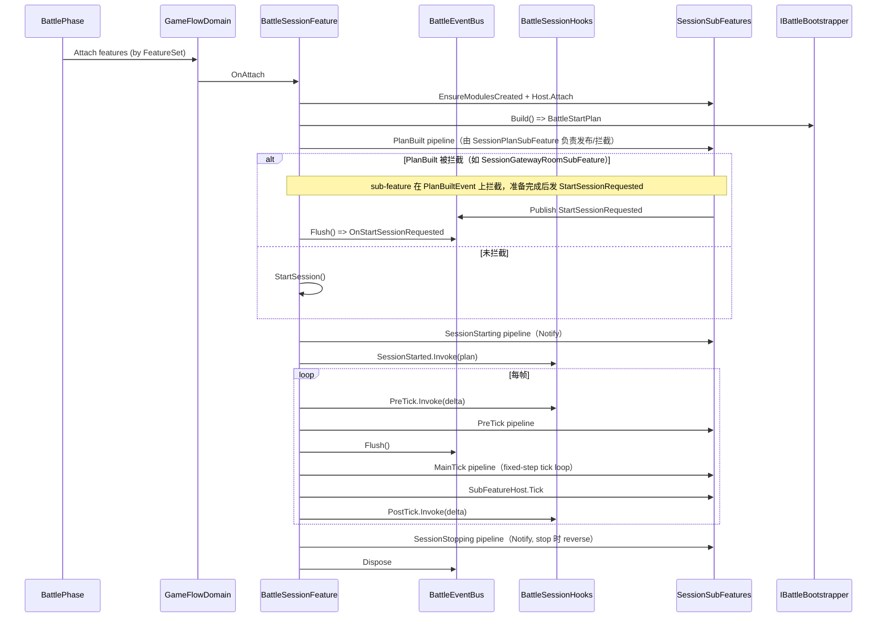
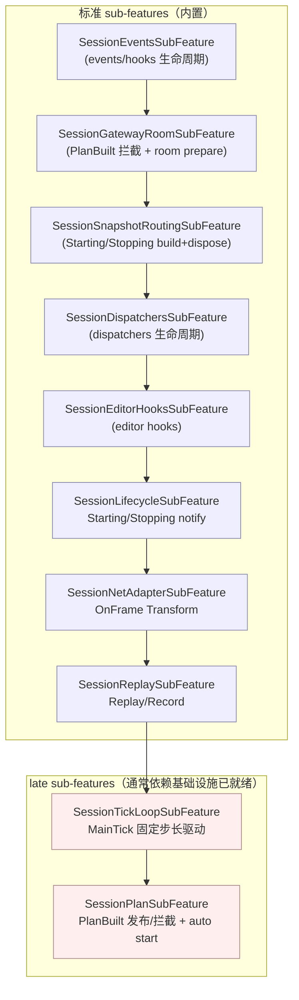
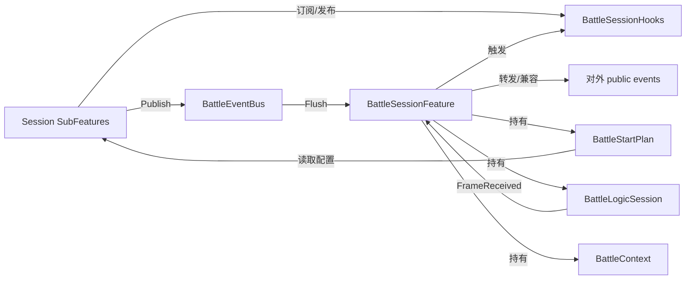

# 战斗流程设计说明（com.abilitykit.demo.moba.view.runtime）

本文档描述 Demo MOBA 的战斗流程架构：

- 配置资产（Preset/Overrides/FeatureSet）如何组织
- 启动/运行/停止的流程结构（含 Hooks + EventBus + SubFeatures）
- 关键数据在各模块间的流向
- 如何通过“组合”切换网络模式、回放/录像等运行方式

> 约定：本文只覆盖 **Battle Flow（View Runtime 包）** 的装配与运行流程；底层网络同步/录像回放的通用原理请参考：
> - `com.abilitykit.world.framesync/Document/NetworkSyncModels.md`
> - `com.abilitykit.record/Runtime/DESIGN.md`

---

## 1. 总览：核心角色与职责边界

### 1.1 配置与装配入口

- `BattleStartConfig`：战斗启动配置根资产（可引用 Preset/Overrides）。
- `BattleStartPresetSO`：模板资产（**完全覆盖**），用于“一键切换组合”。
- `BattleStartRuntimeOverrides`：少量运行时覆盖（WorldId/RoomId/路径等）。
- `BattleFeatureSetConfig`：BattlePhase 的 Feature 组合列表。

### 1.2 运行时宿主

- `BattlePhase`：游戏相位（IGamePhase），负责按 `FeatureSet` 装配 features。
- `GameFlowDomain`：Feature 宿主容器（Attach/Detach/Tick）。
- `BattleSessionFeature`：战斗会话宿主（Session Host），负责：
  - 构建 `BattleStartPlan`
  - Start/Stop session
  - 维护 Session 子功能（SubFeatures）管线
  - 驱动 hooks/eventbus

### 1.3 子功能化与通信

BattleSessionFeature 现采用更通用的“子功能（SubFeature）”组合方式（与 ViewFeature 模块化风格对齐）：

- `ISessionSubFeature<TFeature>`：Session 子功能最小生命周期接口（Attach/Detach/Tick/Rebind）。
- `ModuleHost<FeatureModuleContext<TFeature>, ISessionSubFeature<TFeature>>`：统一的依赖校验 + 拓扑排序 + 生命周期驱动容器。
- `SessionSubFeaturePipeline`：标准 sub-features 的装配入口（见 `Runtime/Game/Battle/Client/Session/Features/SubFeatures/SessionSubFeaturePipeline.cs`）。

当前实现不再保留 legacy session module 体系（`IBattleSessionModule` 等），所有会话内能力均以 `ISessionSubFeature<TFeature>` 形式存在，并通过依赖排序保证执行顺序。

通信机制保持不变：

- `BattleSessionHooks`：主流程固定挂点（host-style）。
- `BattleEventBus`：模块/子功能间局部协作事件总线（queue + Flush）。

---

## 1.4 为什么要引入 Session SubFeatures（设计动机）

本次重构将 BattleSessionFeature 的“模块化”统一为 `ISessionSubFeature<TFeature>` + `ModuleHost`：

- **与 ViewFeature 对齐**：
  - BattleViewFeature 已采用类似的 sub-feature + host 管线式组合方式。
  - Session 与 View 的模块化风格统一后，新同学理解成本更低，新增功能的落点也更明确。

- **把“流程编排”与“业务逻辑”分离**：
  - `BattleSessionFeature` 更接近 orchestration（决定什么时候发生什么），
  - 具体逻辑（plan、dispatcher、tick loop、replay、net adapter 等）由各自 sub-feature 承载。

- **统一依赖排序与生命周期驱动**：
  - 依赖校验、拓扑排序、Attach/Detach/Tick 都由 `ModuleHost` 统一管理。

- **统一会话内扩展形态**：
  - 会话内部不再通过 legacy modules 进行扩展，统一使用 sub-features。
  - gateway_room / snapshot_routing 现在为原生 sub-features，实现更薄、更易于约束边界。

---

## 2. 配置资产排布（数据结构）

### 2.1 BattleStartConfig（根资产）

`BattleStartConfig` 当前同时承载两类信息：

- **配置来源选择**
  - `Preset`：模板（若不为 null，则模板字段覆盖绝大多数配置）
  - `RuntimeOverrides`：少量覆盖（优先级最高，但覆盖范围受限）
- **本地兜底字段**
  - 当 `Preset == null` 时使用 `BattleStartConfig` 自身字段

其对外“可组合点”主要是：

- `EffectiveFeatureSet`：决定 BattlePhase 组合哪些 Feature。

### 2.2 BattleStartPresetSO（模板，完全覆盖）

`BattleStartPresetSO` 设计目标：

- 选择一个 preset，即选定一套“正式战斗流程组合”
- 复用：多个 demo / 多个场景可以复用同一个 preset

主要字段：

- **Formal Start Profile**：
  - `WorldId / WorldType / ClientId`
  - `HostMode`（Local / GatewayRemote）
  - `AutoConnect / AutoCreateWorld / AutoJoin / AutoReady`
  - `SyncMode / ViewEventSourceMode`
  - `EnableClientPrediction / EnableConfirmedAuthorityWorld`
  - `EnabledSnapshotRegistryIds`
- **SO 引用**：
  - `EnterGameSO / PlayersSO / RunModeSO / GatewaySO`
- **组合引用**：
  - `FeatureSet`

### 2.3 BattleStartRuntimeOverrides（少量运行时覆盖）

覆盖字段（可选）：

- `WorldId`
- `ClientId`
- `NumericRoomId`
- `GatewayJoinRoomId`
- `RecordOutputDirectory`
- `ReplayInputFilePath`

设计原则：

- 用于“运行时经常变”的参数（例如连接到某个房间、换输出文件路径）。
- 不建议覆盖 FeatureSet/EnterGameSO 等“组合语义强”的字段。

---

## 3. 启动流程结构（从进入 BattlePhase 到 Session 运行）

### 3.1 组件图（装配关系）

### 3.2 时序图（关键调用序列）

### 3.3 SessionSubFeatures 分层与顺序（概念图）

以下图示用于帮助理解“哪些逻辑属于标准 sub-features、哪些属于 late sub-features”，以及它们在各阶段的执行位置。

> 说明：最终顺序以 `ModuleHost.TrySortByDependencies()` 为准；下图仅表达分层与常见依赖关系。

---

## 4. SessionSubFeatures：组合、依赖与校验

### 4.1 组合来源

BattleSessionFeature 的组合来源分两层：

- **标准 sub-features（内置）**：由 `SessionSubFeaturePipeline.AddStandardSessionSubFeatures(...)` 统一添加（events/dispatchers/editor hooks/lifecycle/net adapter/replay 等）。

其中 `gateway_room` / `snapshot_routing` 也属于标准 sub-features（`SessionGatewayRoomSubFeature` / `SessionSnapshotRoutingSubFeature`），不再通过 legacy module 体系装配。

> 注意：调试输入/seek 已由 `SessionReplaySubFeature` 负责，不再通过 legacy module id 进行装配。
> 注意：`SessionSubFeaturePipeline` 的方法命名与分层以实现为准（例如 late sub-features），文档中的图示仅表达常见依赖关系。

### 4.2 Id 与依赖声明

sub-feature 依赖排序基于 `IGameModuleId` + `IGameModuleDependencies`：

- sub-feature 可实现 `IGameModuleId`（`Id` 不可空）。
- sub-feature 可实现 `IGameModuleDependencies`（`Dependencies` 为 `IEnumerable<string>`）。

### 4.3 校验与拓扑排序

`ModuleHost.TrySortByDependencies()` 会在创建 sub-features 后：

- 校验：
  - `Id` 缺失 / 为空
  - `Id` 重复
  - 依赖为空字符串
  - 依赖指向不存在的模块
  - 循环依赖
- 通过后进行拓扑排序。
- 失败时会通过 `SessionFailedEvent` fail-fast，并带明确错误信息。

---

## 5. 主流程 Hooks vs 局部事件 EventBus（数据流向）

### 5.1 设计原则

- `BattleSessionHooks`：用于“主流程固定节点”
  - PlanBuilt（可拦截）
  - SessionStarting / SessionStopping
  - PreTick / PostTick
  - SessionStarted / SessionFailed / FirstFrameReceived

- `BattleEventBus`：用于“模块间局部协作事件”
  - 例如：`StartSessionRequested`（gateway room 准备完成后请求继续启动）
  - 例如：`SessionFailedEvent`（模块内部失败上报）

补充说明（当前实现要点）：

- Hooks/事件的触发点仍由 `BattleSessionFeature` 统一编排，但实际执行逻辑已分散到各 sub-feature（例如 PlanBuilt / TickLoop / Replay / NetAdapter）。

### 5.2 数据流（概念图）

---

## 6. 网络模式/回放/录像如何通过组合体现

### 6.1 网络模式（Local / GatewayRemote）

- 配置来源：`BattleStartPlan.HostMode` + `UseGatewayTransport`（由 Preset/Config + GatewaySO 决定）。
- 组合体现：
  - 选择 `SessionGatewayRoomSubFeature`（通过 `PlanBuiltEvent` 拦截启动）
  - 依赖 `GatewaySO` / room 配置

### 6.1.1 FramePacket 处理（OnFrame 管线）

当网络侧收到帧（`BattleLogicSession.FrameReceived`）后，`BattleSessionFeature.OnFrame(...)` 会按如下步骤处理：

1. **FramePacket Transform pipeline**：
   - 逐个执行 `ISessionFramePacketTransformSubFeature<TFeature>`
   - 允许对 packet 做路由/改写（例如 `SessionNetAdapterSubFeature` 将 remote input/snapshot 缓存喂给 `_netAdapter` 并返回处理后的 packet）
2. **更新 host 状态**：
   - 更新 `_lastFrame`
   - 首帧到达时发布 `FirstFrameReceivedEvent`
3. **FrameReceived pipeline**：
   - 广播到 `ISessionFrameReceivedSubFeature<TFeature>`（例如 `SessionReplaySubFeature` 做录制/回放校验）

### 6.2 录像/回放（Record / Replay）

- 配置来源：`RunModeSO` + `BattleStartPlanOptions.RunMode.*` 字段。
- `RuntimeOverrides` 允许覆盖录制输出目录与回放文件路径，方便调试。
- 组合体现：
  - `SessionReplaySubFeature` 负责：
    - replay driver 创建（`LockstepReplayDriver`）
    - debug seek 输入（Editor/Development）
    - 每帧 state-hash 校验与输入/快照写入

---

## 7. 附录：关键数据对象速查

### 7.1 BattleStartPlan（运行时计划）

- 构建位置：`IBattleBootstrapper.Build()` / `BattleStartConfig.BuildPlanOptions()`
- 主要字段类别：
  - world/client/player
  - auto actions
  - gateway transport
  - runMode record/replay
  - create world payload/opcode
  - time sync / safety

### 7.2 BattleLogicSession（运行时会话）

- 生命周期：由 `BattleSessionFeature.StartSession/StopSession` 管理。
- 每帧：由 `BattleSessionFeature.Tick` 驱动。

---

## 8. 迭代建议（与当前实现对齐）

- 继续把 `BattleSessionFeature` 里剩余的“主流程状态维护逻辑”拆为更小的 sub-feature（例如 lastFrame/firstFrame、world destroy 等），让 host 更接近纯 orchestration。
- 将 sub-features 的装配进一步抽象为 registry（id->factory），让新增 sub-feature 无需修改 pipeline（可选）。
- 为 Editor 提供组合校验入口（依赖缺失/循环/必填 SO 等），将 fail-fast 前移。

---

## 9. Session 子功能（SubFeatures）职责速查（当前实现）

以下列出 BattleSessionFeature 当前内置的关键 sub-features（按职责划分，不保证最终排序与列表完全一致，最终顺序以 `ModuleHost.TrySortByDependencies()` 为准）：

- `SessionEventsSubFeature`：创建/销毁 `BattleEventBus` 与 `BattleSessionHooks`，并处理依赖校验失败时的事件补发。
- `SessionGatewayRoomSubFeature`：在 `PlanBuiltEvent` 上拦截并准备 gateway room，准备完成后发布 `StartSessionRequested`。
- `SessionSnapshotRoutingSubFeature`：在 `SessionStarting/Stopping` 上构建/释放 SnapshotRouting（含 net adapter context/adapter）。
- `SessionDispatchersSubFeature`：捕获 Unity dispatcher、创建/销毁网络线程 dispatcher。
- `SessionEditorHooksSubFeature`：Editor playmode hooks 的安装/卸载（UNITY_EDITOR 条件编译）。
- `SessionLifecycleSubFeature`：SessionStarting/Stopping 的 notify 阶段（发布事件、flush、hooks）。
- `SessionNetAdapterSubFeature`：OnFrame transform 阶段（`FramePacket` 预处理/路由）。
- `SessionReplaySubFeature`：回放/录像（setup + debug seek + frame received 录制/校验）。
- `SessionTickLoopSubFeature`：MainTick 阶段的 fixed-step tick loop（含 replay.Pump + session.Tick）。
- `SessionPlanSubFeature`：Build plan、发布/拦截 PlanBuiltEvent、auto start/auto plan。

---

## 10. 当前实现的“数据/资源/行为”分离（State/Handles/Controllers）

为提升可维护性与可测试性，当前 BattleSessionFeature 的实现采用以下边界：

- `BattleSessionState`：纯数据状态（tick、flags、remote-driven/confirmed 状态、gateway time-sync 状态等）。
- `BattleSessionHandles`：运行期资源句柄（session/runtime/world、dispatcher、net adapter、snapshot routing、cts/task 等），并提供 `Reset()` 作为异常路径的兜底释放。
- Controllers：承载行为逻辑的可测试单元（例如 `SessionOrchestrator` / `TickLoopController` / `SessionPlanController` / `SessionReplayController` / `SessionNetAdapterController` / `SessionEventsController` / `SessionDispatchersController`）。
- SubFeatures：薄胶水层，把 Session 的 pipeline hook（plan built / pre tick / main tick / frame transform / frame received / starting/stopping）转发到对应 controller 或 feature 内部窄 wrapper。
- Host ports（`ISession*Host`）：将 feature 的能力以更小的接口暴露给 controller，避免 controller 直接依赖 feature 全量实现。

该结构与 ECS（组件/系统）思想相近：

- State ≈ Components（纯数据）
- Controllers/SubFeatures ≈ Systems（纯行为）
- Handles ≈ 非纯数据资源/运行时上下文的集中管理
