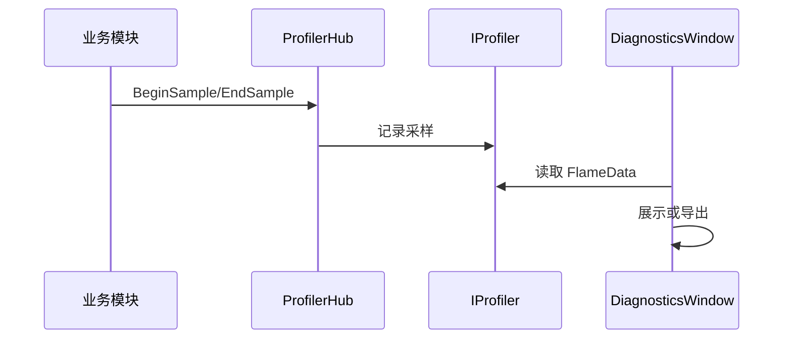

# Ability-Kit Diagnostics 诊断与性能分析模块开发设计文档

> **阅读对象**：需要在开发期采集性能片段、查看诊断窗口、导出分析数据的框架和工具开发者。
>
> **文档目标**：说明 Diagnostics 包的运行时 profiler 抽象、火焰数据模型、编辑器窗口和导出器边界。

---

## 一、设计理念

Diagnostics 模块用于开发期诊断和性能分析。它提供运行时轻量 profiler 抽象，让业务模块可以用统一入口记录分析区间；编辑器侧再通过窗口和导出器查看或导出采样数据。

该包强调“可选接入”。没有诊断需求时可以使用 `NullProfiler`，避免业务代码到处写条件判断。

---

## 二、模块边界

负责：

- 定义 `IProfiler` 采样接口。
- 提供 `ProfilerHub` 统一入口。
- 提供 `NullProfiler` 空实现。
- 提供 `EditorProfiler` 编辑器实现。
- 定义 `FlameData` 火焰图/层级采样数据。
- 提供 `DiagnosticsWindow` 编辑器查看入口。
- 提供基础和高级导出器。

不负责：

- 不替代 Unity Profiler。
- 不负责线上遥测上传。
- 不负责自动插桩所有模块。
- 不承担业务日志系统。

---

## 三、目录结构

| 路径 | 职责 |
|------|------|
| `Runtime/Core/IProfiler.cs` | profiler 接口 |
| `Runtime/Core/ProfilerHub.cs` | 全局 profiler 入口 |
| `Runtime/Core/NullProfiler.cs` | 空实现 |
| `Runtime/Core/EditorProfiler.cs` | 编辑器 profiler 实现 |
| `Runtime/Core/FlameData.cs` | 火焰图数据模型 |
| `Editor/Windows/DiagnosticsWindow.cs` | Unity 编辑器诊断窗口 |
| `Editor/Exporters/Exporters.cs` | 基础导出能力 |
| `Editor/Exporters/AdvancedExporters.cs` | 高级导出能力 |

---

## 四、典型流程

---

## 五、使用建议

- 运行时代码只依赖 `IProfiler` 或 `ProfilerHub`，不要直接依赖 Editor 窗口。
- 默认实现应可切换到 `NullProfiler`，保证生产环境没有额外开销。
- 采样名称应稳定，便于跨版本比较。
- 导出数据格式变更时需要记录版本，避免旧分析工具无法读取。

---

## 六、分析数据分层

大型项目接入 Diagnostics 时，先确定数据口径，再扩展派生分析和 Web 展示。统一分析文件按以下分层组织：

| 分层 | 数据内容 | 规则 |
|------|----------|------|
| Raw | profiler counters、gauges、rates、durations、events、flame、trace nodes、runtime records、diagnostic records | 只表达采集事实，不写业务结论 |
| Correlation | RootContextId、SourceContextId、RuntimeId、RuntimeRootContextId、ActorId、SkillId、ConfigId | 用于跨 Trace、Runtime、Diagnostics 关联，字段语义必须稳定 |
| Derived | trace health、skill chain、runtime leak、snapshot contract、hotspot、baseline diff | 由 Raw + Correlation 推导，可随规则版本迭代 |
| Presentation | Web 标签、摘要、风险等级、排行显示文本 | 只服务展示，不反向污染运行时采集字段 |

---

## 七、Metric Catalog 规范

每个可长期使用的指标都应进入指标目录，目录项至少包含：

| 字段 | 说明 |
|------|------|
| `Name` | 全局稳定名称，例如 `moba.skill.runtime.active` |
| `Category` | 所属域，例如 `moba.skill`、`moba.trace`、`moba.snapshot` |
| `Kind` | counter、gauge、rate、duration、sample、event、derived |
| `Unit` | count、ms、nodes、entities、percent、none |
| `Description` | 面向分析人员的稳定说明 |
| `Stability` | stable、experimental、internal |
| `Sampling` | always、sampled、debug-only、export-only |
| `Dimensions` | actor、skill、traceKind、runtimeKind、frameRange 等可用维度 |
| `Owner` | 指标责任模块或团队 |

命名规则：

- 使用小写域前缀和点分层级，例如 `moba.trace.active.roots`。
- 耗时指标单位写入名称或 Unit，优先使用 `durationMs` / `ms`。
- 同一语义不能同时存在多个名称；改名必须保留兼容映射或进入新 schema 版本。
- 高频指标必须声明采样策略，避免业务模块默认全量上报。

---

## 八、Schema 演进规则

`abilitykit-analysis.v1` 是 Web 和离线工具消费的稳定契约，演进规则如下：

- v1 内允许新增可选字段，不允许改变已有字段语义。
- 删除字段、改字段类型、改单位、改关联语义都必须进入新 schema 版本。
- Web viewer 必须兼容 PascalCase 和 camelCase。
- Artifact 应包含 metric catalog，便于离线工具理解指标口径。
- 派生分析规则升级时，应通过 insight id、category、values 保持兼容；必要时在 Metadata 中记录规则版本。
- CI 和基线对比只依赖 stable 指标；experimental/internal 指标不能作为阻断条件。

---

## 九、Threshold Profile 与 Baseline Diff

`ThresholdProfile` 用于把派生分析中的阈值显式导出，避免 Web、CI、人工排查只能看到结论却看不到判定依据。

| 字段 | 说明 |
|------|------|
| `Name` / `Version` / `Scope` | 阈值配置名称、版本和适用范围 |
| `Rules` | 稳定规则列表，包含 metric、category、severity、operator、value、unit、description |
| `Evaluations` | 本次分析对规则的实际评估结果，包含 actual、expected、delta、status |
| `Metadata` | 规则来源、模式、是否可替换为项目级配置等附加信息 |

`Baseline` 用于表达当前分析文件和历史基线、演示基线或 CI 基线之间的差异。

| 字段 | 说明 |
|------|------|
| `BaselineId` | 基线标识，例如历史构建号、场景版本或 demo baseline |
| `Source` | 基线来源，例如 embedded-demo-baseline、ci-history、manual-import |
| `ComparedAtUtc` | 对比生成时间 |
| `Metrics` | 指标对比列表，包含 current、baseline、delta、deltaPercent、severity、direction |
| `Metadata` | 对比模式和使用说明 |

使用规则：

- Threshold 和 Baseline 都是 v1 可选 section，旧导出文件缺失这些字段时 Web viewer 必须正常工作。
- Baseline Diff 只应使用 stable 指标作为 CI 阻断依据；demo baseline 只用于演示分析能力。
- Threshold Rule 的 `Metric` 应能在 Metric Catalog 中找到相同或通配语义，便于离线工具解释单位和采样策略。
- 派生分析里的风险等级应尽量引用同一组 threshold 常量或配置，避免导出规则和实际判断不一致。

---

*文档版本：1.2*
*最后更新：2026-07-01*
