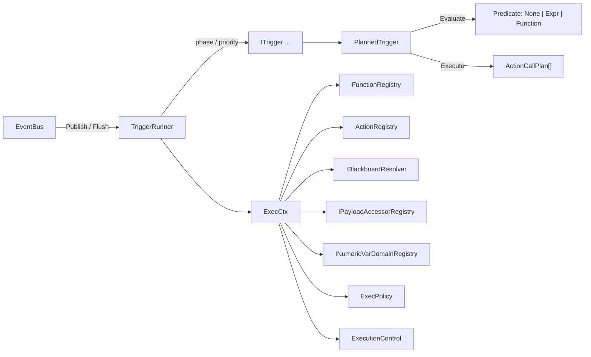
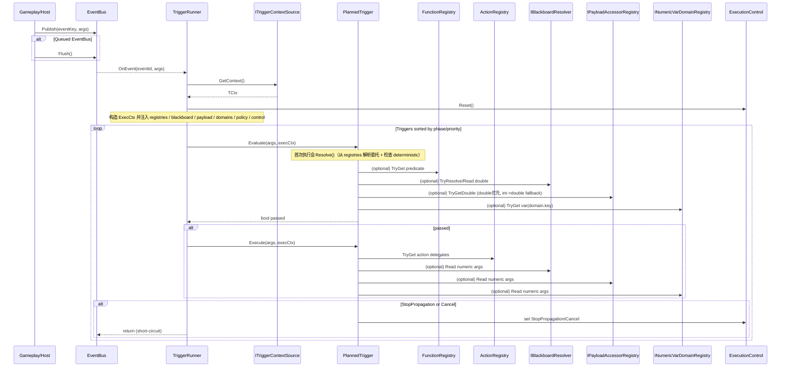
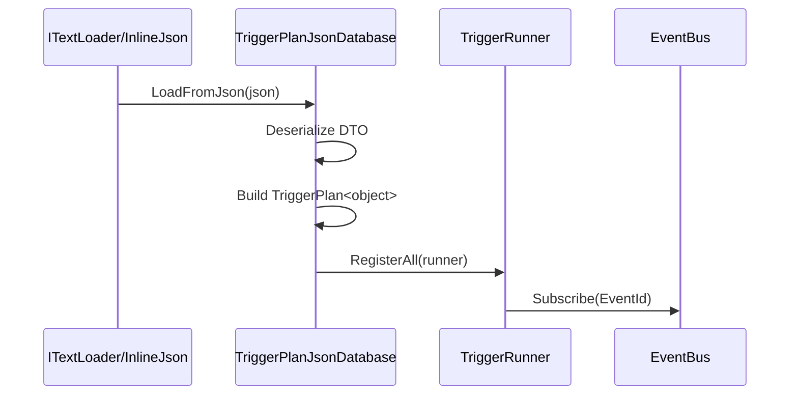
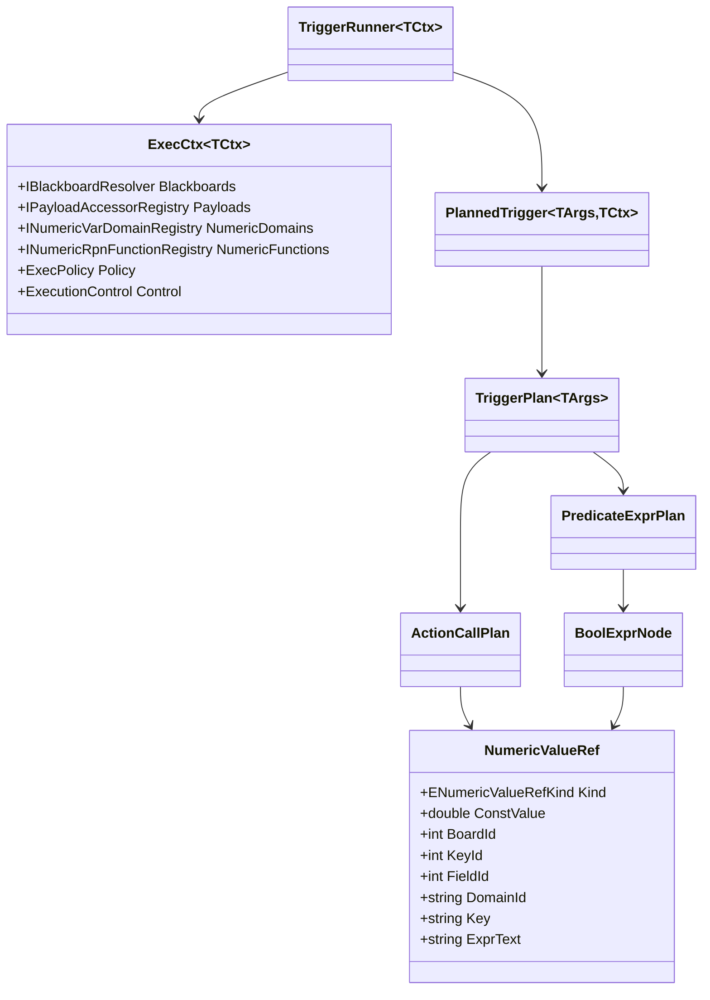

# AbilityKit Triggering 运行时模块设计文档（Runtime）

本文档面向：
- 需要在运行时**注册触发器**、**派发事件**、**加载 TriggerPlan JSON** 的使用者
- 需要扩展“任意条件/任意行为”、接入 deterministic replay / ECS 的开发者

目标：帮助你快速建立对 `com.abilitykit.triggering/Runtime` 的整体心智模型，并能按推荐路径落地使用。

---

## 1. 模块分层与目录结构

Runtime 目录大致按职责拆分：

- `Eventing/`
  - `EventBus`：事件总线（Immediate/Queued），支持 `Flush()`
  - `EventSchemaRegistry`：eventId -> argsType/name 的运行时 schema 注册表
  - `StableStringId`：稳定字符串哈希（string -> int）作为运行时 ID

- `Runtime/`
  - `TriggerRunner`：触发器调度器（订阅事件、按 phase/priority 执行、提供 `ExecCtx`）
  - `ExecCtx<TCtx>`：执行上下文（包含 Context、Registries、Blackboard、Payload、Policy 等）
  - `ExecutionControl`：控制短路（StopPropagation/Cancel）
  - `TriggerContext` / `ITriggerContextSource<TCtx>`：由宿主注入的上下文（目前内置 Frame/Sequence）

- `Plan/`
  - `TriggerPlan<TArgs>`：强类型计划结构（Predicate=Function/Expr/None，Actions=强类型调用）
  - `PlannedTrigger<TArgs, TCtx>`：将 `TriggerPlan` 解析成可执行触发器
  - `PredicateExprPlan`：布尔表达式（RPN 逆波兰）
  - `RpnNumericExprRuntime`：numeric(double) RPN 表达式运行时解析/缓存/求值（用于更复杂的数值来源）
  - `Json/TriggerPlanJsonDatabase`：从 JSON 加载计划并注册到 runner

- `Registry/`
  - `FunctionRegistry`：注册 predicate/function 的委托
  - `ActionRegistry`：注册 action 的委托

- `Blackboard/` / `Payload/`
  - 黑板：`DictionaryBlackboard` / `IBlackboardResolver` 等
  - payload：`PayloadAccessorRegistry` / `IPayloadDoubleAccessor<TArgs>` / `IPayloadIntAccessor<TArgs>` 等（numeric 读取优先 double，其次 int->double fallback）

- `ActionScheduler/`
  - Trigger Action 调度主线：管理由 `TriggerPlan.Actions` 派生出的延迟、周期、持续型 Action 实例
  - 由 `TriggerRunner` / `PlannedTrigger` 通过 `ExecCtx.ActionSchedulerManager` 接入，不与通用业务调度混用

- `Schedule/`
  - 通用业务调度：Buff、子弹、AOE、延迟任务等非 Trigger Action 生命周期
  - `DefaultScheduleManager` 仅保留兼容用途，新代码优先使用 `SimpleScheduleManager` 或 `GroupedScheduleManager`

- `Scheduler/`
  - 旧版通用调度注册体系，仅作为兼容层保留
  - 新 Trigger Action 调度不再扩展此目录；需要通用业务调度时优先接入 `Schedule/`

- `Dispatcher/`
  - 外部驱动方式适配层：事件、定时、持续 tick 等 Dispatcher API
  - 新的事件订阅、条件评估、执行控制主线优先使用 `Runtime/TriggerRunner`

- `Plan/Executables/`
  - TriggerPlan 行为树主线节点：Sequence、Selector、If、Repeat、ActionCall 等正式执行结构
  - 与 `Executable/` 的旧 DSL/示例体系分离，后者仅作为兼容和迁移参考

- 根目录兼容占位文件
  - `ActionScheduler.cs`、`TriggerRunner.cs`、`PlannedTrigger.cs` 等根目录空文件仅用于保留旧路径和 `.meta` GUID
  - 删除条件：确认包内外不再依赖对应根目录占位文件及其 `.meta` GUID 后，随兼容清理批次移除

- `Example/`
  - 纯 C# 示例（无 Unity 场景依赖），用于快速理解 API 组合方式

---

## 2. 核心数据流（从事件到触发执行）

一次事件触发的核心流程：

1. 业务侧调用 `EventBus.Publish(eventKey, args)`
2. `EventBus` 将事件分发给订阅者（Immediate 模式立刻派发；Queued 模式等待 `Flush()`）
3. `TriggerRunner` 作为订阅者收到事件：
   - 从 `ITriggerContextSource` 获取 `TriggerContext`
   - 构造 `ExecCtx<TCtx>`（把 registries/blackboard/payload/policy/control 统一注入）
   - 按 `phase -> priority -> registrationOrder` 顺序遍历触发器
4. 对每个触发器：
   - `Evaluate(args, execCtx)` 判定是否满足条件
   - 若满足则 `Execute(args, execCtx)` 执行动作
   - 若 `ExecutionControl.StopPropagation` 或 `ExecutionControl.Cancel` 被置位，则短路退出

### 2.1 Mermaid：运行时架构图

### 2.2 Mermaid：一次事件触发的执行时序（Publish -> Evaluate/Execute）

---

## 3. 触发器模型：ITrigger 与 TriggerPlan

### 3.1 ITrigger<TArgs>
两步接口：
- `bool Evaluate(in TArgs args, in ExecCtx ctx)`
- `void Execute(in TArgs args, in ExecCtx ctx)`

你既可以直接写 `DelegateTrigger<TArgs>`（手写逻辑），也可以使用计划系统 `TriggerPlan<TArgs>` + `PlannedTrigger<TArgs>`。

### 3.2 TriggerPlan<TArgs>
`TriggerPlan` 是推荐的“可序列化/可 codegen/可回放”的中间结构。

- `Phase / Priority`：调度顺序
- `Predicate` 三种形态：
  - `None`：无条件，永远通过
  - `Function`：任意条件（委托），从上下文取值做复杂判断
  - `Expr`：布尔表达式（RPN），性能高且更易 deterministic replay

- `Actions` 两种形态：
  - 强类型 ActionCallPlan：通过 `ActionRegistry` 查委托并执行

`PlannedTrigger<TArgs>` 会在第一次执行时 Resolve：
- 将 `FunctionId/ActionId` 解析为真实委托
- 在执行时按 arity 求值参数（来自 payload/blackboard/const）

---

## 4. “条件”如何表达与扩展

### 4.1 Expr（RPN 布尔表达式）
`PredicateExprPlan` 目前内置节点：
- `CompareNumeric`：对 `NumericValueRef` 做 `Eq/Ne/Gt/Ge/Lt/Le`
- `And/Or/Not`
- `Const`

特点：
- 可序列化、可 codegen
- 可做 deterministic replay（输入显式化）
- 高性能（stackalloc + RPN）

### 4.2 Function（任意条件，推荐扩展点）
当你需要：
- 从上下文取复杂数据（ECS/World/服务查询）
- 做非线性的内部逻辑（查表/组合规则/状态机）

使用 `PredicateKind=Function`：
- 在 `FunctionRegistry` 注册 `PlannedTrigger<TArgs>.Predicate0/1/2` 委托
- `TriggerPlan` 中引用 `FunctionId`

常见数据来源：
- A：`ctx.Context`（来自 `ITriggerContextSource`）
- B：`ctx.Blackboards`
- C：自定义服务（推荐通过自定义 `TCtx` 注入：`ctx.Context.Services`）

---

## 5. “行为/动作”如何表达与扩展

### 5.1 强类型 Action
通过 `ActionRegistry` 注册委托：
- `PlannedTrigger<TArgs>.Action0/1/2`

`ActionCallPlan` 支持：
- `arity=0`：无参数
- `arity=1/2`：参数来自 `NumericValueRef`（const/payloadField/blackboard/var 等）

说明（重构后）：
- 参数类型已升级为 `NumericValueRef`（double）
- payload numeric 读取策略：
  - 先 `IPayloadDoubleAccessor<TArgs>`
  - 再 `IPayloadIntAccessor<TArgs>` 并转换为 double

---

## 6. 数值来源与表达式：NumericValueRef 与 RPN Numeric

### 6.1 NumericValueRef
用于 “从哪里拿 numeric(double) 值”：
- `Const`
- `PayloadField(fieldId)`
- `Blackboard(boardId, keyId)`
- `Var(domainId, key)`（来自 `INumericVarDomainRegistry`）
- `Expr(exprText)`（内部 API 可用；**JSON/UGC 默认禁用**，详见第 8 节）

### 6.2 RPN Numeric（RpnNumericExprRuntime）
当你需要更复杂的数值来源（例如 `payload.amount + bb:combat:atk`）且希望运行时解析：
- `RpnNumericExprPlan`：保存 `lang + text`
- `RpnNumericExprRuntime`：运行时解析并缓存节点
- `RpnNumericExprEval`：用 `ExecCtx` 解析 token 并求值

建议：
- 为 deterministic replay：固定 `lang` 版本、限制 token 集合、避免非确定输入

---

## 7. 确定性（Deterministic Replay）策略

运行时通过 `ExecPolicy.RequireDeterministic` 控制：
- 当 `RequireDeterministic=true`：
  - `PlannedTrigger` 在 Resolve 时会拒绝注册为非确定性的 function/action（registries 会带 `isDeterministic` 标记）

工程建议：
- 将所有“非确定输入”显式化：写入 payload 或 blackboard
- 在回放时只依赖 event stream + 受控黑板更新

---

## 8. JSON 加载（TriggerPlanJsonDatabase）

`TriggerPlanJsonDatabase` 支持：
- 从 JSON 读取多条 trigger 记录
- `RegisterAll(runner)` 批量注册到 runner

当前 DTO 支持：
- `Predicate.Kind = none/expr`
- `expr` 里 nodes 对应 `BoolExprNode`
- `Actions` 支持 arity=0/1/2 + `NumericValueRef`

说明（重构后）：
- `NumericValueRefDto`（double）替代旧的 int DTO
- 支持来源：`Const/Blackboard/PayloadField/Var/Expr`
- **UGC 策略（默认 B）**：JSON 加载路径禁止 `Expr`
  - `TriggerPlanJsonDatabase.BuildNumericValueRef` 遇到 `Kind=Expr` 会抛 `NotSupportedException`
  - 如果你希望允许表达式文本，必须改为受控白名单策略（domain/key/function）并重新开启

### 8.1 Mermaid：JSON 加载与注册流程

### 8.2 Mermaid：核心数据结构（简化类图）

注意：
- JSON 加载的计划是 `TriggerPlan<object>`，适用于“无强类型 payload / 纯 runtime 配置”的场景。
- 若你需要强类型 args 校验，建议配合 `EventSchemaRegistry` 或 codegen。

---

## 9. 示例索引（Runtime/Example）

建议按顺序阅读：

- `TriggeringExample.cs`
  - 从零搭建 runner + payload/blackboard + RPN Numeric 求值

- `TriggerPlanExample.cs`
  - 标准计划示例：复合条件（RPN And/Or/Not + Compare）+ 复合行为（多 action）+ 触发事件

- `ExecutionControlExample.cs`
  - `StopPropagation` / `Cancel` 的短路行为

- `QueuedEventBusExample.cs`
  - Queued 模式下 `Publish` 与 `Flush`

- `TriggerPlanJsonDatabaseExample.cs`
  - JSON 加载 + 注册

- `AnyPredicate_ContextSourceExample.cs`
  - A：从 `ctx.Context`（contextSource）取值做任意条件

- `AnyPredicate_BlackboardExample.cs`
  - B：从黑板取值做任意条件

- `AnyPredicate_CustomServiceExample.cs`
  - C：从自定义服务取值做任意条件（通过自定义 `TCtx`：`ctx.Context.Services`）

- `PhasePriorityExample.cs`
  - phase/priority 执行顺序

- `EventSchemaRegistryExample.cs`
  - event schema 的注册与查询

---

## 10. 推荐上手路径（最短路径）

1. 先跑通：`TriggeringExample`（理解 runner/bus/blackboard/payload）
2. 再看：`TriggerPlanExample`（理解计划系统 + 复合条件/复合行为）
3. 再看：`AnyPredicate_*`（理解“任意条件”扩展点）
4. 最后接入：JSON/codegen

---

## 11. 设计约束与未来扩展建议

- 当前 `TriggerContext` 仅包含 `Frame/Sequence`，若你需要“服务容器/世界引用”，建议通过泛型上下文 `TCtx` 承载（例如 `BattleTriggerContext`）：
  - 在 predicate/action 内使用 `ctx.Context.Services`

- 对 expression 体系（Bool/Numeric）可持续扩展：
  - 增加更多 ValueRef（float/bool/string/entityId/tagset）
  - 增加更多节点（范围、集合包含、标签匹配等）
  - 增加 schema 驱动的 codegen 以确保强类型与性能

---

## 12. 战斗模块集成建议（已确认：服务注入=B，状态存储=A，事件粒度=B）

本章节是面向“战斗模块”落地时的推荐约束与形态。

### 12.1 服务注入（B）：通过自定义 TCtx 统一提供战斗服务

结论：战斗侧需要查询 ECS/World/表配置/战斗规则时，推荐将服务放进自定义 `TCtx`（例如 `BattleTriggerContext.Services`）。

推荐做法：
- 定义 `readonly struct BattleTriggerContext { public readonly IBattleServices Services; ... }`
- 由战斗系统构建 `TriggerRunner<BattleTriggerContext>(..., contextSource: ...)`
- 在 predicate/action 内部使用：`var s = ctx.Context.Services;`

好处：
- 触发器逻辑不绑定具体服务实例生命周期（更易测试/热重载/回放替换实现）
- 更容易在 deterministic replay 场景中切换为“回放专用服务实现”

### 12.2 状态存储（A）：ECS 是权威状态，黑板是视图/桥接层

结论：战斗的权威状态建议放在 ECS（或战斗 world 数据结构）中；Triggering 的黑板更适合作为：
- 规则需要的数据尽量“显式化”：投影到 payload/blackboard，减少隐式查询
- 需要复杂查询时再通过 `ctx.Context.Services` 访问 ECS/World

### 12.3 事件粒度（B）：偏粗粒度事件（结果落地）

结论：战斗事件建议偏粗粒度，且尽量携带“已结算后的确定性结果”，方便规则/回放。

示例：
- 推荐：`DamageApplied`（包含 source/target/damage/isCrit/isBlocked 等最终结果）
- 避免：把同一次伤害拆成过多细碎事件，导致回放难、顺序复杂、性能与一致性风险变高

建议：
- 粗粒度事件 + 必要的阶段（phase）约束来表达执行时序
- 对随机/概率类机制：结果必须落地到事件 payload 或黑板，避免运行时再次采样
