# MOBA 触发器事件上下文与溯源设计

## 1. 背景

当前 MOBA runtime 已经具备几个关键模块：

- 伤害管线通过 `AttackInfo`、`AttackCalcInfo`、`DamageResult` 作为强类型事件参数派发不同阶段事件。
- 触发器系统通过事件 payload 执行配置化 Trigger Plan。
- 效果执行服务会为每次效果执行创建 trace 节点，用于记录效果链路。
- 技能释放已经引入 `MobaSkillCastRuntime`，用于管理一次技能释放的聚合生命周期和技能作用域黑板。
- Buff 等持续对象已经开始保存 `SourceContextId`、`SkillRuntimeHandle` 等运行时来源信息。

但随着触发链路变复杂，单纯在 `AttackInfo` 或 Buff 上继续增加来源字段会逐渐失控。典型路径是：

1. 技能释放创建技能运行时。
2. 技能效果造成伤害，派发 `AttackInfo`。
3. `AttackInfo` 作为强类型事件参数触发其他 Trigger Plan。
4. 新的 Trigger Plan 可能继续造成伤害、添加 Buff、创建子弹、创建区域、创建召唤物。
5. Buff 或子弹后续再次触发效果，又派发新的强类型事件参数。
6. 调试、回放、循环保护、结算归因都需要知道每一层来源。

因此需要明确：事件参数、触发上下文、效果执行上下文、trace、技能运行时、派生对象运行时分别负责什么。

## 2. 核心结论

`AttackInfo` 不是来源管理中心，而是伤害管线某一阶段派发给触发器的强类型事件参数。

它应该表达：

- 本次伤害是谁打谁。
- 本次伤害如何计算。
- 本次伤害的直接结算原因。
- 本次事件可用于继续追溯来源的引用。

它不应该表达：

- 反伤是否已经触发过。
- 某个技能已经命中过哪些目标。
- 某个技能当前衰减因子是多少。
- Buff、子弹、区域、召唤物的生命周期。
- 完整 trace 树结构。
- 任意自定义运行时参数。

这些职责应分别交给 trace、技能运行时黑板、派生对象运行时和触发器执行上下文。

## 3. 概念分层

### 3.1 强类型事件参数

代表某次领域事件的事实数据。

当前例子：

- `AttackInfo`：伤害创建、伤害计算前等阶段的输入事件。
- `AttackCalcInfo`：伤害计算过程事件。
- `DamageResult`：伤害应用完成事件。

职责：

- 作为事件总线派发的 payload。
- 为触发器条件判断和 Action 提供强类型数据。
- 只保存本次事件需要的数据和必要来源引用。

不负责：

- 管理派生效果生命周期。
- 管理技能运行时状态。
- 表达完整溯源树。
- 承载任意业务黑板。

### 3.2 触发器执行上下文

代表某个 Trigger Plan 正在处理某个事件 payload。

职责：

- 读取 payload 中的强类型数据。
- 读取来源引用并转换成效果执行输入。
- 提供当前触发器调用的 source actor、target actor、source context。
- 将当前事件上下文传递给后续 Action。

设计方向：

- 使用强类型接口暴露上下文。
- 避免泛型 KV 和魔法字符串成为主要路径。
- 对不同领域事件提供专门解析器，例如 Damage payload resolver、Buff payload resolver。
- 事件参数只表达领域事件事实；执行环境通过 `MobaTriggerExecutionSnapshot` 暴露只读快照，不把底层 `EffectExecutionContext` 或 Triggering `ExecCtx<TCtx>` 传到业务条件层。
- 复杂条件判断统一通过 `MobaTriggerConditionContext` 查询 payload、origin、trace、execution snapshot、skill runtime blackboard 和 data bag。
- payload 到条件上下文的创建不写死在执行服务中，而是通过 `MobaTriggerPayloadResolverRegistry` 注册可替换解析器。
- MOBA 业务触发条件通过 `MobaTriggerConditionRegistry` 绑定到 triggerId，在进入通用 Trigger Plan 前先执行。

`MobaTriggerConditionContext` 的定位是 readonly 查询视图，不是新的可变运行时容器。它把一次触发器调用可读的信息收敛到一个稳定入口，后续条件系统可以读取：

- 当前强类型 payload。
- source actor、target actor、parent/root/owner context。
- 当前 `MobaGameplayOrigin` 和 trace input。
- 当前 `MobaTriggerExecutionSnapshot` 中的 kind、triggerId、configId、frame、stack、elapsed、remaining 等执行环境事实。
- 当前 `MobaSkillCastRuntimeHandle`。
- 技能运行时黑板中的命中记录、命中次数、循环 guard 等状态。
- 必要时读取标准化 data bag 兼容字段。

查询优先级按语义区分：事件 payload / trace / origin 代表“发生了什么、从哪里来”，执行快照代表“本次触发在什么执行环境下运行”。同一字段存在多路来源时，事件事实和来源优先，执行快照只作为执行环境补充。

这样复杂 condition 不需要直接依赖一堆松散接口，也不需要把条件需要的查询字段继续塞进 `AttackInfo`、`DamageResult` 这类事件事实对象。

### 3.3 执行环境快照

`MobaTriggerExecutionSnapshot` 是 MOBA 层定义的只读执行环境视图，用于抽象底层执行对象。

它表达的是：

- 当前执行的 `EffectContextKind`。
- source actor、target actor、source/root/owner context。
- 当前 triggerId、configId、frame。
- 当前技能运行时 handle。
- Buff / Effect 等执行期可能需要判断的 stack、elapsed、remaining 等稳定读值。

它不表达：

- 具体服务容器。
- 底层事件总线。
- Triggering 运行时函数表、action 表、执行控制器。
- 任何可变玩法黑板。

因此，`EffectExecutionContext`、`ExecCtx<TCtx>` 仍然可以在底层模块中存在，但业务条件只通过 `MobaTriggerExecutionSnapshot` 读取稳定字段。这样条件系统既能判断执行环境数据，又不会和某个具体执行器强绑定。

### 3.4 效果执行上下文

代表一次效果配置或 Trigger Plan 的执行。

职责：

- 为本次效果执行创建 trace 节点。
- 提供当前 Action 执行时的 trace scope。
- 从 trigger payload 中提取父来源。
- 将本次效果执行作为后续事件或派生对象的直接来源。

当前 `MobaEffectExecutionService` 已经具备这个方向：

- 能从 payload 提取 trace 输入。
- 能创建 root 或 child trace context。
- 能记录 Action 子节点。
- 能暴露当前 trace scope 给 Action 使用。
- 能在进入 Trigger Plan 前执行深度、帧预算、root 预算和同 root 同 trigger 预算检查。
- 能通过 `MobaTriggerPayloadResolverRegistry` 创建 `MobaTriggerConditionContext`，后续不同 payload 类型可以注册自己的解析器。
- 能在通用 Trigger Plan 执行前调用 `MobaTriggerConditionRegistry`，让 MOBA 业务条件读取统一条件上下文。

执行预算是效果执行层的兜底保护，优先级高于 trace 节点创建。也就是说，如果某条链路已经超过预算，服务会直接拒绝继续执行，并记录 trigger id、frame、depth、root context、source/target actor 等信息，避免无限链路继续制造 trace 节点。

这里要区分三类保护：

1. 玩法级去重或反伤限制，使用 `MobaSkillCastRuntime` 黑板或具体 runtime 自己的状态。
2. 执行服务级预算，防止错误配置、反伤互触、周期对象爆发导致同帧无限递归。
3. trace 查询，主要用于调试、归因、回放和问题定位，不作为高频循环保护主路径。

`MobaTriggerConditionRegistry` 和通用 Triggering 包中的 predicate 不是互斥关系：通用 predicate 适合框架级、数值表达式级判断；MOBA trigger condition 适合读取来源、技能运行时黑板、payload 强类型数据、root context 等业务语义。后续配置层可以逐步把条件声明转换成 registry 绑定，执行服务不需要再知道每种条件细节。

后续需要补强的是：把预算阈值接入配置或 battle rule，把条件绑定接入配置加载，并继续把 Area、Summon、Delay 等派生对象纳入同一套 origin/runtime 规范。

### 3.5 Trace 溯源树

代表行为链路如何发生。

职责：

- 记录技能、效果、Action、Buff、子弹、区域、召唤物、伤害等上下文之间的父子关系。
- 支持调试、回放、战斗日志、归因、问题定位。
- 提供完整来源查询能力。

不负责：

- 保存技能运行时可变黑板。
- 作为派生对象生命周期管理器。
- 作为触发器 payload。

### 3.6 技能运行时聚合

`MobaSkillCastRuntime` 代表一次技能释放的聚合生命周期。

职责：

- 表达一次技能释放的整体生命周期。
- 在技能管线结束后，只要 Buff、子弹、区域、召唤物等派生对象仍然存在，技能运行时仍然可以存活。
- 保存技能作用域黑板。
- 管理派生对象 retain/release。

适合存放：

- 已命中的目标集合。
- 命中次数。
- 伤害衰减因子。
- 连锁或反伤 loop guard。
- 本次技能释放共享的临时状态。

不适合存放：

- 静态配置。
- Actor 长期属性。
- 完整 trace 结构。
- Buff 自己的剩余时间和层数等生命周期状态。

### 3.7 派生对象运行时

代表 Buff、Projectile、Area、Summon 等由效果创建、可以跨帧存在的对象。

职责：

- 管理自己的生命周期。
- 保存自己的直接来源 context。
- 保存所属技能运行时句柄。
- 后续触发效果时，把来源继续传递下去。
- 存活期间 retain 技能运行时，销毁时 release。

## 4. 事件链路模型

### 4.1 主链路

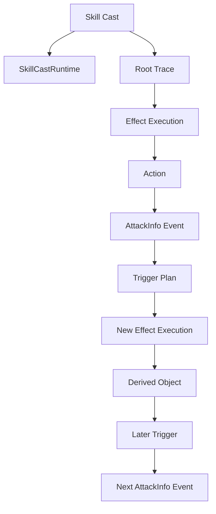

### 4.2 伤害触发派生效果链路

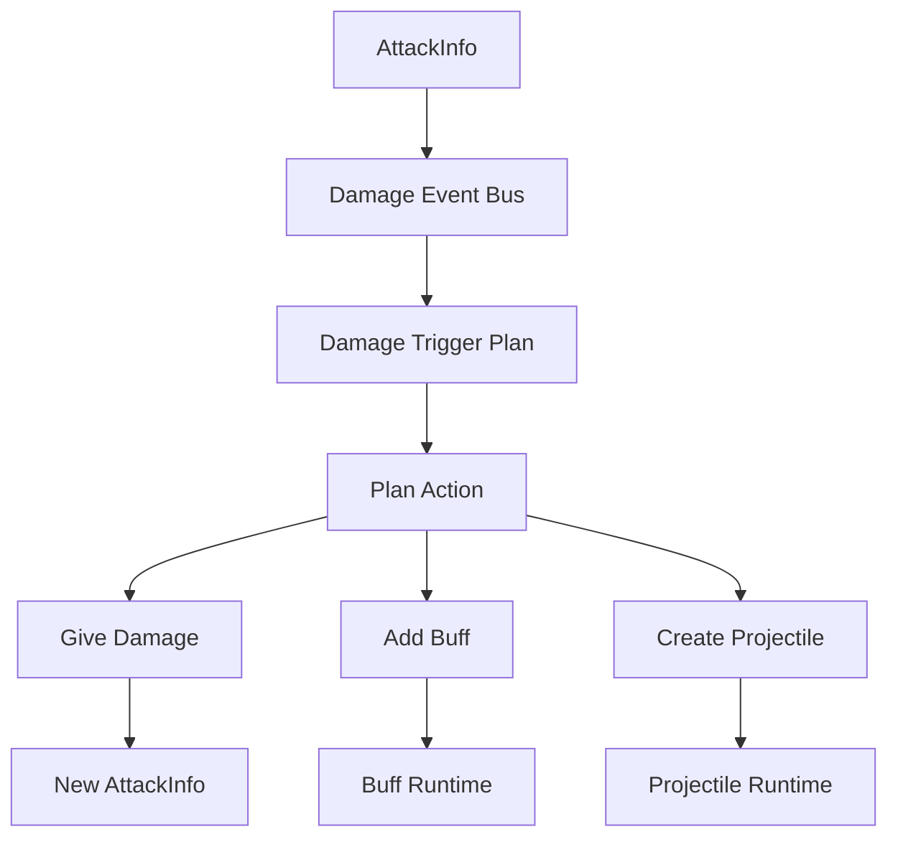

这说明 `AttackInfo` 只是其中一个事件节点。它被触发器消费后，触发器执行行为可能继续产生新的事件或对象。因此来源传递必须放在统一 context/origin 模型中，而不是让每个事件参数都自行扩展一套来源字段。

### 4.3 完整事件、上下文、溯源协作流程

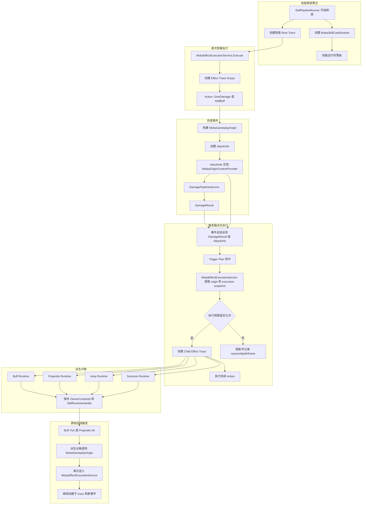

这条图要表达的重点是：`AttackInfo`、`DamageResult`、`BuffTriggerContext` 都只是某一阶段的强类型入口。真正让链路不断延续的是 `MobaGameplayOrigin`，真正记录链路结构的是 trace，真正保存技能作用域状态的是 `MobaSkillCastRuntime`。

### 4.4 伤害到反应式效果的细化流程

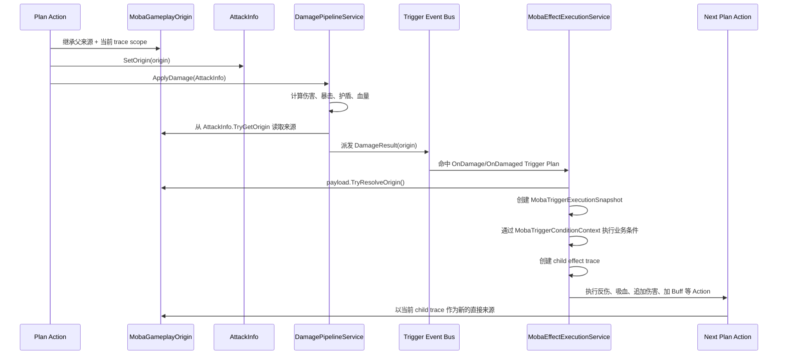

这里不要让 `DamagePipelineService` 反向知道技能、Buff、子弹等上层对象。它只接受 `AttackInfo`，并把 `AttackInfo` 携带的来源继续转移到 `DamageResult`。

## 5. 来源模型设计

建议新增统一值对象：`MobaGameplayOrigin`。

### 5.1 命名建议

优先级：

1. `MobaGameplayOrigin`
2. `MobaEffectOriginContext`
3. `MobaSourceContext`

推荐 `MobaGameplayOrigin`，因为它不仅服务效果系统，也服务伤害、Buff、子弹、召唤物、区域、表现、统计和日志。

### 5.2 字段语义

建议字段：

- `SourceActorId`：行为发起者。
- `TargetActorId`：当前主要目标。
- `ImmediateKind`：当前事件的直接来源类型。
- `ImmediateConfigId`：当前直接来源的配置 ID。
- `ImmediateContextId`：当前直接来源的 trace/runtime context ID。
- `ParentContextId`：后续创建 trace 子节点时的父 context。
- `RootContextId`：整条来源链的根 context。
- `OwnerContextId`：当前持续对象或监听器的归属 context。
- `SkillRuntimeHandle`：所属技能释放聚合句柄。

这几个字段解决的问题不同：

| 字段 | 解决的问题 |
| --- | --- |
| `ImmediateContextId` | 当前事件直接由谁触发 |
| `ParentContextId` | 后续 trace 挂到哪里 |
| `RootContextId` | 最早主线来源是谁 |
| `OwnerContextId` | 当前事件属于哪个持续对象或监听器 |
| `SkillRuntimeHandle` | 如何回到本次技能释放聚合和黑板 |

### 5.3 来源继承规则

每次从旧事件生成新事件或派生对象时，必须遵守以下规则：

1. 新事件的 `ParentContextId` 应指向当前正在执行的效果 trace context。
2. 新事件的 `ImmediateContextId` 应指向直接创建它的行为 context。
3. `RootContextId` 默认从父来源继承。
4. `SkillRuntimeHandle` 默认从父来源继承。
5. 如果新事件来自一个持续对象，例如 Buff tick，则 `OwnerContextId` 应指向该 Buff 的 source context。
6. 如果没有父来源，则创建 root trace，并以当前效果作为 root。

### 5.4 Origin 字段语义图

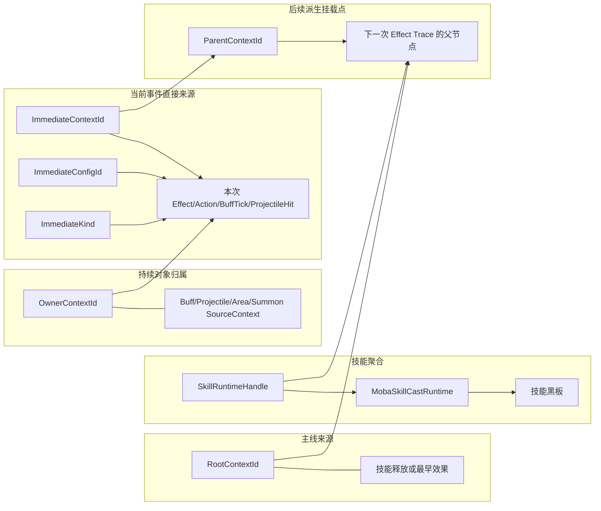

理解这几个 ID 时，可以按一句话区分：`ImmediateContextId` 回答“这次事件直接是谁造成的”，`ParentContextId` 回答“后续 trace 挂到哪里”，`RootContextId` 回答“最早主线是谁”，`OwnerContextId` 回答“当前持续对象归谁”，`SkillRuntimeHandle` 回答“这条链属于哪次技能释放聚合”。

### 5.5 来源继承决策流程

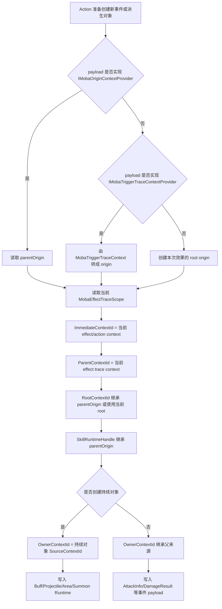

这条流程应该成为后续 `GiveDamage`、`TakeDamage`、`AddBuff`、创建子弹、创建区域、创建召唤物的统一来源构建规则。实现上可以先在各 Action 内遵守，后续再收敛到 `MobaGameplayOriginFactory` 或 resolver。

### 5.6 接口设计

建议新增接口：

```csharp
public interface IMobaOriginContextProvider
{
    bool TryGetOrigin(out MobaGameplayOrigin origin);
}
```

已有接口继续保留：

```csharp
public interface IMobaTriggerTraceContextProvider
{
    bool TryGetTraceContext(out MobaTriggerTraceContext traceContext);
}

public interface IMobaTriggerSkillRuntimeContext
{
    bool TryGetSkillRuntimeHandle(out MobaSkillCastRuntimeHandle handle);
}
```

推荐关系：

1. `IMobaOriginContextProvider` 是更高层、更统一的来源入口。
2. `IMobaTriggerTraceContextProvider` 是 trace 输入兼容层。
3. `IMobaTriggerSkillRuntimeContext` 是访问技能运行时的快捷接口。
4. `MobaGameplayOrigin` 可以派生出 `MobaTriggerTraceContext`。

## 6. AttackInfo 应如何调整

### 6.1 当前问题

当前 `AttackInfo` 有：

```csharp
public object OriginSource;
public object OriginTarget;
public MobaTraceKind OriginKind;
public int OriginConfigId;
public long OriginContextId;
```

问题：

- `object` 类型不利于维护。
- 只能表达一个来源点，难以区分 immediate、parent、root、owner。
- 无法直接表达技能运行时句柄。
- `DamageResult` 重复同样字段。
- `GiveDamage`、`TakeDamage` 各自手写来源复制逻辑，容易出现语义漂移。

### 6.2 目标形态

`AttackInfo` 应变成：

```csharp
public sealed class AttackInfo : IMobaOriginContextProvider
{
    public int AttackerActorId;
    public int TargetActorId;
    public MobaGameplayOrigin Origin;
    public DamageType DamageType;
    public CritType CritType;
    public DamageReasonKind ReasonKind;
    public int ReasonParam;
    public int FormulaKind;
    public string FormulaId;
}
```

`DamageResult` 同理携带 `MobaGameplayOrigin`。

这样 `AttackInfo` 仍然是强类型事件参数，但来源字段被收敛成一个规范对象。

## 7. 效果派生事件的规则

当某个 Trigger Plan 消费 `AttackInfo` 后执行 `GiveDamage`：

1. 从当前 payload 读取 `MobaGameplayOrigin`。
2. 从当前 `MobaEffectExecutionService` 读取当前 trace scope。
3. 构建新的 `MobaGameplayOrigin`。
4. 新的 `ImmediateKind` 设置为 `EffectExecution` 或具体 Action 类型。
5. 新的 `ParentContextId` 设置为当前效果 trace context。
6. `RootContextId` 和 `SkillRuntimeHandle` 从旧 origin 继承。
7. 创建新的 `AttackInfo` 并派发。

### 7.1 `GiveDamage` 生成新伤害事件

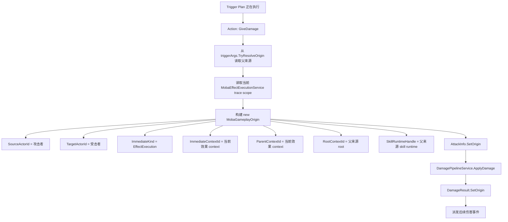

这里的新 `AttackInfo` 是一次全新的伤害事实，但不是一条全新的主线。它的直接来源变成当前效果执行，根来源和技能运行时仍然继承上一层。

当某个 Trigger Plan 执行 `AddBuff`：

1. 从当前 payload 读取 `MobaGameplayOrigin`。
2. 从当前效果 trace scope 创建 Buff 来源 context。
3. Buff runtime 保存 `SourceContextId`。
4. Buff runtime 保存 `SkillRuntimeHandle`。
5. Buff 存活时 retain 技能运行时。
6. Buff 后续 tick 或 remove 触发效果时，通过 `IMobaOriginContextProvider` 把来源继续传下去。

### 7.2 `AddBuff` 创建持续对象

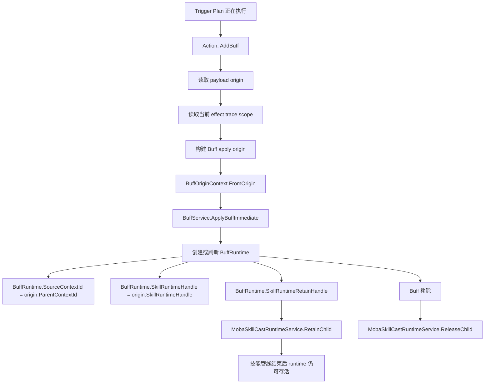

持续对象和瞬时事件最大的差异是生命周期。`AttackInfo` 用完即走，Buff、子弹、区域、召唤物则必须保存来源和技能运行时句柄，并用 retain/release 把技能运行时聚合生命周期撑住。

当某个 Buff tick 造成伤害：

1. Buff trigger context 提供 origin。
2. `MobaEffectExecutionService` 根据 origin 创建 child trace。
3. `GiveDamage` 根据当前 trace scope 创建新的 `AttackInfo`。
4. 新伤害的直接来源是本次 Buff tick effect。
5. 新伤害的 owner/root/skill runtime 仍能追溯到原技能。

### 7.3 Buff tick 再次触发伤害

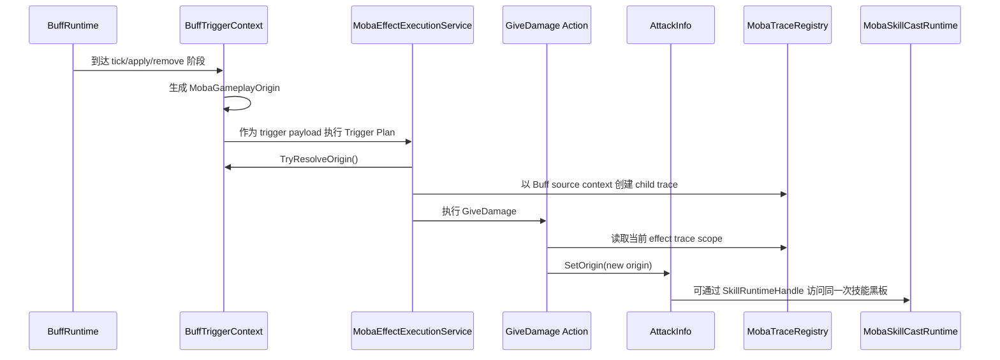

这条链路能回答一个很关键的问题：Buff tick 当前造成的伤害，直接来源是这次 Buff tick 的效果执行，但 Buff 本身又能追溯到创建它的技能和效果。

### 7.4 `ShootProjectile` 创建投射物持续对象

投射物和 Buff 一样属于跨帧派生对象，但它的通用移动、碰撞逻辑位于 projectile 基础模块，MOBA 业务来源不应该侵入通用 projectile 包。因此当前采用 sidecar 缓存方式：

1. `ShootProjectilePlanActionModule` 从触发 payload 读取 `MobaGameplayOrigin` 和当前 effect trace scope。
2. `MobaProjectileService` 创建 `ProjectileLaunch` trace context，并生成 `ProjectileSourceContext`。
3. `MobaProjectileLinkService` 以 `ProjectileId` 缓存 `ProjectileSourceContext` 和 `MobaSkillRuntimeRetainHandle`。
4. 连发或延迟发射时，先按 launcher actor 缓存来源，再在 `ProjectileSpawnEvent` 到达时绑定到实际 `ProjectileId`。
5. 投射物命中时，`ProjectileHitArgs` 从 `ProjectileSourceContext` 还原 source actor、origin、trace context 和 skill runtime handle。
6. 投射物退出时，结束 `ProjectileLaunch` trace context，并 release skill runtime child retain。

```mermaid
sequenceDiagram
    participant Action as ShootProjectile Action
    participant Service as MobaProjectileService
    participant Link as MobaProjectileLinkService
    participant Runtime as MobaSkillCastRuntime
    participant Projectile as Projectile Service
    participant Hit as ProjectileHitArgs
    participant Effect as MobaEffectExecutionService

    Action->>Action: payload.TryResolveOrigin()
    Action->>Service: Launch(sourceContext)
    Service->>Link: BindLauncherSource 或 BindSource
    Service->>Runtime: RetainChild(kind=Projectile, childId=ProjectileId)
    Projectile->>Link: ProjectileSpawnEvent 绑定实际 ProjectileId
    Projectile->>Hit: ProjectileHitEvent
    Hit->>Link: 读取 ProjectileSourceContext
    Hit->>Effect: 作为 trigger payload 继续执行
    Projectile->>Link: ProjectileExitEvent
    Link->>Runtime: ReleaseChild(retainHandle)
```

这里需要特别注意：skill runtime child 的 `ChildId` 必须使用实际 `ProjectileId`，不能只使用 source trace context。连发子弹可能共享同一个 launch context，如果用 context id 做 child id，会被 runtime 当成同一个子对象，导致 retain/release 失真。

### 7.5 周期触发 payload 的标准接口

`MobaPeriodicTriggerContext` 现在也按统一触发 payload 规范补齐接口：

- `IMobaActorContextProvider`：提供 source/target actor。
- `IMobaOriginContextProvider`：由 periodic trace context 还原 `MobaGameplayOrigin`。
- `IMobaTriggerSkillRuntimeContext`：从 periodic runtime 继续暴露 skill runtime handle。
- `IMobaTriggerDataContext`：同步 invocation、trace、skill runtime 数据，兼容旧 Action 的 dictionary fallback。

这使 Buff interval、持续区域 tick、后续持续结算都能走同一套“强类型 payload + 标准 readonly provider”的传递规则。

## 8. 反伤和循环保护

反伤不是 `AttackInfo` 的职责。

推荐做法：

1. `DamageResult` 触发反伤 Trigger Plan。
2. 反伤 Action 读取当前 origin。
3. 通过 `SkillRuntimeHandle` 访问技能运行时黑板。
4. 使用 `LoopGuards` 或专门 key 判断当前 context 是否已经处理。
5. 如果没有处理过，则写入 guard，并派发新的 `AttackInfo`。
6. 新 `AttackInfo` 通过 origin 记录直接来源为反伤效果。

### 8.1 反伤 loop guard 流程

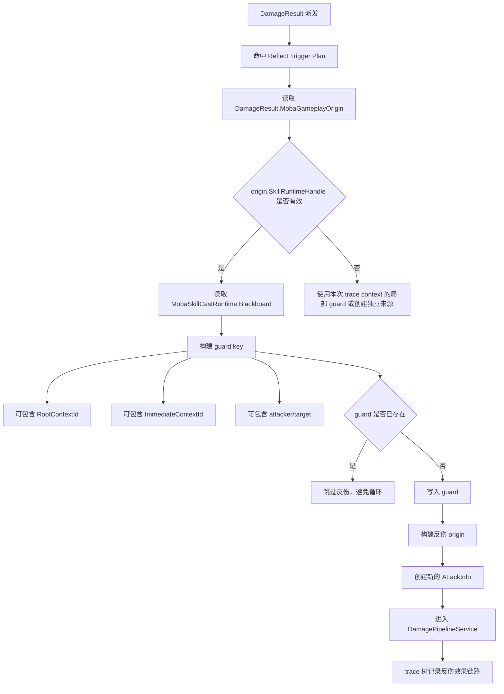

loop guard 的存储位置应当跟作用域一致。如果反伤只限制一次技能释放内不能重复，那么放在 `MobaSkillCastRuntime` 黑板最合适；如果反伤只限制某一个 Buff 实例，则可以放在 Buff runtime 自己的状态中；如果只是调试查询，则查 trace 树即可，不要把 trace 查询当成每帧循环保护的主路径。

这样：

- 事件参数保持干净。
- 循环保护有技能作用域状态。
- trace 树仍能完整看到反伤链路。
- 调试时能知道反伤来自哪个 Buff、Buff 来自哪个技能。

## 9. 执行预算与条件查询上下文

复杂链路会出现技能、Buff、效果、伤害监听、反伤、子弹命中、区域 tick 互相嵌套的情况。当前正式化后的处理方式是把“条件查询”和“执行安全”拆成两层：

### 9.1 条件查询上下文

`MobaTriggerConditionContext` 是一次 trigger 调用的强类型只读查询面。

它默认由 `MobaTriggerPayloadResolverRegistry` 根据 payload 和 trace input 创建；如果没有更专门的 resolver，会回落到 `MobaDefaultTriggerPayloadResolver`。这样 Damage、Buff、Projectile、Area、Summon 等 payload 后续都可以注册自己的解析器，把领域特有的解析策略集中在 resolver 内，而不是继续堆到 `MobaEffectExecutionService`。

它可以查询：

- payload 本体，用于 `TryGetPayload<TPayload>` 做领域类型判断。
- actor 信息：source actor、target actor。
- trace 信息：parent/root/owner context、origin kind、context kind。
- skill runtime：`MobaSkillCastRuntimeHandle` 和对应黑板。
- 标准 data bag：通过 `AbilityContextKeys` 读取兼容字段。

它不负责写入 gameplay 状态。需要修改命中集合、命中次数、循环 guard 时，应通过 skill runtime blackboard 或具体玩法 action 的强类型接口执行。

### 9.2 触发条件注册表

`MobaTriggerConditionRegistry` 是 MOBA runtime 自己的触发条件扩展点。

它解决的问题是：复杂条件往往不只是“payload 某个数值大于 N”，还可能需要判断：

- 当前 root context 是否已经处理过。
- 当前技能 runtime 黑板里是否已有目标。
- 当前 payload 是否来自 Buff、Projectile、Area 或 DamageResult。
- 当前 source/target actor、origin kind、owner context 是否满足业务限制。

这些条件实现 `IMobaTriggerCondition`，只读取 `MobaTriggerConditionContext`，返回 `MobaTriggerConditionCheckResult`。执行顺序是：

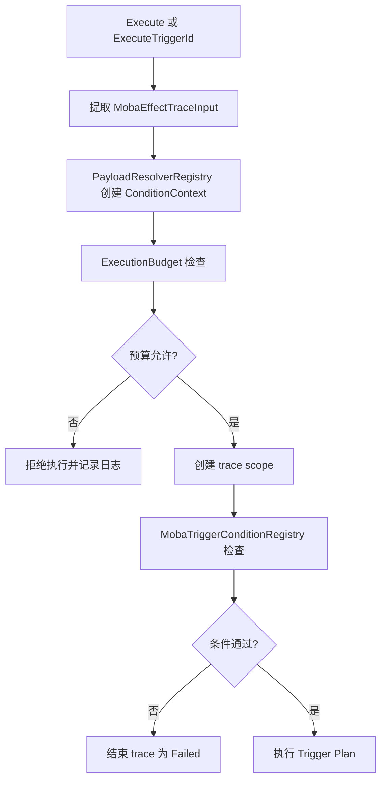

这样以后扩展条件时优先写小型条件类并注册或绑定 triggerId；不需要继承事件 payload，也不需要修改 `AttackInfo`、`DamageResult` 这类事实参数。

### 9.3 执行预算

`MobaTriggerExecutionBudget` 是 `MobaEffectExecutionService` 内部的执行安全防线，默认规则包括：

- 最大递归深度。
- 单帧最大 trigger 执行次数。
- 单帧同 root context 最大执行次数。
- 同 root context 下同一 trigger 最大执行次数。

预算检查发生在创建 trace scope 之前。这样当配置错误导致无限套娃时，被阻断的后续执行不会继续污染 trace 树。没有帧同步服务时，执行服务会使用最外层触发批次作为 fallback frame，保证测试或非帧同步环境中预算仍然能按批次释放。

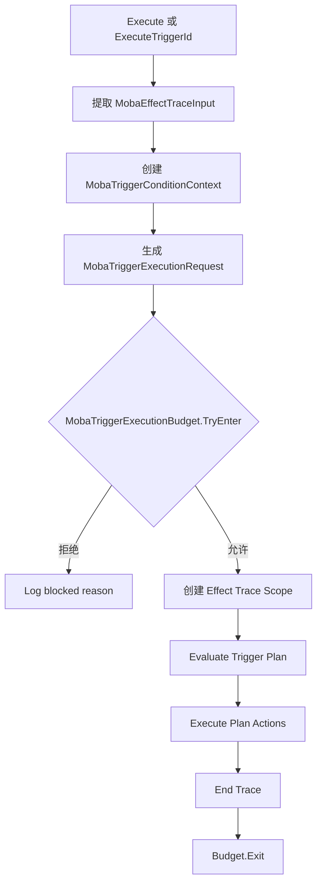

### 9.3 与 loop guard 的边界

执行预算是兜底，不应该替代玩法规则。比如反伤只能触发一次、连锁只传播 N 个目标、同一技能只命中同一目标一次，这些应该使用 `MobaSkillCastRuntime` 黑板、`MobaTriggerConditionRegistry` 条件或对应派生对象 runtime 状态表达。执行预算只保证即使玩法规则漏配，也不会把战斗同帧执行拖入无限递归。

## 10. 当前实现映射

| 当前模块 | 当前职责 | 当前状态 |
| --- | --- | --- |
| `AttackInfo` | 伤害事件参数，保留兼容 origin 字段 | 已携带 `MobaGameplayOrigin` 并实现 `IMobaOriginContextProvider` |
| `AttackCalcInfo` | 伤害计算过程事件参数 | 已通过 `AttackInfo` 代理 `IMobaOriginContextProvider` |
| `DamageResult` | 伤害结果事件参数 | 已携带 `MobaGameplayOrigin` 并实现 `IMobaOriginContextProvider` |
| `GiveDamagePlanActionModule` | 创建新的伤害事件 | 已从 payload origin 和当前 trace scope 构建新 origin |
| `TakeDamagePlanActionModule` | 基于旧伤害结果创建反向伤害 | 已通过 `IMobaOriginContextProvider` 继承并重建 origin |
| `AddBuffPlanActionModule` | 创建 Buff 持续对象 | 已从 payload origin 和当前 trace scope 构建 Buff 来源 |
| `BuffOriginContext` | Buff 来源上下文，带 skill runtime handle | 已内含 `MobaGameplayOrigin` 并实现 `IMobaOriginContextProvider` |
| `BuffTriggerContext` | Buff 触发时提供 trace 和 runtime handle | 已实现 `IMobaOriginContextProvider` |
| `ShootProjectilePlanActionModule` | 创建投射物持续对象 | 已从 payload origin 和当前 trace scope 构建 `ProjectileSourceContext` |
| `ProjectileSourceContext` | 投射物来源 sidecar，上接 origin/runtime，下接 hit payload | 已缓存 source/root/owner context 和 skill runtime handle |
| `ProjectileHitArgs` | 投射物命中事件参数 | 已实现 origin、trace、actor、skill runtime 标准 provider |
| `MobaPeriodicTriggerContext` | 周期触发事件参数 | 已补齐 actor、origin、trace、runtime、data provider |
| `MobaEffectExecutionService` | 从 payload 提取 trace input、创建 trace scope、执行预算和条件检查 | 已优先从 `MobaGameplayOrigin` 提取，并在执行前接入预算和 MOBA trigger condition |
| `MobaTriggerPayloadResolverRegistry` | payload 到条件上下文的可插拔解析入口 | 已提供默认 resolver，后续领域 payload 可注册专用 resolver |
| `MobaTriggerConditionContext` | 复杂条件只读查询视图 | 已可查询 payload、origin、trace、skill runtime blackboard 和标准 data bag |
| `MobaTriggerConditionRegistry` | MOBA 业务触发条件注册与 triggerId 绑定 | 已提供条件接口、注册、绑定和执行入口 |
| `MobaTriggerExecutionBudget` | 触发链路深度和帧级预算保护 | 已提供默认预算并接入效果执行入口 |
| `MobaSkillCastRuntime` | 技能聚合生命周期和黑板 | 保持现有方向，作为 skill runtime handle 的目标聚合 |

## 11. 推荐落地顺序

1. 新增 `MobaGameplayOrigin` 值对象和 `IMobaOriginContextProvider`。已初步完成。
2. 新增 `MobaGameplayOriginFactory` 或 `MobaGameplayOriginResolver`，统一从 payload、trace scope、actor id 构建来源。后续可收敛。
3. 让 `AttackInfo`、`AttackCalcInfo`、`DamageResult` 支持 typed origin。已初步完成。
4. 暂时保留旧 origin 字段作为兼容桥接，但新代码只写 typed origin。已初步完成。
5. 让 `BuffOriginContext` 内含或转换为 `MobaGameplayOrigin`。已初步完成。
6. 让 `BuffTriggerContext` 实现 `IMobaOriginContextProvider`。已初步完成。
7. 改造 `GiveDamagePlanActionModule`。已初步完成。
8. 改造 `TakeDamagePlanActionModule`。已初步完成。
9. 改造 `MobaEffectExecutionService.ExtractTraceInputFromPayload`，优先读取 `IMobaOriginContextProvider`。已初步完成。
10. 扩展 Projectile、Periodic tick 的 origin 传递。已初步完成。
11. 扩展 Area、Summon 的 origin 传递和 retain/release。后续进行。
12. 增加反伤 loop guard 的黑板使用规范。后续进行。
13. 增加执行预算与条件查询上下文。已初步完成。
14. 增加 payload resolver registry 与 MOBA trigger condition registry。已初步完成。
15. 文档持续补充流程图和实现映射，必要时执行构建验证。

## 12. 设计原则

1. 事件参数只表达事件事实，不承载运行时管理职责。
2. 来源模型统一，不允许每个 payload 自己发明来源字段。
3. trace 负责链路，runtime 负责生命周期和黑板。
4. 派生对象保存来源引用，不复制完整链路。
5. 触发器 Action 创建新事件或对象时，必须通过统一 origin resolver。
6. 任何可跨帧存在的对象，都必须有 owner/source context 和 skill runtime handle。
7. 任何循环保护、命中去重、衰减状态，都应进入技能运行时黑板或专门 guard，不进入事件 payload。

## 13. 最终目标

完成后，一条复杂链路可以被稳定表达：

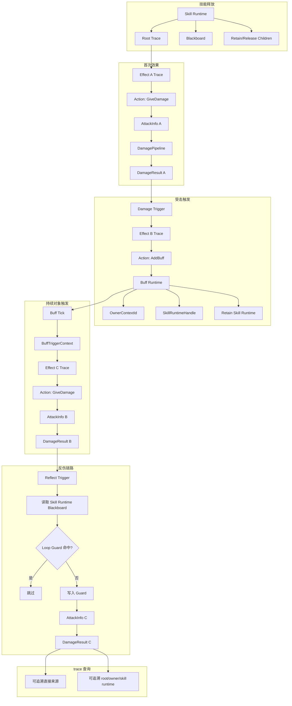

此时可以回答：

- 当前伤害直接由哪个效果或 Buff tick 产生。
- 当前 Buff 是哪个技能、哪个效果、哪个 Action 创建的。
- 当前反伤是否来自某条已处理过的链路。
- 某次技能释放期间命中过哪些目标。
- 某个派生对象为什么仍然让技能运行时存活。
- trace 树上每个来源节点如何串联。

这才是大型复杂技能系统中比较稳的上下文与溯源规划方式。
