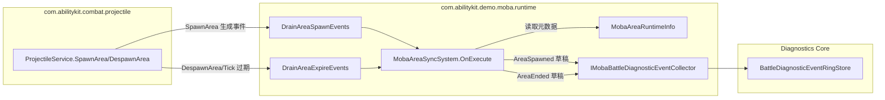
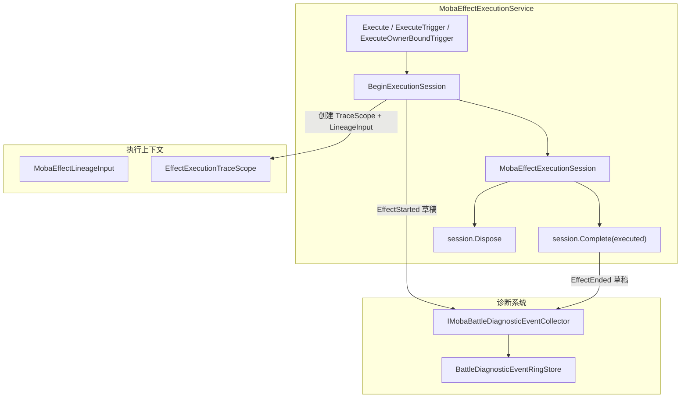
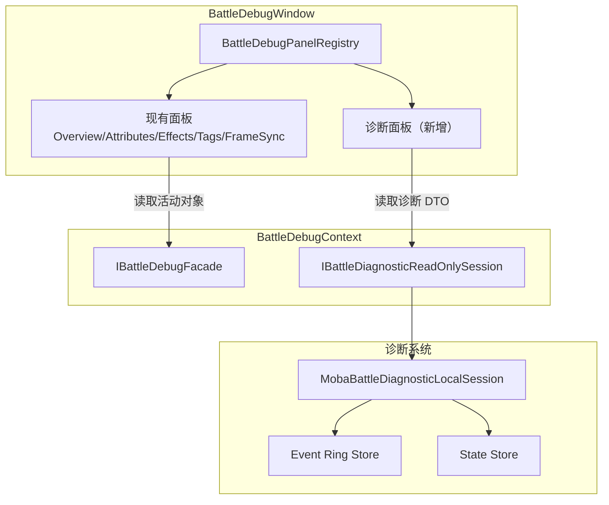

# MOBA 诊断系统：Area/Effect Producer + BattleDebugWindow 迁移计划

## 一、背景与现状

### 已完成 Producer 覆盖（第十批后）

| 通道 | Kind | Producer | 状态 |
|---|---|---|---|
| Skill | SkillRuntimeStarted/Ended | MobaSkillTriggering | ✅ |
| Skill | TraceNodeStarted/Ended | MobaTraceRegistry | ✅ |
| DamageAndHeal | Damage（管线） | DamagePipelineService | ✅ |
| DamageAndHeal | Damage（直接） | MobaDamageService | ✅ |
| DamageAndHeal | Heal | MobaDamageService | ✅ |
| Buff | BuffAdded/BuffRemoved | MobaBuffService | ✅ |
| TemporaryEntity | ProjectileSpawned/Ended | MobaProjectileService/LinkService | ✅ |
| TemporaryEntity | SummonSpawned/Ended | MobaSummonService | ✅ |

### 待完成

| 通道 | Kind | 接入点 | 批次 |
|---|---|---|---|
| TemporaryEntity | AreaSpawned/AreaEnded | MobaAreaSyncSystem | 第十一批 |
| Effect | EffectStarted/EffectEnded（新增枚举） | MobaEffectExecutionService | 第十二批 |

### BattleDebugWindow 现状

- 已有面板注册机制：[`IBattleDebugPanel`](../Unity/Packages/com.abilitykit.demo.moba.editor/Editor/BattleDebug/IBattleDebugPanel.cs:6) + [`BattleDebugPanelRegistry`](../Unity/Packages/com.abilitykit.demo.moba.editor/Editor/BattleDebug/BattleDebugPanelRegistry.cs:7)（反射发现）+ [`BattleDebugContext`](../Unity/Packages/com.abilitykit.demo.moba.editor/Editor/BattleDebug/BattleDebugContext.cs:8)
- **问题**：所有面板直接读取活动对象 `IUnitFacade`，未使用诊断 Local Session 查询表面
- 设计文档第 38 节有严格 UI 原型门禁

---

## 二、第十一批：Area 生命周期 Producer

### 架构决策

### 接入点：MobaAreaSyncSystem

- **Spawn 路径**：`OnExecute` 中 drain `AreaSpawnEvent` 后，在 `PublishAreaEvent("area.spawn", ...)` 调用前后提交 `AreaSpawned` 草稿
- **Ended 路径**：`OnExecute` 中 drain `AreaExpireEvent` 后，在 `PublishAreaEvent("area.expire", ...)` 调用前后提交 `AreaEnded` 草稿
- **Collector 注入**：通过 `Services.TryResolve(out _eventCollector)` 解析（WorldSystemBase 风格，与现有 `_diagnostics` 解析一致）

### 草稿映射字段

| Draft 字段 | 来源 |
|---|---|
| Kind | `AreaSpawned=11` / `AreaEnded=12` |
| Channel | `BattleDiagnosticEventChannel.TemporaryEntity` |
| SourceActorId | `info.OwnerActorId` |
| TargetActorId | 0（Area 是范围实体，无单一目标） |
| ConfigId | `info.TemplateId` |
| RootContextId | `info.RootContextId`（缺失回退到 `info.SourceContextId`） |
| ContextId | `info.SourceContextId` |
| Summary | `areaId={info.AreaId} template={info.TemplateId} owner={info.OwnerActorId} center={info.Center} radius={info.Radius}` |

### 实现步骤

1. 在 `MobaAreaSyncSystem` 添加 `IMobaBattleDiagnosticEventCollector _eventCollector` 字段
2. 在 `OnInit` 中 `Services.TryResolve(out _eventCollector)`
3. 添加 `CreateAreaSpawnedDraft` / `CreateAreaEndedDraft` internal static 映射函数
4. 在 spawn 循环和 expire 循环中提交草稿（try/catch 隔离）
5. 创建测试文件 `MobaAreaDiagnosticProducerTests.cs`

---

## 三、第十二批：Effect 执行 Producer

### 架构决策

### 枚举扩展

在 [`BattleDiagnosticDtos.cs`](../Unity/Packages/com.abilitykit.demo.moba.runtime/DiagnosticsCore/Domain/BattleDiagnosticDtos.cs:1) 的 `BattleDiagnosticEventKind` 枚举新增：
- `EffectStarted = 18`
- `EffectEnded = 19`

归属 `BattleDiagnosticEventChannel.Effect` 通道。

### 接入点：MobaEffectExecutionService

- **Started**：在 `BeginExecutionSession` 成功创建 TraceScope 后提交 `EffectStarted` 草稿
- **Ended**：在 `MobaEffectExecutionSession.Complete(bool executed)` 中提交 `EffectEnded` 草稿（携带 executed 结果）
- **Collector 注入**：通过 `[WorldInject(required: false)]` 字段注入（与 `MobaBuffService` 等一致）

### 草稿映射字段

| Draft 字段 | 来源 |
|---|---|
| Kind | `EffectStarted=18` / `EffectEnded=19` |
| Channel | `BattleDiagnosticEventChannel.Effect` |
| SourceActorId | `lineageInput.SourceActorId` |
| TargetActorId | `lineageInput.TargetActorId` |
| ConfigId | `effectConfigId`（或 `triggerId`） |
| RootContextId | `lineageInput.EffectiveRootContextId` |
| ContextId | `scope.EffectContextId` |
| Outcome | Started: `Succeeded`; Ended: `executed ? Succeeded : Failed` |
| Summary | `effect={effectConfigId} trigger={triggerId} source={sourceActorId} target={targetActorId}` |

### 实现步骤

1. 扩展 `BattleDiagnosticEventKind` 枚举（EffectStarted=18, EffectEnded=19）
2. 在 `MobaEffectExecutionService` 添加 `[WorldInject(required: false)] IMobaBattleDiagnosticEventCollector _eventCollector`
3. 添加 `CreateEffectStartedDraft` / `CreateEffectEndedDraft` internal static 映射函数
4. 在 `BeginExecutionSession` 末尾提交 Started 草稿
5. 在 `MobaEffectExecutionSession.Complete` 中提交 Ended 草稿
6. 创建测试文件 `MobaEffectDiagnosticProducerTests.cs`

---

## 四、BattleDebugWindow 迁移

### 设计原则

1. **复用现有面板注册机制**：`IBattleDebugPanel` + `BattleDebugPanelRegistry` 反射发现
2. **新增诊断面板**：不修改现有面板（Overview/Attributes/Effects/Tags/FrameSync），新增独立诊断面板
3. **数据来源切换**：诊断面板读取 `IBattleDiagnosticReadOnlySession`（Local Session），不直接读 `IUnitFacade`
4. **框架组件复用**：参考 `com.abilitykit.trace` 的 Plugin 模式（`NodeDetailPlugin`/`TreeVisualizationPlugin`）

### 架构方案

### 迁移策略：渐进式而非重构

- **不破坏现有面板**：现有面板继续通过 `IBattleDebugFacade` 读取活动对象
- **新增诊断面板**：通过同一 `BattleDebugPanelRegistry` 注册，读取诊断 Local Session
- **Session 获取**：在 `BattleDebugContext` 中扩展可选的 `IBattleDiagnosticReadOnlySession`，通过 `BattleDebugFacadeProvider` 或独立 Provider 解析

### 实现步骤

1. **探索框架可复用编辑器组件**：确认 `com.abilitykit.trace` Plugin 模式、`GameplayTagTreeView`（TreeView 模式）等可复用组件
2. **设计诊断面板抽象**：定义 `BattleDebugDiagnosticPanelBase` 或直接实现 `IBattleDebugPanel`，通过 Context 获取 Session
3. **实现诊断事件面板**：`BattleDebugDiagnosticEventPanel` - 分页查询 Event Ring Store，显示事件列表
4. **实现诊断状态面板**：`BattleDebugDiagnosticStatePanel` - 查询 State Store，显示 World/Actor 快照
5. **测试验证**：EditMode 测试验证面板注册和数据读取

### 关键约束（来自设计文档第 38 节）

- UI 原型门禁：主窗口重构前需先完成静态交互原型
- **本计划采用渐进式新增策略**：不重构主窗口，只新增面板，因此不触发原型门禁
- 面板只绘制 DTO，不建立旁路数据源

---

## 五、执行顺序

1. **第十一批 Area Producer**（5 步）
2. **第十二批 Effect Producer**（5 步）
3. **BattleDebugWindow 迁移**（6 步）

总计 16 个步骤，每批完成后更新设计文档第 39 节。
