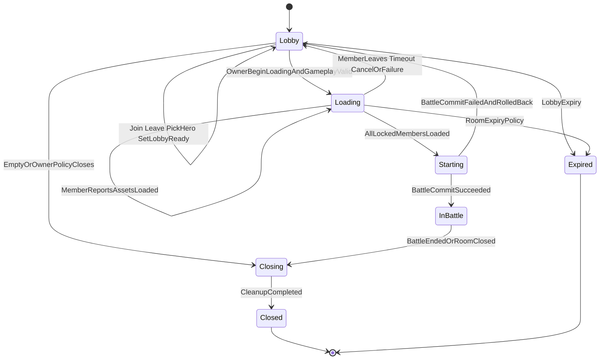

# MOBA 多人模式正式启动链路实施计划

## 1. 文档目标与结论

本文给出 AbilityKit 从登录、建房、入房、选角、大厅确认、客户端战斗资源加载、服务端加载屏障到权威创建 Battle 的正式实施方案。方案只规划正式链路，不引入测试旁路、客户端直接开战或临时拼接流程。

核心结论：

1. Orleans `RoomGrain` 是开战前唯一权威状态机；Unity Phase、HFSM 和 Flow 只负责呈现、命令提交、资源加载及等待服务端状态。
2. MOBA `MobaRoomState` 继续拥有队伍、英雄、loadout 和玩法级 `CanStart` 校验；通用 Room 内核拥有房间阶段、成员在线状态、LobbyReady、AssetsLoaded、revision、launch generation、超时和 Battle 提交。
3. 房主仅在所有成员满足玩法条件后提交一次 `BeginLoading`，锁定本轮 roster 与启动参数。所有锁定成员上报 `AssetsLoaded` 后，Room 自动且幂等地提交 Battle；客户端不再调用“直接开始 Battle”。
4. 大厅期房主离开时按稳定加入顺序迁移给下一位在线成员。Loading 期任一锁定成员离开或超时退出时取消该 launch generation、清空加载状态并回到 Lobby。
5. snapshot 是恢复真源，push event 是低延迟通知。任何断线重连、漏事件或乱序事件都通过拉取较新 snapshot 收敛。
6. 现有 `RoomGatewaySessionFlow` 与 `BattleSessionFeature` 的重复建房/入房职责必须收敛为一条多人入口；开战后的 `SessionCoordinator`、StateSync 和 Battle Host 保持既有职责。

## 2. 审计范围与现状

### 2.1 已有能力

| 领域 | 已有正式能力 | 主要位置 | 复用方式 |
|---|---|---|---|
| 登录与会话 | Guest 登录、账号 Session、token 校验、续期、登出、踢旧会话 | `Server/Orleans/src/AbilityKit.Orleans.Grains/Accounts/SessionGrain.cs`、`Server/Orleans/src/AbilityKit.Orleans.Contracts/Accounts`、Gateway login handlers | 保留 Session Grain 为身份真源；所有 Room 命令继续先校验 token |
| 房间目录 | 创建、列表、摘要索引 | `Server/Orleans/src/AbilityKit.Orleans.Grains/Rooms/RoomDirectoryGrain.cs` | 保留目录职责，不把成员或开战状态移入 Directory |
| 房间成员 | Join、Restore、MarkOffline、Leave、账号到房间映射、离线超时信息 | `RoomGrain.cs`、`RoomMemberTracker.cs`、`RoomIdMappingGrain.cs` | 扩展为稳定加入序号、owner 迁移和定时清理 |
| MOBA 大厅规则 | 人数、Ready、队伍、英雄、等级、属性模板、普攻和技能完整性校验 | `Unity/Packages/com.abilitykit.host.extension/Runtime/Moba/Shared/Room/MobaRoomState.cs`、`MobaRoomGameplayAdapter.cs` | 保留玩法校验与 Battle init spec 构造，不承载通用加载屏障 |
| Battle 创建 | `MobaRoomState -> MobaRoomGameStartSpec -> BattleInitParams -> BattleHost` 正式映射链 | `MobaRoomGameplayAdapter.cs`、`DefaultMobaRoomGameStartSpecBuilder`、`OrleansRoomBattleStartMapper`、Battle grains | 原样保留参数构造边界，由 Room 的自动提交过程调用 |
| Gateway | handler 路由、MemoryPack、连接上下文、按 account/token 推送 | `Server/Orleans/src/AbilityKit.Orleans.Gateway/Gateway`、`IGatewayPushTargetGrain.cs` | 增加 Room 命令、snapshot/event 映射和推送，不在 Gateway 实现规则 |
| Unity 编排 | Root Boot/Lobby/Battle，Battle Prepare/Connect/CreateOrJoinWorld/LoadAssets/InMatch/End，Flow 的 callback/timeout/finally 等组合 | `Unity/Packages/com.abilitykit.demo.moba.view.runtime/Runtime/Game/App/Flow`、`Docs/design/05-CommonModules/05-FlowEngine.md` | 将多人大厅和加载屏障接入现有阶段，不新建第二套状态机框架 |
| 战中 Session | Battle session、time sync、state sync subscription、输入、首帧通知 | `BattleSessionFeature`、`SessionCoordinator`、Gateway battle handlers | 仅消费服务端已提交的 Battle launch identity，不再创建/准备 Room |

### 2.2 确切缺口与风险

| 缺口 | 当前证据 | 风险 |
|---|---|---|
| Room 没有显式权威阶段 | `RoomLifecyclePolicy` 只由 `_closed`、`_battleId` 和人数推导 | 无法表达选角、Loading、启动提交、取消和失败恢复 |
| 单一 `Ready` 混合多种语义 | `RoomPlayerSnapshot.Ready` 和 `MobaRoomState.PlayerSlot.Ready` | 无法区分大厅确认和资源加载完成 |
| 客户端可直接 StartBattle | `StartRoomBattleHandler` 直接调用 `RoomGrain.StartBattleAsync`；两条 Unity flow 都可能调用 | 非房主失败、并发 start、客户端越权决定时序 |
| Unity `LoadAssets` 是虚假门槛 | `MobaBattleAdvanceDecider` 用 `FirstFrameReceived` 触发 `LoadingDone`；阶段仅安装 debug feature | 服务端和客户端均不知道真实资源是否可进入战斗 |
| 两条重复房间准备链路 | `RoomGatewaySessionFlow` 与 `BattleSessionFeature.GatewayPreparation` 都做登录/建房/入房 | 状态所有权分裂，难以重连和测试 |
| Room 状态只在 activation 内存 | `RoomGrain` 没有 persistent state；玩法 state 也是对象字段 | Grain 重激活后房间、加载轮次和提交结果丢失 |
| Battle 创建存在半提交 | 当前先设置 `_battleId`，再初始化 frame/battle grain | 下游失败后可能返回已有 BattleId，但 Battle 未可用 |
| Room 无事件广播 | `NotifyRoomChangedAsync` 只更新目录人数并顺带清理 | 选角、Ready、加载和 owner 变化无法实时同步 |
| 离线清理无定时驱动 | 只在其他 Room 变更时收集超时成员 | 静默房间不会按时处理加载超时或 owner 离线 |
| owner 离开无迁移 | `RoomSummary.OwnerAccountId` 不变化，成员用 `HashSet` | 房间可能永久失去合法控制者，且不能稳定选继任者 |
| Lobby restore 被客户端拒绝 | `RoomGatewaySessionFlow.RestoreRoomAsync` 只接受 InBattle | 断线后无法恢复选角或 Loading 页面 |
| Gateway 反向绑定清理不完整 | `GatewaySessionRegistry.Unregister` 仅移除 session | push 可能命中过期连接，重连绑定行为不完整 |
| 正式 wire 协议字段不足 | `AbilityKit.Protocol.Room/WireRoomGatewayTypes.cs` 无 phase、revision、event sequence、loading | 客户端不能可靠恢复和丢弃乱序状态 |
| 测试覆盖不足 | Room tests 主要覆盖 policy/tracker/shooter；Gateway 仅少量 join/restore；Unity 无完整多人大厅 flow | 状态机、并发、序列化和多客户端行为缺少保护 |

注意：`com.abilitykit.protocol.moba/Runtime/Room` 内存在旧的 MOBA Room DTO；Gateway 和当前 MOBA view assembly 的正式共享契约是 `com.abilitykit.protocol.room` / `src/AbilityKit.Protocol.Room`。实施时禁止同时扩展两份协议；旧 DTO 应先确认无引用后删除或明确标记废弃。

## 3. 职责边界

### 3.1 服务端

- Session Grain：账号和 token 生命周期，不感知房间阶段。
- Gateway：校验 token、反序列化、调用 Grain、映射结构化结果、绑定连接、发送 push；不判断能否开战。
- RoomDirectoryGrain：房间摘要索引，不保存完整成员和加载状态。
- RoomGrain：权威 phase、owner、稳定 roster 顺序、revision、event sequence、launch generation、超时、命令去重、持久化和 Battle 提交。
- IRoomGameplayAdapter：玩法成员投影、英雄/loadout、玩法 `CanBeginLoading`、持久化玩法快照和 Battle init 参数。
- Battle Host：只接收锁定且不可变的 Battle init，负责战中权威世界、Tick、输入和快照。

### 3.2 Unity 客户端

- Lobby 页面/Presenter：呈现 Room snapshot，提交选角、LobbyReady 和房主 BeginLoading。
- 多人 Room application service：维护当前 snapshot/revision/event sequence，封装命令幂等键、push 消费、restore 和主动补拉。
- Flow/HFSM：根据服务端 phase 编排页面、加载任务、等待和切换，不自行推导权威 phase。
- Battle asset loading service：根据服务端冻结的 launch manifest 执行异步加载、校验、进度和释放，并只在完整成功后报告。
- BattleSessionFeature：接收 committed launch spec 后连接/订阅 Battle；移除 guest login/create/join 的职责。

## 4. 权威状态机

### 4.1 阶段定义

| Phase | 含义 | 允许的关键命令 |
|---|---|---|
| Lobby | 成员可加入、离开、选角、修改 loadout、设置 LobbyReady | Join、Leave、ConfigureLoadout、SetLobbyReady、BeginLoading、Restore |
| Loading | roster 和 launch config 已冻结，客户端加载资源 | ReportAssetsLoaded、CancelLoading、Leave、Restore、MarkOffline |
| Starting | 加载屏障满足，服务端正在幂等提交 Battle | Restore；其他修改命令拒绝 |
| InBattle | Battle 已提交，snapshot 带 BattleId/WorldId/anchor | Restore、战中已有命令 |
| Closing | 正在清理映射、目录和资源 | Restore 返回 closing；其他命令拒绝 |
| Closed | 终态 | 仅返回结构化 closed |
| Expired | 超时终态 | 仅返回结构化 expired |

选角不是独立通用 phase。它是 Lobby 内的 MOBA 玩家状态，`CanBeginLoading` 由 gameplay adapter 综合人数、LobbyReady 和完整 loadout 得出。这样通用 Room 不依赖 MOBA 英雄字段，同时客户端仍可基于 snapshot 呈现“等待选角/等待 Ready”。

### 4.2 转换图

### 4.3 不变量

1. 每个可观察状态变更令 `RoomRevision` 单调递增；每个已发布事件令 `EventSequence` 单调递增。
2. `LaunchGeneration` 每次成功进入 Loading 时递增，取消后绝不复用。`ReportAssetsLoaded` 必须携带 generation；旧 generation 返回成功但 `Applied=false`，不得影响当前轮次。
3. Loading 的 `LockedRoster`、每位玩家 loadout、map、seed、tick、sync options 和 asset manifest version 均不可变。
4. `LobbyReady` 与 `AssetsLoaded` 是不同字段。回到 Lobby 时清空所有 AssetsLoaded；loadout 变化时仅将该玩家 LobbyReady 重置为 false。
5. 只有 owner 可 `BeginLoading`；只有 locked roster 中对应 account 可报告自己的 loaded。
6. 仅 Room Grain 可从 Loading 进入 Starting；所有成员 loaded 后自动触发一次 Battle commit。
7. Starting 时不得 Join、Leave、改 loadout 或改 Ready；重复命令只能返回当前 snapshot/原结果。
8. `InBattle` 必须同时具有已验证可用的 BattleId、WorldId、start anchor 和不可变 launch spec。
9. 大厅 owner 离开时，按持久化的 `JoinOrdinal` 选择最早加入且在线的剩余成员；没有在线候选则关闭房间。Loading 期任一 locked member 离开先取消 generation 回 Lobby，再按同一规则迁移 owner。
10. 短暂断线只标记 Offline，不立即改变 locked roster；超过 loading/offline deadline 后按“成员离开”处理并取消本轮加载。

## 5. 命令、事件、快照与错误协议

### 5.1 通用命令信封

所有变更命令增加：

- `CommandId`：客户端生成 UUID，同 account、room、command id 重试返回同一结果。
- `ExpectedRevision`：可选；对 owner BeginLoading、取消和会改变冻结 roster 的命令强制校验。
- `ClientSequence`：同一客户端实例单调递增，用于诊断和拒绝明显旧命令，不作为全局顺序真源。
- `LaunchGeneration`：只用于加载相关命令。

服务端维护有界去重表，键为 account + command id，值为命令类型、结果摘要和应用后的 revision；通过 TTL/容量清理并随 Room 持久化。相同 id 但不同 payload 返回 `CommandIdConflict`。

### 5.2 命令集合

| 命令 | 调用者 | 前置条件 | 结果 |
|---|---|---|---|
| JoinRoom | 已登录账号 | Lobby 且有容量；或原成员恢复 | snapshot + join kind |
| ConfigureMobaLoadout | 本人 | Lobby、成员身份 | 更新玩法状态；改变时本人 LobbyReady=false |
| SetLobbyReady | 本人 | Lobby、loadout 已合法；设置 true 时强校验 | snapshot；幂等设置返回 Applied=false |
| BeginLoading | owner | ExpectedRevision 匹配，玩法 CanStart，所有 roster 在线 | 冻结 launch spec/manifest、generation++、设置 deadline |
| ReportAssetsLoaded | 本人 | Loading、generation 匹配、属于 locked roster | 记录 manifest hash/version、loaded 时间；最后一人触发自动 commit |
| CancelLoading | owner 或服务端策略 | Loading、generation 匹配 | 回 Lobby、清空 loading state |
| LeaveRoom | 本人 | Lobby/Loading | Loading 时先取消；处理 owner 迁移 |
| RestoreRoom | 本人 | 有账号房间映射且仍为成员 | 返回任意非终态 snapshot，不要求已 InBattle |
| GetRoomSnapshot | 本人 | 成员身份 | 返回当前完整 snapshot |

现有客户端直连 `StartBattle` opcode 停止作为公网命令。迁移期 handler 可保留一个版本，但必须返回 `DeprecatedCommand`，不能调用 Battle Host；内部自动提交使用 Room Grain 私有方法，不暴露 Gateway opcode。

### 5.3 Snapshot

`RoomSnapshot` / `WireRoomSnapshot` 至少增加：

- `SchemaVersion`
- `RoomRevision`
- `LastEventSequence`
- `Phase`
- `PhaseReason`
- `OwnerAccountId` 与成员稳定顺序
- `CanBeginLoading`
- `LaunchGeneration`
- `LoadingDeadlineUnixMs`
- `LockedRoster`
- `LaunchManifestVersion` 和 `LaunchManifestHash`
- `BattleId`、`WorldId`、`WorldStartAnchor`
- `LastStartFailureCode`，仅用于可恢复诊断

每个玩家投影增加：

- `LobbyReady`
- `AssetsLoaded`
- `LoadedManifestVersion` / hash
- `IsOnline`
- `JoinOrdinal`
- `PlayerId`
- 既有 MOBA loadout 字段

MemoryPack 兼容策略：保留现有字段 order，不改类型、不重排；新增字段只追加更高 order。协议测试必须覆盖旧 payload 反序列化为默认值、新 payload 的 round-trip，以及 Server `src/AbilityKit.Protocol.Room` 与 Unity package linked source 的单一来源一致性。

### 5.4 Push 事件

新增通用 `RoomStateChangedPush`：

- `SchemaVersion`
- `RoomId`
- `RoomRevision`
- `EventSequence`
- `EventType`
- `LaunchGeneration`
- `Snapshot`，第一版直接携带完整 snapshot，避免过早引入 delta 合并复杂度

建议事件类型：`MemberJoined`、`MemberLeft`、`OwnerChanged`、`LoadoutChanged`、`LobbyReadyChanged`、`LoadingStarted`、`MemberAssetsLoaded`、`LoadingCancelled`、`BattleStarting`、`BattleCommitted`、`RoomClosed`。

客户端处理规则：

1. sequence 小于等于已应用 sequence：丢弃。
2. sequence 正好连续且 revision 更新：应用 snapshot。
3. sequence 有缺口、反序列化失败或 revision 回退：调用 GetRoomSnapshot/RestoreRoom 补拉。
4. push 发送失败不回滚 Room 状态；重连后 snapshot 收敛。
5. Room push 与 Battle snapshot 使用不同 opcode 和 DTO，不混入现有 `SnapshotPushed`。

### 5.5 结构化错误

Gateway 业务响应不能只返回 transport status。统一结果包含：

- `Success`
- `Applied`
- `ErrorCode`
- `Message`
- `RoomRevision`
- 可选 `Snapshot`

至少定义：`InvalidSession`、`RoomNotFound`、`NotMember`、`NotOwner`、`InvalidPhase`、`RevisionConflict`、`CommandIdConflict`、`InvalidLoadout`、`NotAllLobbyReady`、`MemberOffline`、`RosterChanged`、`LaunchGenerationMismatch`、`ManifestMismatch`、`LoadingTimedOut`、`BattleCommitInProgress`、`BattleCommitFailed`、`RoomClosed`、`DeprecatedCommand`、`InternalError`。

可预期业务失败返回正常 Gateway response payload；transport status 只表达协议损坏、未知 opcode 或基础设施故障。

## 6. 持久化、并发与跨 Grain 副作用

### 6.1 Room 持久状态

新增内部 `RoomPersistentState`，保存 summary、phase、members、member states、join ordinal counter、gameplay snapshot、revision、event sequence、launch state、battle commit state、command dedup entries 和终态信息。

为避免直接序列化 `object gameplayState`：

- 扩展 `IRoomGameplayAdapter`，增加 `ExportPersistentState`、`RestorePersistentState` 和 `ValidateBeginLoading`。
- MOBA adapter 使用明确的 Orleans serializer DTO 保存 `MobaRoomState` 所需配置和 PlayerSlot；不得用不透明 CLR object 或仅依赖 activation 内存。
- Room activation 时先读取持久状态，再恢复 gameplay adapter；初始化操作保持幂等。
- 每次权威 mutation 先在内存构造新状态并校验不变量，再一次持久化；持久化成功后才发布 push。

实现可沿用仓库 `IRoomStateStore` 抽象，新增完整 runtime record API，或采用已配置的 Orleans `IPersistentState<RoomPersistentState>`。实施第一阶段必须通过部署配置审计作最终选择；无论选择哪种，生产配置不得使用进程内 Dictionary。测试环境可使用 memory provider。

### 6.2 Battle 提交状态

`BattleCommitState` 至少包含 `Generation`、`CommitId`、`Status`、不可变 init spec hash、BattleId、WorldId、anchor、attempt count、last error。

提交步骤：

1. 在 Room 内将 phase 持久化为 Starting，并写入稳定 `CommitId` 和完整 init spec。
2. 调用幂等的 Battle 初始化接口，幂等键为 room id + launch generation/commit id。
3. 下游返回“已存在”时必须校验 init spec hash 一致。
4. 成功后持久化 InBattle 及 launch identity，再发布 `BattleCommitted`。
5. 可重试基础设施失败保留 Starting，由 reminder 重试；明确不可恢复的配置失败记录错误并回 Lobby，generation 作废。
6. Grain 重激活若看到 Starting，继续同一 CommitId，不生成新 Battle。

不得先写 `_battleId` 再无保护地创建 Battle。Battle Host 接口或其初始化实现需要提供查询/幂等初始化能力，确保“超时但实际成功”的调用可以恢复。

### 6.3 Timer、Reminder 与时间

- 使用 reminder 驱动跨 activation 的 Loading deadline、offline eviction 和 Starting retry；短周期 UI 进度不依赖 Grain timer。
- deadline 使用服务端 Unix ms 或 UTC ticks；客户端时间只用于展示。
- reminder 回调必须带/校验 generation，旧回调不得取消新一轮 Loading。
- 所有 timeout 动作都走与普通命令相同的 transition 函数、持久化和事件发布路径。

### 6.4 Gateway 连接与重连

- 修正 `GatewaySessionRegistry.Unregister`：仅在 reverse mapping 仍指向当前 connection 时移除 token/account 映射，避免旧连接关闭误删新连接绑定。
- 新连接绑定同 account/token 时原子替换旧 connection，并可主动 kick 旧连接。
- 登录、Join/Restore 后统一绑定 token、account、room 到 `GatewaySessionContext`。
- `OnClosed` 继续 MarkOffline，但 Room 以 offline grace period 处理，不立即移除。
- token rotate/logout/kick 时清理旧绑定并让 Room 收到 offline；客户端使用新 token RestoreRoom。

## 7. Unity 正式流程

### 7.1 单一入口

新增一个面向 MOBA 表现层的 `MobaMultiplayerRoomFlow` 或等价 application service，复用 `RoomGatewaySessionFlow` 的传输 DTO 思路，但重构其步骤为：

1. EnsureGatewayConnected
2. EnsureSession 或 RestoreSession
3. RestoreRoom；无活动房间则 Create/Join
4. SubscribeRoomEvents
5. 显示 Lobby，提交英雄/loadout 和 LobbyReady
6. owner 提交 BeginLoading
7. 收到权威 Loading snapshot 后进入 Battle.LoadAssets
8. 执行资源加载 manifest
9. ReportAssetsLoaded，并等待权威 Starting/InBattle
10. 收到 BattleCommitted 后将 launch identity 交给 BattleSessionFeature
11. SubscribeStateSync，收到有效首帧后进入 InMatch

`BattleSessionFeature.GatewayPreparation` 删除 guest login/create/join 分支，只保留 committed battle 的 connect/time sync/subscribe。`RoomGatewaySessionFlow` 不再提供 `CreateReadyStartAndSubscribeAsync` 这类一口气直达 Battle 的 API，改为可观察的 Room service 或按状态等待的 Flow steps。

### 7.2 Phase/HFSM 映射

- Root Lobby：覆盖登录、房间页面、选角和 LobbyReady。
- Battle.Prepare：消费冻结 launch manifest，创建本局 scope，不启动战中 session。
- Battle.Connect：确保 Gateway/Battle transport 可用。
- Battle.CreateOrJoinWorld：仅在 Room 已 InBattle 后订阅/恢复 Battle world。
- Battle.LoadAssets：安装正式 asset loading feature；也可在收到 Loading 时预加载并让该阶段读取已有结果，但“报告 loaded”必须发生在资源完整成功之后。
- Battle.InMatch：条件为 Room InBattle + Battle subscription 成功 + 首个有效权威 frame，不再把 FirstFrameReceived 当作资源加载完成。

为避免阶段名称与时序冲突，实施时优先让 Root Lobby 的子 Flow 执行服务端 Loading barrier，待 BattleCommitted 后进入 Root Battle；现有 Battle.LoadAssets 则负责本地实例化/绑定已预加载资源并使用明确 `AssetsBound` 信号。若资源必须依赖 battle world identity，则调整为 Room Loading 只加载共享 manifest，Battle.LoadAssets 加载 world-specific 可选资源，但后者不得再作为服务端 roster barrier。

### 7.3 真实资源加载契约

现有 `IAssetProvider`/`ResourcesAssetProvider` 是同步兼容层，不足以表达 barrier。新增 battle loading 抽象：

- `IBattleAssetLoadService.LoadAsync(manifest, progress, cancellationToken)`
- 返回 `BattleAssetLoadResult`，包含 manifest version/hash、已加载资源句柄和校验结果
- `IBattleAssetLease.Dispose` 或 Release，绑定到 battle scope 生命周期
- Resources 第一版可用 `Resources.LoadAsync` 实现适配器；未来 Addressables 可替换，不改变 Flow/Room 协议
- manifest 由服务端根据冻结 map 和全体 hero/loadout 生成确定性版本/hash；客户端不得自行声明任意 manifest 已完成
- 任一必需资源缺失时不报告 loaded，展示结构化失败并允许取消/重试当前 generation

资源集合至少覆盖 map/config、全体英雄配置、模型、动画、技能/触发 JSON、投射物/AOE/VFX prefab、HUD 必需资源。具体 resolver 应复用现有配置加载器和 presentation config，不在 UI 代码中硬编码散落路径。

### 7.4 UI 行为

正式 UI 至少支持登录状态、房间号、成员列表、在线状态、owner 标识、英雄选择、Ready、房主开始加载、每位成员加载状态、超时/取消原因、重试和进入战斗。`DemoLobbyOnGUIFeature` 保留为 editor debug harness，但不能作为多人正式入口，也不能绕过 Room service。

按钮启用条件只由最新 snapshot 投影：非 owner 不显示/禁用 BeginLoading；Loading 时禁止改英雄/Ready；revision conflict 后自动刷新；重连时先显示恢复中，再按 snapshot phase 跳转。

## 8. 分阶段实施计划

### 阶段 0：协议单一来源与基线保护

范围：

- `Unity/Packages/com.abilitykit.protocol.room/Runtime/Room/*`
- `src/AbilityKit.Protocol.Room/*` 及其项目链接配置
- `Unity/Packages/com.abilitykit.protocol.moba/Runtime/Room/*`
- 新增协议序列化兼容测试项目/fixture

任务：

1. 确认 Room 协议由 Unity package 还是 `src` 生成/链接，建立单一源码来源和 CI 一致性检查。
2. 搜索并迁移旧 MOBA Room DTO 引用；无引用则废弃或删除，禁止双写。
3. 为当前 wire payload 固化 golden bytes/round-trip 基线。

验收：Server 和 Unity 引用同一 Room DTO/opcode；现有 payload 兼容测试通过；未改变业务行为。

### 阶段 1：权威模型、持久化和纯状态机

范围：

- `Server/Orleans/src/AbilityKit.Orleans.Contracts/Rooms/RoomModels.cs`
- `RoomGameplayCommandModels.cs`
- `IRoomGrain.cs`
- `Server/Orleans/src/AbilityKit.Orleans.Grains/Rooms/RoomGrain.cs`
- `RoomLifecyclePolicy.cs`
- `RoomMemberTracker.cs`
- `Gameplay/IRoomGameplayAdapter.cs`
- `Persistence/IRoomStateStore.cs` 及实现，或新增 Room persistent state 文件
- `Gameplays/Moba/Rooms/MobaRoomGameplayAdapter.cs`
- `Unity/Packages/com.abilitykit.host.extension/Runtime/Moba/Shared/Room/MobaRoomState.cs`
- `Server/Orleans/src/AbilityKit.Orleans.Grains.Tests/Rooms/*`

任务：

1. 定义 Phase、revision、event sequence、join ordinal、launch state、commit state、dedup entry 的 serializer DTO。
2. 将 Room mutation 收敛到纯 transition 方法并建立合法转换校验。
3. 增加 gameplay state export/restore；保证 activation 恢复后 MOBA 玩家状态一致。
4. 实现 owner 稳定迁移、Lobby/Loading leave 策略和双 Ready 字段。
5. 持久化每次成功 mutation；push 尚可先由测试 fake 捕获。

验收：Grain 重激活后 snapshot 等价；所有非法转换返回结构化错误；owner 迁移确定；旧 generation report 无副作用；无 Battle Host 调用。

#### 阶段 1 实施状态（2026-07-15）

状态：**核心完成，构建被既有脏工作区阻塞**。

已实现：

- 权威状态模型：新增 [`RoomPhase`](Server/Orleans/src/AbilityKit.Orleans.Contracts/Rooms/RoomModels.cs:1)（Lobby/Loading/Starting/InBattle/Closing/Closed/Expired）、`RoomOperationResult`（Success/Applied/ErrorCode/Message/Revision）、`RoomPersistentState`/`RoomPersistentMember`/`RoomLaunchState`/`RoomBattleCommitState`/`RoomCommandDedupEntry` 全部 `[GenerateSerializer]` 可序列化 DTO，位于 [`Persistence/RoomPersistentState.cs`](Server/Orleans/src/AbilityKit.Orleans.Grains/Persistence/RoomPersistentState.cs:1)。
- 纯状态机：[`RoomStateMachine`](Server/Orleans/src/AbilityKit.Grains/Rooms/RoomStateMachine.cs:1) 提供 `Join`/`Reconnect`/`MarkOffline`/`SetLobbyReady`/`GameplayChanged`/`ReportAssetsLoaded`/`Leave`/`IsTransitionAllowed`，全部基于不可变 record 快照返回 `RoomTransitionResult(State, Result)`，非法转换返回结构化错误且不产生副作用。
- 稳定 owner 迁移：成员持久化单调 `JoinOrdinal`，`Leave` 后按 JoinOrdinal 选继任 owner；`RoomMemberTracker.MembersSnapshot()` 按 JoinOrdinal 稳定排序。
- Lobby/Loading leave 策略：Loading 期离开回退 Lobby、清空全员 AssetsLoaded、清空锁定 roster/deadline/manifest；InBattle 期拒绝 Leave。
- 双 Ready 字段：`LobbyReady` 与 `AssetsLoaded` 分离；`GameplayChanged` 仅重置变更成员自身的 LobbyReady。
- launch generation 语义：`ReportAssetsLoaded` 校验 generation，旧 generation 返回 `Success=true, Applied=false` 且不修改状态。
- 持久化与 activation 恢复：`IRoomStateStore` 新增 `TryGetRuntimeStateAsync`/`WriteRuntimeStateAsync`/`RemoveRuntimeStateAsync`；`InMemoryRoomStateStore` 实现深拷贝防止共享可变引用；`RoomGrain.OnActivateAsync` 调用 `RestoreActivation` 重建 tracker、gameplay state 与 legacy 兼容字段（`_closed`/`_battleId`/`_worldId`/`_worldStartAnchor`）。
- MOBA/Shooter gameplay export/restore：`IRoomGameplayAdapter` 新增 `ExportPersistentState`/`RestorePersistentState`，返回带 format/version 的 `RoomGameplayPersistentState` 信封；`MobaRoomState` 新增 `ExportPersistentState`/`RestorePersistentState` + DTO；adapter 注册表按 RoomType 解析。
- RoomGrain 迁移：所有 Lobby mutation 路径（Join/Restore/MarkOffline/Leave/SetReady/SubmitGameplayCommand）改走 `RoomStateMachine` + `PersistAndRestoreAsync`；`StartBattleAsync` 在 legacy 开战后记录 `RoomPhase.InBattle` + battle commit 信封；`CloseAsync` 转 `RoomPhase.Closed`；`GetLifecycleSnapshot` 改用 phase-based `RoomLifecyclePolicy.Evaluate`。
- 测试：新增 [`RoomStateMachineTests`](Server/Orleans/src/AbilityKit.Orleans.Grains.Tests/Rooms/RoomStateMachineTests.cs:1)（13 例：JoinOrdinal/revision 单调、reconnect 保序、满员拒绝、owner 迁移、末成员→Closing、Loading leave 清理、InBattle leave 拒绝、旧 generation 无副作用、当前 generation 标记 loaded、Lobby 外 SetReady 拒绝、GameplayChanged 仅重置本人、IsTransitionAllowed 合法/非法）、[`MobaRoomGameplayPersistenceTests`](Server/Orleans/src/AbilityKit.Orleans.Grains.Tests/Rooms/MobaRoomGameplayPersistenceTests.cs:1)（3 例：export/restore round-trip、format 不匹配抛异常、注册表解析）、[`RoomStateStoreDeepCopyTests`](Server/Orleans/src/AbilityKit.Orleans.Grains.Tests/Rooms/RoomStateStoreDeepCopyTests.cs:1)（3 例：写后改原不影响读、两次读独立、remove 清空）。

偏差：

- 生产持久化仅实现 in-memory store（`InMemoryRoomStateStore`），未实现文件/数据库后端；接口已就绪，后续可替换。
- `StartBattleAsync` 仍走 legacy Battle Host 路径（阶段 3 才引入幂等 commit），但在成功后记录 InBattle phase 与 commit 信封，保证 activation 可恢复。
- push event 广播尚未接入（阶段 4）；当前 `NotifyRoomChangedAsync` 仍只更新目录人数。
- 未实现定时 reminder 驱动离线清理（阶段 2）；`CleanupExpiredOfflineMembersAsync` 已改用状态机，但仍由其他 mutation 顺带触发。

构建阻塞（非阶段 1 引入）：

- `AbilityKit.Orleans.Contracts` 项目构建 0 错误。
- `AbilityKit.Orleans.Grains` 与 `AbilityKit.Orleans.Grains.Tests` 被用户脏工作区中既有 `AbilityKit.Demo.Moba.Core` 缺失类型阻塞：`BattleDiagnosticEventKind`/`BattleDiagnosticEventChannel`/`BattleDiagnosticEventOutcome`/`BattleDiagnosticRuntimeHandle`/`BattleDiagnosticSessionScope`/`BattleDiagnosticEventRingStore`（`AbilityKit.Demo.Moba.Diagnostics` 命名空间，涉及 `MobaBattleDiagnosticEventCollector.cs`/`DamagePipelineService.cs`/`MobaSkillTriggering.cs` 等）。这些与阶段 1 Room 改动无关，需用户自行解决后方可运行聚焦测试。
- 过滤构建日志确认：无任何 Room/StateMachine/store/test 文件产生编译错误。

未进入的后续范围（明确排除）：

- 阶段 2：`BeginLoading` 加载屏障、`ReportAssetsLoaded` 的 account/generation/manifest 校验与命令去重、Loading deadline/offline grace reminder、取消回 Lobby。
- 阶段 3：幂等 Battle commit、CommitId/init spec hash、Starting 持久化重试、失败回滚。
- 阶段 4：Gateway wire 协议新字段、Room push event、错误分类与映射。
- 阶段 5+：Unity Lobby/Loading UI、多人 Room application service、Flow/HFSM 接入、BattleSessionFeature 收敛。

### 阶段 2：BeginLoading、加载屏障和超时

范围：

- 阶段 1 Room files
- `IRoomGrain.cs` 新命令
- Room reminder/clock abstraction
- MOBA gameplay adapter 的 `ValidateBeginLoading` 与 manifest builder
- Grain tests

任务：

1. 实现 owner BeginLoading、ExpectedRevision 和冻结 roster/spec/manifest。
2. 实现 ReportAssetsLoaded 的 account/generation/manifest 校验和命令去重。
3. 实现 Loading deadline、offline grace reminder 和取消回 Lobby。
4. 保证最后一人 loaded 只产生一次 Starting transition。

验收：重复、乱序、旧 generation、并发最后两人 report、成员断线/离开、owner 离开、timeout 等测试全部通过；任何取消都清空 loaded 且 generation 不回退。

### 阶段 3：幂等 Battle commit 与故障恢复

范围：

- `RoomGrain.cs`
- `MobaRoomGameplayAdapter.cs`
- `Server/Orleans/src/AbilityKit.Orleans.Contracts/Battle/*`
- Battle Grain 初始化实现、`OrleansRoomBattleStartMapper`
- Room/Battle integration tests

任务：

1. 引入稳定 CommitId 和 init spec hash。
2. 让 Battle 初始化支持幂等 create-or-get 与 hash 冲突检测。
3. 实现 Starting 持久化、重试 reminder、成功 commit 和不可恢复失败回滚。
4. 保留既有 MOBA start spec 映射链，不在 Room 内复制玩法参数组装。

验收：模拟调用前失败、调用后响应丢失、Battle 已创建、Grain 重激活、重复 reminder；最终最多一个 Battle，Room 可恢复到 InBattle 或明确回 Lobby，不存在 `_battleId` 半提交。

### 阶段 4：Gateway wire、错误和 Room push

范围：

- `Unity/Packages/com.abilitykit.protocol.room/Runtime/Room/WireRoomGatewayTypes.cs`
- `RoomGatewayOpCodes.cs`
- `Server/Orleans/src/AbilityKit.Orleans.Gateway/Gateway/Handlers/*Room*`
- `RoomGatewayWireMapper.cs`
- `RoomOperationErrorClassifier.cs`、`RoomGatewayErrorMapper.cs`
- `GatewaySessionRegistry.cs`、`GatewayTransportHandler.cs`
- `IGatewayPushTargetGrain.cs` 或拆分 Room push contract
- `Server/Orleans/src/AbilityKit.Orleans.Gateway.Tests/*`

任务：

1. 只追加 MemoryPack fields；新增 BeginLoading、ReportAssetsLoaded、GetSnapshot 和 RoomStateChanged opcodes。
2. handler 只做 token/account 映射并调用 Grain，返回结构化业务结果。
3. Room mutation 持久化成功后按 locked/current members 推送完整 snapshot event。
4. 修复连接 reverse mapping、旧连接关闭和重连原子重绑。
5. 将公网 StartBattle 标记废弃并阻断直接创建。

验收：serializer compatibility、每个新 handler、错误码、push 失败、旧/新连接竞争、漏事件补拉测试通过；Gateway 无玩法判断。

### 阶段 5：Unity Room client 与状态仓库

范围：

- `Unity/.../Battle/Client/Gateway/GatewayRoomClient.cs`
- `Unity/.../Battle/Client/Session/Features/Gateway/IGatewayRoomClient.cs`
- 新增 Room snapshot mapper、Room event subscriber 和 client state store
- `Unity/Packages/com.abilitykit.host.extension/Runtime/Session/RoomGatewaySessionFlow.cs`
- Unity EditMode tests

任务：

1. 让公开 interface 覆盖 Restore/GetSnapshot/ConfigureLoadout/Ready/BeginLoading/ReportLoaded 和 push 解析。
2. 建立单一 client Room store，按 sequence/revision 应用 snapshot，缺口自动补拉。
3. 重构 RoomGatewaySessionFlow 为可恢复的阶段化流程，删除 ready-start-subscribe 一口气 API。
4. 支持 Lobby、Loading、Starting、InBattle 任意阶段 restore。

验收：重复/乱序 push、事件缺口、revision conflict、断线重连、Lobby restore 和 Loading restore 的纯客户端测试通过；concrete client 不再拥有 interface 外的关键房间 API。

### 阶段 6：真实资源加载服务

范围：

- `Unity/.../Battle/Shared/Assets/IAssetProvider.cs`
- `ResourcesAssetProvider.cs`
- 新增 `IBattleAssetLoadService`、manifest resolver、asset lease/result
- 现有 config/presentation loaders
- 资源存在性与加载失败测试

任务：

1. 从冻结 manifest 解析确定性资源集合。
2. 提供 cancellable async load、进度、hash/version 校验和 battle-scope 释放。
3. 必需资源全部成功后才产生 loaded result；失败不得报告服务端。
4. 为 Resources 实现正式适配器，接口允许未来替换 Addressables。

验收：全英雄/地图 manifest 确定性；缺资源、取消、重复加载、释放测试通过；无同步假完成信号。

### 阶段 7：Unity Flow/HFSM 和 UI 收敛

范围：

- `Unity/.../Game/App/Flow/Core/MobaFlowConfiguration.cs`
- `MobaBattleAdvanceDecider.cs`
- `BattleScopeManager.cs`
- Feature scheduler/bindings
- `BattleSessionFeature.GatewayPreparation.cs`
- `GatewayRoomPreparationController.cs`
- 正式 Lobby UI/Presenter/页面
- `DemoLobbyOnGUIFeature.cs`
- `BattleRuntimeOptimizationTests.cs` 及新增 flow tests

任务：

1. 将 multiplayer room flow 安装到 Root Lobby 和既有 Feature 生命周期。
2. 用明确的 AssetLoadCompleted/AssetsBound 信号替换 `FirstFrameReceived -> LoadingDone`。
3. BattleSessionFeature 只消费 committed launch identity，删除重复登录和建房逻辑。
4. UI 全部从 Room store 投影并提交命令；debug OnGUI 不再启动正式多人战斗。
5. 退出/失败通过 Flow finally 取消加载、释放 lease、取消订阅并保留可 restore 的 session。

验收：两个模拟客户端从登录走到 InMatch；首帧早到不会越过 LoadAssets；资源失败停留在 Loading；断线重连按服务端 phase 恢复；每局 scope 无残留订阅或资源。

### 阶段 8：端到端与多进程正式入口

范围：

- Orleans integration test fixture
- 现有 smoke runner 模式和 tools 脚本，新增 MOBA multiplayer scenario
- Unity PlayMode/E2E harness
- CI test profiles 与文档

任务：

1. 建立两个独立账号/连接的 E2E：登录、创建、加入、选不同英雄、Ready、owner BeginLoading、分别 report、自动 commit、订阅、首帧。
2. 增加故障矩阵：重复命令、乱序 push、最后两人并发 report、Loading 断线恢复、超时、owner Lobby 离开迁移、Loading 离开取消、Battle 初始化超时后恢复。
3. 正式测试入口只调用公开 Gateway 协议，不直接调用 Grain 或 Battle Host。
4. 记录 room id、generation、revision、commit id、battle id 关联日志，便于联机测试诊断。

验收：多次运行均只创建一个 Battle；两客户端最终 snapshot 的 revision/phase/battle identity 一致；不存在直接 StartBattle 旁路；失败场景有稳定错误码并可再次开局。

### 阶段 9：迁移清理与文档同步

范围：

- 删除/废弃旧 MOBA Room DTO 与 opcode
- 删除重复 `GatewayRoomPreparationController` 路径或收敛为新 service 内部步骤
- 更新 `Docs/design/12-ServerArchitecture/02-GatewayRoomBattleFlow.md`
- 更新 `Docs/design/09-ImplementationExamples/MOBA/15-OnlineSessionAndProtocolContract.md`
- 更新 `Docs/MobaBattleFormalIntegrationGuide.md`

验收：仓库搜索无客户端直接 StartBattle、无 `FirstFrameReceived` 驱动 LoadingDone、无两份活跃 Room wire contract；设计文档与实现状态机一致。

## 9. 测试策略总表

| 层级 | 必测内容 |
|---|---|
| 纯状态机 | 所有合法/非法转换、不变量、owner 迁移、generation、revision、dedup |
| Gameplay adapter | MOBA loadout、Ready、export/restore、manifest 与 start spec 一致性 |
| Serializer | MemoryPack 旧新兼容、字段 order、golden bytes、Server/Unity 单一来源 |
| Grain | 持久化恢复、reminder、offline/timeout、并发 report、Starting 恢复 |
| Battle integration | 幂等创建、响应丢失、spec hash 冲突、最多一次逻辑效果 |
| Gateway | token 校验、handler/error、push、connection rebind、旧连接关闭竞争 |
| Unity EditMode | Room store、revision/sequence、restore、Flow 取消和 scope 清理 |
| Unity resource | manifest、异步成功/失败/取消、资源 lease 生命周期 |
| E2E | 两客户端完整链路与故障矩阵，禁止 Grain 旁路 |

## 10. 依赖顺序与发布约束

严格依赖顺序：阶段 0 -> 1 -> 2 -> 3 -> 4 -> 5 -> 6 -> 7 -> 8 -> 9。

协议发布采用 expand/contract：

1. 先追加 Server/Unity 都能忽略的新字段和新 opcodes。
2. 部署支持 snapshot/event 的服务端，同时旧客户端仍可完成旧功能但不得直接启动正式多人 Battle。
3. 部署新客户端并启用 feature flag 的正式 multiplayer flow。
4. E2E 稳定后禁用并废弃旧 StartBattle 和重复 flow。
5. 最后删除旧 DTO/API；禁止在同一提交中先破坏旧字段再迁移客户端。

每阶段提交必须保持 Server solution 和 Unity assemblies 可编译；不得把阶段 8 的测试 harness 当作阶段 1-7 的运行时替代。

## 11. 全局完成标准

只有同时满足以下条件，才能把多人模式入口视为正式完成：

- 登录、建房、入房、选角、LobbyReady、BeginLoading、AssetsLoaded、自动 Battle commit 和首帧进入 InMatch 全部走公开正式协议。
- Room snapshot 是所有客户端的开战前恢复真源，包含 phase、revision、generation、成员双就绪状态和 Battle identity。
- Battle 创建由服务端自动且幂等执行，客户端无直接开战权限。
- Room 重激活、Gateway 重连、push 丢失和 Battle 初始化响应丢失都能收敛。
- Lobby owner 离开按稳定加入顺序迁移；Loading 成员离开/超时取消本轮并回 Lobby。
- 真实资源加载完成是可验证的 manifest barrier，首帧不再代表资源加载完成。
- 两套 Unity 房间准备路径已收敛，BattleSessionFeature 不再拥有 Lobby。
- 单元、序列化、Grain、Gateway、Unity Flow、资源加载和双客户端 E2E 测试全部通过。
- 旧协议、旧 StartBattle 和 debug 旁路已删除或明确不可用于正式入口。

## 12. 实施禁区

- 不允许客户端以“所有人看起来 Ready”为依据本地进入 Battle。
- 不允许用延时、首帧、场景加载回调或 debug 按钮伪造 AssetsLoaded。
- 不允许把 Room phase/loading 字段塞进 MOBA loadout command。
- 不允许在 Gateway handler 内实现人数、英雄或加载判断。
- 不允许通过直接调用 Grain/Battle Host 的测试路径代替公开协议 E2E。
- 不允许依赖 Grain activation 内存保存 launch generation 或 commit 状态。
- 不允许在未核对 MemoryPack order 的情况下重排或复用现有 wire 字段。
- 不允许回退或覆盖工作区中与本方案无关的用户未提交改动。
