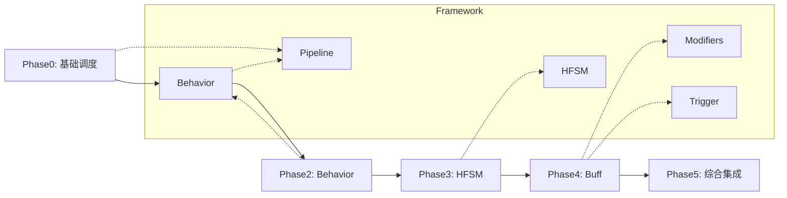

# 渐进式技能系统示例框架

## 一、概述

本示例框架展示如何使用 AbilityKit 框架逐步构建复杂技能系统。从基础调度开始，逐步集成 Pipeline、Behavior、Modifiers、Trigger 等框架能力。

## 二、框架能力映射



## 三、当前文件结构

```
Samples/Demo/ProgressiveSkill/
├── README.md                           # 本文档
├── ProgressiveSkill_Phase0.cs          # 入口: Phase0 基础调度
├── ProgressiveSkill_Phase1.cs          # Phase1: Pipeline (使用 AbilityPipeline)
├── ProgressiveSkill_Phase2.cs          # Phase2: 行为树 (使用 BTCore)
├── ProgressiveSkill_Phase3.cs          # Phase3: HFSM (使用 UnityHFSM)
├── ProgressiveSkill_Phase4.cs          # Phase4: Buff (待更新)
└── ProgressiveSkill_Phase5.cs          # Phase5: 网络同步 (待更新)
```

## 四、各阶段说明

### Phase0: 基础调度

**目标**: 理解技能执行的基本流程

**示例**:
- `BasicFireballSkill`: 硬编码顺序执行的火球术
- `SimpleSkillExecutor`: 简单技能执行器

**核心概念**:
- 技能上下文 (SkillContext)
- 技能定义 (SkillDefinition)
- 执行流程: 验证 → 消耗 → 施法 → 效果 → 冷却

### Phase1: Pipeline

**目标**: 使用 `AbilityPipeline` 框架重构技能执行

**使用的框架类型**:
- `AbilityPipeline<TCtx>`: 管线执行器
- `AAbilityPipelineContext`: 管线上下文基类
- `AbilityInstantPhaseBase<TCtx>`: 瞬时阶段
- `AbilityDurationalPhaseBase<TCtx>`: 持续阶段
- `AbilityDelayPhase<TCtx>`: 延迟阶段

**示例**:
- `Phase1_ValidationPhase`: 验证阶段
- `Phase1_ConsumePhase`: 消耗阶段
- `Phase1_EffectPhase`: 效果阶段
- `Phase1_CooldownPhase`: 冷却阶段

**优势**:
- 阶段可独立配置和复用
- 支持阶段打断和恢复
- 便于扩展新阶段

### Phase2: 行为树 (BTCore)

**目标**: 使用行为树处理技能决策

**使用的框架类型** (来自 `BTCore.Runtime`):
- `BTree`: 行为树容器
- `BTData`: 行为树数据
- `EntryNode`: 入口节点
- `Sequence`: 序列组合
- `Selector`: 选择组合
- `Parallel`: 并行组合
- `Condition`: 条件节点基类
- `Actions.Action`: 动作节点基类
- `Blackboard`: 黑板数据
- `NodeState`: 节点状态枚举

**节点状态**:
- `Inactive`: 未激活
- `Running`: 正在执行
- `Success`: 执行成功
- `Failure`: 执行失败

**决策场景**:
- 目标选择行为树
- 连击系统行为树
- AI 决策行为树

### Phase3: HFSM

**目标**: 使用 HFSM 管理角色状态

**使用的框架类型** (来自 `UnityHFSM`):
- `StateMachine<TStateId, TEvent>`: 状态机
- `State<TStateId, TEvent>`: 状态
- `Transition<TStateId>`: 状态转换
- `TransitionAfter<TStateId>`: 延迟转换

**状态示例**:
- `Idle`: 待机
- `Casting`: 施法中
- `Channeling`: 引导中
- `Effect`: 效果
- `Recovery`: 恢复中

**状态转换图**:
```
┌─────────┐
│  Idle  │
└────┬────┘
     │ CanCast
     ↓
┌─────────┐
│ Casting │
└────┬────┘
     │ CastComplete
     ↓
┌─────────────┐
│ Channeling │
└──────┬──────┘
       │ ChannelComplete
       ↓
┌───────┐
│Effect │
└───┬───┘
    │
    ↓
┌──────────┐
│ Recovery │
└────┬─────┘
     │ RecoveryComplete
     ↓
┌─────────┐
│  Idle  │
└─────────┘
```

### Phase4: Buff (待实现)

**目标**: 实现 Buff 系统

**将使用的框架类型**:
- `ModifierData`: 修改器数据
- `ModifierSystem`: 修改器系统

**Buff 类型**:
- DOT (持续伤害)
- HOT (持续治疗)
- 属性加成

### Phase5: 综合集成 (待实现)

**目标**: 整合所有框架能力

## 五、演进路线

```
Phase0: 基础调度
  └─ 学习技能基本概念
  
Phase1: Pipeline
  └─ 使用 AbilityPipeline 框架管理执行流程
  
Phase2: 行为树
  └─ 使用 BTCore 框架的行为树处理决策逻辑
  
Phase3: HFSM
  └─ 使用 UnityHFSM 状态机管理高层状态
  
Phase4: Buff
  └─ 使用 ModifierSystem 实现 Buff
  
Phase5: 综合集成
  └─ 整合所有框架能力
```

## 六、运行示例

```bash
cd src/AbilityKit.Samples.Logic
dotnet build
dotnet run
```

选择 `ProgressiveSkill` 菜单下的各个 Phase 示例运行。

## 七、框架依赖

| Phase | 框架包 | 命名空间 |
|-------|--------|----------|
| Phase0 | - | Phase0.Entities |
| Phase1 | AbilityKit.Pipeline | AbilityKit.Pipeline |
| Phase2 | AbilityKit.BTCore | BTCore.Runtime |
| Phase3 | AbilityKit.HFSM.Core | UnityHFSM |
| Phase4 | AbilityKit.Modifiers | AbilityKit.Modifiers |
| Phase5 | 全部 | 全部 |

## 八、注意事项

1. **Phase1** 使用了框架的 `AbilityPipeline` 相关类型
2. **Phase2** 使用了 `BTCore.Runtime` 命名空间下的行为树类型 (`BTree`, `Sequence`, `Selector`, `Condition`, `Action` 等)
3. **Phase3** 使用了 `UnityHFSM` 命名空间下的状态机类型 (`StateMachine`, `State`, `Transition` 等)
4. 所有阶段都依赖 `AbilityKit.Samples.Abstractions` 中的 `SampleBase` 类
